# 03 - Application Architecture

[← Data Architecture](02-data-architecture.md) | [Index](README.md) | [Technology Architecture →](04-technology-architecture.md)

---

## Application Landscape Overview

The Azure Logic Apps Monitoring Solution follows a **layered architecture** pattern with clear separation between orchestration, application services, and infrastructure concerns. The design prioritizes observability as a first-class concern, embedding distributed tracing throughout the request lifecycle.

```mermaid
flowchart TB
    subgraph Presentation["1️⃣ Presentation Layer"]
        P1["eShop.Web.App<br/><i>Blazor Server</i>"]
    end

    subgraph Application["2️⃣ Application Layer"]
        A1["eShop.Orders.API<br/><i>ASP.NET Core Web API</i>"]
    end

    subgraph Integration["3️⃣ Integration Layer"]
        I1["Azure Service Bus<br/><i>Topic: ordersplaced</i>"]
        I2["Azure Logic Apps<br/><i>OrdersManagement</i>"]
    end

    subgraph Data["4️⃣ Data Layer"]
        D1[("Azure SQL<br/><i>Orders DB</i>")]
        D2[("Azure Blob<br/><i>Workflow Storage</i>")]
    end

    subgraph CrossCutting["⚙️ Cross-Cutting Concerns"]
        X1["app.ServiceDefaults<br/><i>Resilience, Telemetry</i>"]
        X2["app.AppHost<br/><i>Aspire Orchestration</i>"]
    end

    P1 -->|"HTTP/REST"| A1
    A1 -->|"Publish"| I1
    I1 -->|"Trigger"| I2
    I2 -->|"HTTP Callback"| A1
    A1 -->|"EF Core"| D1
    I2 -->|"Blob Connector"| D2

    X1 -.->|"provides"| P1
    X1 -.->|"provides"| A1
    X2 -.->|"orchestrates"| P1
    X2 -.->|"orchestrates"| A1

    classDef presentation fill:#e3f2fd,stroke:#1565c0,stroke-width:2px
    classDef application fill:#e8f5e9,stroke:#2e7d32,stroke-width:2px
    classDef integration fill:#fff3e0,stroke:#ef6c00,stroke-width:2px
    classDef data fill:#f3e5f5,stroke:#7b1fa2,stroke-width:2px
    classDef crosscutting fill:#f5f5f5,stroke:#616161,stroke-width:2px

    class P1 presentation
    class A1 application
    class I1,I2 integration
    class D1,D2 data
    class X1,X2 crosscutting
```



---

## Service Catalog

| Service                 | Type         | Technology             | Responsibilities                                  | Dependencies              |
| ----------------------- | ------------ | ---------------------- | ------------------------------------------------- | ------------------------- |
| **eShop.Web.App**       | Web UI       | Blazor Server, .NET 10 | User interface, order display, real-time updates  | Orders API                |
| **eShop.Orders.API**    | REST API     | ASP.NET Core 10        | Order CRUD, event publishing, business logic      | SQL Database, Service Bus |
| **app.ServiceDefaults** | Library      | .NET Class Library     | Resilience patterns, OpenTelemetry, health checks | Application Insights      |
| **app.AppHost**         | Orchestrator | .NET Aspire 9.x        | Local dev orchestration, Azure resource wiring    | All services              |
| **OrdersManagement**    | Workflow     | Logic Apps Standard    | Event processing, success/error routing, archival | Service Bus, Blob Storage |

---

## Service Details

### eShop.Web.App (Presentation Layer)

**Purpose**: Blazor Server application providing the user interface for order management.

**Key Components**:

| Component          | File                         | Responsibility                  |
| ------------------ | ---------------------------- | ------------------------------- |
| `OrdersAPIService` | Services/OrdersAPIService.cs | Typed HTTP client for API calls |
| `Home.razor`       | Components/Pages/Home.razor  | Order listing page              |
| `Layout`           | Components/Layout/           | Application shell, navigation   |

**Configuration**:

```
┌─────────────────────────────────────────────────────┐
│ eShop.Web.App                                       │
├─────────────────────────────────────────────────────┤
│ Program.cs                                          │
│ ├── AddServiceDefaults()        (OpenTelemetry)    │
│ ├── AddHttpClient<OrdersAPIService>()              │
│ │   └── BaseAddress: orders-api service reference  │
│ ├── AddRazorComponents()                           │
│ └── UseOutputCache()            (Response caching) │
└─────────────────────────────────────────────────────┘
```

### eShop.Orders.API (Application Layer)

**Purpose**: RESTful API providing order management operations with full observability instrumentation.

**Internal Architecture**:


**Layer Responsibilities**:

| Layer          | Component              | Responsibility                                                                   |
| -------------- | ---------------------- | -------------------------------------------------------------------------------- |
| **Controller** | `OrdersController`     | HTTP routing, request validation, response formatting, distributed tracing spans |
| **Service**    | `OrderService`         | Business logic, validation rules, custom metrics recording                       |
| **Service**    | `OrdersMessageHandler` | Service Bus message publishing with trace context propagation                    |
| **Repository** | `OrderRepository`      | EF Core data access, query execution                                             |
| **Data**       | `OrderDbContext`       | Entity configuration, migrations, connection management                          |

### app.ServiceDefaults (Cross-Cutting)

**Purpose**: Shared library providing standardized implementations for resilience, observability, and health checks.

**Capabilities Provided**:

```
┌─────────────────────────────────────────────────────────────────┐
│ app.ServiceDefaults                                             │
├─────────────────────────────────────────────────────────────────┤
│ AddServiceDefaults() Extension Method                           │
│ ├── OpenTelemetry                                               │
│ │   ├── Tracing: HttpClient, ASP.NET Core, EF Core, SQL        │
│ │   ├── Metrics: Runtime, ASP.NET Core, HttpClient             │
│ │   └── Logging: OpenTelemetry log provider                    │
│ ├── Health Checks                                               │
│ │   ├── /health (all checks)                                   │
│ │   └── /alive (liveness only)                                 │
│ ├── Service Discovery                                           │
│ │   └── Aspire service references resolution                   │
│ └── Resilience                                                  │
│     ├── Total Request Timeout: 600 seconds                     │
│     ├── Retry: 3 attempts, exponential backoff                 │
│     ├── Circuit Breaker: 10 failures, 30s break                │
│     └── Attempt Timeout: 60 seconds                            │
├─────────────────────────────────────────────────────────────────┤
│ AddAzureServiceBusClient() Extension Method                     │
│ ├── ServiceBusClient registration (singleton)                  │
│ ├── ServiceBusSender for topic publishing                      │
│ └── ServiceBusHealthCheck registration                         │
└─────────────────────────────────────────────────────────────────┘
```

### OrdersManagement Logic App (Integration Layer)

**Purpose**: Event-driven workflow that processes order events and manages success/failure archival.

**Workflow Structure**:

```mermaid
flowchart TD
    subgraph Trigger["🎯 Trigger"]
        T1["When messages are<br/>available in topic"]
    end

    subgraph Actions["⚙️ Actions"]
        A1["Parse JSON<br/>(message body)"]
        A2["HTTP POST<br/>/api/orders/{id}/process"]
        A3{"Response<br/>Status?"}
        A4["Create blob<br/>success/{id}.json"]
        A5["Create blob<br/>error/{id}.json"]
    end

    subgraph Completion["✅ Completion"]
        C1["Complete message"]
    end

    T1 --> A1 --> A2 --> A3
    A3 -->|"200 OK"| A4
    A3 -->|"Error"| A5
    A4 --> C1
    A5 --> C1

    classDef trigger fill:#e3f2fd,stroke:#1565c0,stroke-width:2px
    classDef action fill:#e8f5e9,stroke:#2e7d32,stroke-width:2px
    classDef decision fill:#fff3e0,stroke:#ef6c00,stroke-width:2px
    classDef completion fill:#f3e5f5,stroke:#7b1fa2,stroke-width:2px

    class T1 trigger
    class A1,A2,A4,A5 action
    class A3 decision
    class C1 completion
```



---

## API Specification

### Orders API Endpoints

| Method   | Endpoint                   | Description                        | Request Body     | Response      |
| -------- | -------------------------- | ---------------------------------- | ---------------- | ------------- |
| `GET`    | `/api/orders`              | List all orders                    | -                | `Order[]`     |
| `GET`    | `/api/orders/{id}`         | Get order by ID                    | -                | `Order`       |
| `POST`   | `/api/orders`              | Create new order                   | `CreateOrderDto` | `Order` (201) |
| `PUT`    | `/api/orders/{id}`         | Update order                       | `UpdateOrderDto` | `Order`       |
| `DELETE` | `/api/orders/{id}`         | Delete order                       | -                | 204           |
| `POST`   | `/api/orders/{id}/process` | Process order (Logic App callback) | -                | `Order`       |

### Request/Response Schemas

**CreateOrderDto**:

```json
{
  "customerName": "string (required, 2-200 chars)",
  "customerEmail": "string (required, valid email)",
  "shippingAddress": "string (required, max 500 chars)",
  "products": [
    {
      "productName": "string (required, 1-200 chars)",
      "quantity": "integer (required, 1-1000)",
      "unitPrice": "decimal (required, >= 0)"
    }
  ]
}
```

**Order Response**:

```json
{
  "id": "integer",
  "orderNumber": "string",
  "customerName": "string",
  "customerEmail": "string",
  "shippingAddress": "string",
  "totalAmount": "decimal",
  "status": "string (Pending|Processing|Completed|Failed)",
  "createdAt": "datetime",
  "updatedAt": "datetime",
  "products": [...]
}
```

### Health Check Endpoints

| Endpoint  | Purpose            | Checks                                  |
| --------- | ------------------ | --------------------------------------- |
| `/health` | Full health status | SQL Database, Service Bus, dependencies |
| `/alive`  | Liveness probe     | Application responsiveness only         |

---

## Communication Patterns

### Synchronous Communication


### Asynchronous Communication


### Message Schema (OrderPlaced)

```json
{
  "orderId": 123,
  "orderNumber": "ORD-2024-001",
  "totalAmount": 149.99,
  "status": "Pending",
  "timestamp": "2024-01-15T10:30:00Z"
}
```

**Message Properties**:

| Property      | Value              | Purpose                         |
| ------------- | ------------------ | ------------------------------- |
| `ContentType` | `application/json` | MIME type                       |
| `MessageId`   | GUID               | Deduplication                   |
| `TraceId`     | 32-char hex        | Distributed trace correlation   |
| `SpanId`      | 16-char hex        | Parent span identification      |
| `traceparent` | W3C format         | Standards-compliant propagation |

---

## Resilience Patterns

### HTTP Client Resilience (Polly)


### Resilience Configuration

| Pattern             | Configuration                                          | Behavior                                          |
| ------------------- | ------------------------------------------------------ | ------------------------------------------------- |
| **Total Timeout**   | 600 seconds                                            | Maximum time for entire request including retries |
| **Retry**           | 3 attempts, exponential backoff (base: 2s, max: 30s)   | Handles transient failures                        |
| **Circuit Breaker** | 10 failures in 30s sampling window, 30s break duration | Prevents cascade failures                         |
| **Attempt Timeout** | 60 seconds                                             | Maximum time per individual attempt               |

### EF Core Resilience

| Setting                | Value       | Purpose                              |
| ---------------------- | ----------- | ------------------------------------ |
| `MaxRetryCount`        | 5           | Retry transient SQL failures         |
| `MaxRetryDelay`        | 30 seconds  | Maximum delay between retries        |
| `EnableRetryOnFailure` | true        | Automatic retry for transient errors |
| `CommandTimeout`       | 120 seconds | Query execution timeout              |

---

## Application Configuration

### Configuration Hierarchy

```
┌─────────────────────────────────────────────────────────────────┐
│ Configuration Sources (Lowest to Highest Priority)              │
├─────────────────────────────────────────────────────────────────┤
│ 1. appsettings.json           (Base configuration)             │
│ 2. appsettings.{Environment}.json (Environment-specific)       │
│ 3. User Secrets               (Local development secrets)      │
│ 4. Environment Variables      (Azure App Configuration)        │
│ 5. Aspire AppHost             (Service references, connections)│
└─────────────────────────────────────────────────────────────────┘
```

### Key Configuration Settings

| Setting                                | Source             | Purpose                 |
| -------------------------------------- | ------------------ | ----------------------- |
| `ConnectionStrings:ordersDb`           | Aspire/Environment | SQL Database connection |
| `ConnectionStrings:serviceBus`         | Aspire/Environment | Service Bus namespace   |
| `ServiceBus:TopicName`                 | appsettings.json   | Publish target topic    |
| `ApplicationInsights:ConnectionString` | Aspire/Environment | Telemetry destination   |
| `OTEL_EXPORTER_OTLP_ENDPOINT`          | Environment        | OpenTelemetry endpoint  |

---

## Dependency Graph


---

## Cross-Architecture References

| Related Architecture           | Connection                                | Reference                                                                  |
| ------------------------------ | ----------------------------------------- | -------------------------------------------------------------------------- |
| **Business Architecture**      | Services implement business capabilities  | [Capability Map](01-business-architecture.md#capability-map)               |
| **Data Architecture**          | Repository pattern accesses data layer    | [Data Access Patterns](02-data-architecture.md#data-access-patterns)       |
| **Technology Architecture**    | Runtime platforms and frameworks          | [Technology Standards](04-technology-architecture.md#technology-standards) |
| **Observability Architecture** | Instrumentation points and telemetry flow | [Instrumentation](05-observability-architecture.md#instrumentation)        |

---

[← Data Architecture](02-data-architecture.md) | [Index](README.md) | [Technology Architecture →](04-technology-architecture.md)
