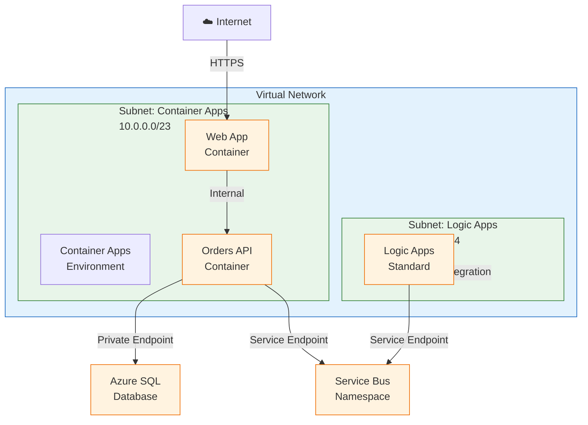

# Technology Architecture

← [Application Architecture](03-application-architecture.md) | [Index](README.md) | [Observability Architecture](05-observability-architecture.md) →

## 1. Technology Principles

| Principle                     | Statement                       | Rationale                        | Implications                                 |
| ----------------------------- | ------------------------------- | -------------------------------- | -------------------------------------------- |
| **Cloud-Native**              | Leverage Azure managed services | Reduce operational overhead      | PaaS over IaaS                               |
| **Serverless First**          | Use consumption-based compute   | Cost optimization                | Container Apps, Logic Apps consumption plans |
| **Infrastructure as Code**    | All resources defined in Bicep  | Reproducibility, version control | No manual Azure Portal changes               |
| **Managed Identity**          | Eliminate stored credentials    | Security best practice           | All service-to-service auth via AAD          |
| **Single-Command Deployment** | Deploy with `azd up`            | Developer productivity           | Automated provisioning + deployment          |

---

## 2. Technology Standards Catalog

| Category          | Technology           | Version  | Status   | Rationale                                  |
| ----------------- | -------------------- | -------- | -------- | ------------------------------------------ |
| **Runtime**       | .NET                 | 10.0     | Approved | LTS, performance improvements              |
| **Container**     | Azure Container Apps | Latest   | Approved | Serverless containers, KEDA scaling        |
| **Workflow**      | Logic Apps Standard  | Latest   | Approved | Event-driven automation, VS Code tooling   |
| **Database**      | Azure SQL Database   | Latest   | Approved | Managed PaaS, high availability            |
| **Messaging**     | Azure Service Bus    | Standard | Approved | Enterprise messaging, topics/subscriptions |
| **Observability** | Application Insights | Latest   | Approved | APM, distributed tracing                   |
| **IaC**           | Bicep                | Latest   | Approved | Native Azure, type safety                  |
| **Deployment**    | Azure Developer CLI  | 1.9+     | Approved | Unified deployment experience              |

---

## 3. Platform Services

### 3.1 Compute Platform

| Service                        | SKU/Tier                | Purpose                    | Scaling                  | Cost Model               |
| ------------------------------ | ----------------------- | -------------------------- | ------------------------ | ------------------------ |
| **Container Apps Environment** | Consumption             | Managed Kubernetes hosting | Auto-scale 0-10 replicas | Per vCPU-second + memory |
| **Container App (API)**        | Consumption             | Orders API hosting         | HTTP-based               | Per request              |
| **Container App (Web)**        | Consumption             | Blazor UI hosting          | HTTP-based               | Per request              |
| **App Service Plan**           | Workflow Standard (WS1) | Logic Apps hosting         | Manual/Auto              | Per hour                 |
| **Logic Apps Standard**        | Workflow Standard       | Event-driven workflows     | Consumption              | Per execution            |

### 3.2 Data Platform

| Service                      | SKU/Tier             | Purpose            | Scaling            | Cost Model                 |
| ---------------------------- | -------------------- | ------------------ | ------------------ | -------------------------- |
| **Azure SQL Database**       | General Purpose (S1) | Transactional data | Manual DTU scaling | Per DTU-hour               |
| **Azure Service Bus**        | Standard             | Message broker     | Auto-scale         | Per operation + throughput |
| **Azure Storage (Workflow)** | Standard LRS         | Logic App state    | Auto               | Per GB + transactions      |
| **Azure Storage (Logs)**     | Standard LRS         | Diagnostic logs    | Auto               | Per GB + transactions      |

### 3.3 Observability Platform

| Service                     | SKU/Tier | Purpose                  | Retention | Cost Model              |
| --------------------------- | -------- | ------------------------ | --------- | ----------------------- |
| **Application Insights**    | Standard | APM, distributed tracing | 90 days   | Per GB ingested         |
| **Log Analytics Workspace** | Standard | Centralized logs         | 30 days   | Per GB ingested         |
| **Azure Monitor**           | N/A      | Platform metrics         | 93 days   | Included with resources |

### 3.4 Identity Platform

| Service                              | SKU/Tier | Purpose                 | Scope               |
| ------------------------------------ | -------- | ----------------------- | ------------------- |
| **Managed Identity (User-Assigned)** | N/A      | Workload identity       | All services        |
| **Azure RBAC**                       | N/A      | Resource access control | Subscription-scoped |

### 3.5 Network Platform

| Service                     | SKU/Tier | Purpose                     | Address Space |
| --------------------------- | -------- | --------------------------- | ------------- |
| **Virtual Network**         | N/A      | Network isolation           | 10.0.0.0/16   |
| **Subnet (Container Apps)** | N/A      | Container Apps workload     | 10.0.0.0/23   |
| **Subnet (Logic Apps)**     | N/A      | Logic Apps VNet integration | 10.0.2.0/24   |

---

## 4. Deployment Architecture

### 4.1 Environment Topology

| Environment           | Region  | Purpose                   | Managed Identity | SLA Target |
| --------------------- | ------- | ------------------------- | ---------------- | ---------- |
| **Local Development** | N/A     | Dev/Debug                 | User credentials | N/A        |
| **Dev (Azure)**       | East US | Shared development        | Managed Identity | 99%        |
| **Staging**           | East US | Pre-production validation | Managed Identity | 99.5%      |
| **Production**        | East US | Live workloads            | Managed Identity | 99.9%      |

### 4.2 Network Architecture



### 4.3 Scaling Configuration

| Service        | Min Replicas | Max Replicas | Scale Rule                         | Cooldown |
| -------------- | ------------ | ------------ | ---------------------------------- | -------- |
| **Orders API** | 1            | 10           | HTTP concurrency (10 req/replica)  | 300s     |
| **Web App**    | 1            | 10           | HTTP concurrency (10 req/replica)  | 300s     |
| **Logic Apps** | N/A          | N/A          | Event-driven (Service Bus trigger) | N/A      |

---

## 5. Infrastructure as Code

### 5.1 Bicep Module Structure

```
infra/
├── main.bicep                 # Subscription-scoped entry point
├── types.bicep                # Shared type definitions
├── main.parameters.json       # Environment-specific parameters
├── shared/                    # Shared infrastructure
│   ├── main.bicep             # Orchestrator for shared resources
│   ├── identity/              # Managed Identity + RBAC
│   ├── monitoring/            # App Insights, Log Analytics
│   ├── network/               # Virtual Network, subnets
│   └── data/                  # Azure SQL Database
└── workload/                  # Workload infrastructure
    ├── main.bicep             # Orchestrator for workload resources
    ├── messaging/             # Service Bus namespace, topics
    ├── services/              # Container Apps, Container Registry
    └── logic-app.bicep        # Logic Apps Standard
```

### 5.2 Parameter Strategy

| Parameter      | Source               | Example                                     |
| -------------- | -------------------- | ------------------------------------------- |
| `solutionName` | User input           | `orders`                                    |
| `location`     | User input / azd env | `eastus`                                    |
| `envName`      | azd environment      | `dev`, `staging`, `prod`                    |
| Resource names | Bicep interpolation  | `rg-${solutionName}-${envName}-${location}` |

### 5.3 Resource Naming Convention

| Resource Type              | Pattern                          | Example                |
| -------------------------- | -------------------------------- | ---------------------- |
| Resource Group             | `rg-{solution}-{env}-{location}` | `rg-orders-dev-eastus` |
| Container Apps Environment | `cae-{solution}-{env}`           | `cae-orders-dev`       |
| Container App              | `ca-{service}-{solution}-{env}`  | `ca-api-orders-dev`    |
| SQL Server                 | `sql-{solution}-{env}`           | `sql-orders-dev`       |
| SQL Database               | `sqldb-{solution}-{env}`         | `sqldb-orders-dev`     |
| Service Bus                | `sbns-{solution}-{env}`          | `sbns-orders-dev`      |
| Storage Account            | `st{solution}{env}{purpose}`     | `stordersdevwf`        |
| App Insights               | `appi-{solution}-{env}`          | `appi-orders-dev`      |
| Log Analytics              | `log-{solution}-{env}`           | `log-orders-dev`       |
| Managed Identity           | `id-{solution}-{env}`            | `id-orders-dev`        |

---

## 6. Operational Considerations

### 6.1 Backup and Recovery

| Resource              | Backup Strategy                | RPO        | RTO    |
| --------------------- | ------------------------------ | ---------- | ------ |
| **Azure SQL**         | Automated backups (7 days)     | 5 minutes  | 1 hour |
| **Azure Storage**     | Geo-redundant storage (future) | 15 minutes | 1 hour |
| **Application State** | Idempotent message processing  | N/A        | N/A    |

### 6.2 Disaster Recovery

| Tier               | Strategy              | Implementation                 |
| ------------------ | --------------------- | ------------------------------ |
| **Data**           | Point-in-time restore | SQL Database automated backups |
| **Infrastructure** | Redeploy via IaC      | `azd provision` to new region  |
| **Application**    | Stateless containers  | Redeploy via `azd deploy`      |

### 6.3 Maintenance Windows

| Environment    | Window           | Day       | Duration |
| -------------- | ---------------- | --------- | -------- |
| **Dev**        | Anytime          | N/A       | N/A      |
| **Staging**    | 2:00-4:00 AM UTC | Wednesday | 2 hours  |
| **Production** | 3:00-5:00 AM UTC | Sunday    | 2 hours  |

---

## 7. Cost Analysis

### 7.1 Resource Pricing (Dev Environment - Monthly Estimate)

| Resource                | SKU          | Estimated Usage | Estimated Cost (USD) |
| ----------------------- | ------------ | --------------- | -------------------- |
| Container Apps (2 apps) | Consumption  | ~100 req/hour   | $10-20               |
| SQL Database            | S1 (20 DTU)  | Always-on       | $30                  |
| Service Bus             | Standard     | 1M operations   | $10                  |
| App Service Plan        | WS1          | 744 hours       | $150                 |
| Storage Accounts (2)    | Standard LRS | 10 GB           | $2                   |
| App Insights            | Standard     | 1 GB/day        | $7                   |
| Log Analytics           | Standard     | 0.5 GB/day      | $3.5                 |
| **Total**               |              |                 | **~$212-222/month**  |

### 7.2 Optimization Opportunities

| Opportunity                    | Potential Savings   | Implementation                    |
| ------------------------------ | ------------------- | --------------------------------- |
| Container Apps scale-to-zero   | ~50% compute cost   | Configure min replicas = 0 in dev |
| SQL Database reserved capacity | ~40% database cost  | 1-year RI for production          |
| App Insights sampling          | ~30% ingestion cost | 10% adaptive sampling             |
| Logic Apps consumption plan    | Variable            | Replace Workflow Standard in dev  |

---

## Cross-Architecture Relationships

| Related Architecture           | Connection                                      | Reference                                                                           |
| ------------------------------ | ----------------------------------------------- | ----------------------------------------------------------------------------------- |
| **Business Architecture**      | Quality attributes drive infrastructure choices | [Business Architecture](01-business-architecture.md#quality-attribute-requirements) |
| **Application Architecture**   | Services deployed to compute platform           | [Application Architecture](03-application-architecture.md#service-catalog)          |
| **Data Architecture**          | Data stores hosted on data platform             | [Data Architecture](02-data-architecture.md#data-store-inventory)                   |
| **Observability Architecture** | Monitoring platform collects telemetry          | [Observability Architecture](05-observability-architecture.md#platform-components)  |

---

← [Application Architecture](03-application-architecture.md) | [Index](README.md) | [Observability Architecture](05-observability-architecture.md) →
