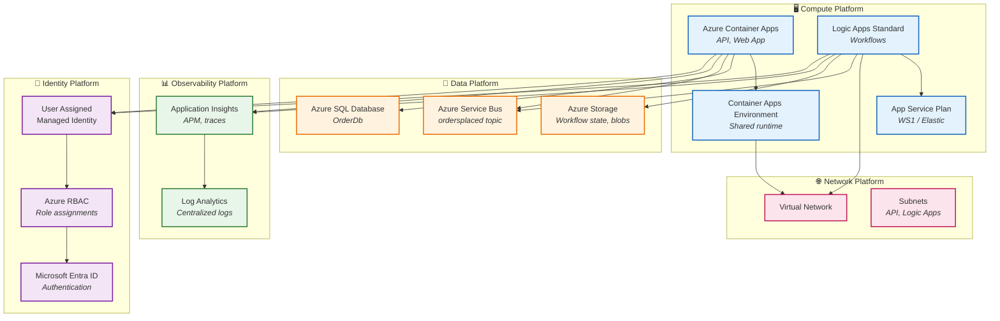
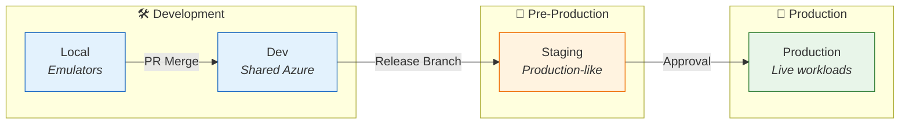

# 🖥️ Technology Architecture

← [Application Architecture](03-application-architecture.md) | [Index](README.md) | [Observability Architecture →](05-observability-architecture.md)

---

## 📑 Table of Contents

- [📋 Principles](#-1-technology-principles)
- [📊 Standards](#-2-technology-standards)
- [☁️ Platform Services](#️-3-platform-services)
- [🚀 Deployment Architecture](#-4-deployment-architecture)
- [🗺️ Component Mapping](#️-5-technology-component-mapping)
- [📜 Infrastructure as Code](#-6-infrastructure-as-code)
- [🛠️ Operational Considerations](#️-7-operational-considerations)
- [💰 Cost Analysis](#-8-cost-analysis)
- [↔️ Cross-Architecture](#️-9-cross-architecture-relationships)

---

## 📋 1. Technology Principles

| #   | Principle                  | Statement                         | Rationale                                         | Implications               |
| --- | -------------------------- | --------------------------------- | ------------------------------------------------- | -------------------------- |
| T-1 | **Cloud-Native First**     | Use Azure PaaS services over IaaS | Reduced operational overhead, built-in resilience | Accept service limitations |
| T-2 | **Infrastructure as Code** | All resources defined in Bicep    | Repeatable, auditable deployments                 | No portal-only changes     |
| T-3 | **Managed Identity**       | No stored credentials             | Zero-trust security posture                       | All services use MI        |
| T-4 | **Environment Parity**     | Local dev mirrors production      | Reduce surprises                                  | Emulators for all services |
| T-5 | **Serverless Preference**  | Consumption-based compute         | Cost optimization                                 | Cold start acceptance      |

---

<div align="right"><a href="#-table-of-contents">⬆️ Back to top</a></div>

## 📊 2. Technology Standards

### 📖 Standards Catalog

| Category               | Technology           | Version  | Status   | Rationale                         |
| ---------------------- | -------------------- | -------- | -------- | --------------------------------- |
| **Runtime**            | .NET                 | 10.0     | Approved | LTS, performance, Aspire support  |
| **Container Platform** | Azure Container Apps | Latest   | Approved | Serverless containers, Dapr-ready |
| **Workflow Engine**    | Logic Apps Standard  | Latest   | Approved | Azure-native, low-code automation |
| **Database**           | Azure SQL Database   | Latest   | Approved | Managed PaaS, EF Core support     |
| **Messaging**          | Azure Service Bus    | Standard | Approved | Enterprise messaging patterns     |
| **Observability**      | Application Insights | Latest   | Approved | Azure-native APM                  |
| **IaC**                | Bicep                | Latest   | Approved | Azure-native, type-safe           |
| **Orchestration**      | .NET Aspire          | 13.1.0   | Approved | Cloud-native development          |

### 🔄 Lifecycle Status

| Technology           | Current State | Target State | Retiring      |
| -------------------- | ------------- | ------------ | ------------- |
| .NET 10              | Active        | Active       | -             |
| .NET Aspire 13.1     | Active        | Active       | -             |
| Bicep                | Active        | Active       | ARM Templates |
| Application Insights | Active        | Active       | -             |

---

<div align="right"><a href="#-table-of-contents">⬆️ Back to top</a></div>

## ☁️ 3. Platform Services

### 🧩 Platform Decomposition



### 🖥️ 3.1 Compute Platform

| Service                        | Purpose                               | SKU/Tier         | Scaling       |
| ------------------------------ | ------------------------------------- | ---------------- | ------------- |
| **Container Apps Environment** | Shared runtime for containerized apps | Consumption      | Automatic     |
| **Container Apps**             | Hosts Orders API and Web App          | Consumption      | 0-10 replicas |
| **Logic Apps Standard**        | Workflow automation engine            | WS1              | Elastic       |
| **App Service Plan**           | Logic Apps hosting                    | WorkflowStandard | Elastic scale |

### 🗄️ 3.2 Data Platform

| Service                | Purpose                      | SKU/Tier     | Configuration          |
| ---------------------- | ---------------------------- | ------------ | ---------------------- |
| **Azure SQL Database** | Order data persistence       | Standard S1  | 20 DTUs, 250GB         |
| **Azure Service Bus**  | Event messaging              | Standard     | Topics + Subscriptions |
| **Azure Storage**      | Workflow state, blob storage | Standard LRS | General Purpose v2     |

### 📊 3.3 Observability Platform

| Service                     | Purpose                     | SKU/Tier      | Retention |
| --------------------------- | --------------------------- | ------------- | --------- |
| **Application Insights**    | APM, distributed tracing    | Standard      | 90 days   |
| **Log Analytics Workspace** | Centralized log aggregation | Pay-as-you-go | 30 days   |

### 🔐 3.4 Identity Platform

| Service                            | Purpose                | Configuration                     |
| ---------------------------------- | ---------------------- | --------------------------------- |
| **User Assigned Managed Identity** | Service authentication | Single identity for all workloads |
| **Azure RBAC**                     | Authorization          | Least privilege roles             |
| **Microsoft Entra ID**             | Identity provider      | SQL AD authentication             |

### 🌐 3.5 Network Platform

| Service             | Purpose              | Configuration                      |
| ------------------- | -------------------- | ---------------------------------- |
| **Virtual Network** | Network isolation    | Address space: 10.0.0.0/16         |
| **Subnets**         | Service segmentation | API, Logic Apps, Private Endpoints |

---

<div align="right"><a href="#-table-of-contents">⬆️ Back to top</a></div>

## 🚀 4. Deployment Architecture

### 🌍 Environment Topology

| Environment    | Region  | Purpose                   | SLA Target | Infrastructure    |
| -------------- | ------- | ------------------------- | ---------- | ----------------- |
| **Local**      | N/A     | Development, debugging    | N/A        | Emulators, Docker |
| **Dev**        | East US | Shared development        | 99%        | Azure (shared)    |
| **Staging**    | East US | Pre-production validation | 99.5%      | Azure (dedicated) |
| **Production** | East US | Live workloads            | 99.9%      | Azure (dedicated) |

### 📦 Environment Progression



---

<div align="right"><a href="#-table-of-contents">⬆️ Back to top</a></div>

## 🗺️ 5. Technology Component Mapping

### 📱 Application-to-Technology Matrix

| Application          | Compute             | Data         | Messaging                | Observability |
| -------------------- | ------------------- | ------------ | ------------------------ | ------------- |
| **eShop.Orders.API** | Container Apps      | Azure SQL    | Service Bus (publisher)  | App Insights  |
| **eShop.Web.App**    | Container Apps      | -            | -                        | App Insights  |
| **OrdersManagement** | Logic Apps Standard | Blob Storage | Service Bus (subscriber) | App Insights  |

### 🌟 Capability-to-Platform Matrix

| Capability          | Platform Service     | Justification             |
| ------------------- | -------------------- | ------------------------- |
| Order Management    | Container Apps + SQL | Transactional workload    |
| Workflow Automation | Logic Apps Standard  | Low-code, event-driven    |
| Event Messaging     | Service Bus          | Enterprise reliability    |
| Observability       | Application Insights | Azure-native, correlation |
| Identity            | Managed Identity     | Zero-trust, no secrets    |

---

<div align="right"><a href="#-table-of-contents">⬆️ Back to top</a></div>

## 📜 6. Infrastructure as Code

### 📁 IaC Structure

```text
infra/
├── main.bicep                    # Entry point (subscription scope)
├── main.parameters.json          # Parameter values
├── types.bicep                   # Shared type definitions
├── shared/
│   ├── main.bicep                # Shared resources orchestrator
│   ├── data/                     # Data resources (Storage)
│   ├── identity/                 # Managed Identity, RBAC
│   ├── monitoring/               # App Insights, Log Analytics
│   │   ├── app-insights.bicep
│   │   └── log-analytics-workspace.bicep
│   └── network/                  # VNet, Subnets
└── workload/
    ├── main.bicep                # Workload orchestrator
    ├── logic-app.bicep           # Logic Apps Standard
    ├── messaging/                # Service Bus
    └── services/                 # Container Apps
```

### 🧩 Module Responsibilities

| Module                  | Scope          | Resources Created                       |
| ----------------------- | -------------- | --------------------------------------- |
| **main.bicep**          | Subscription   | Resource Group                          |
| **shared/main.bicep**   | Resource Group | Identity, Monitoring, Network, Data     |
| **workload/main.bicep** | Resource Group | Container Apps, Logic Apps, Service Bus |

### ⚙️ Parameter Strategy

| Parameter Type  | Storage                  | Example                   |
| --------------- | ------------------------ | ------------------------- |
| **Static**      | main.parameters.json     | `solutionName`, `envName` |
| **Environment** | azd environment (.env)   | `AZURE_LOCATION`          |
| **Secrets**     | User Secrets / Key Vault | Connection strings        |
| **Computed**    | Bicep variables          | Resource suffixes         |

---

<div align="right"><a href="#-table-of-contents">⬆️ Back to top</a></div>

## 🛠️ 7. Operational Considerations

### 💾 Backup and Recovery

| Resource     | Backup Strategy         | RPO   | RTO      |
| ------------ | ----------------------- | ----- | -------- |
| Azure SQL    | Automated backups       | 5 min | 1 hour   |
| Service Bus  | Geo-DR (if enabled)     | N/A   | Minutes  |
| Blob Storage | Soft delete, versioning | N/A   | Minutes  |
| Logic Apps   | State in Storage        | N/A   | Redeploy |

### 🔧 Maintenance Windows

| Activity               | Frequency  | Window    | Impact                |
| ---------------------- | ---------- | --------- | --------------------- |
| Azure SQL patching     | Monthly    | Automatic | Minimal (failover)    |
| Container Apps updates | Continuous | Automatic | None (revision-based) |
| Logic Apps runtime     | Monthly    | Automatic | Brief restarts        |

---

<div align="right"><a href="#-table-of-contents">⬆️ Back to top</a></div>

## 💰 8. Cost Analysis

### 💳 Resource Pricing Model

| Service                | Pricing Model              | Estimated Monthly Cost |
| ---------------------- | -------------------------- | ---------------------- |
| Container Apps         | Per-request + vCPU-seconds | $50-150                |
| Azure SQL (S1)         | DTU-based                  | ~$30                   |
| Service Bus (Standard) | Per-operation + base       | ~$10                   |
| Logic Apps (WS1)       | App Service Plan           | ~$150                  |
| Application Insights   | Per-GB ingested            | ~$20                   |
| Storage                | Per-GB + operations        | ~$5                    |

### 💡 Optimization Opportunities

| Opportunity                     | Potential Savings | Trade-off          |
| ------------------------------- | ----------------- | ------------------ |
| Reserved capacity (SQL)         | 30-40%            | 1-year commitment  |
| Container Apps min replicas = 0 | Variable          | Cold start latency |
| Log Analytics sampling          | 50%+              | Reduced telemetry  |

---

<div align="right"><a href="#-table-of-contents">⬆️ Back to top</a></div>

## ↔️ 9. Cross-Architecture Relationships

| Related Architecture           | Connection                      | Reference                                                                       |
| ------------------------------ | ------------------------------- | ------------------------------------------------------------------------------- |
| **Application Architecture**   | Services deployed to platforms  | [Service Catalog](03-application-architecture.md#4-service-catalog)             |
| **Data Architecture**          | Data stores hosted on platforms | [Data Store Details](02-data-architecture.md#5-data-store-details)              |
| **Observability Architecture** | Monitoring platforms            | [Platform Components](05-observability-architecture.md#7-platform-components)   |
| **Security Architecture**      | Identity and network platforms  | [Managed Identity](06-security-architecture.md#3-managed-identity-architecture) |
| **Deployment Architecture**    | IaC provisions platforms        | [Infrastructure as Code](07-deployment-architecture.md#infrastructure-as-code)  |

---

_Last Updated: January 2026_
