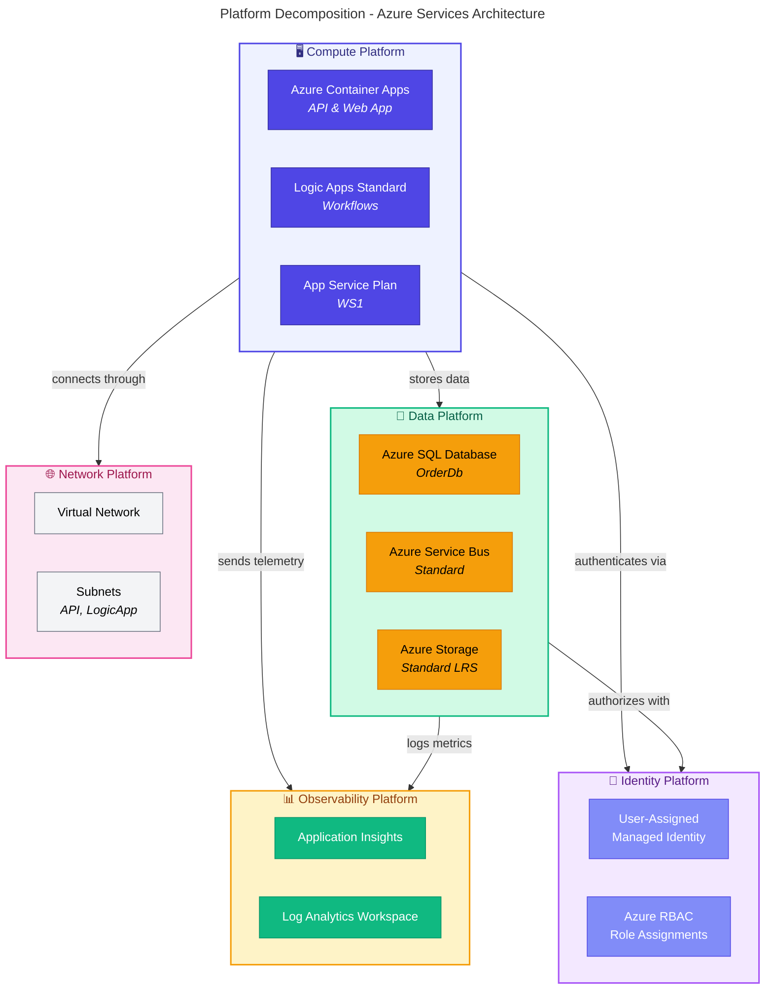
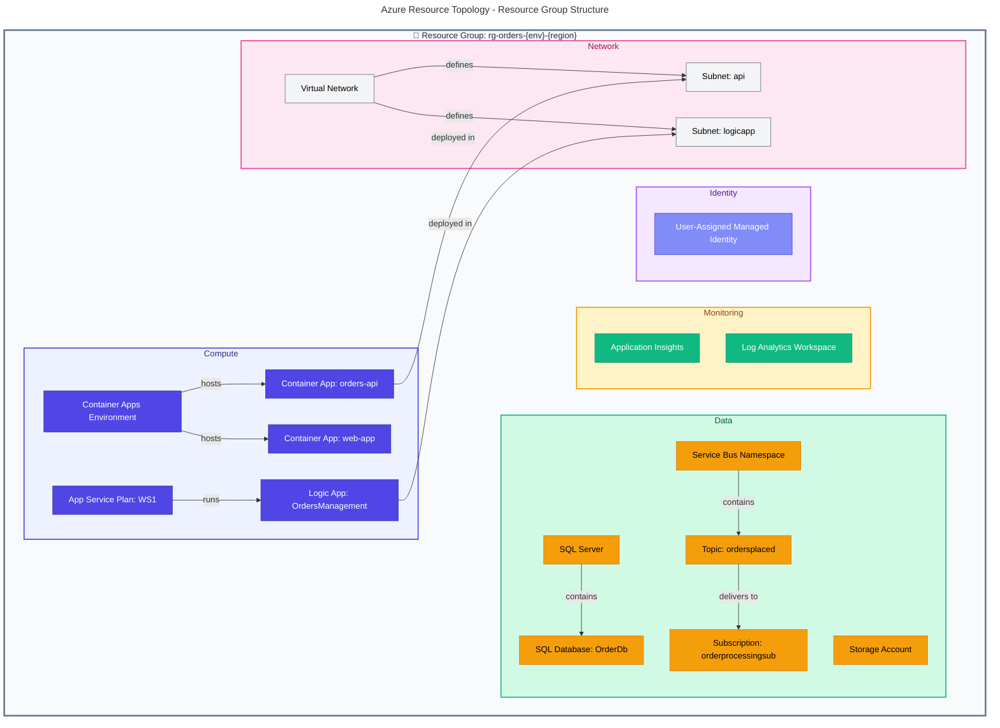

# Technology Architecture

[← Application Architecture](03-application-architecture.md) | [Index](README.md) | [Observability Architecture →](05-observability-architecture.md)

---

## 📑 Table of Contents

- [📜 Technology Principles](#-1-technology-principles)
- [📋 Technology Standards](#-2-technology-standards)
- [☁️ Platform Services](#%EF%B8%8F-3-platform-services)
- [🏛️ Azure Resource Topology](#%EF%B8%8F-4-azure-resource-topology)
- [🔗 Technology Component Mapping](#-5-technology-component-mapping)
- [📁 Infrastructure as Code](#-6-infrastructure-as-code)
- [🌍 Environment Topology](#-7-environment-topology)
- [🛠️ Operational Considerations](#%EF%B8%8F-8-operational-considerations)
- [💰 Cost Analysis](#-9-cost-analysis)
- [🔗 Cross-Architecture Relationships](#-cross-architecture-relationships)

---

## 📜 1. Technology Principles

| #       | Principle                  | Statement                                | Rationale                                 | Implications                                    |
| ------- | -------------------------- | ---------------------------------------- | ----------------------------------------- | ----------------------------------------------- |
| **T-1** | **Cloud-Native First**     | Use Azure PaaS services over IaaS        | Reduced operational overhead, built-in HA | Azure Container Apps, SQL Database, Service Bus |
| **T-2** | **Infrastructure as Code** | All resources defined in Bicep templates | Repeatable, auditable, version-controlled | No manual Azure Portal changes                  |
| **T-3** | **Managed Identity**       | Use Azure AD for service authentication  | Zero-secret architecture, security        | No connection strings with passwords            |
| **T-4** | **Observability Built-in** | OpenTelemetry instrumentation by default | Operational excellence                    | Application Insights integration                |
| **T-5** | **Local Dev Parity**       | Local environment mirrors production     | Faster development, fewer surprises       | Emulators for SQL, Service Bus                  |

---

## 📋 2. Technology Standards

### Standards Catalog

| Category               | Technology            | Version   | Status   | Rationale                                |
| ---------------------- | --------------------- | --------- | -------- | ---------------------------------------- |
| **Runtime**            | .NET                  | 10.0      | Approved | Latest LTS with performance improvements |
| **Web Framework**      | ASP.NET Core          | 10.0      | Approved | Industry standard, high performance      |
| **Frontend**           | Blazor Server         | 10.0      | Approved | C# full-stack, SignalR integration       |
| **ORM**                | Entity Framework Core | 10.0      | Approved | .NET native, migration support           |
| **Container Platform** | Azure Container Apps  | Latest    | Approved | Serverless containers, Dapr-ready        |
| **Database**           | Azure SQL Database    | Latest    | Approved | Managed PaaS, EF Core support            |
| **Messaging**          | Azure Service Bus     | Standard  | Approved | Enterprise messaging, topics             |
| **Workflow**           | Logic Apps Standard   | Latest    | Approved | Serverless workflows, connectors         |
| **Monitoring**         | Application Insights  | Latest    | Approved | APM, distributed tracing                 |
| **IaC**                | Bicep                 | Latest    | Approved | Azure-native, type-safe                  |
| **CLI**                | Azure Developer CLI   | >= 1.11.0 | Approved | Unified deployment experience            |

---

## ☁️ 3. Platform Services

### Platform Decomposition



### Compute Platform

| Service                  | Purpose                 | SKU/Tier    | Scaling        | Configuration              |
| ------------------------ | ----------------------- | ----------- | -------------- | -------------------------- |
| **Azure Container Apps** | API and Web App hosting | Consumption | 0-10 replicas  | Auto-scale on HTTP traffic |
| **Logic Apps Standard**  | Workflow automation     | WS1         | Workflow-based | App Service Plan           |
| **App Service Plan**     | Logic Apps hosting      | WS1         | Manual         | Dedicated compute          |

### Data Platform

| Service                | Purpose                | SKU/Tier        | Capacity         | Configuration            |
| ---------------------- | ---------------------- | --------------- | ---------------- | ------------------------ |
| **Azure SQL Database** | Order data persistence | General Purpose | Configurable DTU | Managed Identity auth    |
| **Azure Service Bus**  | Event messaging        | Standard        | Auto-managed     | Topics and subscriptions |
| **Azure Storage**      | Workflow state, blobs  | Standard LRS    | Unlimited        | Managed Identity auth    |

### Identity Platform

| Service                            | Purpose                | Configuration                    |
| ---------------------------------- | ---------------------- | -------------------------------- |
| **User-Assigned Managed Identity** | Service authentication | Single identity for all services |
| **Azure RBAC**                     | Authorization          | Role assignments per resource    |

---

## 🏛️ 4. Azure Resource Topology



---

## 🔗 5. Technology Component Mapping

### Application-to-Technology Matrix

| Application          | Compute             | Data          | Messaging                | Monitoring    |
| -------------------- | ------------------- | ------------- | ------------------------ | ------------- |
| **eShop.Orders.API** | Container Apps      | Azure SQL     | Service Bus (publisher)  | App Insights  |
| **eShop.Web.App**    | Container Apps      | -             | -                        | App Insights  |
| **OrdersManagement** | Logic Apps Standard | Azure Storage | Service Bus (subscriber) | Log Analytics |

### Capability-to-Platform Matrix

| Capability              | Platform Services            | Rationale                            |
| ----------------------- | ---------------------------- | ------------------------------------ |
| **Order Management**    | Container Apps, SQL Database | Transactional CRUD operations        |
| **Workflow Automation** | Logic Apps Standard, Storage | Visual workflow designer, connectors |
| **Messaging**           | Service Bus Standard         | Enterprise pub/sub with topics       |
| **Observability**       | App Insights, Log Analytics  | Unified APM and logging              |
| **Identity**            | Managed Identity, RBAC       | Zero-secret authentication           |

---

## 📁 6. Infrastructure as Code

### IaC Tool Selection

| Tool                    | Purpose                     | Justification                    |
| ----------------------- | --------------------------- | -------------------------------- |
| **Bicep**               | Azure resource provisioning | Azure-native, type-safe, modular |
| **Azure Developer CLI** | Deployment orchestration    | Unified dev-to-prod workflow     |

### Module Structure

```
infra/
├── main.bicep                    # Entry point orchestrator
├── main.parameters.json          # Environment parameters
├── types.bicep                   # Shared type definitions
├── shared/
│   ├── main.bicep                # Shared infrastructure module
│   ├── identity/
│   │   └── main.bicep            # Managed identity and RBAC
│   ├── monitoring/
│   │   ├── main.bicep            # Monitoring orchestrator
│   │   ├── app-insights.bicep    # Application Insights
│   │   ├── log-analytics-workspace.bicep
│   │   └── azure-monitor-health-model.bicep
│   ├── network/
│   │   └── main.bicep            # VNet and subnets
│   └── data/
│       └── main.bicep            # SQL Server and database
└── workload/
    ├── main.bicep                # Workload orchestrator
    ├── logic-app.bicep           # Logic Apps Standard
    ├── messaging/
    │   └── main.bicep            # Service Bus namespace
    └── services/
        └── main.bicep            # Container Apps
```

> **Source**: [infra/](../../infra/)

### Parameter Strategy

| Parameter               | Scope       | Source           |
| ----------------------- | ----------- | ---------------- |
| `solutionName`          | Global      | azure.yaml       |
| `location`              | Environment | azd env          |
| `envName`               | Environment | azd env          |
| `deployerPrincipalType` | CI/CD       | GitHub Variables |
| `deployHealthModel`     | CI/CD       | false in CI/CD   |

---

## 🌍 7. Environment Topology

| Environment    | Region     | Purpose             | Scaling         | Data       |
| -------------- | ---------- | ------------------- | --------------- | ---------- |
| **Local**      | N/A        | Development/Debug   | Single instance | Emulators  |
| **Dev**        | Configured | Shared development  | Min replicas    | Test data  |
| **Staging**    | Configured | Pre-prod validation | Production-like | Anonymized |
| **Production** | Configured | Live workloads      | Auto-scale      | Live data  |

### Local Development Stack

| Component         | Local Implementation | Azure Equivalent     |
| ----------------- | -------------------- | -------------------- |
| **Orchestration** | .NET Aspire AppHost  | Azure Container Apps |
| **SQL Database**  | SQL Server container | Azure SQL Database   |
| **Service Bus**   | Service Bus emulator | Azure Service Bus    |
| **App Insights**  | OTLP exporter        | Application Insights |

---

## 🛠️ 8. Operational Considerations

### Backup and Recovery

| Resource         | Backup Method             | RPO   | RTO      |
| ---------------- | ------------------------- | ----- | -------- |
| **SQL Database** | Azure automated backup    | 5 min | 1 hour   |
| **Service Bus**  | Geo-redundancy (optional) | N/A   | N/A      |
| **Logic Apps**   | Source control (IaC)      | N/A   | Redeploy |

### Maintenance Windows

| Resource           | Maintenance        | Impact         |
| ------------------ | ------------------ | -------------- |
| **Container Apps** | Rolling updates    | Zero downtime  |
| **SQL Database**   | Automated patching | < 30s failover |
| **Logic Apps**     | Deployment slots   | Zero downtime  |

---

## 💰 9. Cost Analysis

### Resource Pricing Model

| Resource           | Pricing Model             | Estimated Monthly |
| ------------------ | ------------------------- | ----------------- |
| **Container Apps** | Per-request + vCPU/memory | Pay-per-use       |
| **SQL Database**   | DTU-based                 | ~$15-150          |
| **Service Bus**    | Per-operation             | ~$10-50           |
| **Logic Apps**     | Per-execution             | ~$5-50            |
| **App Insights**   | Per-GB ingested           | ~$2.30/GB         |
| **Log Analytics**  | Per-GB ingested           | ~$2.30/GB         |

### Optimization Opportunities

1. **Sampling**: Configure telemetry sampling to reduce App Insights costs
2. **Retention**: Adjust Log Analytics retention (default 30 days)
3. **Scaling**: Configure Container Apps min replicas to 0 for dev/test
4. **Reserved Capacity**: Consider SQL Database reserved capacity for production

---

## 🔗 Cross-Architecture Relationships

| Related Architecture           | Connection                            | Reference                                                      |
| ------------------------------ | ------------------------------------- | -------------------------------------------------------------- |
| **Application Architecture**   | Services deployed to compute platform | [Application Architecture](03-application-architecture.md)     |
| **Observability Architecture** | Monitoring platform services          | [Observability Architecture](05-observability-architecture.md) |
| **Security Architecture**      | Identity and network platform         | [Security Architecture](06-security-architecture.md)           |
| **Deployment Architecture**    | IaC and CI/CD integration             | [Deployment Architecture](07-deployment-architecture.md)       |

---

[← Application Architecture](03-application-architecture.md) | [Index](README.md) | [Observability Architecture →](05-observability-architecture.md)
