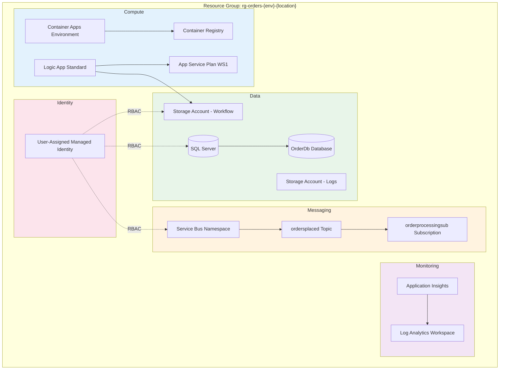
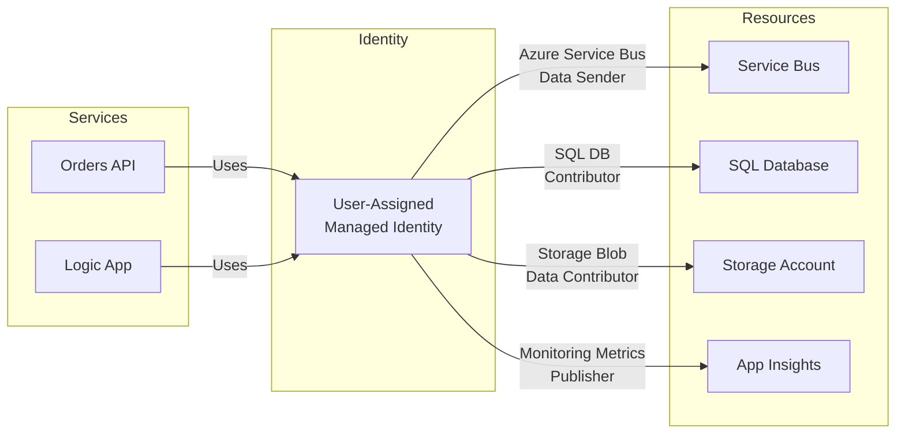
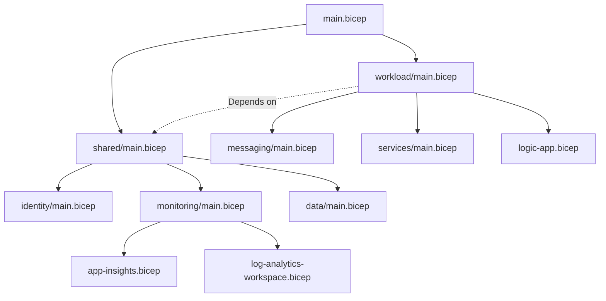

# Technology Architecture

← [Application Architecture](03-application-architecture.md) | [Index](README.md) | [Observability Architecture →](05-observability-architecture.md)

## Technology Stack Overview

### Runtime and Frameworks

| Technology | Version | Purpose |
|------------|---------|---------|
| **.NET** | 10.0 | Application runtime |
| **.NET Aspire** | 9.5+ | Service orchestration and local development |
| **ASP.NET Core** | 10.0 | Web API and Blazor Server |
| **Entity Framework Core** | 10.0 | ORM for SQL Database |
| **Blazor Server** | 10.0 | Interactive web UI |
| **Fluent UI Blazor** | Latest | UI component library |
| **OpenTelemetry** | 1.x | Distributed tracing and metrics |
| **Polly** | 8.x | Resilience and transient fault handling |

### Azure Services

| Service | SKU/Tier | Purpose |
|---------|----------|---------|
| **Azure Container Apps** | Consumption | Microservices hosting |
| **Azure Container Registry** | Basic | Container image storage |
| **Azure Service Bus** | Standard | Message brokering |
| **Azure Logic Apps** | Standard (WS1) | Workflow automation |
| **Azure SQL Database** | Basic/Standard | Order data persistence |
| **Application Insights** | Pay-as-you-go | APM and tracing |
| **Log Analytics Workspace** | Pay-as-you-go | Centralized logging |
| **Azure Storage** | Standard_LRS | Diagnostics and workflow state |
| **User-Assigned Managed Identity** | N/A | Service authentication |

### Development Tools

| Tool | Purpose |
|------|---------|
| **Azure Developer CLI (azd)** | Environment provisioning and deployment |
| **Azure CLI** | Azure resource management |
| **Docker Desktop** | Local container development |
| **Visual Studio 2022 / VS Code** | IDE |

---

## Azure Resource Topology



---

## Infrastructure Components

| Resource | Azure Service | Purpose | SKU/Tier | Bicep Module |
|----------|---------------|---------|----------|--------------|
| Container Apps Environment | Microsoft.App/managedEnvironments | Service hosting | Consumption | [services/](../../infra/workload/services/) |
| Container Registry | Microsoft.ContainerRegistry/registries | Image storage | Basic | [services/](../../infra/workload/services/) |
| Service Bus Namespace | Microsoft.ServiceBus/namespaces | Message broker | Standard | [messaging/main.bicep](../../infra/workload/messaging/main.bicep) |
| Logic App | Microsoft.Web/sites | Workflow engine | WorkflowStandard WS1 | [logic-app.bicep](../../infra/workload/logic-app.bicep) |
| App Service Plan | Microsoft.Web/serverfarms | Logic App hosting | WS1 (capacity: 3) | [logic-app.bicep](../../infra/workload/logic-app.bicep) |
| SQL Server | Microsoft.Sql/servers | Database engine | N/A | [data/](../../infra/shared/data/) |
| SQL Database | Microsoft.Sql/servers/databases | Order storage | Basic | [data/](../../infra/shared/data/) |
| Application Insights | Microsoft.Insights/components | APM | Pay-as-you-go | [app-insights.bicep](../../infra/shared/monitoring/app-insights.bicep) |
| Log Analytics Workspace | Microsoft.OperationalInsights/workspaces | Log aggregation | PerGB2018 | [log-analytics-workspace.bicep](../../infra/shared/monitoring/log-analytics-workspace.bicep) |
| Storage Account (Logs) | Microsoft.Storage/storageAccounts | Diagnostic storage | Standard_LRS | [log-analytics-workspace.bicep](../../infra/shared/monitoring/log-analytics-workspace.bicep) |
| Storage Account (Workflow) | Microsoft.Storage/storageAccounts | Logic App state | Standard_LRS | [data/](../../infra/shared/data/) |
| Managed Identity | Microsoft.ManagedIdentity/userAssignedIdentities | Service auth | N/A | [identity/main.bicep](../../infra/shared/identity/) |

---

## Compute Architecture

### Azure Container Apps

Container Apps Environment provides:
- **Serverless scaling**: Scale to zero when idle
- **Built-in ingress**: HTTPS termination and load balancing
- **Health probes**: Liveness and readiness checks
- **Environment variables**: Configuration injection

### Logic Apps Standard

Configuration:
- **Plan**: WorkflowStandard WS1 (elastic scaling)
- **Runtime**: Azure Functions v4 with .NET
- **Identity**: User-assigned managed identity
- **Storage**: Azure Files for workflow state

```bicep
// From logic-app.bicep
resource wfASP 'Microsoft.Web/serverfarms@2025-03-01' = {
  sku: {
    name: 'WS1'
    tier: 'WorkflowStandard'
  }
  properties: {
    elasticScaleEnabled: true
    maximumElasticWorkerCount: 20
  }
}
```

---

## Network Architecture

### Current Configuration

The solution uses **public endpoints** for simplicity:

| Component | Network Access |
|-----------|---------------|
| Container Apps | Public ingress with HTTPS |
| Service Bus | Public access |
| SQL Database | Public access (firewall rules) |
| Application Insights | Public ingestion and query |
| Logic Apps | Public access |

### Future Enhancement: Private Networking

For production scenarios, consider:
- VNet integration for Container Apps
- Private endpoints for Service Bus, SQL, Storage
- Application Gateway for ingress

---

## Identity & Access Management

### Managed Identity Architecture



### RBAC Role Assignments

| Principal | Resource | Role | Purpose |
|-----------|----------|------|---------|
| Managed Identity | Service Bus | Azure Service Bus Data Sender | Publish messages |
| Managed Identity | Service Bus | Azure Service Bus Data Receiver | Consume messages |
| Managed Identity | SQL Database | SQL DB Contributor | Data access |
| Managed Identity | Storage Account | Storage Blob Data Contributor | Workflow state |
| Managed Identity | Storage Account | Storage Table Data Contributor | Diagnostics |
| Managed Identity | Container Registry | AcrPull | Pull images |

### Service-to-Service Authentication

All Azure SDK clients use `DefaultAzureCredential`:

```csharp
// From Extensions.cs
var credential = new DefaultAzureCredential(new DefaultAzureCredentialOptions
{
    ExcludeEnvironmentCredential = false,
    ExcludeManagedIdentityCredential = false,
    ExcludeVisualStudioCredential = false,
    ExcludeAzureCliCredential = false
});
return new ServiceBusClient(messagingHostName, credential, clientOptions);
```

---

## Infrastructure as Code

### Bicep Module Structure

```
infra/
├── main.bicep                    # Subscription-scoped orchestrator
├── main.parameters.json          # Parameter values
├── types.bicep                   # Shared type definitions
├── shared/
│   ├── main.bicep               # Shared infrastructure module
│   ├── identity/
│   │   └── main.bicep           # Managed identity
│   ├── monitoring/
│   │   ├── main.bicep           # Monitoring module
│   │   ├── app-insights.bicep   # Application Insights
│   │   └── log-analytics-workspace.bicep
│   └── data/
│       └── main.bicep           # SQL and storage
└── workload/
    ├── main.bicep               # Workload module
    ├── logic-app.bicep          # Logic Apps Standard
    ├── messaging/
    │   └── main.bicep           # Service Bus
    └── services/
        └── main.bicep           # Container Apps, ACR
```

### Module Dependencies



---

## Environment Configuration

### Configuration Hierarchy

1. **appsettings.json**: Base configuration
2. **appsettings.{Environment}.json**: Environment overrides
3. **User Secrets**: Local development secrets
4. **Environment Variables**: Container/azd injected values

### Key Configuration Keys

| Key | Purpose | Source |
|-----|---------|--------|
| `Azure:ServiceBus:HostName` | Service Bus endpoint | azd output / user secrets |
| `Azure:SqlServer:Name` | SQL Server name | azd output / user secrets |
| `APPLICATIONINSIGHTS_CONNECTION_STRING` | Telemetry connection | azd output / user secrets |
| `ConnectionStrings:OrderDb` | SQL connection string | Aspire / azd |
| `ConnectionStrings:messaging` | Service Bus connection | Aspire / azd |

---

## Related Documents

- [Observability Architecture](05-observability-architecture.md) - Application Insights configuration
- [Security Architecture](06-security-architecture.md) - Identity and access details
- [Deployment Architecture](07-deployment-architecture.md) - IaC deployment flow
