# Technology Architecture

← [Application Architecture](03-application-architecture.md) | [Index](README.md) | [Observability Architecture →](05-observability-architecture.md)

---

## 1. Technology Principles

| # | Principle | Rationale | Implications |
|---|-----------|-----------|--------------|
| **TP-1** | **Cloud-Native First** | Maximize Azure PaaS benefits | Prefer managed services over IaaS |
| **TP-2** | **Serverless Where Possible** | Minimize operational overhead | Container Apps Consumption, Logic Apps Standard |
| **TP-3** | **Infrastructure as Code** | Repeatable, auditable deployments | All resources defined in Bicep |
| **TP-4** | **Zero-Secret Architecture** | Eliminate credential management risk | Managed Identity for all service auth |
| **TP-5** | **Observability by Default** | Proactive issue detection | OpenTelemetry instrumentation everywhere |
| **TP-6** | **Environment Parity** | Reduce deployment surprises | Emulators mirror Azure services locally |
| **TP-7** | **Cost Optimization** | Efficient resource utilization | Consumption-based scaling, auto-shutdown |

---

## 2. Technology Architecture Landscape

### Platform Decomposition


### Technology Stack Layers

```mermaid
flowchart TB
    subgraph Presentation["🎨 Presentation Layer"]
        Blazor["Blazor Server<br/>+ Fluent UI"]
    end

    subgraph Application["🔧 Application Layer"]
        ASPNET["ASP.NET Core 10<br/>REST APIs"]
        EFCore["Entity Framework Core<br/>Data Access"]
        OTEL["OpenTelemetry<br/>Instrumentation"]
    end

    subgraph Integration["🔗 Integration Layer"]
        SBSDK["Azure.Messaging.ServiceBus<br/>Messaging Client"]
        LogicApps["Logic Apps Workflows<br/>Process Automation"]
    end

    subgraph Data["💾 Data Layer"]
        SQLServer["Azure SQL Database<br/>OLTP Storage"]
        ServiceBus["Azure Service Bus<br/>Message Broker"]
    end

    subgraph Infrastructure["🏗️ Infrastructure Layer"]
        ContainerApps["Azure Container Apps<br/>Compute"]
        Storage["Azure Storage<br/>State & Logs"]
        AppInsights["Application Insights<br/>Telemetry"]
    end

    Presentation --> Application
    Application --> Integration
    Integration --> Data
    Data --> Infrastructure

    classDef presentation fill:#e3f2fd,stroke:#1565c0
    classDef application fill:#e8f5e9,stroke:#2e7d32
    classDef integration fill:#fff3e0,stroke:#ef6c00
    classDef data fill:#f3e5f5,stroke:#7b1fa2
    classDef infra fill:#f5f5f5,stroke:#616161

    class Blazor presentation
    class ASPNET,EFCore,OTEL application
    class SBSDK,LogicApps integration
    class SQLServer,ServiceBus data
    class ContainerApps,Storage,AppInsights infra
```



### BDAT Integration View


---

## 3. Technology Standards Catalog

### 3.1 Runtime and Frameworks

| Category | Technology | Version | Status | Rationale |
|----------|------------|---------|--------|-----------|
| **Runtime** | .NET | 10.0 | ✅ Current | LTS, performance, cross-platform |
| **Web Framework** | ASP.NET Core | 10.0 | ✅ Current | Unified web/API framework |
| **Orchestration** | .NET Aspire | 9.x | ✅ Current | Local dev orchestration |
| **ORM** | Entity Framework Core | 10.0 | ✅ Current | Productivity, migrations |
| **UI Framework** | Blazor Server | 10.0 | ✅ Current | Server-side rendering |
| **UI Components** | Microsoft Fluent UI | Latest | ✅ Current | Design system consistency |
| **Messaging SDK** | Azure.Messaging.ServiceBus | Latest | ✅ Current | Service Bus client |
| **Telemetry SDK** | OpenTelemetry | Latest | ✅ Current | Vendor-neutral observability |

### 3.2 Azure Services

| Service | Purpose | SKU/Tier | Status | Lifecycle |
|---------|---------|----------|--------|-----------|
| Azure Container Apps | Application hosting | Consumption | ✅ Current | GA |
| Azure Logic Apps Standard | Workflow automation | WS1 | ✅ Current | GA |
| Azure Service Bus | Event messaging | Standard | ✅ Current | GA |
| Azure SQL Database | Data persistence | General Purpose | ✅ Current | GA |
| Application Insights | APM and tracing | Standard | ✅ Current | GA |
| Log Analytics Workspace | Log aggregation | PerGB2018 | ✅ Current | GA |
| Azure Container Registry | Container images | Basic | ✅ Current | GA |
| Azure Storage | Workflow state, logs | Standard LRS | ✅ Current | GA |

### 3.3 Technology Lifecycle Status

| Status | Meaning | Action Required |
|--------|---------|-----------------|
| ✅ **Current** | Approved for new development | None |
| 🔄 **Target** | Planned adoption | Evaluate for new projects |
| ⚠️ **Retiring** | Phasing out | Plan migration |
| ❌ **Prohibited** | Not allowed | Do not use |

### 3.4 Development Tools

| Tool | Purpose | Status |
|------|---------|--------|
| Azure Developer CLI (azd) | Deployment automation | ✅ Current |
| Visual Studio Code | Development IDE | ✅ Current |
| .NET CLI | Build and run | ✅ Current |
| Azure CLI | Azure management | ✅ Current |
| Docker Desktop | Local containers | ✅ Current |
| .NET CLI | Build and run |
| Azure CLI | Azure management |

---

## 2. Azure Resource Topology


### Resource Group Organization

| Resource Group | Pattern | Purpose |
|---------------|---------|---------|
| `rg-orders-{env}-{location}` | `rg-{solution}-{env}-{location}` | All solution resources |

---

## 3. Infrastructure Components

| Resource | Azure Service | Purpose | SKU/Tier | Bicep Module |
|----------|---------------|---------|----------|--------------|
| Container Apps Environment | `Microsoft.App/managedEnvironments` | Container hosting | Consumption | `workload/services/` |
| orders-api | `Microsoft.App/containerApps` | Orders REST API | N/A | `workload/services/` |
| web-app | `Microsoft.App/containerApps` | Blazor Web UI | N/A | `workload/services/` |
| Logic App | `Microsoft.Web/sites` | Workflow automation | WS1 | `workload/logic-app.bicep` |
| App Service Plan | `Microsoft.Web/serverfarms` | Logic App hosting | WorkflowStandard | `workload/logic-app.bicep` |
| SQL Server | `Microsoft.Sql/servers` | Database server | N/A | `shared/data/` |
| SQL Database | `Microsoft.Sql/servers/databases` | Order storage | General Purpose | `shared/data/` |
| Service Bus | `Microsoft.ServiceBus/namespaces` | Messaging | Standard | `workload/messaging/` |
| Application Insights | `Microsoft.Insights/components` | APM | Standard | `shared/monitoring/` |
| Log Analytics | `Microsoft.OperationalInsights/workspaces` | Logging | PerGB2018 | `shared/monitoring/` |
| Container Registry | `Microsoft.ContainerRegistry/registries` | Images | Basic | `workload/services/` |
| Managed Identity | `Microsoft.ManagedIdentity/userAssignedIdentities` | Auth | N/A | `shared/identity/` |

---

## 4. Compute Architecture

### Azure Container Apps

| Setting | Configuration | Purpose |
|---------|---------------|---------|
| Environment Type | Consumption | Pay-per-use, auto-scaling |
| Ingress | External (Web), Internal (API) | Network exposure |
| Scale Rules | HTTP concurrent requests | Auto-scaling trigger |
| Health Probes | `/health` (readiness), `/alive` (liveness) | Container health |

### Logic Apps Standard

| Setting | Configuration | Purpose |
|---------|---------------|---------|
| App Service Plan | WS1 (WorkflowStandard) | Workflow hosting |
| Elastic Scale | Max 20 workers | Auto-scaling |
| Runtime | Functions v4, .NET | Workflow execution |
| Extension Bundle | Microsoft.Azure.Functions.ExtensionBundle.Workflows | Logic Apps actions |

### Scaling Configuration

| Service | Min Replicas | Max Replicas | Scale Trigger |
|---------|--------------|--------------|---------------|
| orders-api | 0 | 10 | HTTP requests |
| web-app | 0 | 10 | HTTP requests |
| Logic App | 1 | 20 | Elastic (workload) |

---

## 5. Network Architecture

```mermaid
flowchart LR
    subgraph Internet["🌐 Internet"]
        User["User"]
    end

    subgraph Azure["☁️ Azure"]
        subgraph Public["Public Endpoints"]
            WebIngress["Web App<br/>HTTPS Ingress"]
        end

        subgraph Internal["Internal Network"]
            APIIngress["Orders API<br/>Internal Ingress"]
            SB["Service Bus"]
            SQL["SQL Database"]
            LA["Logic App"]
        end
    end

    User -->|"HTTPS"| WebIngress
    WebIngress -->|"Internal DNS"| APIIngress
    APIIngress -->|"TDS"| SQL
    APIIngress -->|"AMQP"| SB
    SB -->|"Trigger"| LA

    classDef public fill:#e8f5e9,stroke:#2e7d32
    classDef internal fill:#e3f2fd,stroke:#1565c0

    class WebIngress public
    class APIIngress,SB,SQL,LA internal
```



### DNS and Service Discovery

| Environment | Discovery Method | Example |
|-------------|------------------|---------|
| Local (Aspire) | .NET Aspire service discovery | `https+http://orders-api` |
| Azure | Container Apps internal DNS | `orders-api.internal.{env}.{region}.azurecontainerapps.io` |

---

## 6. Identity & Access Management

### Managed Identity Architecture


### RBAC Role Assignments

| Resource | Role | Principal |
|----------|------|-----------|
| SQL Database | SQL DB Contributor | Managed Identity |
| Service Bus | Azure Service Bus Data Owner | Managed Identity |
| Storage Account | Storage Blob Data Contributor | Managed Identity |
| App Insights | Monitoring Metrics Publisher | Managed Identity |
| Container Registry | AcrPull | Managed Identity |

### Service-to-Service Authentication

| Source | Target | Method |
|--------|--------|--------|
| Container Apps | SQL Database | Managed Identity (Entra ID) |
| Container Apps | Service Bus | Managed Identity (DefaultAzureCredential) |
| Logic Apps | Storage | Managed Identity |
| Logic Apps | Service Bus | Connector with Managed Identity |

---

## 7. Infrastructure as Code

### Bicep Module Structure

```
infra/
├── main.bicep              # Root orchestrator (subscription scope)
├── main.parameters.json    # Parameter values
├── types.bicep             # Shared type definitions
├── shared/
│   ├── main.bicep          # Shared infrastructure orchestrator
│   ├── data/
│   │   └── main.bicep      # SQL Server and Database
│   ├── identity/
│   │   └── main.bicep      # Managed Identity
│   └── monitoring/
│       ├── main.bicep      # Monitoring orchestrator
│       ├── app-insights.bicep
│       ├── log-analytics-workspace.bicep
│       └── azure-monitor-health-model.bicep
└── workload/
    ├── main.bicep          # Workload orchestrator
    ├── logic-app.bicep     # Logic Apps Standard
    ├── messaging/
    │   └── main.bicep      # Service Bus namespace, topics
    └── services/
        └── ...             # Container Apps
```

### Module Dependency Diagram


### Parameter Management

| Parameter | Source | Description |
|-----------|--------|-------------|
| `solutionName` | `main.parameters.json` | Base name for resources |
| `location` | `azd env` | Azure region |
| `envName` | `azd env` | Environment (dev/staging/prod) |

---

## 8. Environment Configuration

### Environment-Specific Settings

| Setting | Local | Dev | Prod |
|---------|-------|-----|------|
| SQL Server | Docker container | Azure SQL | Azure SQL |
| Service Bus | Emulator | Azure SB Standard | Azure SB Standard |
| App Insights | User Secrets | Azure AI | Azure AI |
| Logging Level | Debug | Information | Warning |

### Configuration Hierarchy

```mermaid
flowchart TB
    subgraph Sources["Configuration Sources"]
        Env["Environment Variables"]
        Secrets["User Secrets<br/>(Local only)"]
        AppSettings["appsettings.json"]
        AppSettingsEnv["appsettings.{env}.json"]
    end

    subgraph Priority["Priority (Low → High)"]
        P1["1. appsettings.json"]
        P2["2. appsettings.{env}.json"]
        P3["3. User Secrets"]
        P4["4. Environment Variables"]
    end

    AppSettings --> P1
    AppSettingsEnv --> P2
    Secrets --> P3
    Env --> P4

    classDef source fill:#e3f2fd,stroke:#1565c0
    classDef priority fill:#e8f5e9,stroke:#2e7d32

    class Env,Secrets,AppSettings,AppSettingsEnv source
    class P1,P2,P3,P4 priority
```



---

## 9. Cost Analysis

### Resource Pricing Model

| Service | Pricing Model | Estimated Monthly Cost | Notes |
|---------|---------------|------------------------|-------|
| **Container Apps** | Consumption | $5-50 | Based on vCPU-seconds and memory |
| **Logic Apps Standard** | WS1 Plan | ~$150 | Fixed + execution costs |
| **Azure SQL** | General Purpose | ~$15-100 | DTU or vCore based |
| **Service Bus** | Standard | ~$10 | Base + per-operation |
| **Application Insights** | Per GB | ~$5-20 | Based on data ingestion |
| **Log Analytics** | Per GB | ~$5-20 | Based on data retention |
| **Container Registry** | Basic | ~$5 | Fixed monthly |
| **Storage** | LRS | ~$2-5 | Per GB stored |

### Cost Optimization Opportunities

| Opportunity | Potential Savings | Implementation |
|-------------|-------------------|----------------|
| **Container Apps scale-to-zero** | 50-80% | Already configured with `minReplicas: 0` |
| **SQL Serverless** | 30-50% | Use serverless tier for dev/test |
| **Log retention tuning** | 20-40% | Reduce retention from 90 to 30 days |
| **Reserved capacity** | 20-40% | 1-year reservations for prod SQL |
| **Sampling telemetry** | 30-50% | Reduce App Insights sampling in prod |

### Environment Cost Comparison

| Environment | Monthly Estimate | Notes |
|-------------|------------------|-------|
| **Local** | $0 | Emulators and containers |
| **Dev** | ~$50-100 | Scale-to-zero, minimal data |
| **Staging** | ~$100-200 | Production-like, limited hours |
| **Production** | ~$200-500 | Always-on, full scale |

---

## 10. Operational Considerations

### Backup and Recovery

| Resource | Backup Method | RPO | RTO | Retention |
|----------|---------------|-----|-----|-----------|
| **Azure SQL** | Auto (PITR) | 5 min | < 1 hour | 7-35 days |
| **Service Bus** | Geo-replication | Near-zero | Minutes | N/A |
| **Storage** | LRS (3 copies) | Near-zero | < 1 hour | Configurable |
| **Container Apps** | Re-deploy from ACR | N/A | Minutes | ACR retention |
| **Logic Apps** | Re-deploy from IaC | N/A | Minutes | Source control |

### Disaster Recovery

| Scenario | Strategy | RTO Target |
|----------|----------|------------|
| **Single resource failure** | Auto-healing (Container Apps) | < 5 min |
| **Zone failure** | Zone redundancy (SQL, Storage) | < 15 min |
| **Region failure** | Re-deploy to paired region | < 4 hours |

### Maintenance Windows

| Resource | Maintenance Type | Frequency | Impact |
|----------|------------------|-----------|--------|
| **Azure SQL** | Patching | Weekly | < 30 sec failover |
| **Container Apps** | Platform updates | Monthly | Zero downtime (rolling) |
| **Logic Apps** | Runtime updates | Monthly | Brief restarts |
| **Service Bus** | Patching | Monthly | Zero downtime |

### Health Monitoring

| Component | Health Check | Interval | Alerting |
|-----------|--------------|----------|----------|
| **orders-api** | `/health` endpoint | 30 sec | App Insights |
| **web-app** | `/health` endpoint | 30 sec | App Insights |
| **Logic App** | Workflow runs | Real-time | Azure Monitor |
| **SQL Database** | DTU utilization | 1 min | Azure Monitor |
| **Service Bus** | Queue depth | 1 min | Azure Monitor |

---

## 11. Technology Viewpoints

### Developer Viewpoint

| Aspect | Technology | Details |
|--------|------------|---------|
| **IDE** | VS Code + C# Dev Kit | Full IntelliSense, debugging |
| **Local Run** | .NET Aspire | `dotnet run` in AppHost |
| **Database** | SQL Server container | Docker-based emulator |
| **Messaging** | Service Bus Emulator | Local topic/subscription testing |
| **Debugging** | Visual Studio / VS Code | Attach to running containers |

### Operator Viewpoint

| Aspect | Technology | Details |
|--------|------------|---------|
| **Monitoring** | Application Insights | APM, traces, metrics |
| **Logging** | Log Analytics | KQL queries, dashboards |
| **Alerting** | Azure Monitor | Metric and log alerts |
| **Deployment** | Azure Developer CLI | `azd up` single command |
| **Rollback** | Container Apps revisions | Instant revision activation |

### Security Viewpoint

| Aspect | Technology | Details |
|--------|------------|---------|
| **Authentication** | Managed Identity | Zero-secret architecture |
| **Authorization** | Azure RBAC | Role-based access control |
| **Encryption (transit)** | TLS 1.3 | All communications encrypted |
| **Encryption (rest)** | Azure Storage Encryption | Automatic, Microsoft-managed keys |
| **Network** | Container Apps internal ingress | API not publicly exposed |

---

## Related Documents

- [Application Architecture](03-application-architecture.md) - Services running on this infrastructure
- [Observability Architecture](05-observability-architecture.md) - Monitoring configuration
- [Security Architecture](06-security-architecture.md) - Identity and access management
- [Deployment Architecture](07-deployment-architecture.md) - IaC deployment workflow

---

> ⚠️ **Warning:** Always use the Bicep modules for infrastructure changes. Manual Azure Portal modifications may be overwritten on next deployment.
