# Technology Architecture

← [Application Architecture](03-application-architecture.md) | [Index](README.md) | [Observability Architecture →](05-observability-architecture.md)

---

The Technology Architecture specifies the Azure platform services, infrastructure patterns, and deployment mechanisms that host and operate the Azure Logic Apps Monitoring Solution. This document provides a complete inventory of Azure resources—from Container Apps Environment and Azure SQL Database to Service Bus namespaces and Logic Apps Standard—along with the modular Bicep templates that provision them. The architecture follows Infrastructure as Code best practices with subscription-scope deployments, separating shared infrastructure (identity, monitoring, data) from workload-specific resources.

A key differentiator of this solution is its developer experience optimization through Azure Developer CLI (azd) integration. The document details the `azure.yaml` configuration, lifecycle hooks (preprovision, postprovision), and the one-command deployment workflow that provisions all resources, configures managed identity RBAC, and sets up local development secrets automatically. Combined with the Container Apps configuration for serverless scaling and the network architecture ensuring secure service communication, this technology foundation enables both rapid local development with .NET Aspire and production-grade Azure deployments.

## Table of Contents

- [🏗️ 1. Technology Architecture Overview](#1-technology-architecture-overview)
  - [📐 Design Principles](#design-principles)
- [☁️ 2. Azure Resource Topology](#2-azure-resource-topology)
- [📦 3. Resource Inventory](#3-resource-inventory)
  - [🔗 Shared Infrastructure](#shared-infrastructure)
  - [⚙️ Workload Infrastructure](#workload-infrastructure)
- [📝 4. Infrastructure as Code Structure](#4-infrastructure-as-code-structure)
  - [🏛️ Bicep Module Hierarchy](#bicep-module-hierarchy)
  - [🔄 Module Deployment Flow](#module-deployment-flow)
- [🔧 5. Key Bicep Module Details](#5-key-bicep-module-details)
  - [🎯 Root Module - main.bicep](#root-module---mainbicep)
  - [📊 Monitoring Module](#monitoring-module)
  - [⚡ Logic App Module](#logic-app-module)
- [🚀 6. Azure Developer CLI Configuration](#6-azure-developer-cli-configuration)
  - [📋 azure.yaml Structure](#azureyaml-structure)
  - [🪝 azd Lifecycle Hooks](#azd-lifecycle-hooks)
- [🐳 7. Container Apps Configuration](#7-container-apps-configuration)
  - [🌐 Container Apps Environment](#container-apps-environment)
  - [📦 Container App Configuration](#container-app-configuration)
- [🌐 8. Network Architecture](#8-network-architecture)
  - [⚙️ Network Configuration](#network-configuration)
- [🔐 9. Security Architecture Summary](#9-security-architecture-summary)
- [🔗 Cross-Architecture Relationships](#cross-architecture-relationships)
- [📚 Related Documents](#related-documents)

---

## 1. Technology Architecture Overview

The technology architecture leverages Azure PaaS services deployed via Infrastructure as Code (Bicep) at **subscription scope**. The modular template structure separates shared infrastructure (identity, monitoring, data) from workload-specific resources (messaging, compute, Logic Apps).

### Design Principles

| Principle                         | Implementation                | Rationale                      |
| --------------------------------- | ----------------------------- | ------------------------------ |
| **Infrastructure as Code**        | Bicep templates               | Repeatability, version control |
| **Subscription-Scope Deployment** | Creates resource group        | Single deployment entry point  |
| **Modular Templates**             | shared/, workload/ folders    | Separation of concerns         |
| **Managed Identity**              | User-assigned identity        | No secrets management          |
| **Cost Optimization**             | Basic SKUs, consumption tiers | Development workload           |

---

## 2. Azure Resource Topology

```mermaid
%%{init: {'theme': 'base', 'themeVariables': { 'fontSize': '14px'}}}%%
flowchart TB
    subgraph Subscription["📋 Azure Subscription"]
        direction TB
        subgraph RG["🗂️ Resource Group: rg-${AZURE_ENV_NAME}"]
            direction TB
            subgraph Identity["🔐 Identity"]
                direction LR
                subgraph IAM["IAM Resources"]
                    MI["User-Assigned<br/>Managed Identity"]
                end
            end

            subgraph Monitoring["📊 Monitoring"]
                direction LR
                subgraph LogsStorage["Logs & Storage"]
                    LAW["Log Analytics<br/>Workspace"]
                end
                subgraph APM["Application Performance"]
                    AI["Application<br/>Insights"]
                end
            end

            subgraph Data["💾 Data Tier"]
                direction LR
                subgraph Relational["Relational"]
                    SQL[("🗄️ Azure SQL<br/>Database")]
                end
                subgraph BlobStorage["Blob Storage"]
                    Storage["📁 Azure Storage<br/>Account"]
                end
            end

            subgraph Messaging["📨 Messaging"]
                direction LR
                subgraph ServiceBusRes["Service Bus Resources"]
                    SB["Service Bus<br/>Namespace (Basic)"]
                    Topic["📨 ordersplaced<br/>Topic"]
                    Sub["📬 orderprocessingsub<br/>Subscription"]
                end
            end

            subgraph Compute["⚡ Compute"]
                direction LR
                subgraph ContainerPlatform["Container Platform"]
                    ACR["Azure Container<br/>Registry"]
                    CAE["Container Apps<br/>Environment"]
                end
                subgraph AppServices["App Services"]
                    API["📡 Orders API<br/>Container App"]
                    Web["🌐 Web App<br/>Container App"]
                    LA["🔄 Logic Apps<br/>Standard"]
                end
            end
        end
    end

    %% Identity relationships
    MI -->|"Authenticates"| SQL
    MI -->|"Authenticates"| SB
    MI -->|"Authenticates"| Storage
    MI -->|"Authenticates"| AI

    %% Monitoring relationships
    API -.->|"Telemetry"| AI
    Web -.->|"Telemetry"| AI
    LA -.->|"Diagnostics"| LAW
    AI -->|"Stores in"| LAW

    %% Data relationships
    API -->|"TDS"| SQL
    LA -->|"Blob"| Storage

    %% Messaging relationships
    API -->|"AMQP"| Topic
    Topic --> Sub
    Sub -->|"Triggers"| LA

    %% Compute relationships
    ACR -.->|"Images"| API
    ACR -.->|"Images"| Web
    CAE -->|"Hosts"| API
    CAE -->|"Hosts"| Web

    %% Accessible color palette with clear resource grouping
    classDef identity fill:#e8eaf6,stroke:#3f51b5,stroke-width:2px,color:#1a237e
    classDef monitoring fill:#e3f2fd,stroke:#1565c0,stroke-width:2px,color:#0d47a1
    classDef data fill:#e8f5e9,stroke:#2e7d32,stroke-width:2px,color:#1b5e20
    classDef messaging fill:#fff3e0,stroke:#e65100,stroke-width:2px,color:#bf360c
    classDef compute fill:#fce4ec,stroke:#c2185b,stroke-width:2px,color:#880e4f

    class MI identity
    class LAW,AI monitoring
    class SQL,Storage data
    class SB,Topic,Sub messaging
    class ACR,CAE,API,Web,LA compute

    %% Subgraph container styling for visual layer grouping
    style Subscription fill:#fafafa22,stroke:#9e9e9e,stroke-width:2px
    style RG fill:#f5f5f522,stroke:#757575,stroke-width:2px
    style Identity fill:#e8eaf622,stroke:#3f51b5,stroke-width:2px
    style Monitoring fill:#e3f2fd22,stroke:#1565c0,stroke-width:2px
    style Data fill:#e8f5e922,stroke:#2e7d32,stroke-width:2px
    style Messaging fill:#fff3e022,stroke:#e65100,stroke-width:2px
    style Compute fill:#fce4ec22,stroke:#c2185b,stroke-width:2px
    style IAM fill:#e8eaf611,stroke:#3f51b5,stroke-width:1px,stroke-dasharray:3
    style LogsStorage fill:#e3f2fd11,stroke:#1565c0,stroke-width:1px,stroke-dasharray:3
    style APM fill:#e3f2fd11,stroke:#1565c0,stroke-width:1px,stroke-dasharray:3
    style Relational fill:#e8f5e911,stroke:#2e7d32,stroke-width:1px,stroke-dasharray:3
    style BlobStorage fill:#e8f5e911,stroke:#2e7d32,stroke-width:1px,stroke-dasharray:3
    style ServiceBusRes fill:#fff3e011,stroke:#e65100,stroke-width:1px,stroke-dasharray:3
    style ContainerPlatform fill:#fce4ec11,stroke:#c2185b,stroke-width:1px,stroke-dasharray:3
    style AppServices fill:#fce4ec11,stroke:#c2185b,stroke-width:1px,stroke-dasharray:3
```



---

## 3. Resource Inventory

### Shared Infrastructure

| Resource                    | Type                 | SKU/Tier     | Purpose                | Bicep Module         |
| --------------------------- | -------------------- | ------------ | ---------------------- | -------------------- |
| **User-Assigned Identity**  | Managed Identity     | N/A          | Service authentication | `shared/identity/`   |
| **Log Analytics Workspace** | Log Analytics        | PerGB2018    | Central log storage    | `shared/monitoring/` |
| **Application Insights**    | Application Insights | Web          | APM and telemetry      | `shared/monitoring/` |
| **Azure SQL Server**        | SQL Server           | N/A          | Database server        | `shared/data/`       |
| **Azure SQL Database**      | SQL Database         | Basic        | Order data             | `shared/data/`       |
| **Storage Account**         | Storage v2           | Standard_LRS | Logic App state, blobs | `shared/data/`       |

### Workload Infrastructure

| Resource                       | Type            | SKU/Tier    | Purpose              | Bicep Module               |
| ------------------------------ | --------------- | ----------- | -------------------- | -------------------------- |
| **Service Bus Namespace**      | Service Bus     | Basic       | Event messaging      | `workload/messaging/`      |
| **Service Bus Topic**          | Topic           | N/A         | Order events pub/sub | `workload/messaging/`      |
| **Topic Subscription**         | Subscription    | N/A         | Logic App trigger    | `workload/messaging/`      |
| **Container Registry**         | ACR             | Basic       | Docker images        | `workload/services/`       |
| **Container Apps Environment** | ACA Environment | Consumption | Compute platform     | `workload/services/`       |
| **Orders API**                 | Container App   | Consumption | REST API             | `workload/services/`       |
| **Web App**                    | Container App   | Consumption | Blazor frontend      | `workload/services/`       |
| **Logic App Standard**         | Logic Apps      | WS1         | Workflow automation  | `workload/logic-app.bicep` |

---

## 4. Infrastructure as Code Structure

### Bicep Module Hierarchy

```
infra/
├── main.bicep                    # Root orchestrator (subscription scope)
├── main.parameters.json          # Environment parameters
├── types.bicep                   # Custom type definitions
├── shared/
│   ├── main.bicep               # Shared resources module
│   ├── identity/
│   │   └── main.bicep           # Managed identity module
│   ├── monitoring/
│   │   └── main.bicep           # Log Analytics + App Insights
│   └── data/
│       └── main.bicep           # SQL + Storage module
└── workload/
    ├── main.bicep               # Workload resources module
    ├── logic-app.bicep          # Logic App deployment
    ├── messaging/
    │   └── main.bicep           # Service Bus module
    └── services/
        └── main.bicep           # Container Apps module
```

### Module Deployment Flow


---

## 5. Key Bicep Module Details

### Root Module - main.bicep

**Location:** [infra/main.bicep](../../infra/main.bicep)

**Scope:** Subscription  
**Purpose:** Creates resource group and orchestrates all module deployments

```bicep
// Key structure from main.bicep
targetScope = 'subscription'

@minLength(1)
@maxLength(64)
@description('Name of the environment')
param name string

// Creates resource group
resource rg 'Microsoft.Resources/resourceGroups@2022-09-01' = {
  name: 'rg-${name}'
  location: location
}

// Deploys shared infrastructure
module shared 'shared/main.bicep' = { ... }

// Deploys workload infrastructure
module workload 'workload/main.bicep' = { ... }
```

### Monitoring Module

**Location:** [infra/shared/monitoring/main.bicep](../../infra/shared/monitoring/main.bicep)

```bicep
// Log Analytics Workspace
resource logAnalyticsWorkspace 'Microsoft.OperationalInsights/workspaces@2023-09-01' = {
  name: '${abbrs.operationalInsightsWorkspaces}${resourceToken}'
  location: location
  properties: {
    sku: { name: 'PerGB2018' }
    retentionInDays: 30
  }
}

// Application Insights with workspace-based logs
resource applicationInsights 'Microsoft.Insights/components@2020-02-02' = {
  name: '${abbrs.insightsComponents}${resourceToken}'
  location: location
  kind: 'web'
  properties: {
    Application_Type: 'web'
    WorkspaceResourceId: logAnalyticsWorkspace.id
    publicNetworkAccessForIngestion: 'Enabled'
    publicNetworkAccessForQuery: 'Enabled'
  }
}
```

### Logic App Module

**Location:** [infra/workload/logic-app.bicep](../../infra/workload/logic-app.bicep)

```bicep
// Logic App Standard (WS1 Plan)
resource logicApp 'Microsoft.Web/sites@2023-12-01' = {
  name: logicAppName
  location: location
  kind: 'functionapp,workflowapp'
  identity: {
    type: 'UserAssigned'
    userAssignedIdentities: { '${managedIdentityId}': {} }
  }
  properties: {
    serverFarmId: hostingPlan.id
    siteConfig: {
      appSettings: [
        { name: 'AzureWebJobsStorage', value: storageConnectionString }
        { name: 'FUNCTIONS_WORKER_RUNTIME', value: 'node' }
        { name: 'WEBSITE_NODE_DEFAULT_VERSION', value: '~18' }
        { name: 'serviceBus_connectionString', value: serviceBusConnectionString }
        // Application Insights integration
        { name: 'APPINSIGHTS_INSTRUMENTATIONKEY', value: appInsightsInstrumentationKey }
        { name: 'APPLICATIONINSIGHTS_CONNECTION_STRING', value: appInsightsConnectionString }
      ]
    }
  }
}
```

---

## 6. Azure Developer CLI Configuration

### azure.yaml Structure

**Location:** [azure.yaml](../../azure.yaml)

```yaml
name: app
metadata:
  template: azd-init@1.11.0
hooks:
  preprovision:
    windows:
      shell: pwsh
      run: ./hooks/preprovision.ps1
    posix:
      shell: sh
      run: ./hooks/preprovision.sh
  postprovision:
    windows:
      shell: pwsh
      run: ./hooks/postprovision.ps1
    posix:
      shell: sh
      run: ./hooks/postprovision.sh
services:
  orders-api:
    project: ./src/eShop.Orders.API
    language: dotnet
    host: containerapp
  web-app:
    project: ./src/eShop.Web.App
    language: dotnet
    host: containerapp
```

### azd Lifecycle Hooks

| Hook              | Script                    | Purpose                               |
| ----------------- | ------------------------- | ------------------------------------- |
| **preprovision**  | `hooks/preprovision.ps1`  | Validate prerequisites, clean secrets |
| **postprovision** | `hooks/postprovision.ps1` | Configure .NET user secrets           |

---

## 7. Container Apps Configuration

### Container Apps Environment

```mermaid
%%{init: {'theme': 'base', 'themeVariables': { 'fontSize': '14px'}}}%%
flowchart TB
    subgraph CAE["Container Apps Environment"]
        direction LR
        subgraph API["📡 orders-api"]
            direction TB
            subgraph APIRuntime["Runtime"]
                API_Container["Container<br/>eShop.Orders.API"]
            end
            subgraph APINetworking["Networking"]
                API_Ingress["Ingress<br/>Port 5001"]
            end
        end

        subgraph Web["🌐 web-app"]
            direction TB
            subgraph WebRuntime["Runtime"]
                Web_Container["Container<br/>eShop.Web.App"]
            end
            subgraph WebNetworking["Networking"]
                Web_Ingress["Ingress<br/>Port 5002"]
            end
        end
    end

    subgraph External["External Resources"]
        direction LR
        subgraph Registry["Container Registry"]
            ACR["📦 Azure Container Registry"]
        end
        subgraph Monitoring["Monitoring"]
            AI["📊 App Insights"]
        end
        subgraph Networking["Networking"]
            VNet["🌐 Virtual Network"]
        end
    end

    ACR -->|"Pull Images"| API_Container
    ACR -->|"Pull Images"| Web_Container
    API_Container -.->|"OTLP"| AI
    Web_Container -.->|"OTLP"| AI
    CAE -->|"Integrated"| VNet

    %% Accessible color palette
    classDef container fill:#e3f2fd,stroke:#1565c0,stroke-width:2px,color:#0d47a1
    classDef external fill:#f3e5f5,stroke:#7b1fa2,stroke-width:2px,color:#4a148c

    class API_Container,API_Ingress,Web_Container,Web_Ingress container
    class ACR,AI,VNet external

    %% Subgraph container styling for visual layer grouping
    style CAE fill:#e3f2fd22,stroke:#1565c0,stroke-width:2px
    style API fill:#e8f5e922,stroke:#2e7d32,stroke-width:2px
    style Web fill:#e8f5e922,stroke:#2e7d32,stroke-width:2px
    style External fill:#f3e5f522,stroke:#7b1fa2,stroke-width:2px
    style APIRuntime fill:#e8f5e911,stroke:#2e7d32,stroke-width:1px,stroke-dasharray:3
    style APINetworking fill:#e8f5e911,stroke:#2e7d32,stroke-width:1px,stroke-dasharray:3
    style WebRuntime fill:#e8f5e911,stroke:#2e7d32,stroke-width:1px,stroke-dasharray:3
    style WebNetworking fill:#e8f5e911,stroke:#2e7d32,stroke-width:1px,stroke-dasharray:3
    style Registry fill:#f3e5f511,stroke:#7b1fa2,stroke-width:1px,stroke-dasharray:3
    style Monitoring fill:#f3e5f511,stroke:#7b1fa2,stroke-width:1px,stroke-dasharray:3
    style Networking fill:#f3e5f511,stroke:#7b1fa2,stroke-width:1px,stroke-dasharray:3
```



### Container App Configuration

| Setting          | orders-api     | web-app        |
| ---------------- | -------------- | -------------- |
| **Min Replicas** | 0              | 0              |
| **Max Replicas** | 10             | 10             |
| **CPU**          | 0.5            | 0.5            |
| **Memory**       | 1.0 Gi         | 1.0 Gi         |
| **Ingress**      | External (API) | External (Web) |
| **Target Port**  | 5001           | 5002           |
| **Transport**    | HTTP           | HTTP           |

---

## 8. Network Architecture

```mermaid
%%{init: {'theme': 'base', 'themeVariables': { 'fontSize': '14px'}}}%%
flowchart TB
    subgraph Internet["🌐 Internet"]
        direction LR
        subgraph EndUsers["End Users"]
            Users["👤 Users"]
        end
    end

    subgraph Azure["☁️ Azure"]
        direction TB
        subgraph VNet["Virtual Network (managed)"]
            direction LR
            subgraph CAE["Container Apps Environment"]
                subgraph PublicIngress["Public Ingress"]
                    API["📡 Orders API<br/>External Ingress"]
                    Web["🌐 Web App<br/>External Ingress"]
                end
            end
        end

        subgraph PaaS["PaaS Services"]
            direction LR
            subgraph DataServices["Data Services"]
                SQL[("🗄️ Azure SQL<br/>Public Endpoint")]
            end
            subgraph MessagingServices["Messaging Services"]
                SB["📨 Service Bus<br/>Public Endpoint"]
            end
            subgraph WorkflowServices["Workflow Services"]
                LA["🔄 Logic Apps<br/>Public Endpoint"]
            end
        end
    end

    Users -->|"HTTPS"| Web
    Users -->|"HTTPS"| API
    API -->|"TDS (1433)"| SQL
    API -->|"AMQP (5671)"| SB
    SB -->|"Trigger"| LA

    %% Accessible color palette for network zones
    classDef internet fill:#e8f5e9,stroke:#2e7d32,stroke-width:2px,color:#1b5e20
    classDef compute fill:#e3f2fd,stroke:#1565c0,stroke-width:2px,color:#0d47a1
    classDef paas fill:#fff3e0,stroke:#e65100,stroke-width:2px,color:#bf360c

    class Users internet
    class API,Web compute
    class SQL,SB,LA paas

    %% Subgraph container styling for visual layer grouping
    style Internet fill:#e8f5e922,stroke:#2e7d32,stroke-width:2px
    style Azure fill:#f5f5f522,stroke:#757575,stroke-width:2px
    style VNet fill:#e3f2fd22,stroke:#1565c0,stroke-width:2px
    style CAE fill:#e3f2fd22,stroke:#1565c0,stroke-width:2px
    style PaaS fill:#fff3e022,stroke:#e65100,stroke-width:2px
    style EndUsers fill:#e8f5e911,stroke:#2e7d32,stroke-width:1px,stroke-dasharray:3
    style PublicIngress fill:#e3f2fd11,stroke:#1565c0,stroke-width:1px,stroke-dasharray:3
    style DataServices fill:#fff3e011,stroke:#e65100,stroke-width:1px,stroke-dasharray:3
    style MessagingServices fill:#fff3e011,stroke:#e65100,stroke-width:1px,stroke-dasharray:3
    style WorkflowServices fill:#fff3e011,stroke:#e65100,stroke-width:1px,stroke-dasharray:3
```



### Network Configuration

| Resource           | Endpoint Type    | Access           | Protocol    |
| ------------------ | ---------------- | ---------------- | ----------- |
| **Container Apps** | External Ingress | Public           | HTTPS       |
| **Azure SQL**      | Public           | Firewall Rules   | TDS (1433)  |
| **Service Bus**    | Public           | Managed Identity | AMQP (5671) |
| **Logic Apps**     | Public           | Azure Entra ID   | HTTPS       |
| **Storage**        | Public           | Managed Identity | HTTPS       |

---

## 9. Security Architecture Summary

| Control            | Implementation                    | Configuration                          |
| ------------------ | --------------------------------- | -------------------------------------- |
| **Identity**       | User-Assigned Managed Identity    | Single identity for all services       |
| **Authentication** | Azure Entra ID (Managed Identity) | Credential-free auth to Azure services |
| **Authorization**  | Azure RBAC                        | Role assignments per service           |
| **Network**        | Public endpoints + firewall       | Development configuration              |
| **Secrets**        | Azure Key Vault (not deployed)    | Future enhancement                     |
| **TLS**            | Azure-managed certificates        | Automatic for Container Apps           |

---

## Cross-Architecture Relationships

| Related Architecture           | Connection                           | Reference                                                      |
| ------------------------------ | ------------------------------------ | -------------------------------------------------------------- |
| **Application Architecture**   | Services deployed to Azure resources | [Application Architecture](03-application-architecture.md)     |
| **Security Architecture**      | Identity and access controls         | [Security Architecture](06-security-architecture.md)           |
| **Deployment Architecture**    | IaC templates and CI/CD              | [Deployment Architecture](07-deployment-architecture.md)       |
| **Observability Architecture** | Monitoring infrastructure            | [Observability Architecture](05-observability-architecture.md) |

---

## Related Documents

- [Security Architecture](06-security-architecture.md) - Identity and access details
- [Deployment Architecture](07-deployment-architecture.md) - CI/CD and deployment flows
- [ADR-001: Aspire Orchestration](adr/ADR-001-aspire-orchestration.md) - Local orchestration decision

---

<div align="center">

**Made with ❤️ by Evilazaro | Principal Cloud Solution Architect | Microsoft**

[⬆ Back to Top](#technology-architecture)

</div>
