# Technology Architecture

[← Application Architecture](03-application-architecture.md) | [Index](README.md) | [Next →](05-observability-architecture.md)

## Technology Architecture Overview

The solution leverages **Azure PaaS services** for compute, messaging, storage, and observability, orchestrated through **.NET Aspire** for local development and **Bicep Infrastructure as Code** for Azure deployment.

### Technology Landscape

```mermaid
flowchart TB
    subgraph Compute["🖥️ Compute Layer"]
        ACA["Azure Container Apps<br/><i>Consumption workload profile</i>"]
        LAS["Logic Apps Standard<br/><i>WS1 tier</i>"]
    end

    subgraph Messaging["📨 Messaging Layer"]
        SB["Azure Service Bus<br/><i>Standard tier</i>"]
    end

    subgraph Data["🗄️ Data Layer"]
        SQL["Azure SQL Database<br/><i>General Purpose</i>"]
        Storage["Azure Storage<br/><i>Standard LRS</i>"]
    end

    subgraph Observability["📊 Observability Layer"]
        AI["Application Insights<br/><i>Workspace-based</i>"]
        LAW["Log Analytics<br/><i>PerGB2018</i>"]
    end

    subgraph Identity["🔐 Identity Layer"]
        UAMI["User-Assigned<br/>Managed Identity"]
        EntraID["Microsoft Entra ID"]
    end

    subgraph IaC["📋 Infrastructure as Code"]
        Bicep["Bicep Templates"]
        AZD["Azure Developer CLI"]
    end

    ACA --> SB
    ACA --> SQL
    LAS --> SB
    LAS --> Storage
    ACA & LAS --> AI --> LAW
    ACA & LAS --> UAMI --> EntraID
    Bicep --> AZD

    classDef compute fill:#e3f2fd,stroke:#1565c0,stroke-width:2px
    classDef messaging fill:#fff3e0,stroke:#ef6c00,stroke-width:2px
    classDef data fill:#e8f5e9,stroke:#2e7d32,stroke-width:2px
    classDef observe fill:#f3e5f5,stroke:#7b1fa2,stroke-width:2px
    classDef identity fill:#fce4ec,stroke:#c2185b,stroke-width:2px
    classDef iac fill:#f5f5f5,stroke:#757575,stroke-width:2px

    class ACA,LAS compute
    class SB messaging
    class SQL,Storage data
    class AI,LAW observe
    class UAMI,EntraID identity
    class Bicep,AZD iac
```



---

## Technology Standards Catalog

### Runtime & Frameworks

| Technology | Version | Purpose | License | Support |
|------------|---------|---------|---------|---------|
| **.NET** | 10.0 | Application runtime | MIT | LTS |
| **.NET Aspire** | 9.5.0 | Cloud-native orchestration | MIT | Current |
| **ASP.NET Core** | 10.0 | Web framework | MIT | LTS |
| **Entity Framework Core** | 10.0 | ORM / Data access | MIT | LTS |
| **Blazor Server** | 10.0 | Interactive web UI | MIT | LTS |
| **Fluent UI Blazor** | 4.12.3 | UI component library | MIT | Active |

### Azure Services

| Service | SKU/Tier | Purpose | SLA |
|---------|----------|---------|-----|
| **Azure Container Apps** | Consumption | Serverless container hosting | 99.95% |
| **Azure SQL Database** | General Purpose | Relational data storage | 99.99% |
| **Azure Service Bus** | Standard | Message queuing and pub/sub | 99.9% |
| **Azure Logic Apps** | Standard WS1 | Workflow automation | 99.9% |
| **Azure Storage** | Standard LRS | Blob and file storage | 99.9% |
| **Application Insights** | Workspace-based | APM and distributed tracing | 99.9% |
| **Log Analytics** | PerGB2018 | Log aggregation and analytics | 99.9% |
| **Azure Container Registry** | Basic | Container image storage | 99.9% |

### Development Tools

| Tool | Version | Purpose |
|------|---------|---------|
| **Azure Developer CLI (azd)** | Latest | Deployment orchestration |
| **Azure CLI** | Latest | Resource management |
| **Azure Functions Core Tools** | 4.x | Local Logic Apps runtime |
| **Visual Studio Code** | Latest | IDE |
| **.NET SDK** | 10.0 | Build toolchain |

---

## Platform Decomposition

### Azure Container Apps Environment


### Logic Apps Standard Architecture


---

## Environment Topology

### Development Environment

```mermaid
flowchart LR
    subgraph LocalDev["💻 Local Development"]
        Aspire["🚀 .NET Aspire<br/>AppHost"]
        WebApp["🌐 Web App<br/>localhost:5000"]
        API["📡 Orders API<br/>localhost:5001"]
    end

    subgraph Emulators["🔌 Local Emulators"]
        Azurite["📦 Azurite<br/>Storage Emulator"]
        SQLEdge["🗄️ SQL Edge<br/>Database"]
        SBEmulator["📨 Service Bus<br/>Emulator (config)"]
    end

    Aspire --> WebApp & API
    WebApp --> API
    API --> SQLEdge
    API --> Azurite
    API -.-> SBEmulator

    classDef local fill:#e3f2fd,stroke:#1565c0
    classDef emulator fill:#fff3e0,stroke:#ef6c00

    class Aspire,WebApp,API local
    class Azurite,SQLEdge,SBEmulator emulator
```



### Production Environment (Azure)


### Environment Configuration Matrix

| Setting | Local Development | Azure Production |
|---------|-------------------|------------------|
| **SQL Database** | SQL Server Edge container | Azure SQL (Entra ID only) |
| **Service Bus** | Emulator or skip | Azure Service Bus Standard |
| **Storage** | Azurite emulator | Azure Storage Standard LRS |
| **Application Insights** | Local SDK | Workspace-based App Insights |
| **Authentication** | Connection strings | Managed Identity |
| **Container Registry** | Local images | Azure Container Registry |
| **Networking** | localhost | VNet-integrated ACA |

---

## Infrastructure as Code Architecture

### Bicep Module Structure


### Module Inventory

| Module | Path | Purpose | Dependencies |
|--------|------|---------|--------------|
| **main.bicep** | `infra/main.bicep` | Subscription-scoped orchestrator | All modules |
| **shared/main.bicep** | `infra/shared/main.bicep` | Shared infrastructure coordinator | Identity, Monitoring, Data |
| **workload/main.bicep** | `infra/workload/main.bicep` | Application infrastructure coordinator | Services, Messaging, Logic Apps |
| **managed-identity** | `infra/shared/identity/` | User-assigned managed identity | None |
| **app-insights** | `infra/shared/monitoring/` | Application Insights | Log Analytics |
| **log-analytics** | `infra/shared/monitoring/` | Log Analytics Workspace | None |
| **sql-database** | `infra/shared/data/` | Azure SQL Database | Managed Identity |
| **storage** | `infra/shared/data/` | Storage Account | Managed Identity |
| **acr** | `infra/workload/services/` | Container Registry | None |
| **container-apps** | `infra/workload/services/` | ACA Environment + Apps | ACR, Identity, App Insights |
| **service-bus** | `infra/workload/messaging/` | Service Bus Namespace | Managed Identity |
| **logic-app** | `infra/workload/logic-app.bicep` | Logic Apps Standard | Service Bus, Storage, Identity |

### Deployment Parameters

| Parameter | Type | Source | Description |
|-----------|------|--------|-------------|
| `environmentName` | string | `azd env` | Environment identifier (dev, prod) |
| `location` | string | `azd env` | Azure region |
| `principalId` | string | `azd auth` | Deploying principal for RBAC |
| `sqlAdminLogin` | string | User input | SQL admin username (local only) |
| `sqlAdminPassword` | securestring | User input | SQL admin password (local only) |

---

## Azure Developer CLI (azd) Integration

### azd Lifecycle Hooks


### Hook Functions

| Hook | Script | Functions |
|------|--------|-----------|
| **preprovision** | `hooks/preprovision.ps1` | Validate Azure subscription, check prerequisites, configure environment |
| **postprovision** | `hooks/postprovision.ps1` | Configure SQL managed identity, deploy Logic App workflows, set RBAC |

### azure.yaml Configuration

```yaml
name: eshop-azure-platform
metadata:
  template: eshop-azure-platform@1.0.0

services:
  web:
    project: ./src/eShop.Web.App
    host: containerapp
    
  api:
    project: ./src/eShop.Orders.API
    host: containerapp

hooks:
  preprovision:
    windows:
      shell: pwsh
      run: ./hooks/preprovision.ps1
    posix:
      shell: bash
      run: ./hooks/preprovision.sh
      
  postprovision:
    windows:
      shell: pwsh
      run: ./hooks/postprovision.ps1
    posix:
      shell: bash
      run: ./hooks/postprovision.sh
```

---

## Network Architecture

### Connectivity Diagram

```mermaid
flowchart TB
    subgraph Internet["🌐 Internet"]
        Users["End Users"]
    end

    subgraph Azure["☁️ Azure"]
        subgraph PublicEndpoints["Public Endpoints"]
            WebAppIngress["Web App Ingress<br/><i>HTTPS 443</i>"]
            APIIngress["API Ingress<br/><i>HTTPS 443</i>"]
        end

        subgraph InternalNetwork["Internal Network"]
            ACAEnv["Container Apps<br/>Environment"]
            LogicApp["Logic Apps<br/>Standard"]
        end

        subgraph BackendServices["Backend Services"]
            SQL["Azure SQL<br/><i>TDS 1433</i>"]
            SB["Service Bus<br/><i>AMQP 5671</i>"]
            Storage["Storage<br/><i>HTTPS 443</i>"]
        end
    end

    Users -->|"HTTPS"| PublicEndpoints
    PublicEndpoints --> ACAEnv
    ACAEnv -->|"TCP 1433"| SQL
    ACAEnv -->|"AMQP 5671"| SB
    SB -->|"Trigger"| LogicApp
    LogicApp -->|"HTTPS"| ACAEnv
    LogicApp -->|"HTTPS"| Storage

    classDef internet fill:#f5f5f5,stroke:#757575
    classDef public fill:#e3f2fd,stroke:#1565c0
    classDef internal fill:#fff3e0,stroke:#ef6c00
    classDef backend fill:#e8f5e9,stroke:#2e7d32

    class Users internet
    class WebAppIngress,APIIngress public
    class ACAEnv,LogicApp internal
    class SQL,SB,Storage backend
```



### Port and Protocol Summary

| Service | Protocol | Port | Direction | Purpose |
|---------|----------|------|-----------|---------|
| Web App (Ingress) | HTTPS | 443 | Inbound | User access |
| API (Ingress) | HTTPS | 443 | Inbound | API access |
| SQL Database | TDS | 1433 | Outbound | Database queries |
| Service Bus | AMQP | 5671/5672 | Outbound | Message publishing |
| Storage | HTTPS | 443 | Outbound | Blob/File access |
| App Insights | HTTPS | 443 | Outbound | Telemetry export |

---

## Technology Decision Summary

| Decision Area | Choice | Rationale |
|---------------|--------|-----------|
| **Runtime** | .NET 10 | Latest LTS, performance, cloud-native support |
| **Orchestration** | .NET Aspire | Simplified local dev, service discovery |
| **Compute** | Azure Container Apps | Serverless scaling, Kubernetes-based |
| **Database** | Azure SQL | Managed, Entra ID auth, familiar EF Core |
| **Messaging** | Azure Service Bus | Enterprise messaging, topics/subscriptions |
| **Workflows** | Logic Apps Standard | Low-code automation, managed connectors |
| **IaC** | Bicep | Azure-native, modular, type-safe |
| **Deployment** | Azure Developer CLI | End-to-end developer workflow |
| **Observability** | OpenTelemetry + App Insights | Vendor-agnostic instrumentation |
| **Identity** | Managed Identity | No secrets management, automatic rotation |

---

## Cross-Architecture Relationships

| Related Architecture | Connection | Reference |
|---------------------|------------|-----------|
| **Application Architecture** | Technology platform hosts application services | [Application Architecture](03-application-architecture.md#service-catalog) |
| **Data Architecture** | Azure services provide data storage | [Data Architecture](02-data-architecture.md#data-stores-inventory) |
| **Observability Architecture** | Platform provides telemetry infrastructure | [Observability Architecture](05-observability-architecture.md#telemetry-pipeline) |
| **Security Architecture** | Azure services integrate identity and encryption | [Security Architecture](06-security-architecture.md#managed-identity) |
| **Deployment Architecture** | IaC and azd enable automated deployment | [Deployment Architecture](07-deployment-architecture.md#infrastructure-as-code) |

---

[← Application Architecture](03-application-architecture.md) | [Index](README.md) | [Next →](05-observability-architecture.md)
