# Technology Architecture

← [Application Architecture](03-application-architecture.md) | [Index](README.md) | [Observability Architecture →](05-observability-architecture.md)

---

## Technology Architecture Overview

The solution leverages **Azure PaaS services** to minimize operational overhead while maximizing scalability and observability. Infrastructure is defined as code using **Bicep** and deployed via **Azure Developer CLI (azd)**.

---

## Technology Principles

| Principle | Statement | Implications |
|-----------|-----------|--------------|
| **Platform-Managed Operations** | Use PaaS/serverless over IaaS | Reduced ops burden, built-in HA |
| **Infrastructure as Code** | All infrastructure defined in Bicep | Repeatable, auditable deployments |
| **Passwordless by Default** | Managed Identity for all Azure service connections | No secrets to rotate or manage |
| **Environment Parity** | Dev/Test/Prod environments structurally identical | Reduced deployment surprises |
| **Cost Optimization** | Right-size resources; use consumption models where possible | Container Apps Consumption tier, Logic Apps WS1 |

---

## Technology Standards Catalog

### Runtime Stack

| Component | Technology | Version | Purpose |
|-----------|------------|---------|---------|
| **Runtime** | .NET | 10.0 (Preview) | Application runtime |
| **Orchestration** | .NET Aspire | 9.x | Local development, service wiring |
| **Web Framework** | ASP.NET Core | 10.0 | API and Blazor hosting |
| **UI Framework** | Blazor Server | 10.0 | Interactive web UI |
| **UI Components** | Fluent UI Blazor | Latest | Design system |
| **ORM** | Entity Framework Core | 10.0 | Database access |

### Azure Platform Services

| Service | SKU/Tier | Purpose | Justification |
|---------|----------|---------|---------------|
| **Azure Container Apps** | Consumption | Compute hosting | Serverless, auto-scaling, built-in Envoy |
| **Azure Logic Apps** | Standard (WS1) | Workflow automation | Visual designer, stateful workflows |
| **Azure SQL Database** | General Purpose | Relational data | Managed, scalable, Entra ID auth |
| **Azure Service Bus** | Standard | Messaging | Topics/subscriptions, enterprise-grade |
| **Azure Storage** | Standard LRS | Logic App state | Cost-effective, platform integration |
| **Application Insights** | Workspace-based | APM | Full-stack observability |
| **Log Analytics** | Pay-as-you-go | Log aggregation | Centralized analysis |
| **Container Registry** | Basic | Image storage | Private, integrated with ACA |
| **User-Assigned Managed Identity** | N/A | Authentication | Passwordless Azure access |

### Infrastructure Tools

| Tool | Purpose | Version |
|------|---------|---------|
| **Azure Developer CLI (azd)** | Deployment orchestration | Latest |
| **Bicep** | Infrastructure as Code | Latest |
| **Azure CLI** | Azure management | Latest |

---

## Platform Decomposition Diagram

```mermaid
flowchart TB
    subgraph AzureCloud["☁️ Azure Cloud"]
        subgraph Identity["🔐 Identity"]
            MI["User-Assigned<br/>Managed Identity"]
        end

        subgraph Monitoring["📊 Monitoring"]
            AI["Application<br/>Insights"]
            LA["Log Analytics<br/>Workspace"]
        end

        subgraph Compute["🖥️ Compute"]
            subgraph ACA["Container Apps Environment"]
                WebApp["eShop.Web.App<br/>(Container App)"]
                API["eShop.Orders.API<br/>(Container App)"]
            end
            LogicApp["OrdersManagement<br/>(Logic App Standard)"]
        end

        subgraph Data["🗄️ Data"]
            SQL[("Azure SQL<br/>Database")]
            Storage["Azure Storage<br/>Account"]
        end

        subgraph Messaging["📨 Messaging"]
            SB["Azure Service Bus<br/>Namespace"]
            Topic["ordersplaced<br/>Topic"]
            Sub["orderprocessingsub<br/>Subscription"]
        end

        subgraph Registry["📦 Registry"]
            ACR["Azure Container<br/>Registry"]
        end
    end

    MI -.->|"Authenticates"| WebApp & API & LogicApp
    WebApp --> API
    API --> SQL
    API --> SB
    SB --> Topic --> Sub
    Sub --> LogicApp
    LogicApp --> Storage
    ACR -.->|"Images"| WebApp & API
    WebApp & API & LogicApp -.->|"Telemetry"| AI
    AI --> LA

    classDef identity fill:#ffecb3,stroke:#ff8f00
    classDef monitor fill:#e8f5e9,stroke:#2e7d32
    classDef compute fill:#e3f2fd,stroke:#1565c0
    classDef data fill:#f3e5f5,stroke:#7b1fa2
    classDef messaging fill:#fff3e0,stroke:#ef6c00
    classDef registry fill:#fce4ec,stroke:#c2185b

    class MI identity
    class AI,LA monitor
    class WebApp,API,LogicApp compute
    class SQL,Storage data
    class SB,Topic,Sub messaging
    class ACR registry
```



---

## Infrastructure as Code Structure

```
infra/
├── main.bicep              # Entry point - orchestrates all modules
├── main.parameters.json    # Environment parameters
├── types.bicep             # Custom type definitions
├── shared/                 # Shared infrastructure
│   ├── main.bicep          # Shared resources orchestrator
│   ├── identity/
│   │   └── main.bicep      # User-assigned managed identity
│   ├── monitoring/
│   │   ├── main.bicep      # Monitoring orchestrator
│   │   ├── app-insights.bicep
│   │   └── azure-monitor-health-model.bicep
│   └── data/
│       └── main.bicep      # Azure SQL configuration
└── workload/               # Workload-specific resources
    ├── main.bicep          # Workload orchestrator
    ├── logic-app.bicep     # Logic App Standard
    ├── messaging/
    │   └── main.bicep      # Service Bus namespace, topics, subscriptions
    └── services/
        └── main.bicep      # Container Apps (Web, API)
```

### Key Bicep Modules

| Module | Purpose | Key Resources |
|--------|---------|---------------|
| `infra/main.bicep` | Root orchestrator | Resource groups, module composition |
| `infra/shared/identity/main.bicep` | Identity management | User-assigned managed identity |
| `infra/shared/monitoring/app-insights.bicep` | Observability | Application Insights, Log Analytics |
| `infra/shared/data/main.bicep` | Data tier | Azure SQL Server, Database |
| `infra/workload/services/main.bicep` | Compute | Container Apps Environment, Web/API apps |
| `infra/workload/messaging/main.bicep` | Messaging | Service Bus namespace, topics, subscriptions |
| `infra/workload/logic-app.bicep` | Workflow | Logic App Standard with storage |

---

## Environment Topology

```mermaid
flowchart LR
    subgraph Local["💻 Local Development"]
        Aspire["🎯 .NET Aspire<br/>Dashboard"]
        LocalSQL["📦 SQL Server<br/>Container"]
        LocalSB["📦 Service Bus<br/>Emulator"]
        LocalAI["📊 Aspire<br/>Dashboard"]
    end

    subgraph Azure["☁️ Azure (Production)"]
        ACA["🖥️ Container Apps"]
        AzureSQL["🗄️ Azure SQL"]
        AzureSB["📨 Service Bus"]
        AzureLA["🔄 Logic Apps"]
        AzureAI["📊 App Insights"]
    end

    Local -->|"azd deploy"| Azure
    
    classDef local fill:#e3f2fd,stroke:#1565c0
    classDef azure fill:#e8f5e9,stroke:#2e7d32

    class Aspire,LocalSQL,LocalSB,LocalAI local
    class ACA,AzureSQL,AzureSB,AzureLA,AzureAI azure
```



### Environment Configuration

| Environment | Purpose | Key Characteristics |
|-------------|---------|---------------------|
| **Local** | Development | .NET Aspire orchestration, containers, emulators |
| **Azure** | Production | Full PaaS deployment, managed identity, autoscaling |

---

## Azure Developer CLI Configuration

### azure.yaml Structure

```yaml
name: app
metadata:
  template: azd-init@1.11.0
services:
  orders-api:
    project: ./src/eShop.Orders.API
    host: containerapp
    language: dotnet
  web-app:
    project: ./src/eShop.Web.App
    host: containerapp
    language: dotnet
hooks:
  preprovision:
    posix:
      shell: sh
      run: ./hooks/preprovision.sh
    windows:
      shell: pwsh
      run: ./hooks/preprovision.ps1
  postprovision:
    posix:
      shell: sh
      run: ./hooks/postprovision.sh
    windows:
      shell: pwsh
      run: ./hooks/postprovision.ps1
```

### azd Lifecycle Hooks

| Hook | Script | Purpose |
|------|--------|---------|
| `preprovision` | `hooks/preprovision.ps1/.sh` | Environment validation, prerequisites check |
| `postprovision` | `hooks/postprovision.ps1/.sh` | Secret configuration, SQL managed identity setup |

---

## Network Architecture

```mermaid
flowchart TB
    subgraph Internet["🌐 Internet"]
        User["👤 Users"]
    end

    subgraph Azure["☁️ Azure"]
        subgraph ACAEnv["Container Apps Environment"]
            Ingress["🔀 Envoy Ingress"]
            WebApp["🌐 Web App"]
            API["⚙️ Orders API"]
        end

        subgraph PrivateServices["🔒 Private Services"]
            SQL[("Azure SQL")]
            SB["Service Bus"]
            LA["Logic Apps"]
        end
    end

    User -->|"HTTPS"| Ingress
    Ingress --> WebApp
    WebApp -->|"Internal"| API
    API -->|"Private Endpoint"| SQL
    API -->|"Service Endpoint"| SB
    SB -->|"Private"| LA

    classDef internet fill:#ffcdd2,stroke:#c62828
    classDef ingress fill:#fff3e0,stroke:#ef6c00
    classDef app fill:#e3f2fd,stroke:#1565c0
    classDef private fill:#e8f5e9,stroke:#2e7d32

    class User internet
    class Ingress ingress
    class WebApp,API app
    class SQL,SB,LA private
```



### Network Security

| Layer | Control | Implementation |
|-------|---------|----------------|
| **Ingress** | TLS termination, traffic routing | Container Apps Envoy |
| **Service-to-Service** | Internal communication | Container Apps internal network |
| **Data Access** | Private connectivity | Service endpoints / Private endpoints |
| **Identity** | Token-based auth | Managed Identity + Entra ID |

---

## Resource Provisioning Flow


---

## Key Bicep Outputs

The infrastructure exports these outputs for application configuration:

| Output | Description | Consumer |
|--------|-------------|----------|
| `MANAGED_IDENTITY_CLIENT_ID` | Client ID of user-assigned managed identity | All services |
| `APPLICATIONINSIGHTS_CONNECTION_STRING` | App Insights connection string | All services |
| `MESSAGING_SERVICEBUSHOSTNAME` | Service Bus fully qualified namespace | Orders API |
| `SQL_CONNECTIONSTRING` | SQL Database connection string | Orders API |

---

## Scaling Configuration

### Container Apps Scaling

| Service | Min Replicas | Max Replicas | Scale Trigger |
|---------|--------------|--------------|---------------|
| **eShop.Web.App** | 0 | 10 | HTTP requests |
| **eShop.Orders.API** | 0 | 10 | HTTP requests |

### Logic Apps Scaling

| Plan | Description | Scale Model |
|------|-------------|-------------|
| **WS1 (Workflow Standard 1)** | Entry-level Standard plan | Auto-scaling based on workflow executions |

---

## Technology Decision Records

Key technology choices are documented as Architecture Decision Records:

| ADR | Decision | Status |
|-----|----------|--------|
| [ADR-001](adr/ADR-001-aspire-orchestration.md) | Use .NET Aspire for local orchestration | Accepted |
| [ADR-002](adr/ADR-002-service-bus-messaging.md) | Use Azure Service Bus for event-driven messaging | Accepted |
| [ADR-003](adr/ADR-003-observability-strategy.md) | Use OpenTelemetry + Application Insights | Accepted |

---

## Cross-Architecture Relationships

| Related Architecture | Connection | Reference |
|---------------------|------------|-----------|
| **Business Architecture** | Technology enables business capabilities | [01-business-architecture.md](01-business-architecture.md) |
| **Data Architecture** | Technology hosts data stores (SQL, Service Bus, Storage) | [02-data-architecture.md](02-data-architecture.md) |
| **Application Architecture** | Technology provides runtime for applications | [03-application-architecture.md](03-application-architecture.md) |
| **Observability Architecture** | Technology provides monitoring infrastructure | [05-observability-architecture.md](05-observability-architecture.md) |
| **Deployment Architecture** | Technology defined via IaC, deployed via azd | [07-deployment-architecture.md](07-deployment-architecture.md) |

---

← [Application Architecture](03-application-architecture.md) | [Index](README.md) | [Observability Architecture →](05-observability-architecture.md)
