# Technology Architecture

[← Application Architecture](03-application-architecture.md) | **Technology Architecture** | [Observability Architecture →](05-observability-architecture.md)

---

## 1. Technology Principles

| #       | Principle                     | Statement                              | Rationale                                         | Implications                                     |
| ------- | ----------------------------- | -------------------------------------- | ------------------------------------------------- | ------------------------------------------------ |
| **T-1** | **Cloud-Native First**        | Leverage Azure PaaS services over IaaS | Reduced operational overhead, managed scalability | Container Apps, Logic Apps Standard, Azure SQL   |
| **T-2** | **Infrastructure as Code**    | All resources defined in Bicep         | Repeatable, auditable deployments                 | No portal-based changes                          |
| **T-3** | **Consumption-Based Scaling** | Prefer serverless/consumption tiers    | Cost optimization, automatic scaling              | Container Apps Consumption, Service Bus Standard |
| **T-4** | **Managed Identity**          | No credential storage                  | Security posture, simplified rotation             | Azure RBAC for all service-to-service auth       |
| **T-5** | **Environment Parity**        | Local development mirrors production   | Fewer deployment surprises                        | .NET Aspire emulators for SQL, Service Bus       |

---

## 2. Technology Standards Catalog

| Category                | Technology               | Version  | Status   | Rationale                                 |
| ----------------------- | ------------------------ | -------- | -------- | ----------------------------------------- |
| **Runtime**             | .NET                     | 10.0     | Approved | LTS, performance, native AOT support      |
| **Container Platform**  | Azure Container Apps     | Latest   | Approved | Serverless containers, built-in scaling   |
| **Workflow Engine**     | Logic Apps Standard      | Latest   | Approved | Stateful workflows, vNet integration      |
| **Relational Database** | Azure SQL Database       | Latest   | Approved | Managed PaaS, EF Core native support      |
| **Message Broker**      | Azure Service Bus        | Standard | Approved | Enterprise messaging, dead-letter support |
| **Telemetry**           | Application Insights     | Latest   | Approved | Distributed tracing, Azure-native         |
| **Log Aggregation**     | Log Analytics            | Latest   | Approved | KQL queries, Azure integration            |
| **Container Registry**  | Azure Container Registry | Basic    | Approved | Private image storage                     |
| **IaC Language**        | Bicep                    | Latest   | Approved | Azure-native, type-safe                   |

---

## 3. Platform Decomposition

```mermaid
flowchart TB
 subgraph Compute["🖥️ Compute Platform"]
        ACA["Azure Container Apps<br><i>API + Web App</i>"]
        LA["Logic Apps Standard<br><i>Workflow Engine</i>"]
  end
 subgraph Data["💾 Data Platform"]
        SQL["Azure SQL Database<br><i>Order Persistence</i>"]
        SB["Azure Service Bus<br><i>Event Messaging</i>"]
        Storage["Azure Storage<br><i>Workflow State</i>"]
  end
 subgraph Observability["📊 Observability Platform"]
        AI["Application Insights<br><i>APM &amp; Traces</i>"]
        LAW["Log Analytics<br><i>Centralized Logs</i>"]
  end
 subgraph Identity["🔐 Identity Platform"]
        MI["Managed Identity<br><i>Service Auth</i>"]
        RBAC["Azure RBAC<br><i>Access Control</i>"]
  end
 subgraph Network["🌐 Network Platform"]
        VNet["Virtual Network<br><i>Network Isolation</i>"]
        Subnets["Subnets<br><i>API, Logic App</i>"]
  end
    Compute --> Data & Observability & Identity
    Data --> Observability & Identity
    Network -.-> Compute & Data

     ACA:::compute
     LA:::compute
     SQL:::data
     SB:::data
     Storage:::data
     AI:::observability
     LAW:::observability
     MI:::identity
     RBAC:::identity
     VNet:::network
     Subnets:::network
    classDef compute fill:#e3f2fd,stroke:#1565c0,stroke-width:2px
    classDef data fill:#fff3e0,stroke:#ef6c00,stroke-width:2px
    classDef observability fill:#e8f5e9,stroke:#2e7d32,stroke-width:2px
    classDef identity fill:#f3e5f5,stroke:#7b1fa2,stroke-width:2px
    classDef network fill:#fce4ec,stroke:#c2185b,stroke-width:2px
    style Compute stroke:#000000,fill:#FFFFFF
    style Data stroke:#000000,fill:#FFFFFF
    style Observability stroke:#000000,fill:#FFFFFF
    style Identity stroke:#000000,fill:#FFFFFF
    style Network stroke:#000000,fill:#FFFFFF
```



---

## 4. Azure Resource Topology

```mermaid
flowchart TB
 subgraph Compute["Compute Resources"]
        ACR["🐳 Container Registry<br>orders-*-acr"]
        CAE["📦 Container Apps Environment<br>orders-*-cae"]
        CA1["🌐 Container App: web-app"]
        CA2["📡 Container App: orders-api"]
        ASP["⚙️ App Service Plan: WS1"]
        LogicApp["🔄 Logic App: orders-*-logicapp"]
  end
 subgraph Data["Data Resources"]
        SQLServer["🗄️ SQL Server<br>orders-*-sql"]
        SQLDB["📊 SQL Database: OrderDb"]
        SBNamespace["📨 Service Bus Namespace<br>orders-*-sb"]
        SBTopic["📬 Topic: ordersplaced"]
        SBSub["📥 Subscription: orderprocessingsub"]
        StorageAccount["📁 Storage Account<br>orders-*-st"]
  end
 subgraph Monitoring["Monitoring Resources"]
        AppInsights["📈 Application Insights<br>orders-*-appinsights"]
        LogAnalytics["📋 Log Analytics Workspace<br>orders-*-law"]
  end
 subgraph Identity["Identity Resources"]
        ManagedIdentity["🔑 Managed Identity<br>orders-*-mi"]
  end
 subgraph Network["Network Resources"]
        VNet["🌐 Virtual Network"]
        APISubnet["Subnet: api"]
        LASubnet["Subnet: logicapp"]
  end
 subgraph RG["Resource Group: rg-orders-{env}-{region}"]
        Compute
        Data
        Monitoring
        Identity
        Network
  end
 subgraph Subscription["Azure Subscription"]
        RG
  end
    CAE --> CA1 & CA2
    CA1 --> CA2
    CA2 --> SQLDB & SBTopic
    SBTopic --> SBSub
    SBSub --> LogicApp
    LogicApp --> StorageAccount
    SQLServer --> SQLDB
    CA1 -.-> AppInsights
    CA2 -.-> AppInsights
    LogicApp -.-> LogAnalytics & LASubnet
    AppInsights --> LogAnalytics
    ManagedIdentity -.-> CA2 & LogicApp
    VNet --> APISubnet & LASubnet
    CAE -.-> APISubnet

     ACR:::compute
     CAE:::compute
     CA1:::compute
     CA2:::compute
     ASP:::compute
     LogicApp:::compute
     SQLServer:::data
     SQLDB:::data
     SBNamespace:::data
     SBTopic:::data
     SBSub:::data
     StorageAccount:::data
     AppInsights:::monitoring
     LogAnalytics:::monitoring
     ManagedIdentity:::identity
     VNet:::network
     APISubnet:::network
     LASubnet:::network
    classDef compute fill:#e3f2fd,stroke:#1565c0
    classDef data fill:#fff3e0,stroke:#ef6c00
    classDef monitoring fill:#e8f5e9,stroke:#2e7d32
    classDef identity fill:#f3e5f5,stroke:#7b1fa2
    classDef network fill:#fce4ec,stroke:#c2185b
    style ACR stroke:#00C853,fill:#C8E6C9
    style CAE fill:#C8E6C9,stroke:#00C853
    style CA1 stroke:#00C853,fill:#C8E6C9
    style CA2 stroke:#00C853,fill:#C8E6C9
    style ASP stroke:#00C853,fill:#C8E6C9
    style LogicApp stroke:#00C853,fill:#C8E6C9
    style SQLServer stroke:#FF6D00,fill:#FFE0B2
    style SQLDB stroke:#FF6D00,fill:#FFE0B2
    style SBNamespace stroke:#FF6D00,fill:#FFE0B2
    style SBTopic stroke:#FF6D00,fill:#FFE0B2
    style SBSub stroke:#FF6D00,fill:#FFE0B2
    style StorageAccount stroke:#FF6D00,fill:#FFE0B2
    style AppInsights fill:#E1BEE7,stroke:#AA00FF
    style LogAnalytics stroke:#AA00FF,fill:#E1BEE7
    style ManagedIdentity fill:#FFF9C4,stroke:#FFD600
    style VNet fill:#FFCDD2
    style APISubnet fill:#FFCDD2
    style LASubnet fill:#FFCDD2
    style Compute fill:#BBDEFB,stroke:#2962FF,color:#000000
    style Data fill:#BBDEFB,stroke:#2962FF
    style Monitoring fill:#BBDEFB,stroke:#2962FF
    style Identity fill:#BBDEFB,stroke:#2962FF
    style Network fill:#BBDEFB,stroke:#2962FF
    style RG fill:#2962FF,stroke:#000000,color:#FFFFFF
    style Subscription fill:#FFD600,stroke:#000000
```



---

## 5. Technology Portfolio

| Service                        | Tier/SKU      | Scaling       | Cost Model                 | Justification                 |
| ------------------------------ | ------------- | ------------- | -------------------------- | ----------------------------- |
| **Container Apps Environment** | Consumption   | 0-10 replicas | Per-request + vCPU-seconds | Serverless, auto-scale        |
| **Azure SQL Database**         | Standard S1   | Manual        | DTU-based                  | Sufficient for demo workloads |
| **Service Bus**                | Standard      | Auto          | Per-operation + base       | Topics, sessions, dead-letter |
| **Logic Apps Standard**        | WS1           | Elastic       | App Service Plan           | Workflow complexity needs     |
| **Application Insights**       | Pay-as-you-go | N/A           | GB ingested                | Standard telemetry needs      |
| **Log Analytics**              | Pay-as-you-go | N/A           | GB ingested                | Centralized logging           |
| **Container Registry**         | Basic         | N/A           | Storage + bandwidth        | Low image volume              |
| **Storage Account**            | Standard LRS  | N/A           | Capacity + transactions    | Workflow state, archives      |

---

## 6. Environment Topology

| Environment     | Purpose        | Infrastructure        | Data                                      | Scaling         |
| --------------- | -------------- | --------------------- | ----------------------------------------- | --------------- |
| **Local**       | Development    | .NET Aspire emulators | Local SQL container, Service Bus emulator | Single instance |
| **Development** | Shared dev     | Azure (shared)        | Test data                                 | Min replicas    |
| **Staging**     | Pre-production | Azure (dedicated)     | Anonymized production                     | Production-like |
| **Production**  | Live workloads | Azure (dedicated)     | Live data                                 | Auto-scale      |

### Environment Progression

```mermaid
flowchart LR
    Local["🛠️ Local<br/><i>Emulators</i>"]
    Dev["🔧 Development<br/><i>Shared Azure</i>"]
    Staging["🧪 Staging<br/><i>Production-like</i>"]
    Prod["🚀 Production<br/><i>Live</i>"]

    Local -->|"PR Merge"| Dev
    Dev -->|"Release Branch"| Staging
    Staging -->|"Approval"| Prod

    classDef local fill:#f5f5f5,stroke:#616161
    classDef dev fill:#e3f2fd,stroke:#1565c0
    classDef staging fill:#fff3e0,stroke:#ef6c00
    classDef prod fill:#e8f5e9,stroke:#2e7d32

    class Local local
    class Dev dev
    class Staging staging
    class Prod prod
```



---

## 7. Infrastructure as Code Structure

### Bicep Module Hierarchy

```
infra/
├── main.bicep                    # Entry point (subscription scope)
├── main.parameters.json          # Environment parameters
├── types.bicep                   # Shared type definitions
├── shared/
│   ├── main.bicep               # Shared infrastructure orchestrator
│   ├── data/
│   │   └── main.bicep           # SQL Server, Database
│   ├── identity/
│   │   └── main.bicep           # Managed Identity, Role assignments
│   ├── monitoring/
│   │   ├── main.bicep           # Monitoring orchestrator
│   │   ├── app-insights.bicep   # Application Insights
│   │   └── log-analytics-workspace.bicep
│   └── network/
│       └── main.bicep           # VNet, Subnets
└── workload/
    ├── main.bicep               # Workload orchestrator
    ├── logic-app.bicep          # Logic Apps Standard
    ├── messaging/
    │   └── main.bicep           # Service Bus
    └── services/
        └── main.bicep           # Container Apps, ACR
```

### Module Deployment Order

1. **Subscription Scope:** Resource Group creation
2. **Shared Infrastructure:** Identity, Monitoring, Networking, Data
3. **Workload Infrastructure:** Messaging, Container Services, Logic Apps

> **Reference:** [infra/main.bicep](../../infra/main.bicep)

---

## 8. Application-to-Technology Mapping

| Application          | Compute             | Data          | Messaging                | Monitoring    |
| -------------------- | ------------------- | ------------- | ------------------------ | ------------- |
| **eShop.Orders.API** | Container Apps      | Azure SQL     | Service Bus (publisher)  | App Insights  |
| **eShop.Web.App**    | Container Apps      | N/A           | N/A                      | App Insights  |
| **OrdersManagement** | Logic Apps Standard | Azure Storage | Service Bus (subscriber) | Log Analytics |

---

## 9. Local Development Setup

### Prerequisites

| Tool                      | Version | Purpose                  |
| ------------------------- | ------- | ------------------------ |
| .NET SDK                  | 10.0+   | Application runtime      |
| Docker Desktop            | Latest  | Container emulators      |
| Azure CLI                 | Latest  | Azure authentication     |
| Azure Developer CLI (azd) | 1.9.0+  | Deployment orchestration |

### Emulator Configuration

| Azure Service        | Local Alternative    | Configuration                     |
| -------------------- | -------------------- | --------------------------------- |
| Azure SQL            | SQL Server container | Connection string in user secrets |
| Service Bus          | Service Bus emulator | `MESSAGING_HOST=localhost`        |
| Application Insights | OTLP endpoint        | Optional local collector          |

### Quick Start

```bash
# Clone and navigate
cd arch2

# Restore and build
dotnet restore
dotnet build

# Run with Aspire (starts all services + emulators)
dotnet run --project app.AppHost
```

---

## 10. Operational Considerations

### Backup and Recovery

| Resource        | Backup Method       | Retention           | RPO/RTO        |
| --------------- | ------------------- | ------------------- | -------------- |
| Azure SQL       | Automated backups   | 7 days (short-term) | 5 min / 1 hour |
| Service Bus     | N/A (stateless)     | N/A                 | N/A            |
| Storage Account | Soft delete enabled | 7 days              | Minutes        |
| Logic App State | Storage Account     | Per storage policy  | Minutes        |

### Scaling Boundaries

| Resource       | Min | Max            | Trigger            |
| -------------- | --- | -------------- | ------------------ |
| Container Apps | 0   | 10 replicas    | HTTP requests, CPU |
| Logic Apps     | 1   | 20 workers     | Queue depth        |
| SQL Database   | S1  | S3 (manual)    | DTU utilization    |
| Service Bus    | 1   | 1000 TU (auto) | Message volume     |

---

## 11. Cross-Architecture Relationships

| Related Architecture           | Connection                                 | Reference                                                           |
| ------------------------------ | ------------------------------------------ | ------------------------------------------------------------------- |
| **Application Architecture**   | Services deployed on compute platforms     | [Service Catalog](03-application-architecture.md#4-service-catalog) |
| **Data Architecture**          | Data services host application data stores | [Data Stores](02-data-architecture.md#5-data-store-details)         |
| **Observability Architecture** | Monitoring platforms collect telemetry     | [Observability Architecture](05-observability-architecture.md)      |
| **Security Architecture**      | Identity platform provides authentication  | [Security Architecture](06-security-architecture.md)                |
| **Deployment Architecture**    | IaC deploys all technology components      | [Deployment Architecture](07-deployment-architecture.md)            |

---

**Next:** [Observability Architecture →](05-observability-architecture.md)
