# 🛠️ Technology Architecture

> [!NOTE]
> **Target Audience:** Platform Engineers, Cloud Architects, DevOps Engineers
> **Reading Time:** ~15 minutes

<details>
<summary>📍 Navigation</summary>

| Previous                                                     |        Index         |                                                             Next |
| :----------------------------------------------------------- | :------------------: | ---------------------------------------------------------------: |
| [← Application Architecture](03-application-architecture.md) | **Technology Layer** | [Observability Architecture →](05-observability-architecture.md) |

</details>

---

## 📑 Table of Contents

- [Technology Principles](#-technology-principles)
- [Technology Standards Catalog](#-technology-standards-catalog)
- [Platform Decomposition](#%EF%B8%8F-platform-decomposition)
- [Environment and Location Strategy](#-environment-and-location-strategy)
- [Infrastructure Components](#-infrastructure-components)
- [Technology Portfolio](#-technology-portfolio)
- [Infrastructure as Code](#-infrastructure-as-code)
- [Local Development Stack](#-local-development-stack)
- [Operational Considerations](#-operational-considerations)
- [Cross-Architecture Relationships](#-cross-architecture-relationships)

---

## 📋 Technology Principles

| #       | Principle                     | Rationale                         | Implications                          |
| ------- | ----------------------------- | --------------------------------- | ------------------------------------- |
| **T-1** | **Azure PaaS First**          | Reduced operational overhead      | Container Apps, SQL PaaS, Service Bus |
| **T-2** | **Infrastructure as Code**    | Repeatable, auditable deployments | All resources defined in Bicep        |
| **T-3** | **Managed Identity**          | Zero stored secrets               | DefaultAzureCredential everywhere     |
| **T-4** | **Local Development Parity**  | Minimize production surprises     | Emulators mirror Azure services       |
| **T-5** | **Single-Command Deployment** | Reduce human error                | `azd up` provisions and deploys       |

---

---

## 📦 Technology Standards Catalog

| Category               | Technology           | Version  | Status   | Rationale                         |
| ---------------------- | -------------------- | -------- | -------- | --------------------------------- |
| **Runtime**            | .NET                 | 10.0     | Approved | LTS, performance, Aspire support  |
| **Container Platform** | Azure Container Apps | Latest   | Approved | Serverless containers, auto-scale |
| **Database**           | Azure SQL Database   | Latest   | Approved | Managed PaaS, EF Core support     |
| **Messaging**          | Azure Service Bus    | Standard | Approved | Enterprise messaging, topics      |
| **Workflow**           | Logic Apps Standard  | Latest   | Approved | Event-driven automation           |
| **APM**                | Application Insights | Latest   | Approved | Distributed tracing, Azure native |
| **IaC**                | Bicep                | 0.30+    | Approved | Azure-native, type-safe           |
| **CLI**                | Azure Developer CLI  | 1.11+    | Approved | E2E deployment orchestration      |

---

---

## 🏛️ Platform Decomposition


---

---

## 🌍 Environment and Location Strategy

| Environment    | Region       | Purpose             | SLA Target | Infrastructure                         |
| -------------- | ------------ | ------------------- | ---------- | -------------------------------------- |
| **Local**      | N/A          | Development/Debug   | N/A        | Emulators (SQL Container, SB Emulator) |
| **Dev**        | Configurable | Shared development  | 99%        | Azure PaaS (shared)                    |
| **Staging**    | Configurable | Pre-prod validation | 99.5%      | Azure PaaS (dedicated)                 |
| **Production** | Configurable | Live workloads      | 99.9%      | Azure PaaS (dedicated)                 |

---

---

## 🏭 Infrastructure Components

### Azure Resource Topology

```mermaid
---
title: Azure Resource Topology
---
flowchart TB
    %% ===== RESOURCE GROUP =====
    subgraph RG["📦 Resource Group: rg-orders-{env}-{region}"]
        %% ===== IDENTITY RESOURCES =====
        subgraph IdentityRG["🔐 Identity"]
            MI["User-Assigned<br/>Managed Identity"]
        end

        %% ===== COMPUTE RESOURCES =====
        subgraph ComputeRG["🖥️ Compute"]
            CAE["Container Apps<br/>Environment"]
            CA1["Container App:<br/>orders-api"]
            CA2["Container App:<br/>web-app"]
            ACR["Container Registry"]
            ASP["App Service Plan<br/>(WS1)"]
            LogicApp["Logic App:<br/>OrdersManagement"]
        end

        %% ===== DATA RESOURCES =====
        subgraph DataRG["💾 Data"]
            SQLServer["SQL Server"]
            SQLDb["SQL Database:<br/>OrderDb"]
            SBNamespace["Service Bus<br/>Namespace"]
            SBTopic["Topic:<br/>ordersplaced"]
            SBSub["Subscription:<br/>orderprocessingsub"]
            StorageAcct["Storage Account"]
        end

        %% ===== MONITORING RESOURCES =====
        subgraph MonitoringRG["📊 Monitoring"]
            LAW["Log Analytics<br/>Workspace"]
            AppInsights["Application<br/>Insights"]
        end

        %% ===== NETWORK RESOURCES =====
        subgraph NetworkRG["🌐 Network"]
            VNet["Virtual Network"]
            APISubnet["API Subnet"]
            LASubnet["Logic App Subnet"]
        end
    end

    %% ===== CONNECTIONS =====
    MI -->|"assigned to"| CA1
    MI -->|"assigned to"| CA2
    MI -->|"assigned to"| LogicApp
    MI -->|"authorizes"| SQLDb
    MI -->|"authorizes"| SBNamespace
    CA1 -->|"deployed to"| CAE
    CA2 -->|"deployed to"| CAE
    CAE -->|"pulls from"| ACR
    LogicApp -->|"runs on"| ASP
    SQLServer -->|"hosts"| SQLDb
    SBNamespace -->|"contains"| SBTopic
    SBTopic -->|"delivers to"| SBSub
    AppInsights -->|"exports to"| LAW
    CA1 -.->|"sends telemetry"| AppInsights
    CA2 -.->|"sends telemetry"| AppInsights
    CAE -->|"connected to"| APISubnet
    LogicApp -->|"connected to"| LASubnet
    APISubnet -->|"part of"| VNet
    LASubnet -->|"part of"| VNet

    %% ===== STYLES - NODE CLASSES =====
    classDef primary fill:#4F46E5,stroke:#3730A3,color:#FFFFFF
    classDef datastore fill:#F59E0B,stroke:#D97706,color:#000000
    classDef secondary fill:#10B981,stroke:#059669,color:#FFFFFF
    classDef external fill:#6B7280,stroke:#4B5563,color:#FFFFFF,stroke-dasharray:5 5

    %% ===== CLASS ASSIGNMENTS =====
    class MI external
    class CAE,CA1,CA2,ACR,ASP,LogicApp primary
    class SQLServer,SQLDb,SBNamespace,SBTopic,SBSub,StorageAcct datastore
    class LAW,AppInsights secondary
    class VNet,APISubnet,LASubnet external

    %% ===== SUBGRAPH STYLES =====
    style RG fill:#F3F4F6,stroke:#6B7280,stroke-width:2px
    style IdentityRG fill:#F3F4F6,stroke:#6B7280,stroke-width:1px
    style ComputeRG fill:#EEF2FF,stroke:#4F46E5,stroke-width:1px
    style DataRG fill:#FEF3C7,stroke:#F59E0B,stroke-width:1px
    style MonitoringRG fill:#ECFDF5,stroke:#10B981,stroke-width:1px
    style NetworkRG fill:#F3F4F6,stroke:#6B7280,stroke-width:1px
```



---

---

## 💼 Technology Portfolio

| Service                        | Tier/SKU        | Scaling       | Cost Model            | Purpose                      |
| ------------------------------ | --------------- | ------------- | --------------------- | ---------------------------- |
| **Container Apps Environment** | Consumption     | 0-10 replicas | Per-request           | Serverless container hosting |
| **Azure SQL Database**         | General Purpose | Manual        | DTU-based             | Relational data persistence  |
| **Service Bus Namespace**      | Standard        | Auto          | Per-operation         | Message brokering            |
| **Logic Apps**                 | Standard (WS1)  | Elastic       | Per-execution         | Workflow automation          |
| **Application Insights**       | Standard        | Auto          | Per-GB ingested       | APM and tracing              |
| **Log Analytics**              | Per-GB          | Auto          | Per-GB ingested       | Log aggregation              |
| **Container Registry**         | Basic           | N/A           | Per-storage           | Container image store        |
| **Storage Account**            | Standard LRS    | Auto          | Per-GB + transactions | Workflow state, blobs        |

---

---

## 📝 Infrastructure as Code

### Bicep Module Structure

```text
infra/
├── main.bicep                    # Entry point (subscription scope)
├── main.parameters.json          # Environment parameters
├── types.bicep                   # Shared type definitions
├── shared/
│   ├── main.bicep               # Shared infrastructure orchestrator
│   ├── identity/
│   │   └── main.bicep           # Managed identity + RBAC
│   ├── monitoring/
│   │   ├── main.bicep           # Monitoring orchestrator
│   │   ├── app-insights.bicep   # Application Insights
│   │   └── log-analytics-workspace.bicep
│   ├── network/
│   │   └── main.bicep           # VNet, subnets, NSGs
│   └── data/
│       └── main.bicep           # SQL Server, Storage
└── workload/
    ├── main.bicep               # Workload orchestrator
    ├── logic-app.bicep          # Logic Apps Standard
    ├── messaging/
    │   └── main.bicep           # Service Bus
    └── services/
        └── main.bicep           # Container Apps
```

### Key Bicep Patterns

| Pattern                 | Implementation                                    | Location                                                      |
| ----------------------- | ------------------------------------------------- | ------------------------------------------------------------- |
| **Unique Naming**       | `uniqueString(resourceGroup().id, name, envName)` | All modules                                                   |
| **Tagging**             | Standard tags via `tagsType`                      | [types.bicep](../../infra/types.bicep)                        |
| **Diagnostic Settings** | All resources export to Log Analytics             | Each module                                                   |
| **Managed Identity**    | User-assigned identity shared across resources    | [identity/main.bicep](../../infra/shared/identity/main.bicep) |

---

---

## 💻 Local Development Stack

| Azure Service        | Local Alternative        | Configuration                       |
| -------------------- | ------------------------ | ----------------------------------- |
| Azure SQL Database   | SQL Server Container     | `RunAsContainer()` with data volume |
| Azure Service Bus    | Service Bus Emulator     | `RunAsEmulator()`                   |
| Application Insights | OTLP Exporter / Console  | Environment detection               |
| Container Apps       | Direct project execution | Kestrel servers                     |

### Local Mode Detection

```csharp
// From AppHost.cs
var isLocalMode = sbHostName.Equals("localhost", StringComparison.OrdinalIgnoreCase);

if (isLocalMode)
{
    serviceBusResource = builder.AddAzureServiceBus("messaging").RunAsEmulator();
}
else
{
    serviceBusResource = builder.AddAzureServiceBus("messaging")
        .AsExisting(sbParam, resourceGroupParameter);
}
```

---

---

## 🔧 Operational Considerations

### Backup and Recovery

| Resource             | Backup Strategy                  | RPO   | RTO      |
| -------------------- | -------------------------------- | ----- | -------- |
| **Azure SQL**        | Azure-managed backup             | 5 min | < 1 hour |
| **Service Bus**      | Geo-disaster recovery (optional) | 0     | < 1 min  |
| **Storage**          | LRS (3 copies)                   | 0     | N/A      |
| **Container Images** | ACR geo-replication (optional)   | 0     | < 5 min  |

### Maintenance Windows

| Resource           | Update Strategy            | Downtime           |
| ------------------ | -------------------------- | ------------------ |
| **Container Apps** | Rolling updates            | Zero downtime      |
| **Azure SQL**      | Azure-managed patching     | Automatic failover |
| **Logic Apps**     | Slot deployment (optional) | Near-zero          |

---

---

## 🌐 Cross-Architecture Relationships

| Related Architecture           | Connection                                    | Reference                                                      |
| ------------------------------ | --------------------------------------------- | -------------------------------------------------------------- |
| **Application Architecture**   | Services deployed to this infrastructure      | [Application Architecture](03-application-architecture.md)     |
| **Observability Architecture** | Monitoring platforms defined here             | [Observability Architecture](05-observability-architecture.md) |
| **Deployment Architecture**    | IaC modules provisioned by CI/CD              | [Deployment Architecture](07-deployment-architecture.md)       |
| **Security Architecture**      | Identity and network security configured here | [Security Architecture](06-security-architecture.md)           |

---

<div align="center">

[← Application Architecture](03-application-architecture.md) | **Technology Layer** | [Observability Architecture →](05-observability-architecture.md)

</div>
