# 04 - Technology Architecture

[← Application Architecture](03-application-architecture.md) | [Index](README.md) | [Observability Architecture →](05-observability-architecture.md)

---

## Technology Standards Catalog

### Runtime & Frameworks

| Technology                | Version | Purpose                    | Selection Rationale                                      |
| ------------------------- | ------- | -------------------------- | -------------------------------------------------------- |
| **.NET**                  | 10.0    | Runtime platform           | LTS support, performance, Aspire integration             |
| **.NET Aspire**           | 9.x     | Cloud-native orchestration | Local dev parity, service discovery, resource management |
| **ASP.NET Core**          | 10.0    | Web framework              | Cross-platform, high performance, OpenTelemetry support  |
| **Blazor Server**         | 10.0    | UI framework               | C# full-stack, real-time via SignalR                     |
| **Entity Framework Core** | 9.x     | ORM                        | LINQ, migrations, Azure SQL optimizations                |
| **Fluent UI Blazor**      | 4.x     | UI components              | Microsoft design system consistency                      |

### Azure Services

| Service                      | SKU/Tier     | Purpose               | Configuration                           |
| ---------------------------- | ------------ | --------------------- | --------------------------------------- |
| **Azure Container Apps**     | Consumption  | Application hosting   | Auto-scale, managed identity            |
| **Azure Logic Apps**         | Standard     | Workflow automation   | Stateful workflows, Service Bus trigger |
| **Azure Service Bus**        | Standard     | Messaging             | Topic/subscription, dead-letter queue   |
| **Azure SQL Database**       | Standard S0  | Data persistence      | Geo-redundancy optional                 |
| **Application Insights**     | -            | APM                   | Workspace-based, sampling 100%          |
| **Log Analytics**            | Per GB       | Log aggregation       | 90-day retention                        |
| **Azure Storage**            | Standard LRS | Workflow state, blobs | Managed identity access                 |
| **Azure Container Registry** | Basic        | Image repository      | Admin disabled, managed identity        |

### Observability Stack

| Technology                 | Purpose                        | Integration Point                |
| -------------------------- | ------------------------------ | -------------------------------- |
| **OpenTelemetry**          | Vendor-neutral instrumentation | SDK in all services              |
| **Azure Monitor Exporter** | Telemetry export               | OTLP → Application Insights      |
| **Application Insights**   | APM, distributed tracing       | Live metrics, transaction search |
| **Log Analytics**          | Log aggregation, KQL queries   | Workspace destination            |

---

## Platform Decomposition


---

## Infrastructure as Code Architecture

### Bicep Module Structure

```
infra/
├── main.bicep                    # Subscription-scoped orchestrator
├── main.parameters.json          # Environment parameters
├── types.bicep                   # Custom type definitions
│
├── shared/                       # Shared infrastructure
│   ├── main.bicep               # Shared module orchestrator
│   ├── identity/                # Managed identity
│   │   └── main.bicep
│   ├── monitoring/              # Observability resources
│   │   └── main.bicep
│   └── data/                    # Data resources
│       └── main.bicep
│
└── workload/                    # Application workload
    ├── main.bicep               # Workload orchestrator
    ├── logic-app.bicep          # Logic Apps deployment
    ├── messaging/               # Service Bus
    │   └── main.bicep
    └── services/                # Container Apps
        └── main.bicep
```

### Module Dependency Graph


### Module Outputs

| Module               | Key Outputs                                                                               | Consumers                            |
| -------------------- | ----------------------------------------------------------------------------------------- | ------------------------------------ |
| `shared/identity`    | `managedIdentityId`, `managedIdentityClientId`, `managedIdentityPrincipalId`              | All modules requiring authentication |
| `shared/monitoring`  | `applicationInsightsId`, `applicationInsightsConnectionString`, `logAnalyticsWorkspaceId` | Container Apps, Logic Apps           |
| `shared/data`        | `sqlServerFqdn`, `sqlDatabaseName`, `storageAccountName`                                  | Orders API, Logic Apps               |
| `workload/messaging` | `serviceBusNamespace`, `serviceBusTopicName`                                              | Orders API, Logic Apps               |
| `workload/services`  | `containerRegistryLoginServer`, `containerAppsEnvironmentId`                              | App deployment                       |

---

## Environment Model

### Environment Comparison

| Aspect                   | Local Development             | Azure (Dev/Prod)               |
| ------------------------ | ----------------------------- | ------------------------------ |
| **Orchestration**        | .NET Aspire AppHost           | Azure Container Apps           |
| **SQL Database**         | SQL Server Emulator / LocalDB | Azure SQL Database             |
| **Service Bus**          | Azure Service Bus Emulator    | Azure Service Bus              |
| **Application Insights** | Local OTLP endpoint           | Azure Application Insights     |
| **Storage**              | Azurite emulator              | Azure Storage Account          |
| **Identity**             | Azure CLI credentials         | User-Assigned Managed Identity |

### Local Development Stack

```mermaid
flowchart TB
    subgraph Aspire["🚀 .NET Aspire AppHost"]
        A1["Service Orchestration"]
        A2["Dashboard (localhost:18888)"]
    end

    subgraph Services["📦 Application Services"]
        S1["eShop.Web.App<br/>:5000"]
        S2["eShop.Orders.API<br/>:5001"]
    end

    subgraph Emulators["🔧 Emulators"]
        E1["SQL Server<br/>:1433"]
        E2["Service Bus Emulator<br/>:5672"]
        E3["Azurite<br/>:10000-10002"]
    end

    Aspire --> Services
    Aspire --> Emulators
    S1 --> S2
    S2 --> E1
    S2 --> E2

    classDef aspire fill:#e3f2fd,stroke:#1565c0,stroke-width:2px
    classDef service fill:#e8f5e9,stroke:#2e7d32,stroke-width:2px
    classDef emulator fill:#f5f5f5,stroke:#616161,stroke-width:2px

    class A1,A2 aspire
    class S1,S2 service
    class E1,E2,E3 emulator
```



---

## Technology Decisions

### Selection Criteria Matrix

| Criterion          | Weight | .NET Aspire      | Dapr        | Manual Config |
| ------------------ | ------ | ---------------- | ----------- | ------------- |
| Local/Cloud parity | 25%    | ✅ Excellent     | ✅ Good     | ❌ Poor       |
| Learning curve     | 20%    | ✅ Low (C# devs) | ⚠️ Medium   | ✅ Low        |
| Azure integration  | 25%    | ✅ Native        | ⚠️ Manual   | ⚠️ Manual     |
| Service discovery  | 15%    | ✅ Built-in      | ✅ Built-in | ❌ Manual     |
| Observability      | 15%    | ✅ Built-in      | ⚠️ Add-on   | ❌ Manual     |
| **Total Score**    | 100%   | **92%**          | 70%         | 45%           |

### Technology Constraints

| Constraint          | Technology       | Implication                                  |
| ------------------- | ---------------- | -------------------------------------------- |
| .NET 10 requirement | .NET Aspire 9.x  | Preview SDK required                         |
| Managed Identity    | Azure SDK v12+   | All Azure clients use DefaultAzureCredential |
| Logic Apps Standard | Consumption Plan | Single tenant, VNet integration optional     |
| Service Bus         | Standard tier    | Topic/subscription, no premium features      |

---

## Integration Points

### Service-to-Platform Integration

| Service                   | Integration                | Protocol  | Authentication           |
| ------------------------- | -------------------------- | --------- | ------------------------ |
| Orders API → SQL          | Entity Framework Core      | TDS       | Managed Identity (Entra) |
| Orders API → Service Bus  | Azure.Messaging.ServiceBus | AMQP      | Managed Identity         |
| Orders API → App Insights | OpenTelemetry              | OTLP/HTTP | Connection String        |
| Logic Apps → Service Bus  | Built-in connector         | AMQP      | Managed Identity         |
| Logic Apps → Blob Storage | Built-in connector         | HTTPS     | Managed Identity         |
| Logic Apps → Orders API   | HTTP action                | HTTPS     | Anonymous (internal)     |

### Connection String Patterns

| Resource                   | Pattern                                                               | Example                                   |
| -------------------------- | --------------------------------------------------------------------- | ----------------------------------------- |
| **SQL (Managed Identity)** | `Server={fqdn};Database={db};Authentication=Active Directory Default` | `Server=sql-xxx.database.windows.net;...` |
| **Service Bus**            | `{namespace}.servicebus.windows.net`                                  | `sb-xxx.servicebus.windows.net`           |
| **Storage**                | `https://{account}.blob.core.windows.net`                             | `https://stxxx.blob.core.windows.net`     |
| **App Insights**           | `InstrumentationKey={key};IngestionEndpoint=...`                      | Full connection string                    |

---

## Performance Specifications

### Resource Sizing

| Resource           | Specification               | Scaling               |
| ------------------ | --------------------------- | --------------------- |
| **Container Apps** | 0.25 vCPU, 0.5 GB RAM (min) | 0-10 replicas         |
| **SQL Database**   | Standard S0 (10 DTU)        | Manual scaling        |
| **Service Bus**    | Standard (1000 msg/s)       | Partitioning optional |
| **Logic Apps**     | Consumption (WS1)           | Automatic             |

### Latency Budget

| Operation            | Target  | Measured |
| -------------------- | ------- | -------- |
| API response (p99)   | < 500ms | ~200ms   |
| Database query (p99) | < 100ms | ~50ms    |
| Service Bus publish  | < 100ms | ~30ms    |
| Logic App execution  | < 5s    | ~2s      |
| End-to-end trace     | < 10s   | ~5s      |

---

## Versioning Strategy

### Package Version Policy

| Package Type  | Strategy       | Example               |
| ------------- | -------------- | --------------------- |
| .NET Runtime  | LTS releases   | .NET 10.0             |
| Azure SDK     | Latest stable  | Azure.\* 12.x         |
| Aspire        | Latest preview | Aspire.\* 9.0-preview |
| EF Core       | Match runtime  | EF Core 9.x           |
| OpenTelemetry | Latest stable  | 1.x                   |

### API Versioning

| Approach  | Implementation              | Reason            |
| --------- | --------------------------- | ----------------- |
| URL path  | `/api/v1/orders`            | Future capability |
| Currently | `/api/orders` (unversioned) | MVP simplicity    |

---

## Cross-Architecture References

| Related Architecture           | Connection                         | Reference                                                         |
| ------------------------------ | ---------------------------------- | ----------------------------------------------------------------- |
| **Application Architecture**   | Technology implements applications | [Service Catalog](03-application-architecture.md#service-catalog) |
| **Observability Architecture** | Monitoring technology stack        | [Observability Stack](05-observability-architecture.md)           |
| **Security Architecture**      | Security technology choices        | [Security Controls](06-security-architecture.md)                  |
| **Deployment Architecture**    | IaC and CI/CD technology           | [Deployment Pipeline](07-deployment-architecture.md)              |

---

[← Application Architecture](03-application-architecture.md) | [Index](README.md) | [Observability Architecture →](05-observability-architecture.md)
