# Technology Architecture

[← Application Architecture](03-application-architecture.md) | [Index](README.md) | [Observability Architecture →](05-observability-architecture.md)

## Technology Principles

| #       | Principle                       | Statement                            | Rationale                                       | Implications                                 |
| ------- | ------------------------------- | ------------------------------------ | ----------------------------------------------- | -------------------------------------------- |
| **T-1** | **Cloud-Native First**          | Design for Azure PaaS services       | Reduced operational overhead, automatic scaling | Azure Container Apps, Azure SQL, Service Bus |
| **T-2** | **Infrastructure as Code**      | All infrastructure defined in Bicep  | Repeatable, auditable, version-controlled       | No manual Azure Portal changes               |
| **T-3** | **Local Development Parity**    | Local environment mirrors production | Faster development, fewer surprises             | Emulators for Service Bus, SQL containers    |
| **T-4** | **Consumption-Based Scaling**   | Pay only for what you use            | Cost efficiency                                 | Container Apps Consumption tier              |
| **T-5** | **Managed Services Preference** | Use PaaS over IaaS                   | Reduced maintenance burden                      | Managed Identity, Azure SQL, App Insights    |

---

## Technology Standards

### Standards Catalog

| Category           | Technology           | Version  | Status   | Rationale                                  |
| ------------------ | -------------------- | -------- | -------- | ------------------------------------------ |
| **Runtime**        | .NET                 | 10.0     | Approved | Latest LTS, performance improvements       |
| **Web Framework**  | ASP.NET Core         | 10.0     | Approved | Unified web stack                          |
| **Container Host** | Azure Container Apps | Latest   | Approved | Serverless containers, auto-scaling        |
| **Database**       | Azure SQL Database   | Latest   | Approved | Managed, ACID-compliant                    |
| **Messaging**      | Azure Service Bus    | Standard | Approved | Enterprise messaging, topics/subscriptions |
| **Workflow**       | Logic Apps Standard  | Latest   | Approved | Event-driven automation                    |
| **Observability**  | Application Insights | Latest   | Approved | APM, distributed tracing                   |
| **IaC**            | Bicep                | Latest   | Approved | Azure-native, type-safe                    |
| **Orchestration**  | .NET Aspire          | 13.1.0   | Approved | Local dev experience                       |

---

## Platform Services

### Platform Decomposition


---

### Compute Platform

| Service                  | Type                  | Purpose                     | Tier/SKU    | Scaling             |
| ------------------------ | --------------------- | --------------------------- | ----------- | ------------------- |
| **Azure Container Apps** | Serverless Containers | Hosts API and Web App       | Consumption | 0-10 replicas, auto |
| **Logic Apps Standard**  | Workflow Engine       | Order processing automation | WS1         | Manual              |
| **App Service Plan**     | Hosting Plan          | Logic Apps compute          | WS1         | Manual              |

### Data Platform

| Service                | Type                | Purpose                  | Tier/SKU        | Scaling              |
| ---------------------- | ------------------- | ------------------------ | --------------- | -------------------- |
| **Azure SQL Database** | Relational Database | Order persistence        | General Purpose | Manual (DTU-based)   |
| **Azure Service Bus**  | Message Broker      | Event propagation        | Standard        | Auto (per operation) |
| **Azure Storage**      | Object Storage      | Workflow state, archives | Standard LRS    | Unlimited            |

### Observability Platform

| Service                     | Type            | Purpose               | Tier/SKU      | Retention |
| --------------------------- | --------------- | --------------------- | ------------- | --------- |
| **Application Insights**    | APM             | Traces, metrics, logs | Standard      | 90 days   |
| **Log Analytics Workspace** | Log Aggregation | Centralized logging   | Pay-as-you-go | 30 days   |

### Identity Platform

| Service                            | Type             | Purpose                         |
| ---------------------------------- | ---------------- | ------------------------------- |
| **User-Assigned Managed Identity** | Service Identity | Service-to-Azure authentication |
| **Azure RBAC**                     | Authorization    | Role-based access control       |

---

## Deployment Architecture

### Environment Topology

```mermaid
flowchart LR
    subgraph Dev["🛠️ Development"]
        Local["Local<br/><i>Aspire + Emulators</i>"]
    end

    subgraph Azure["☁️ Azure"]
        DevEnv["Dev<br/><i>Shared resources</i>"]
        Staging["Staging<br/><i>Pre-production</i>"]
        Prod["Production<br/><i>Live workloads</i>"]
    end

    Local -->|"PR/Push"| DevEnv
    DevEnv -->|"Release"| Staging
    Staging -->|"Approval"| Prod

    classDef dev fill:#e3f2fd,stroke:#1565c0
    classDef azure fill:#e8f5e9,stroke:#2e7d32

    class Local dev
    class DevEnv,Staging,Prod azure
```



### Environment Configuration

| Aspect             | Local                  | Dev                 | Staging           | Production        |
| ------------------ | ---------------------- | ------------------- | ----------------- | ----------------- |
| **Infrastructure** | Emulators + Containers | Shared Azure        | Dedicated Azure   | Dedicated Azure   |
| **Database**       | SQL Server Container   | Azure SQL           | Azure SQL         | Azure SQL         |
| **Service Bus**    | Emulator               | Azure Service Bus   | Azure Service Bus | Azure Service Bus |
| **Secrets**        | User Secrets           | Azure Key Vault     | Azure Key Vault   | Azure Key Vault   |
| **Monitoring**     | Console + Local        | Shared App Insights | Dedicated         | Dedicated         |

---

## Infrastructure as Code

### Bicep Module Structure

```
📁 infra/
├── 📄 main.bicep              # Subscription-scoped orchestrator
├── 📄 main.parameters.json    # Environment parameters
├── 📄 types.bicep             # Shared type definitions
├── 📁 shared/                 # Cross-cutting resources
│   ├── 📄 main.bicep          # Shared orchestrator
│   ├── 📁 identity/           # Managed Identity
│   ├── 📁 monitoring/         # App Insights, Log Analytics
│   ├── 📁 network/            # VNet, Subnets
│   └── 📁 data/               # SQL Server, Storage
└── 📁 workload/               # Application resources
    ├── 📄 main.bicep          # Workload orchestrator
    ├── 📄 logic-app.bicep     # Logic Apps deployment
    ├── 📁 messaging/          # Service Bus
    └── 📁 services/           # Container Apps
```

### Key IaC Patterns

| Pattern                 | Implementation                             | Source                                                   |
| ----------------------- | ------------------------------------------ | -------------------------------------------------------- |
| **Modular Deployment**  | Nested modules with clear dependencies     | [main.bicep](../../infra/main.bicep)                     |
| **Subscription-Scoped** | Resource group creation in template        | [main.bicep#L89](../../infra/main.bicep#L89)             |
| **Parameterized**       | Environment-specific values via parameters | [main.parameters.json](../../infra/main.parameters.json) |
| **Typed Definitions**   | Shared types for consistency               | [types.bicep](../../infra/types.bicep)                   |

---

## Technology Component Mapping

### Application-to-Technology Matrix

| Application          | Compute        | Database  | Messaging   | Monitoring    |
| -------------------- | -------------- | --------- | ----------- | ------------- |
| **eShop.Web.App**    | Container Apps | -         | -           | App Insights  |
| **eShop.Orders.API** | Container Apps | Azure SQL | Service Bus | App Insights  |
| **OrdersManagement** | Logic Apps     | -         | Service Bus | Log Analytics |

### Capability-to-Platform Matrix

| Capability              | Compute        | Data         | Integration | Observability |
| ----------------------- | -------------- | ------------ | ----------- | ------------- |
| **Order Management**    | Container Apps | Azure SQL    | REST API    | App Insights  |
| **Workflow Automation** | Logic Apps     | Storage      | Service Bus | Log Analytics |
| **Observability**       | -              | App Insights | OTLP        | Dashboards    |

---

## Technology Stack Diagram


---

## Local Development Setup

### Prerequisites

| Tool                    | Version | Purpose               |
| ----------------------- | ------- | --------------------- |
| .NET SDK                | 10.0+   | Application runtime   |
| Docker Desktop          | Latest  | Container support     |
| Azure CLI               | 2.60+   | Azure management      |
| Azure Developer CLI     | 1.11+   | Deployment automation |
| Visual Studio / VS Code | Latest  | Development IDE       |

### Local Services

| Service                  | Local Implementation | Configuration                  |
| ------------------------ | -------------------- | ------------------------------ |
| **SQL Database**         | SQL Server Container | `RunAsContainer()` in AppHost  |
| **Service Bus**          | Service Bus Emulator | `RunAsEmulator()` in AppHost   |
| **Application Insights** | Console exporter     | User Secrets connection string |

---

## Cost Model

### Resource Pricing Summary

| Resource       | Tier            | Pricing Model                  | Estimated Cost    |
| -------------- | --------------- | ------------------------------ | ----------------- |
| Container Apps | Consumption     | Per vCPU-second, per GB-second | $0.000024/vCPU-s  |
| Azure SQL      | General Purpose | DTU-based                      | ~$15/month (S0)   |
| Service Bus    | Standard        | Per operation + base           | ~$10/month        |
| Logic Apps     | WS1             | Per workflow run               | ~$0.000025/action |
| App Insights   | Standard        | Per GB ingested                | ~$2.30/GB         |
| Log Analytics  | Pay-as-you-go   | Per GB ingested                | ~$2.76/GB         |

### Cost Optimization Strategies

| Strategy               | Implementation                    | Impact                   |
| ---------------------- | --------------------------------- | ------------------------ |
| **Consumption Tier**   | Container Apps scales to zero     | Pay only when processing |
| **Sampling**           | OpenTelemetry trace sampling      | Reduced telemetry costs  |
| **Retention Policies** | 30-90 day log retention           | Storage cost control     |
| **Resource Tags**      | Cost center tags on all resources | Budget tracking          |

---

## Cross-Architecture Relationships

| Related Architecture           | Connection                        | Reference                                                                          |
| ------------------------------ | --------------------------------- | ---------------------------------------------------------------------------------- |
| **Application Architecture**   | Services deployed to platforms    | [Application Architecture](03-application-architecture.md#service-catalog)         |
| **Data Architecture**          | Data stores hosted on platforms   | [Data Architecture](02-data-architecture.md#data-store-details)                    |
| **Observability Architecture** | Monitoring platform components    | [Observability Architecture](05-observability-architecture.md#platform-components) |
| **Deployment Architecture**    | IaC deploys technology components | [Deployment Architecture](07-deployment-architecture.md#infrastructure-as-code)    |
| **Security Architecture**      | Identity platform provides auth   | [Security Architecture](06-security-architecture.md#managed-identity-architecture) |

---

_Last Updated: January 2026_
