# Technology Architecture

← [Application Architecture](03-application-architecture.md) | [Index](README.md) | [Observability Architecture →](05-observability-architecture.md)

---

## 1. Technology Stack Overview

### Runtime and Frameworks

| Category | Technology | Version | Purpose |
|----------|------------|---------|---------|
| **Runtime** | .NET | 10.0 | Application execution environment |
| **Web Framework** | ASP.NET Core | 10.0 | REST API and Blazor Server hosting |
| **Orchestration** | .NET Aspire | 9.x | Local development orchestration |
| **ORM** | Entity Framework Core | 10.0 | SQL database access |
| **UI Framework** | Blazor Server | 10.0 | Server-side interactive UI |
| **UI Components** | Microsoft Fluent UI | Latest | Design system |
| **Messaging SDK** | Azure.Messaging.ServiceBus | Latest | Service Bus client |
| **Telemetry SDK** | OpenTelemetry | Latest | Distributed tracing |

### Azure Services

| Service | Purpose | SKU/Tier |
|---------|---------|----------|
| Azure Container Apps | Application hosting | Consumption |
| Azure Logic Apps Standard | Workflow automation | WS1 (WorkflowStandard) |
| Azure Service Bus | Event messaging | Standard |
| Azure SQL Database | Data persistence | General Purpose |
| Application Insights | APM and tracing | Standard |
| Log Analytics Workspace | Log aggregation | PerGB2018 |
| Azure Container Registry | Container images | Basic |
| Azure Storage | Workflow state, logs | Standard LRS |

### Development Tools

| Tool | Purpose |
|------|---------|
| Azure Developer CLI (azd) | Deployment automation |
| Visual Studio Code | Development IDE |
| .NET CLI | Build and run |
| Azure CLI | Azure management |

---

## 2. Azure Resource Topology


### Resource Group Organization

| Resource Group | Pattern | Purpose |
|---------------|---------|---------|
| `rg-orders-{env}-{location}` | `rg-{solution}-{env}-{location}` | All solution resources |

---

## 3. Infrastructure Components

| Resource | Azure Service | Purpose | SKU/Tier | Bicep Module |
|----------|---------------|---------|----------|--------------|
| Container Apps Environment | `Microsoft.App/managedEnvironments` | Container hosting | Consumption | `workload/services/` |
| orders-api | `Microsoft.App/containerApps` | Orders REST API | N/A | `workload/services/` |
| web-app | `Microsoft.App/containerApps` | Blazor Web UI | N/A | `workload/services/` |
| Logic App | `Microsoft.Web/sites` | Workflow automation | WS1 | `workload/logic-app.bicep` |
| App Service Plan | `Microsoft.Web/serverfarms` | Logic App hosting | WorkflowStandard | `workload/logic-app.bicep` |
| SQL Server | `Microsoft.Sql/servers` | Database server | N/A | `shared/data/` |
| SQL Database | `Microsoft.Sql/servers/databases` | Order storage | General Purpose | `shared/data/` |
| Service Bus | `Microsoft.ServiceBus/namespaces` | Messaging | Standard | `workload/messaging/` |
| Application Insights | `Microsoft.Insights/components` | APM | Standard | `shared/monitoring/` |
| Log Analytics | `Microsoft.OperationalInsights/workspaces` | Logging | PerGB2018 | `shared/monitoring/` |
| Container Registry | `Microsoft.ContainerRegistry/registries` | Images | Basic | `workload/services/` |
| Managed Identity | `Microsoft.ManagedIdentity/userAssignedIdentities` | Auth | N/A | `shared/identity/` |

---

## 4. Compute Architecture

### Azure Container Apps

| Setting | Configuration | Purpose |
|---------|---------------|---------|
| Environment Type | Consumption | Pay-per-use, auto-scaling |
| Ingress | External (Web), Internal (API) | Network exposure |
| Scale Rules | HTTP concurrent requests | Auto-scaling trigger |
| Health Probes | `/health` (readiness), `/alive` (liveness) | Container health |

### Logic Apps Standard

| Setting | Configuration | Purpose |
|---------|---------------|---------|
| App Service Plan | WS1 (WorkflowStandard) | Workflow hosting |
| Elastic Scale | Max 20 workers | Auto-scaling |
| Runtime | Functions v4, .NET | Workflow execution |
| Extension Bundle | Microsoft.Azure.Functions.ExtensionBundle.Workflows | Logic Apps actions |

### Scaling Configuration

| Service | Min Replicas | Max Replicas | Scale Trigger |
|---------|--------------|--------------|---------------|
| orders-api | 0 | 10 | HTTP requests |
| web-app | 0 | 10 | HTTP requests |
| Logic App | 1 | 20 | Elastic (workload) |

---

## 5. Network Architecture

```mermaid
flowchart LR
    subgraph Internet["🌐 Internet"]
        User["User"]
    end

    subgraph Azure["☁️ Azure"]
        subgraph Public["Public Endpoints"]
            WebIngress["Web App<br/>HTTPS Ingress"]
        end

        subgraph Internal["Internal Network"]
            APIIngress["Orders API<br/>Internal Ingress"]
            SB["Service Bus"]
            SQL["SQL Database"]
            LA["Logic App"]
        end
    end

    User -->|"HTTPS"| WebIngress
    WebIngress -->|"Internal DNS"| APIIngress
    APIIngress -->|"TDS"| SQL
    APIIngress -->|"AMQP"| SB
    SB -->|"Trigger"| LA

    classDef public fill:#e8f5e9,stroke:#2e7d32
    classDef internal fill:#e3f2fd,stroke:#1565c0

    class WebIngress public
    class APIIngress,SB,SQL,LA internal
```



### DNS and Service Discovery

| Environment | Discovery Method | Example |
|-------------|------------------|---------|
| Local (Aspire) | .NET Aspire service discovery | `https+http://orders-api` |
| Azure | Container Apps internal DNS | `orders-api.internal.{env}.{region}.azurecontainerapps.io` |

---

## 6. Identity & Access Management

### Managed Identity Architecture


### RBAC Role Assignments

| Resource | Role | Principal |
|----------|------|-----------|
| SQL Database | SQL DB Contributor | Managed Identity |
| Service Bus | Azure Service Bus Data Owner | Managed Identity |
| Storage Account | Storage Blob Data Contributor | Managed Identity |
| App Insights | Monitoring Metrics Publisher | Managed Identity |
| Container Registry | AcrPull | Managed Identity |

### Service-to-Service Authentication

| Source | Target | Method |
|--------|--------|--------|
| Container Apps | SQL Database | Managed Identity (Entra ID) |
| Container Apps | Service Bus | Managed Identity (DefaultAzureCredential) |
| Logic Apps | Storage | Managed Identity |
| Logic Apps | Service Bus | Connector with Managed Identity |

---

## 7. Infrastructure as Code

### Bicep Module Structure

```
infra/
├── main.bicep              # Root orchestrator (subscription scope)
├── main.parameters.json    # Parameter values
├── types.bicep             # Shared type definitions
├── shared/
│   ├── main.bicep          # Shared infrastructure orchestrator
│   ├── data/
│   │   └── main.bicep      # SQL Server and Database
│   ├── identity/
│   │   └── main.bicep      # Managed Identity
│   └── monitoring/
│       ├── main.bicep      # Monitoring orchestrator
│       ├── app-insights.bicep
│       ├── log-analytics-workspace.bicep
│       └── azure-monitor-health-model.bicep
└── workload/
    ├── main.bicep          # Workload orchestrator
    ├── logic-app.bicep     # Logic Apps Standard
    ├── messaging/
    │   └── main.bicep      # Service Bus namespace, topics
    └── services/
        └── ...             # Container Apps
```

### Module Dependency Diagram


### Parameter Management

| Parameter | Source | Description |
|-----------|--------|-------------|
| `solutionName` | `main.parameters.json` | Base name for resources |
| `location` | `azd env` | Azure region |
| `envName` | `azd env` | Environment (dev/staging/prod) |

---

## 8. Environment Configuration

### Environment-Specific Settings

| Setting | Local | Dev | Prod |
|---------|-------|-----|------|
| SQL Server | Docker container | Azure SQL | Azure SQL |
| Service Bus | Emulator | Azure SB Standard | Azure SB Standard |
| App Insights | User Secrets | Azure AI | Azure AI |
| Logging Level | Debug | Information | Warning |

### Configuration Hierarchy

```mermaid
flowchart TB
    subgraph Sources["Configuration Sources"]
        Env["Environment Variables"]
        Secrets["User Secrets<br/>(Local only)"]
        AppSettings["appsettings.json"]
        AppSettingsEnv["appsettings.{env}.json"]
    end

    subgraph Priority["Priority (Low → High)"]
        P1["1. appsettings.json"]
        P2["2. appsettings.{env}.json"]
        P3["3. User Secrets"]
        P4["4. Environment Variables"]
    end

    AppSettings --> P1
    AppSettingsEnv --> P2
    Secrets --> P3
    Env --> P4

    classDef source fill:#e3f2fd,stroke:#1565c0
    classDef priority fill:#e8f5e9,stroke:#2e7d32

    class Env,Secrets,AppSettings,AppSettingsEnv source
    class P1,P2,P3,P4 priority
```



---

## Related Documents

- [Application Architecture](03-application-architecture.md) - Services running on this infrastructure
- [Observability Architecture](05-observability-architecture.md) - Monitoring configuration
- [Security Architecture](06-security-architecture.md) - Identity and access management
- [Deployment Architecture](07-deployment-architecture.md) - IaC deployment workflow

---

> ⚠️ **Warning:** Always use the Bicep modules for infrastructure changes. Manual Azure Portal modifications may be overwritten on next deployment.
