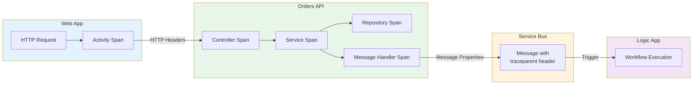
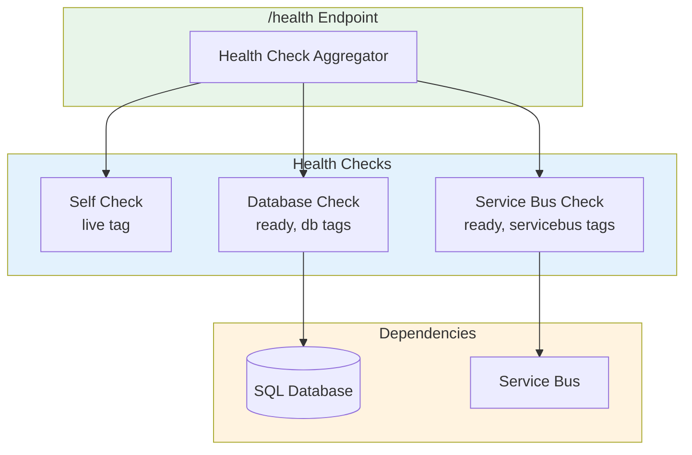

# Observability Architecture

← [Technology Architecture](04-technology-architecture.md) | [Index](README.md) | [Security Architecture →](06-security-architecture.md)

## Observability Strategy Overview

The solution implements comprehensive observability through the three pillars: **Logs**, **Metrics**, and **Traces**. All telemetry flows to Azure Application Insights, enabling unified monitoring across all services including Logic Apps workflows.

### Tooling Decisions

| Pillar | Technology | Destination |
|--------|------------|-------------|
| **Traces** | OpenTelemetry + Azure Monitor Exporter | Application Insights |
| **Metrics** | OpenTelemetry Metrics | Application Insights |
| **Logs** | OpenTelemetry Logging | Application Insights + Log Analytics |
| **Health** | ASP.NET Core Health Checks | `/health`, `/alive` endpoints |

---

## Distributed Tracing

### Trace Propagation



### Correlation ID Strategy

| Header/Property | Purpose | Format |
|----------------|---------|--------|
| `traceparent` | W3C Trace Context | `00-{trace-id}-{span-id}-{flags}` |
| `tracestate` | Vendor-specific state | Key-value pairs |
| `TraceId` | Message property | GUID (32 hex chars) |
| `SpanId` | Message property | 16 hex chars |

### Span Hierarchy

```
[Web App: HTTP POST /placeorder]
└── [API: HTTP POST /api/orders]
    ├── [PlaceOrder (Controller)]
    │   └── [PlaceOrder (Service)]
    │       ├── [SaveOrder (Repository)]
    │       │   └── [SQL INSERT]
    │       └── [SendOrderMessage (Handler)]
    │           └── [Service Bus Publish]
    └── [Logic App: ProcessingOrdersPlaced]
```

### Activity Source Configuration

```csharp
// From Extensions.cs
openTelemetry.WithTracing(tracing =>
{
    tracing.AddSource(builder.Environment.ApplicationName)
        .AddSource("eShop.Orders.API")
        .AddSource("eShop.Web.App")
        .AddSource("Azure.Messaging.ServiceBus")
        .AddAspNetCoreInstrumentation()
        .AddHttpClientInstrumentation()
        .AddSqlClientInstrumentation();
});
```

---

## Logging Architecture

### Log Levels and Standards

| Level | Usage | Examples |
|-------|-------|----------|
| `Trace` | Detailed diagnostic info | Method entry/exit |
| `Debug` | Development diagnostics | Variable values |
| `Information` | Normal operations | Order placed, request received |
| `Warning` | Unexpected but handled | Retry attempt, validation failure |
| `Error` | Operation failures | Exception caught |
| `Critical` | System failures | Startup failure, unhandled exception |

### Structured Logging Format

All logs include structured data for querying:

```csharp
// Example from OrderService.cs
_logger.LogInformation(
    "Placing order with ID: {OrderId} for customer {CustomerId}", 
    order.Id, 
    order.CustomerId);
```

### Log Enrichment

Logs are automatically enriched with:

| Property | Source | Purpose |
|----------|--------|---------|
| `TraceId` | OpenTelemetry | Trace correlation |
| `SpanId` | OpenTelemetry | Span correlation |
| `ApplicationName` | Environment | Service identification |
| `MachineName` | Host | Instance identification |

### Log Analytics Configuration

| Setting | Value | Bicep Location |
|---------|-------|----------------|
| Retention | 30 days | [log-analytics-workspace.bicep](../../infra/shared/monitoring/log-analytics-workspace.bicep) |
| SKU | PerGB2018 | [log-analytics-workspace.bicep](../../infra/shared/monitoring/log-analytics-workspace.bicep) |
| Destination | Dedicated | Diagnostic settings |

---

## Metrics & Monitoring

### Key Metrics

| Metric | Source | Unit | Alert Threshold |
|--------|--------|------|-----------------|
| `eShop.orders.placed` | OrderService | count | N/A (informational) |
| `eShop.orders.processing.duration` | OrderService | ms | > 5000ms |
| `eShop.orders.processing.errors` | OrderService | count | > 10/minute |
| `eShop.orders.deleted` | OrderService | count | N/A (informational) |
| `http.server.request.duration` | ASP.NET Core | ms | p95 > 1000ms |
| `http.client.request.duration` | HttpClient | ms | p95 > 2000ms |

### Custom Metrics Implementation

```csharp
// From OrderService.cs
private static readonly Meter Meter = new("eShop.Orders.API");
private static readonly Counter<long> OrdersPlacedCounter = Meter.CreateCounter<long>(
    "eShop.orders.placed",
    unit: "order",
    description: "Total number of orders successfully placed");
private static readonly Histogram<double> OrderProcessingDuration = Meter.CreateHistogram<double>(
    "eShop.orders.processing.duration",
    unit: "ms",
    description: "Time taken to process order operations");

// Recording metrics
OrdersPlacedCounter.Add(1, new TagList { { "order.status", "success" } });
OrderProcessingDuration.Record(duration, new TagList { { "order.status", "success" } });
```

### Meter Configuration

```csharp
// From Extensions.cs
openTelemetry.WithMetrics(metrics =>
{
    metrics.AddAspNetCoreInstrumentation()
        .AddHttpClientInstrumentation()
        .AddRuntimeInstrumentation()
        .AddMeter(builder.Environment.ApplicationName)
        .AddMeter("eShop.Orders.API")
        .AddMeter("eShop.Web.App");
});
```

---

## Application Insights Integration

### Instrumentation Approach

| Component | Instrumentation | Configuration |
|-----------|-----------------|---------------|
| ASP.NET Core | Auto-instrumentation | `AddAspNetCoreInstrumentation()` |
| HttpClient | Auto-instrumentation | `AddHttpClientInstrumentation()` |
| SQL Client | Auto-instrumentation | `AddSqlClientInstrumentation()` |
| Service Bus | Auto-instrumentation | `AddSource("Azure.Messaging.ServiceBus")` |
| Custom Business Logic | Manual spans | `ActivitySource.StartActivity()` |

### SDK Configuration

```csharp
// From Extensions.cs
var appInsightsConnectionString = builder.Configuration["APPLICATIONINSIGHTS_CONNECTION_STRING"];
if (!string.IsNullOrEmpty(appInsightsConnectionString))
{
    openTelemetry
        .WithTracing(tracing => tracing.AddAzureMonitorTraceExporter(options =>
        {
            options.ConnectionString = appInsightsConnectionString;
        }))
        .WithMetrics(metrics => metrics.AddAzureMonitorMetricExporter(options =>
        {
            options.ConnectionString = appInsightsConnectionString;
        }));
}
```

### Sampling Strategy

Application Insights adaptive sampling is configured via `host.json` for Logic Apps:

```json
// From workflows/OrdersManagement/OrdersManagementLogicApp/host.json
{
  "logging": {
    "applicationInsights": {
      "samplingSettings": {
        "isEnabled": true,
        "excludedTypes": "Request"
      }
    }
  }
}
```

---

## Health Monitoring

### Health Check Endpoints

| Endpoint | Purpose | Check Type |
|----------|---------|------------|
| `/health` | Overall health | All registered checks |
| `/alive` | Liveness probe | Self-check only |

### Health Check Implementation

```csharp
// From Program.cs (Orders API)
var healthChecksBuilder = builder.Services.AddHealthChecks();
healthChecksBuilder.AddCheck<DbContextHealthCheck>("database", tags: new[] { "ready", "db" });
healthChecksBuilder.AddCheck<ServiceBusHealthCheck>("servicebus", tags: new[] { "ready", "servicebus" });
```

### Health Model Diagram



### Dependency Health Tracking

| Dependency | Health Check | Failure Behavior |
|------------|--------------|------------------|
| SQL Database | `DbContextHealthCheck` | `CanConnectAsync()` returns false |
| Service Bus | `ServiceBusHealthCheck` | Connection test fails |

---

## Alerting Strategy

### Recommended Alert Rules

| Metric | Condition | Severity | Action |
|--------|-----------|----------|--------|
| `eShop.orders.processing.errors` | > 10 in 5 min | Warning | Email notification |
| `http.server.request.duration` (p95) | > 2000ms | Warning | Email notification |
| Health check failures | Any failure | Critical | PagerDuty/Slack |
| Exception count | > 50 in 5 min | Error | Email + Teams |

### Action Groups

Configure Azure Monitor Action Groups for:
- Email notifications
- Teams/Slack webhooks
- PagerDuty/OpsGenie integration
- Azure Function triggers

---

## Dashboards & Visualization

### Recommended Dashboards

| Dashboard | Audience | Key Visualizations |
|-----------|----------|-------------------|
| **Application Map** | All | Service dependencies, failure rates |
| **Live Metrics** | Operations | Real-time request rates, response times |
| **Performance** | Developers | Slow requests, dependency calls |
| **Failures** | Operations | Exception trends, failed requests |
| **Custom: Orders** | Business | Orders placed, processing duration |

### Key Visualizations

1. **End-to-End Transaction View**: Trace waterfall from UI to database
2. **Dependency Map**: Service relationships with health indicators
3. **Order Processing Funnel**: Success/failure rates by stage
4. **Resource Utilization**: CPU, memory, request throughput

---

## Aspire Dashboard (Local Development)

In local development, .NET Aspire provides a built-in dashboard at `https://localhost:18888`:

| Feature | Description |
|---------|-------------|
| **Resources** | Service health and endpoints |
| **Console** | Aggregated service logs |
| **Traces** | Distributed traces with span details |
| **Metrics** | Real-time metric graphs |

---

## Related Documents

- [Technology Architecture](04-technology-architecture.md) - Application Insights infrastructure
- [Application Architecture](03-application-architecture.md) - Service instrumentation
- [ADR-003: Observability Strategy](adr/ADR-003-observability-strategy.md) - Strategy rationale
