# Observability Architecture

[← Technology Architecture](04-technology-architecture.md) | [Index](README.md) | [Next →](06-security-architecture.md)

## Observability Architecture Overview

The solution implements a **comprehensive observability strategy** based on the three pillars: **Traces**, **Metrics**, and **Logs**. All telemetry is collected using **OpenTelemetry** instrumentation and exported to **Azure Application Insights** with **Log Analytics** workspace integration.

### Three Pillars of Observability

```mermaid
flowchart TB
    subgraph Sources["📡 Telemetry Sources"]
        WebApp["🌐 Web App"]
        API["📡 Orders API"]
        LogicApp["🔄 Logic Apps"]
        Azure["☁️ Azure Platform"]
    end

    subgraph Collection["📥 Collection (OpenTelemetry)"]
        Traces["📍 Traces<br/><i>Distributed request flow</i>"]
        Metrics["📈 Metrics<br/><i>Aggregated measurements</i>"]
        Logs["📝 Logs<br/><i>Structured events</i>"]
    end

    subgraph Storage["🗄️ Storage"]
        AI["Application Insights<br/><i>APM Platform</i>"]
        LAW["Log Analytics<br/><i>Query & Analytics</i>"]
    end

    subgraph Visualization["📊 Visualization"]
        AppMap["Application Map"]
        TxSearch["Transaction Search"]
        LiveMetrics["Live Metrics"]
        Dashboards["Azure Dashboards"]
        Alerts["Alert Rules"]
    end

    WebApp & API -->|"OTLP"| Collection
    LogicApp & Azure -->|"Platform"| Collection
    
    Traces & Metrics & Logs --> AI
    AI -->|"Workspace"| LAW
    
    AI --> AppMap & TxSearch & LiveMetrics
    LAW --> Dashboards & Alerts

    classDef source fill:#e3f2fd,stroke:#1565c0
    classDef collect fill:#fff3e0,stroke:#ef6c00
    classDef storage fill:#e8f5e9,stroke:#2e7d32
    classDef visual fill:#f3e5f5,stroke:#7b1fa2

    class WebApp,API,LogicApp,Azure source
    class Traces,Metrics,Logs collect
    class AI,LAW storage
    class AppMap,TxSearch,LiveMetrics,Dashboards,Alerts visual
```



---

## OpenTelemetry Instrumentation

### Instrumentation Stack

| Layer | Instrumentation | Package | Auto/Manual |
|-------|-----------------|---------|-------------|
| **HTTP Server** | ASP.NET Core requests | `OpenTelemetry.Instrumentation.AspNetCore` | Auto |
| **HTTP Client** | Outbound HTTP calls | `OpenTelemetry.Instrumentation.Http` | Auto |
| **Database** | EF Core / SQL Server | `OpenTelemetry.Instrumentation.SqlClient` | Auto |
| **Runtime** | GC, Thread Pool, JIT | `OpenTelemetry.Instrumentation.Runtime` | Auto |
| **Business Logic** | Custom spans and metrics | Manual `Activity` and `Meter` | Manual |

### Configuration

From [Extensions.cs](../app.ServiceDefaults/Extensions.cs):

```csharp
private static IHostApplicationBuilder ConfigureOpenTelemetry(this IHostApplicationBuilder builder)
{
    builder.Logging.AddOpenTelemetry(logging =>
    {
        logging.IncludeFormattedMessage = true;
        logging.IncludeScopes = true;
    });

    builder.Services.AddOpenTelemetry()
        .WithMetrics(metrics =>
        {
            metrics.AddAspNetCoreInstrumentation()
                .AddHttpClientInstrumentation()
                .AddRuntimeInstrumentation();
        })
        .WithTracing(tracing =>
        {
            tracing.AddSource(builder.Environment.ApplicationName)
                .AddAspNetCoreInstrumentation(options => 
                    options.RecordException = true)
                .AddHttpClientInstrumentation()
                .AddSqlClientInstrumentation(options =>
                {
                    options.SetDbStatementForText = true;
                    options.RecordException = true;
                });
        });

    builder.AddOpenTelemetryExporters();
    return builder;
}
```

---

## Distributed Tracing

### Trace Context Propagation

```mermaid
sequenceDiagram
    participant User as 👤 User
    participant Web as 🌐 Web App
    participant API as 📡 Orders API
    participant DB as 🗄️ SQL Database
    participant SB as 📨 Service Bus
    participant LA as 🔄 Logic App
    participant AI as 📊 App Insights

    Note over User,AI: W3C Trace Context Propagation

    User->>Web: Request
    activate Web
    Note right of Web: TraceId: abc123<br/>SpanId: span1
    
    Web->>API: HTTP (traceparent header)
    activate API
    Note right of API: TraceId: abc123<br/>SpanId: span2<br/>ParentId: span1
    
    API->>DB: SQL Query
    activate DB
    Note right of DB: TraceId: abc123<br/>SpanId: span3
    DB-->>API: Results
    deactivate DB
    
    API->>SB: Publish Message
    Note right of SB: ApplicationProperties:<br/>traceparent: abc123
    
    API-->>Web: Response
    deactivate API
    Web-->>User: Response
    deactivate Web

    Note over SB,LA: Async Processing
    SB->>LA: Trigger
    activate LA
    Note right of LA: Correlation via<br/>workflow run ID
    LA->>AI: Diagnostics
    deactivate LA

    Web & API & DB -.->|"Export"| AI
```

### Custom Activity Implementation

From [OrdersController.cs](../src/eShop.Orders.API/Controllers/OrdersController.cs):

```csharp
using var activity = ActivitySource.StartActivity(
    "CreateOrder",
    ActivityKind.Server);

activity?.SetTag("order.customer_name", order.CustomerName);
activity?.SetTag("order.total_amount", order.TotalAmount);
activity?.SetTag("order.product_count", order.Products.Count);

try
{
    var result = await _orderService.CreateOrderAsync(order);
    activity?.SetTag("order.id", result.Id);
    activity?.SetStatus(ActivityStatusCode.Ok);
    return CreatedAtAction(nameof(GetOrder), new { id = result.Id }, result);
}
catch (Exception ex)
{
    activity?.SetStatus(ActivityStatusCode.Error, ex.Message);
    activity?.RecordException(ex);
    throw;
}
```

---

## Metrics Architecture

### Metrics Categories


### Custom Metrics Implementation

From [OrderService.cs](../src/eShop.Orders.API/Services/OrderService.cs):

```csharp
private static readonly Meter Meter = new("eShop.Orders.API", "1.0.0");
private static readonly Counter<long> OrdersPlacedCounter = 
    Meter.CreateCounter<long>("eShop.orders.placed", "orders", "Number of orders placed");
private static readonly Counter<long> OrdersDeletedCounter = 
    Meter.CreateCounter<long>("eShop.orders.deleted", "orders", "Number of orders deleted");
private static readonly Histogram<double> OrderProcessingDuration = 
    Meter.CreateHistogram<double>("eShop.orders.processing.duration", "ms", "Order processing duration");

public async Task<Order> CreateOrderAsync(Order order)
{
    var stopwatch = Stopwatch.StartNew();
    try
    {
        var result = await _repository.CreateOrderAsync(order);
        OrdersPlacedCounter.Add(1, new KeyValuePair<string, object?>("status", "success"));
        return result;
    }
    finally
    {
        stopwatch.Stop();
        OrderProcessingDuration.Record(stopwatch.ElapsedMilliseconds);
    }
}
```

### Metrics Inventory

| Metric Name | Type | Description | Dimensions | Source |
|-------------|------|-------------|------------|--------|
| `http.server.request.duration` | Histogram | Request latency | method, route, status_code | OTEL Auto |
| `http.server.active_requests` | UpDownCounter | Concurrent requests | method | OTEL Auto |
| `db.client.operation.duration` | Histogram | Database query time | db.operation | OTEL Auto |
| `eShop.orders.placed` | Counter | Orders created | status | Custom |
| `eShop.orders.deleted` | Counter | Orders deleted | - | Custom |
| `eShop.orders.processing.duration` | Histogram | Processing time | status | Custom |
| `process.runtime.dotnet.gc.collections.count` | Counter | GC collections | generation | OTEL Runtime |
| `process.runtime.dotnet.thread_pool.threads.count` | UpDownCounter | Thread count | - | OTEL Runtime |

---

## Logging Architecture

### Structured Logging Flow

```mermaid
flowchart LR
    subgraph App["📱 Application"]
        Logger["ILogger<T>"]
        Serilog["Serilog<br/><i>Enrichers</i>"]
    end

    subgraph OTEL["OpenTelemetry"]
        LogProvider["Log Provider"]
        LogExporter["Log Exporter"]
    end

    subgraph Storage["📊 Storage"]
        AI["Application Insights<br/><i>traces table</i>"]
        LAW["Log Analytics<br/><i>AppTraces</i>"]
    end

    Logger --> Serilog --> LogProvider --> LogExporter --> AI --> LAW

    classDef app fill:#e3f2fd,stroke:#1565c0
    classDef otel fill:#fff3e0,stroke:#ef6c00
    classDef storage fill:#e8f5e9,stroke:#2e7d32

    class Logger,Serilog app
    class LogProvider,LogExporter otel
    class AI,LAW storage
```



### Log Levels and Usage

| Level | Usage | Example | Retention |
|-------|-------|---------|-----------|
| **Trace** | Detailed debugging | "Entering method X with params..." | Debug only |
| **Debug** | Development diagnostics | "Query returned {count} rows" | Debug only |
| **Information** | Normal operations | "Order {orderId} created successfully" | 30 days |
| **Warning** | Recoverable issues | "Retry attempt {n} for operation" | 30 days |
| **Error** | Operation failures | "Failed to process order: {message}" | 90 days |
| **Critical** | System failures | "Database connection pool exhausted" | 90 days |

### Log Schema

```json
{
  "Timestamp": "2025-01-15T10:30:00.123Z",
  "Level": "Information",
  "MessageTemplate": "Order {OrderId} created for customer {CustomerName}",
  "Properties": {
    "OrderId": "ORD-2025-001",
    "CustomerName": "John Smith",
    "TotalAmount": 99.99,
    "TraceId": "abc123def456...",
    "SpanId": "789xyz...",
    "ParentSpanId": "parent123...",
    "RequestPath": "/api/orders",
    "RequestMethod": "POST",
    "SourceContext": "eShop.Orders.API.Controllers.OrdersController",
    "ActionName": "CreateOrder",
    "MachineName": "container-abc-123",
    "EnvironmentName": "Production"
  },
  "Exception": null
}
```

---

## Health Checks

### Health Check Architecture


### Health Check Configuration

From [Extensions.cs](../app.ServiceDefaults/Extensions.cs):

```csharp
public static IHostApplicationBuilder AddDefaultHealthChecks(this IHostApplicationBuilder builder)
{
    builder.Services.AddHealthChecks()
        .AddCheck("self", () => HealthCheckResult.Healthy(), tags: ["live"]);

    return builder;
}

public static WebApplication MapDefaultEndpoints(this WebApplication app)
{
    app.MapHealthChecks("/health", new HealthCheckOptions
    {
        ResponseWriter = UIResponseWriter.WriteHealthCheckUIResponse
    });

    app.MapHealthChecks("/alive", new HealthCheckOptions
    {
        Predicate = r => r.Tags.Contains("live")
    });

    return app;
}
```

### Health Check Response

```json
{
  "status": "Healthy",
  "totalDuration": "00:00:00.0234567",
  "entries": {
    "self": {
      "status": "Healthy",
      "duration": "00:00:00.0001234"
    },
    "database": {
      "status": "Healthy",
      "duration": "00:00:00.0150000",
      "data": {
        "server": "sql-server.database.windows.net",
        "database": "OrderDb"
      }
    },
    "servicebus": {
      "status": "Healthy",
      "duration": "00:00:00.0080000",
      "data": {
        "namespace": "sb-namespace.servicebus.windows.net"
      }
    }
  }
}
```

---

## Alert Rules

### Alert Configuration

| Alert Name | Condition | Severity | Action |
|------------|-----------|----------|--------|
| **High Error Rate** | Error count > 10/5min | Sev 1 | Page on-call |
| **Slow Response Time** | P95 latency > 2s | Sev 2 | Notify team |
| **Service Unhealthy** | Health check fails | Sev 1 | Page on-call |
| **Dead Letter Queue** | DLQ messages > 0 | Sev 2 | Notify team |
| **High CPU** | Container CPU > 80% | Sev 3 | Notify team |
| **Database DTU High** | DTU > 80% | Sev 2 | Notify team |

### KQL Queries for Alerting

**High Error Rate:**
```kql
requests
| where timestamp > ago(5m)
| where success == false
| summarize ErrorCount = count() by bin(timestamp, 1m)
| where ErrorCount > 10
```

**Slow Response Time:**
```kql
requests
| where timestamp > ago(5m)
| summarize P95Duration = percentile(duration, 95) by bin(timestamp, 1m)
| where P95Duration > 2000
```

**End-to-End Transaction Trace:**
```kql
union requests, dependencies, traces, exceptions
| where operation_Id == "abc123..."
| project timestamp, itemType, name, duration, success, message
| order by timestamp asc
```

---

## SLI/SLO Definitions

### Service Level Indicators

| SLI | Definition | Measurement | Target |
|-----|------------|-------------|--------|
| **Availability** | Successful requests / Total requests | HTTP 2xx-3xx | 99.9% |
| **Latency** | P95 response time | Request duration | < 2s |
| **Error Rate** | Failed requests / Total requests | HTTP 4xx-5xx | < 0.1% |
| **Throughput** | Requests per second | Request count | > 100 RPS |

### Service Level Objectives

| Service | Availability SLO | Latency SLO (P95) | Error Budget |
|---------|-----------------|-------------------|--------------|
| **Orders API** | 99.9% | 500ms | 43.2 min/month |
| **Web App** | 99.5% | 1000ms | 3.6 hrs/month |
| **Order Processing** | 99.5% | 5000ms | 3.6 hrs/month |

---

## Observability Runbook

### Common Investigation Patterns

**1. High Latency Investigation:**
```kql
// Find slow requests
requests
| where timestamp > ago(1h)
| where duration > 2000
| project timestamp, name, duration, operation_Id
| order by duration desc
| take 10

// Get dependencies for slow request
dependencies
| where operation_Id == "<operation_id>"
| project timestamp, name, duration, target, success
| order by timestamp asc
```

**2. Error Investigation:**
```kql
// Find exceptions
exceptions
| where timestamp > ago(1h)
| summarize Count = count() by type, outerMessage
| order by Count desc

// Get full exception details
exceptions
| where operation_Id == "<operation_id>"
| project timestamp, type, outerMessage, innermostMessage, details
```

**3. Service Bus Investigation:**
```kql
// Check message processing
AzureDiagnostics
| where ResourceProvider == "MICROSOFT.SERVICEBUS"
| where OperationName == "Send" or OperationName == "Complete"
| summarize Count = count() by OperationName, bin(TimeGenerated, 1m)
```

---

## Cross-Architecture Relationships

| Related Architecture | Connection | Reference |
|---------------------|------------|-----------|
| **Data Architecture** | Telemetry stored in App Insights and Log Analytics | [Data Architecture](02-data-architecture.md#monitoring-data-flow) |
| **Application Architecture** | Applications emit telemetry via OpenTelemetry SDK | [Application Architecture](03-application-architecture.md#cross-cutting-concerns) |
| **Technology Architecture** | Azure provides observability infrastructure | [Technology Architecture](04-technology-architecture.md#observability-layer) |
| **Deployment Architecture** | Deployment includes diagnostic settings configuration | [Deployment Architecture](07-deployment-architecture.md#infrastructure-as-code) |

---

[← Technology Architecture](04-technology-architecture.md) | [Index](README.md) | [Next →](06-security-architecture.md)
