# Observability Architecture

← [Technology Architecture](04-technology-architecture.md) | [Index](README.md) | [Security Architecture →](06-security-architecture.md)

---

## 1. Observability Principles

| #   | Principle                          | Rationale                             | Implications                      |
| --- | ---------------------------------- | ------------------------------------- | --------------------------------- |
| O-1 | **Vendor-Neutral Instrumentation** | Avoid lock-in, future flexibility     | Use OpenTelemetry SDK             |
| O-2 | **Correlation by Default**         | End-to-end visibility across services | W3C Trace Context propagation     |
| O-3 | **Business-Aligned Metrics**       | Connect technical metrics to outcomes | Custom metrics for order KPIs     |
| O-4 | **Actionable Alerts**              | Reduce noise, improve response        | Alert on symptoms, not causes     |
| O-5 | **Cost-Aware Telemetry**           | Control data volumes                  | Sampling and filtering strategies |

---

## 2. Observability Strategy

### Goals and Objectives

| Goal                          | Objective                          | Measurement                  |
| ----------------------------- | ---------------------------------- | ---------------------------- |
| **End-to-End Visibility**     | Trace requests across all services | 100% trace correlation       |
| **Proactive Monitoring**      | Detect issues before user impact   | Alert on SLO degradation     |
| **Efficient Troubleshooting** | Reduce MTTR                        | < 30 min to root cause       |
| **Performance Baselines**     | Understand normal behavior         | P50/P95/P99 latency tracking |

### SLI/SLO Definitions

| SLI              | Definition                    | Measurement                 | SLO      | Error Budget   |
| ---------------- | ----------------------------- | --------------------------- | -------- | -------------- |
| **Availability** | % of successful HTTP requests | `successCount / totalCount` | 99.9%    | 43.2 min/month |
| **Latency**      | P95 API response time         | `percentile(duration, 95)`  | < 500ms  | N/A            |
| **Throughput**   | Orders processed per hour     | `count(orders.placed)`      | > 500/hr | N/A            |
| **Error Rate**   | % of 5xx responses            | `errorCount / totalCount`   | < 0.1%   | N/A            |

---

## 3. Telemetry Architecture

### Three Pillars Overview

```mermaid
flowchart TB
    subgraph Pillars["📊 Three Pillars of Observability"]
        direction LR
        Traces["🔍 Traces<br/><i>Distributed request flow</i>"]
        Metrics["📈 Metrics<br/><i>Quantitative measurements</i>"]
        Logs["📝 Logs<br/><i>Discrete event records</i>"]
    end

    subgraph Collection["📥 Collection Layer"]
        SDK["OpenTelemetry SDK"]
        AzMon["Azure Monitor Exporter"]
        Diag["Azure Diagnostics"]
    end

    subgraph Backend["💾 Backend Layer"]
        AI["Application Insights<br/><i>APM Platform</i>"]
        LAW["Log Analytics<br/><i>Query Engine</i>"]
    end

    subgraph Consumption["👁️ Consumption Layer"]
        AppMap["Application Map"]
        TxSearch["Transaction Search"]
        Dashboards["Dashboards"]
        Alerts["Alert Rules"]
    end

    Traces & Metrics & Logs --> SDK --> AzMon --> AI
    Diag --> LAW
    AI --> LAW
    AI --> AppMap & TxSearch
    LAW --> Dashboards & Alerts

    classDef pillars fill:#e3f2fd,stroke:#1565c0,stroke-width:2px
    classDef collection fill:#e8f5e9,stroke:#2e7d32,stroke-width:2px
    classDef backend fill:#fff3e0,stroke:#ef6c00,stroke-width:2px
    classDef consumption fill:#f3e5f5,stroke:#7b1fa2,stroke-width:2px

    class Traces,Metrics,Logs pillars
    class SDK,AzMon,Diag collection
    class AI,LAW backend
    class AppMap,TxSearch,Dashboards,Alerts consumption
```



### Instrumentation Standards

| Component       | Instrumentation                          | Auto/Manual | Source           |
| --------------- | ---------------------------------------- | ----------- | ---------------- |
| ASP.NET Core    | OpenTelemetry.Instrumentation.AspNetCore | Auto        | SDK              |
| HTTP Client     | OpenTelemetry.Instrumentation.HttpClient | Auto        | SDK              |
| SQL Client      | OpenTelemetry.Instrumentation.SqlClient  | Auto        | SDK              |
| Service Bus     | Azure.Messaging.ServiceBus source        | Manual      | Custom spans     |
| Business Events | Custom ActivitySource                    | Manual      | Application code |

### Telemetry Inventory Matrix

| Source               | Traces     | Metrics          | Logs           | Correlation ID     |
| -------------------- | ---------- | ---------------- | -------------- | ------------------ |
| eShop.Orders.API     | ✅ Auto    | ✅ Auto + Custom | ✅ Structured  | TraceId, SpanId    |
| eShop.Web.App        | ✅ Auto    | ✅ Auto          | ✅ Structured  | TraceId, SpanId    |
| Service Bus Messages | ✅ Manual  | ✅ Platform      | ✅ Platform    | traceparent header |
| Logic Apps           | ⚠️ Limited | ✅ Platform      | ✅ Run history | Run ID, Action ID  |
| Azure SQL            | ❌ N/A     | ✅ Platform      | ✅ Query logs  | N/A                |

---

## 4. Traces

### Distributed Tracing Strategy

The solution implements **W3C Trace Context** for cross-service correlation, ensuring traces flow seamlessly from the Web App through the API, Service Bus, and Logic Apps.

### Span Inventory

| Span Name          | Kind     | Source               | Attributes                                   |
| ------------------ | -------- | -------------------- | -------------------------------------------- |
| `PlaceOrder`       | Server   | OrdersController     | order.id, order.total, order.products.count  |
| `SendOrderMessage` | Producer | OrdersMessageHandler | messaging.system, messaging.destination.name |
| `GetOrders`        | Server   | OrdersController     | http.method, http.route                      |
| `db.query`         | Client   | EF Core              | db.name, db.operation                        |

### Trace Propagation Flow


### Context Propagation Implementation

From [OrdersMessageHandler.cs](../../src/eShop.Orders.API/Handlers/OrdersMessageHandler.cs):

```csharp
// Add trace context to message for distributed tracing
if (activity != null)
{
    message.ApplicationProperties["TraceId"] = activity.TraceId.ToString();
    message.ApplicationProperties["SpanId"] = activity.SpanId.ToString();
    message.ApplicationProperties["traceparent"] = activity.Id ?? string.Empty;
    if (!string.IsNullOrWhiteSpace(activity.TraceStateString))
    {
        message.ApplicationProperties["tracestate"] = activity.TraceStateString;
    }
}
```

---

## 5. Metrics

### Metrics Strategy

- **Request metrics**: Auto-instrumented by OpenTelemetry
- **Business metrics**: Custom counters for order operations
- **Platform metrics**: Azure Monitor for infrastructure

### Metrics Catalog

| Metric Name                    | Type          | Source        | Unit    | Business Meaning     |
| ------------------------------ | ------------- | ------------- | ------- | -------------------- |
| `http.server.request.duration` | Histogram     | ASP.NET Core  | seconds | API responsiveness   |
| `http.server.active_requests`  | UpDownCounter | ASP.NET Core  | count   | Concurrent load      |
| `db.client.operation.duration` | Histogram     | EF Core       | seconds | Database performance |
| `servicebus.messages.active`   | Gauge         | Azure Monitor | count   | Queue backlog        |
| `sql.dtu.consumption`          | Gauge         | Azure Monitor | percent | Database load        |

### Custom Business Metrics

| Metric                       | Type      | Purpose                    | Implementation                |
| ---------------------------- | --------- | -------------------------- | ----------------------------- |
| `orders.created`             | Counter   | Track order volume         | Increment on successful order |
| `orders.batch.size`          | Histogram | Batch operation analysis   | Record batch count            |
| `orders.processing.duration` | Histogram | End-to-end processing time | Timer from API to Logic App   |

---

## 6. Logs

### Logging Standards

| Standard               | Implementation                                                       | Example                     |
| ---------------------- | -------------------------------------------------------------------- | --------------------------- |
| **Structured Logging** | Serilog-style message templates                                      | `"Order {OrderId} created"` |
| **Correlation IDs**    | TraceId/SpanId in all logs                                           | `BeginScope()`              |
| **Log Levels**         | Information for success, Warning for recoverable, Error for failures | Per-event basis             |
| **Sensitive Data**     | No PII in logs                                                       | Mask customer data          |

### Log Levels and Categories

| Level           | Usage                        | Example             |
| --------------- | ---------------------------- | ------------------- |
| **Trace**       | Detailed debugging           | Method entry/exit   |
| **Debug**       | Development diagnostics      | Variable values     |
| **Information** | Normal operations            | "Order created"     |
| **Warning**     | Recoverable issues           | "Retry attempt 2"   |
| **Error**       | Failures requiring attention | Exception details   |
| **Critical**    | System-wide failures         | Service unavailable |

### Structured Logging Schema

```json
{
  "Timestamp": "2026-01-21T10:30:00.000Z",
  "Level": "Information",
  "MessageTemplate": "Order {OrderId} created with total {Total}",
  "Properties": {
    "OrderId": "ORD-2026-001",
    "Total": 149.99,
    "TraceId": "abc123def456...",
    "SpanId": "789ghi...",
    "RequestPath": "/api/orders",
    "SourceContext": "eShop.Orders.API.Controllers.OrdersController"
  }
}
```

---

## 7. Platform Components

### Collection Layer

| Component                  | Technology                           | Purpose                   |
| -------------------------- | ------------------------------------ | ------------------------- |
| **OpenTelemetry SDK**      | OpenTelemetry.NET                    | Instrumentation framework |
| **Azure Monitor Exporter** | Azure.Monitor.OpenTelemetry.Exporter | Export to App Insights    |
| **Azure Diagnostics**      | Built-in                             | Platform telemetry        |

### Storage Layer

| Store                   | Purpose              | Retention | Query Language   |
| ----------------------- | -------------------- | --------- | ---------------- |
| Application Insights    | APM, traces, metrics | 90 days   | KQL              |
| Log Analytics Workspace | Centralized logs     | 30 days   | KQL              |
| Azure Monitor Metrics   | Time-series          | 93 days   | Metrics Explorer |

### Visualization Layer

| Tool               | Purpose              | Primary Users |
| ------------------ | -------------------- | ------------- |
| Application Map    | Service topology     | All           |
| Transaction Search | End-to-end traces    | Developers    |
| Azure Dashboards   | Operational overview | Operations    |
| KQL Queries        | Ad-hoc analysis      | SRE           |

---

## 8. Alerting and Incident Response

### Alert Rules Catalog

| Alert                   | Severity | Condition                 | Response                 |
| ----------------------- | -------- | ------------------------- | ------------------------ |
| **API High Latency**    | Warning  | P95 > 2s for 5 min        | Investigate slow queries |
| **API Error Spike**     | Critical | Error rate > 5% for 5 min | Page on-call             |
| **Queue Depth Growing** | Warning  | Depth > 1000 for 10 min   | Scale consumers          |
| **Database DTU High**   | Warning  | DTU > 80% for 15 min      | Consider scaling         |
| **Logic App Failures**  | Critical | > 3 failures in 5 min     | Check workflow logs      |

### Escalation Procedures

| Severity          | Initial Response         | Escalation Path                | SLA     |
| ----------------- | ------------------------ | ------------------------------ | ------- |
| **Critical**      | Page on-call immediately | Dev Lead → Engineering Manager | 15 min  |
| **Warning**       | Slack notification       | On-call reviews in shift       | 4 hours |
| **Informational** | Log only                 | Weekly review                  | N/A     |

---

## 9. Dashboards

### Dashboard Inventory

| Dashboard               | Purpose                   | Refresh Rate | Audience      |
| ----------------------- | ------------------------- | ------------ | ------------- |
| **Operations Overview** | System health at a glance | 5 min        | Operations    |
| **Order Processing**    | Business metrics          | 1 min        | Business, Dev |
| **Infrastructure**      | Resource utilization      | 5 min        | Platform      |
| **Error Analysis**      | Failure investigation     | Real-time    | Developers    |

### Key Visualizations

| Visualization        | Metrics         | Chart Type   |
| -------------------- | --------------- | ------------ |
| Request Volume       | requests/min    | Time series  |
| Latency Distribution | P50, P95, P99   | Heatmap      |
| Error Rate           | 4xx, 5xx counts | Stacked area |
| Queue Depth          | Active messages | Line chart   |
| Order Throughput     | orders/hour     | Counter      |

---

## 10. Cost Management

### Data Volume Estimates

| Source           | Daily Volume | Monthly Cost |
| ---------------- | ------------ | ------------ |
| API Traces       | ~500 MB      | ~$10         |
| API Logs         | ~200 MB      | ~$5          |
| Platform Metrics | ~100 MB      | ~$2          |
| Logic App Logs   | ~50 MB       | ~$1          |

### Sampling Strategies

| Telemetry Type   | Sampling Rate | Rationale               |
| ---------------- | ------------- | ----------------------- |
| Traces (success) | 10%           | High volume, low value  |
| Traces (errors)  | 100%          | Always capture failures |
| Metrics          | 100%          | Low volume, aggregated  |
| Logs (debug)     | 1%            | Development only        |

### Retention Policies

| Data Type | Hot Storage | Archive | Rationale              |
| --------- | ----------- | ------- | ---------------------- |
| Traces    | 90 days     | None    | Troubleshooting window |
| Metrics   | 93 days     | None    | Azure default          |
| Logs      | 30 days     | 1 year  | Compliance             |

---

## 11. Cross-Architecture Relationships

| Related Architecture         | Connection                         | Reference                                                                          |
| ---------------------------- | ---------------------------------- | ---------------------------------------------------------------------------------- |
| **Business Architecture**    | SLIs measure business capabilities | [Quality Attributes](01-business-architecture.md#5-quality-attribute-requirements) |
| **Data Architecture**        | Telemetry as data domain           | [Telemetry Data Mapping](02-data-architecture.md#8-telemetry-data-mapping)         |
| **Application Architecture** | Services emit telemetry            | [Cross-Cutting Concerns](03-application-architecture.md#9-cross-cutting-concerns)  |
| **Technology Architecture**  | Observability platforms            | [Platform Services](04-technology-architecture.md#3-platform-services)             |

---

_Last Updated: January 2026_
