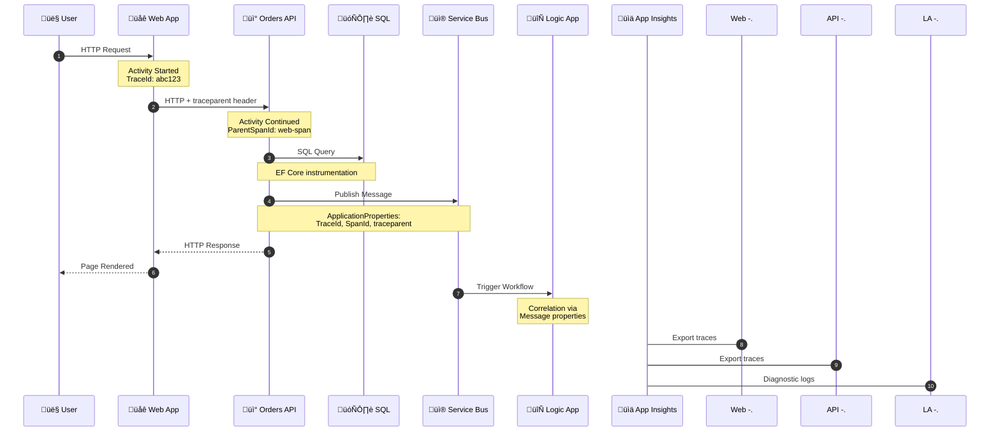

# 📊 Observability Architecture

← [Technology Architecture](04-technology-architecture.md) | **Observability** | [Security Architecture →](06-security-architecture.md)

---

## 📑 Table of Contents

- [Observability Principles](#-observability-principles)
- [Three Pillars Overview](#%EF%B8%8F-three-pillars-overview)
- [Distributed Tracing Strategy](#-distributed-tracing-strategy)
- [Metrics Catalog](#-metrics-catalog)
- [Logging Strategy](#-logging-strategy)
- [OpenTelemetry Configuration](#-opentelemetry-configuration)
- [Health Monitoring](#%EF%B8%8F-health-monitoring)
- [Alert Rules Catalog](#-alert-rules-catalog)
- [SLI/SLO Definitions](#%EF%B8%8F-slislo-definitions)
- [Observability Platform Architecture](#-observability-platform-architecture)
- [Cross-Architecture Relationships](#-cross-architecture-relationships)

---

## 📋 Observability Principles

| #       | Principle                          | Rationale                         | Implications                      |
| ------- | ---------------------------------- | --------------------------------- | --------------------------------- |
| **O-1** | **Vendor-Neutral Instrumentation** | Avoid lock-in, future flexibility | Use OpenTelemetry SDK             |
| **O-2** | **Correlation by Default**         | End-to-end visibility             | W3C Trace Context propagation     |
| **O-3** | **Business-Aligned Metrics**       | Connect tech to outcomes          | Custom metrics for orders KPIs    |
| **O-4** | **Actionable Alerts**              | Reduce noise, improve response    | Alert on symptoms, not causes     |
| **O-5** | **Cost-Aware Telemetry**           | Control data volumes              | Sampling and filtering strategies |

---

---

## 🏛️ Three Pillars Overview

```mermaid
---
title: Three Pillars of Observability
---
flowchart TB
    %% ===== THREE PILLARS =====
    subgraph Pillars["📊 Three Pillars of Observability"]
        direction LR
        Traces["🔍 Traces<br/><i>Distributed request flow</i>"]
        Metrics["📈 Metrics<br/><i>Quantitative measurements</i>"]
        Logs["📝 Logs<br/><i>Discrete event records</i>"]
    end

    %% ===== COLLECTION LAYER =====
    subgraph Collection["📥 Collection Layer"]
        SDK["OpenTelemetry SDK<br/><i>.NET instrumentation</i>"]
        Agent["Azure Diagnostics<br/><i>Platform telemetry</i>"]
    end

    %% ===== BACKEND LAYER =====
    subgraph Backend["💾 Backend Layer"]
        APM["Application Insights<br/><i>APM platform</i>"]
        LogStore["Log Analytics<br/><i>Log aggregation</i>"]
    end

    %% ===== CONSUMPTION LAYER =====
    subgraph Consumption["👁️ Consumption Layer"]
        Dashboards["Azure Dashboards"]
        Alerts["Alert Rules"]
        Queries["KQL Queries"]
        AppMap["Application Map"]
    end

    %% ===== CONNECTIONS =====
    Traces -->|"collected by"| SDK
    Metrics -->|"collected by"| SDK
    Logs -->|"collected by"| SDK
    Traces -->|"collected by"| Agent
    Metrics -->|"collected by"| Agent
    Logs -->|"collected by"| Agent
    SDK -->|"exports to"| APM
    Agent -->|"exports to"| LogStore
    APM -->|"forwards to"| LogStore
    APM -->|"powers"| Dashboards
    APM -->|"powers"| Alerts
    APM -->|"powers"| Queries
    APM -->|"powers"| AppMap

    %% ===== STYLES - NODE CLASSES =====
    classDef primary fill:#4F46E5,stroke:#3730A3,color:#FFFFFF
    classDef secondary fill:#10B981,stroke:#059669,color:#FFFFFF
    classDef datastore fill:#F59E0B,stroke:#D97706,color:#000000
    classDef external fill:#6B7280,stroke:#4B5563,color:#FFFFFF,stroke-dasharray:5 5

    %% ===== CLASS ASSIGNMENTS =====
    class Traces,Metrics,Logs primary
    class SDK,Agent secondary
    class APM,LogStore datastore
    class Dashboards,Alerts,Queries,AppMap external

    %% ===== SUBGRAPH STYLES =====
    style Pillars fill:#EEF2FF,stroke:#4F46E5,stroke-width:2px
    style Collection fill:#ECFDF5,stroke:#10B981,stroke-width:2px
    style Backend fill:#FEF3C7,stroke:#F59E0B,stroke-width:2px
    style Consumption fill:#F3F4F6,stroke:#6B7280,stroke-width:2px
```



---

---

## 🔍 Distributed Tracing Strategy

### Trace Flow Architecture



### Trace Context Propagation

| Component            | Propagation Method       | Properties                         |
| -------------------- | ------------------------ | ---------------------------------- |
| HTTP Requests        | Headers                  | `traceparent`, `tracestate`        |
| Service Bus Messages | ApplicationProperties    | `TraceId`, `SpanId`, `traceparent` |
| Logic Apps           | Built-in correlation     | Azure-managed                      |
| Application Insights | SDK auto-instrumentation | Operation ID                       |

### Span Inventory

| Service        | Span Name              | Kind     | Key Tags                                 |
| -------------- | ---------------------- | -------- | ---------------------------------------- |
| **Orders API** | `PlaceOrder`           | Server   | `order.id`, `order.total`, `http.method` |
| **Orders API** | `SaveOrderStarted`     | Internal | `order.id`, `order.customer_id`          |
| **Orders API** | `SendOrderMessage`     | Producer | `messaging.destination.name`, `order.id` |
| **Web App**    | `HTTP GET /api/orders` | Client   | `http.url`, `http.status_code`           |

---

---

## 📊 Metrics Catalog

### Application Metrics (Custom)

| Metric Name                        | Type      | Unit  | Description                | Dimensions     |
| ---------------------------------- | --------- | ----- | -------------------------- | -------------- |
| `eShop.orders.placed`              | Counter   | order | Orders successfully placed | `order.status` |
| `eShop.orders.processing.duration` | Histogram | ms    | Order processing time      | `order.status` |
| `eShop.orders.processing.errors`   | Counter   | error | Order processing failures  | `error.type`   |
| `eShop.orders.deleted`             | Counter   | order | Orders deleted             | -              |

### Platform Metrics (Auto-instrumented)

| Metric Name                    | Source       | Type      | Purpose               |
| ------------------------------ | ------------ | --------- | --------------------- |
| `http.server.request.duration` | ASP.NET Core | Histogram | API latency           |
| `http.client.request.duration` | HttpClient   | Histogram | Outbound call latency |
| `db.client.operation.duration` | EF Core      | Histogram | Database query time   |

### Azure Monitor Metrics

| Resource         | Metric                    | Alert Threshold   | Action               |
| ---------------- | ------------------------- | ----------------- | -------------------- |
| **Service Bus**  | `ActiveMessages`          | > 1000 for 10 min | Scale consumers      |
| **Service Bus**  | `DeadLetteredMessages`    | > 0               | Investigate failures |
| **SQL Database** | `dtu_consumption_percent` | > 80% for 15 min  | Scale up             |
| **Logic Apps**   | `RunsFailed`              | > 3 in 5 min      | Check workflow logs  |

---

---

## 📝 Logging Strategy

### Log Levels and Usage

| Level           | Usage                       | Example                   |
| --------------- | --------------------------- | ------------------------- |
| **Critical**    | Application cannot continue | Startup failures          |
| **Error**       | Operation failed            | Database connection error |
| **Warning**     | Unexpected but recoverable  | Retry triggered           |
| **Information** | Significant events          | Order placed successfully |
| **Debug**       | Diagnostic details          | SQL query generated       |
| **Trace**       | Verbose debugging           | Method entry/exit         |

### Structured Logging Schema

```json
{
  "Timestamp": "2026-01-20T10:30:00.000Z",
  "Level": "Information",
  "MessageTemplate": "Order {OrderId} placed successfully in {Duration:F2}ms",
  "Properties": {
    "OrderId": "ORD-2026-001",
    "Duration": 245.5,
    "CustomerId": "CUST-100",
    "TraceId": "abc123def456...",
    "SpanId": "789ghi012...",
    "RequestPath": "/api/orders",
    "SourceContext": "eShop.Orders.API.Services.OrderService"
  }
}
```

### Log Correlation Requirements

| Property        | Required    | Purpose                   |
| --------------- | ----------- | ------------------------- |
| `TraceId`       | ✅ Yes      | Cross-service correlation |
| `SpanId`        | ✅ Yes      | Span-level correlation    |
| `OrderId`       | Recommended | Business entity tracking  |
| `SourceContext` | Recommended | Log source identification |

---

---

## 🔧 OpenTelemetry Configuration

### Instrumentation Sources

```csharp
// From Extensions.cs
openTelemetry.WithTracing(tracing =>
{
    tracing.AddSource(builder.Environment.ApplicationName)
        .AddSource("eShop.Orders.API")
        .AddSource("eShop.Web.App")
        .AddSource("Azure.Messaging.ServiceBus")
        .AddAspNetCoreInstrumentation()
        .AddHttpClientInstrumentation()
        .AddSqlClientInstrumentation();
});

openTelemetry.WithMetrics(metrics =>
{
    metrics.AddAspNetCoreInstrumentation()
        .AddHttpClientInstrumentation()
        .AddRuntimeInstrumentation()
        .AddMeter("eShop.Orders.API")
        .AddMeter("eShop.Web.App");
});
```

### Exporters Configuration

| Exporter          | Target                   | Configuration                           |
| ----------------- | ------------------------ | --------------------------------------- |
| **OTLP**          | Aspire Dashboard (local) | `OTEL_EXPORTER_OTLP_ENDPOINT`           |
| **Azure Monitor** | Application Insights     | `APPLICATIONINSIGHTS_CONNECTION_STRING` |

---

---

## ❤️ Health Monitoring

### Health Check Endpoints

| Endpoint  | Purpose               | Tags   |
| --------- | --------------------- | ------ |
| `/health` | Overall health status | all    |
| `/alive`  | Liveness probe        | `live` |

### Custom Health Checks

| Check        | Source                | Evaluates                |
| ------------ | --------------------- | ------------------------ |
| `self`       | ServiceDefaults       | Application is running   |
| `database`   | DbContextHealthCheck  | SQL connectivity         |
| `servicebus` | ServiceBusHealthCheck | Service Bus connectivity |

### Health Check Implementation

```csharp
// From HealthChecks/DbContextHealthCheck.cs
public async Task<HealthCheckResult> CheckHealthAsync(
    HealthCheckContext context,
    CancellationToken cancellationToken = default)
{
    try
    {
        var canConnect = await _dbContext.Database
            .CanConnectAsync(cancellationToken);

        return canConnect
            ? HealthCheckResult.Healthy("Database connection is healthy")
            : HealthCheckResult.Unhealthy("Cannot connect to database");
    }
    catch (Exception ex)
    {
        return HealthCheckResult.Unhealthy("Database health check failed", ex);
    }
}
```

---

---

## 🚨 Alert Rules Catalog

| Alert                   | Severity | Condition                 | Response                     |
| ----------------------- | -------- | ------------------------- | ---------------------------- |
| **High API Latency**    | Warning  | P95 > 2s for 5 min        | Investigate slow queries     |
| **API Error Spike**     | Critical | Error rate > 5% for 5 min | Page on-call                 |
| **Queue Depth Growing** | Warning  | Depth > 1000 for 10 min   | Scale consumers              |
| **Database DTU High**   | Warning  | DTU > 80% for 15 min      | Consider scaling             |
| **Failed Workflows**    | Critical | > 3 failures in 5 min     | Check Logic App logs         |
| **Dead Letters**        | Warning  | Count > 0                 | Investigate message failures |

---

---

## 🎯️ SLI/SLO Definitions

| SLI              | Definition               | Measurement                 | SLO      | Error Budget   |
| ---------------- | ------------------------ | --------------------------- | -------- | -------------- |
| **Availability** | % of successful requests | `successCount / totalCount` | 99.9%    | 43.2 min/month |
| **Latency**      | P95 response time        | `percentile(duration, 95)`  | < 500ms  | N/A            |
| **Throughput**   | Orders processed/hour    | `count(orders.placed)`      | > 500/hr | N/A            |
| **Error Rate**   | % of 5xx responses       | `errorCount / totalCount`   | < 0.1%   | N/A            |

---

---

## 🏭 Observability Platform Architecture


---

---

## 🌐 Cross-Architecture Relationships

| Related Architecture         | Connection                               | Reference                                                                                       |
| ---------------------------- | ---------------------------------------- | ----------------------------------------------------------------------------------------------- |
| **Business Architecture**    | SLOs measure business KPIs               | [Quality Attributes](01-business-architecture.md#quality-attribute-requirements)                |
| **Data Architecture**        | Telemetry data flows documented          | [Telemetry Mapping](02-data-architecture.md#telemetry-data-mapping)                             |
| **Application Architecture** | Services instrumented with OpenTelemetry | [Cross-Cutting Concerns](03-application-architecture.md#cross-cutting-concerns-servicedefaults) |
| **Technology Architecture**  | Monitoring platforms defined             | [Platform Decomposition](04-technology-architecture.md#platform-decomposition)                  |

---

_← [Technology Architecture](04-technology-architecture.md) | [Security Architecture →](06-security-architecture.md)_
