# Observability Architecture

← [Technology Architecture](04-technology-architecture.md) | [Index](README.md) | [Security Architecture →](06-security-architecture.md)

---

## Observability Overview

The solution implements **comprehensive observability** using OpenTelemetry for instrumentation and Azure Monitor (Application Insights + Log Analytics) for collection, analysis, and visualization. This enables end-to-end distributed tracing across all services.

---

## Observability Principles

| Principle | Statement | Implementation |
|-----------|-----------|----------------|
| **Observable by Default** | All services emit telemetry without additional configuration | ServiceDefaults library configures OpenTelemetry automatically |
| **Three Pillars** | Traces, Metrics, and Logs provide complete visibility | OpenTelemetry SDK captures all three |
| **Correlation Everywhere** | All telemetry correlated by TraceId | W3C Trace Context propagation via HTTP headers and Service Bus properties |
| **Actionable Alerts** | Alerts based on SLIs with clear response procedures | Azure Monitor alert rules (infrastructure ready) |
| **Cost-Effective Retention** | Telemetry retained based on compliance and cost balance | Log Analytics workspace-based retention |

---

## Three Pillars Framework

```mermaid
flowchart LR
    subgraph Sources["📡 Sources"]
        App1["eShop.Web.App"]
        App2["eShop.Orders.API"]
        App3["Logic Apps"]
    end

    subgraph Pillars["📊 Three Pillars"]
        Traces["📍 Traces<br/>Distributed request flows"]
        Metrics["📈 Metrics<br/>Numeric measurements"]
        Logs["📝 Logs<br/>Discrete events"]
    end

    subgraph Storage["🗄️ Storage"]
        AI["Application Insights"]
        LA["Log Analytics"]
    end

    subgraph Consumption["📱 Consumption"]
        AppMap["Application Map"]
        TxSearch["Transaction Search"]
        Dashboards["Dashboards"]
        Alerts["Alerts"]
    end

    App1 & App2 -->|"OTLP"| Traces & Metrics & Logs
    App3 -->|"Built-in"| Logs
    Traces & Metrics & Logs --> AI
    AI --> LA
    AI --> AppMap & TxSearch
    LA --> Dashboards & Alerts

    classDef source fill:#e3f2fd,stroke:#1565c0
    classDef pillar fill:#fff3e0,stroke:#ef6c00
    classDef storage fill:#e8f5e9,stroke:#2e7d32
    classDef consume fill:#f3e5f5,stroke:#7b1fa2

    class App1,App2,App3 source
    class Traces,Metrics,Logs pillar
    class AI,LA storage
    class AppMap,TxSearch,Dashboards,Alerts consume
```



---

## OpenTelemetry Configuration

The `ServiceDefaults` library provides centralized OpenTelemetry configuration:

```csharp
// From Extensions.cs - OpenTelemetry setup
private static IHostApplicationBuilder ConfigureOpenTelemetry(this IHostApplicationBuilder builder)
{
    builder.Logging.AddOpenTelemetry(logging =>
    {
        logging.IncludeFormattedMessage = true;
        logging.IncludeScopes = true;
    });

    builder.Services.AddOpenTelemetry()
        .WithMetrics(metrics =>
        {
            metrics.AddAspNetCoreInstrumentation()
                   .AddHttpClientInstrumentation()
                   .AddRuntimeInstrumentation();
        })
        .WithTracing(tracing =>
        {
            tracing.AddSource(builder.Environment.ApplicationName)
                   .AddAspNetCoreInstrumentation()
                   .AddHttpClientInstrumentation();
        });

    builder.AddOpenTelemetryExporters();
    return builder;
}
```

### Instrumentation Sources

| Instrumentation | Type | Data Captured |
|-----------------|------|---------------|
| `AddAspNetCoreInstrumentation()` | Automatic | HTTP server spans, request/response metrics |
| `AddHttpClientInstrumentation()` | Automatic | HTTP client spans for outbound calls |
| `AddRuntimeInstrumentation()` | Automatic | GC, thread pool, assembly metrics |
| Custom `ActivitySource` | Manual | Business operation spans |
| Custom `Meter` | Manual | Business metrics |

---

## Telemetry Data Flow


---

## Distributed Tracing

### Trace Context Propagation

The solution implements **W3C Trace Context** for end-to-end distributed tracing:

| Protocol | Propagation Method | Header/Property |
|----------|-------------------|-----------------|
| **HTTP** | Request headers | `traceparent`, `tracestate` |
| **Service Bus** | Message properties | `TraceId`, `SpanId`, `traceparent` |

### Service Bus Trace Propagation

From [OrdersMessageHandler.cs](../../src/eShop.Orders.API/Handlers/OrdersMessageHandler.cs):

```csharp
// Create activity for distributed tracing
using var activity = _activitySource.StartActivity(
    $"ServiceBus.{topicName}.Send", 
    ActivityKind.Producer);

// Add trace context to message for distributed tracing
if (activity != null)
{
    message.ApplicationProperties["TraceId"] = activity.TraceId.ToString();
    message.ApplicationProperties["SpanId"] = activity.SpanId.ToString();
    message.ApplicationProperties["traceparent"] = activity.Id ?? string.Empty;
}
```

### End-to-End Trace Flow


---

## Metrics Architecture

### Custom Business Metrics

Defined in [OrderService.cs](../../src/eShop.Orders.API/Services/OrderService.cs):

| Metric Name | Type | Unit | Description | Labels |
|-------------|------|------|-------------|--------|
| `eShop.orders.placed` | Counter | count | Total orders successfully placed | - |
| `eShop.orders.processing.duration` | Histogram | ms | Order processing latency | - |
| `eShop.orders.processing.errors` | Counter | count | Order processing failures | - |
| `eShop.orders.deleted` | Counter | count | Orders deleted | - |

### Implementation

```csharp
// From OrderService.cs
private readonly Counter<long> _ordersPlacedCounter;
private readonly Histogram<double> _processingDuration;
private readonly Counter<long> _processingErrors;
private readonly Counter<long> _ordersDeletedCounter;

public OrderService(...)
{
    _ordersPlacedCounter = meter.CreateCounter<long>(
        "eShop.orders.placed", 
        "count", 
        "Total number of orders placed");
    
    _processingDuration = meter.CreateHistogram<double>(
        "eShop.orders.processing.duration", 
        "ms", 
        "Order processing duration");
    
    _processingErrors = meter.CreateCounter<long>(
        "eShop.orders.processing.errors", 
        "count", 
        "Number of order processing errors");
    
    _ordersDeletedCounter = meter.CreateCounter<long>(
        "eShop.orders.deleted", 
        "count", 
        "Total number of orders deleted");
}
```

### Platform Metrics

| Source | Metric | Description |
|--------|--------|-------------|
| **Service Bus** | `ActiveMessages` | Messages awaiting delivery |
| **Service Bus** | `DeadLetteredMessages` | Messages that failed processing |
| **Service Bus** | `IncomingMessages` / `OutgoingMessages` | Throughput |
| **SQL Database** | `cpu_percent` | CPU utilization |
| **SQL Database** | `dtu_consumption_percent` | DTU usage |
| **Logic Apps** | `RunsSucceeded` / `RunsFailed` | Workflow execution counts |
| **Container Apps** | `Requests` | Request count |
| **Container Apps** | `ResponseLatency` | Response time |

---

## Logging Architecture

### Structured Logging

All logs use structured format with correlation properties:

```json
{
  "Timestamp": "2025-12-30T10:30:00.000Z",
  "Level": "Information",
  "MessageTemplate": "Order {OrderId} placed successfully in {Duration}ms",
  "Properties": {
    "OrderId": "ORD-2025-001",
    "Duration": 245,
    "TraceId": "abc123def456...",
    "SpanId": "789ghi012...",
    "SourceContext": "eShop.Orders.API.Services.OrderService"
  }
}
```

### Log Levels

| Level | Usage | Example |
|-------|-------|---------|
| **Trace** | Detailed diagnostic info | EF Core query details |
| **Debug** | Development diagnostics | Variable values, flow tracing |
| **Information** | Normal operations | Order created, message published |
| **Warning** | Unexpected but handled | Validation failures, retries |
| **Error** | Unhandled exceptions | Database connection failures |
| **Critical** | System failures | Service unavailable |

### Log Events

| Event | Level | Source | Properties |
|-------|-------|--------|------------|
| `OrderCreated` | Information | OrderService | OrderId, CustomerId, Total |
| `OrderValidationFailed` | Warning | OrderService | OrderId, Errors |
| `MessagePublished` | Information | OrdersMessageHandler | OrderId, TopicName, MessageId |
| `DatabaseError` | Error | OrderRepository | Exception, Query |
| `ServiceBusConnectionFailed` | Error | ServiceBusHealthCheck | Exception |

---

## Health Monitoring

### Health Check Endpoints

| Endpoint | Purpose | Checks |
|----------|---------|--------|
| `/health` | Readiness probe | Database, Service Bus |
| `/alive` | Liveness probe | Basic availability |

### Custom Health Checks

| Check | Target | Source |
|-------|--------|--------|
| `DbContextHealthCheck` | SQL Database connectivity | [DbContextHealthCheck.cs](../../src/eShop.Orders.API/HealthChecks/DbContextHealthCheck.cs) |
| `ServiceBusHealthCheck` | Service Bus connectivity | [ServiceBusHealthCheck.cs](../../src/eShop.Orders.API/HealthChecks/ServiceBusHealthCheck.cs) |

### Health Check Implementation

```csharp
// From Extensions.cs - Health endpoint mapping
public static WebApplication MapDefaultEndpoints(this WebApplication app)
{
    app.MapHealthChecks("/health");
    app.MapHealthChecks("/alive", new HealthCheckOptions
    {
        Predicate = _ => false // Excludes all checks - just returns healthy if app responds
    });
    return app;
}
```

---

## Service Level Indicators (SLIs)

### Proposed SLIs

| SLI | Metric | Target | Measurement |
|-----|--------|--------|-------------|
| **Availability** | Successful requests / Total requests | 99.9% | App Insights availability |
| **Latency (P95)** | Request duration percentile | < 500ms | `http.server.request.duration` |
| **Error Rate** | Failed requests / Total requests | < 0.1% | HTTP 5xx responses |
| **Order Processing** | Successful orders / Total orders | 99.5% | `eShop.orders.placed` / attempts |
| **Message Delivery** | Messages delivered / Messages sent | 99.9% | Service Bus metrics |

### SLO Examples

| SLO | Definition | Error Budget |
|-----|------------|--------------|
| **Availability** | 99.9% uptime per month | ~43 minutes downtime |
| **Latency** | 95% of requests < 500ms | 5% of requests may exceed |
| **Durability** | Zero data loss for committed orders | N/A |

---

## Observability Infrastructure

### Application Insights Configuration

From [app-insights.bicep](../../infra/shared/monitoring/app-insights.bicep):

```bicep
resource appInsights 'Microsoft.Insights/components@2020-02-02' = {
  name: name
  location: location
  kind: 'web'
  properties: {
    Application_Type: 'web'
    WorkspaceResourceId: logAnalyticsWorkspace.id
    IngestionMode: 'LogAnalytics'
    publicNetworkAccessForIngestion: 'Enabled'
    publicNetworkAccessForQuery: 'Enabled'
  }
}
```

### Log Analytics Workspace

| Setting | Value | Rationale |
|---------|-------|-----------|
| **Retention** | 30-90 days | Cost optimization |
| **Daily Cap** | Based on environment | Cost control |
| **Pricing Tier** | Pay-as-you-go | Flexibility |

---

## Observability Dashboards

### Recommended Dashboards

| Dashboard | Purpose | Key Metrics |
|-----------|---------|-------------|
| **Application Map** | Service topology and health | Dependencies, failure rates |
| **Transaction Search** | End-to-end trace exploration | Trace ID lookup |
| **Live Metrics** | Real-time performance | Requests/sec, failures |
| **Failures** | Error analysis | Exception types, impact |
| **Performance** | Latency analysis | P50/P95/P99 latencies |
| **Custom (Orders)** | Business metrics | Orders placed, processing time |

### Application Map View

```mermaid
flowchart LR
    subgraph AppMap["📊 Application Map"]
        Web["🌐 eShop.Web.App<br/>✅ Healthy"]
        API["⚙️ eShop.Orders.API<br/>✅ Healthy"]
        SQL["🗄️ Azure SQL<br/>✅ Healthy"]
        SB["📨 Service Bus<br/>✅ Healthy"]
    end

    Web -->|"150 req/min<br/>0.1% failures"| API
    API -->|"200 queries/min<br/>50ms avg"| SQL
    API -->|"50 msg/min<br/>0% failures"| SB

    classDef healthy fill:#e8f5e9,stroke:#2e7d32
    class Web,API,SQL,SB healthy
```



---

## Alerting Strategy

### Recommended Alerts

| Alert | Condition | Severity | Action |
|-------|-----------|----------|--------|
| **High Error Rate** | HTTP 5xx > 5% for 5 min | Critical | Page on-call |
| **High Latency** | P95 > 2s for 10 min | Warning | Notify team |
| **Service Unhealthy** | Health check fails 3x | Critical | Auto-restart, page |
| **Dead Letters** | DLQ messages > 10 | Warning | Investigate |
| **Database CPU** | CPU > 80% for 15 min | Warning | Scale consideration |

---

## Troubleshooting Workflows

### Slow Request Investigation

```mermaid
flowchart TD
    Start["🔍 Slow Request Reported"] --> Identify["1. Get TraceId<br/>from logs"]
    Identify --> Search["2. Transaction Search<br/>by TraceId"]
    Search --> Analyze["3. Analyze span<br/>waterfall"]
    Analyze --> Root["4. Identify slow<br/>operation"]
    Root --> Fix["5. Optimize or<br/>add caching"]
```



### Error Investigation

```mermaid
flowchart TD
    Start["⚠️ Error Alert"] --> Failures["1. Open Failures<br/>blade"]
    Failures --> Exception["2. View exception<br/>details"]
    Exception --> Trace["3. View end-to-end<br/>transaction"]
    Trace --> Context["4. Review request<br/>context"]
    Context --> Fix["5. Deploy fix"]
```



---

## Cross-Architecture Relationships

| Related Architecture | Connection | Reference |
|---------------------|------------|-----------|
| **Data Architecture** | Telemetry stored in App Insights/Log Analytics | [02-data-architecture.md](02-data-architecture.md#monitoring-data-flow-architecture) |
| **Application Architecture** | Applications emit telemetry via ServiceDefaults | [03-application-architecture.md](03-application-architecture.md#servicedefaults-library) |
| **Technology Architecture** | Azure Monitor provides observability infrastructure | [04-technology-architecture.md](04-technology-architecture.md) |
| **Security Architecture** | Audit logs and security telemetry | [06-security-architecture.md](06-security-architecture.md) |

---

← [Technology Architecture](04-technology-architecture.md) | [Index](README.md) | [Security Architecture →](06-security-architecture.md)
