# Observability Architecture

← [Technology Architecture](04-technology-architecture.md) | [Index](README.md) | [Security Architecture →](06-security-architecture.md)

---

## 1. Observability Overview

The solution implements the **Three Pillars of Observability** using OpenTelemetry for vendor-neutral instrumentation with Azure Monitor as the telemetry backend.

### Observability Strategy

| Pillar | Technology | Backend | Purpose |
|--------|------------|---------|---------|
| **Logs** | OpenTelemetry Logging | Log Analytics Workspace | Debugging, audit trails |
| **Metrics** | OpenTelemetry Metrics | Application Insights | Performance monitoring, alerting |
| **Traces** | OpenTelemetry Tracing | Application Insights | Request correlation, latency analysis |

---

## 2. Observability Topology


---

## 3. OpenTelemetry Configuration

### SDK Setup

From [app.ServiceDefaults/Extensions.cs](../../app.ServiceDefaults/Extensions.cs):

```csharp
builder.Services.AddOpenTelemetry()
    .WithMetrics(metrics =>
    {
        metrics.AddAspNetCoreInstrumentation()
               .AddHttpClientInstrumentation()
               .AddRuntimeInstrumentation()
               .AddMeter("eShop.orders");  // Custom meter
    })
    .WithTracing(tracing =>
    {
        tracing.AddSource("eShop.orders")  // Custom activity source
               .AddAspNetCoreInstrumentation()
               .AddGrpcClientInstrumentation()
               .AddHttpClientInstrumentation()
               .AddSqlClientInstrumentation(options => options.SetDbStatementForText = true);
    });
```

### Telemetry Sources

| Source Type | Source Name | Scope |
|-------------|-------------|-------|
| **Custom Meter** | `eShop.orders` | Business metrics |
| **Custom Activity Source** | `eShop.orders` | Business traces |
| **ASP.NET Core** | `Microsoft.AspNetCore` | HTTP request metrics/traces |
| **HTTP Client** | `System.Net.Http` | Outbound HTTP calls |
| **SQL Client** | `Microsoft.Data.SqlClient` | Database queries |
| **Runtime** | `.NET Runtime` | GC, thread pool metrics |

---

## 4. Custom Metrics Inventory

Defined in [src/eShop.Orders.API/Services/OrderService.cs](../../src/eShop.Orders.API/Services/OrderService.cs):

| Metric Name | Type | Unit | Description |
|-------------|------|------|-------------|
| `eShop.orders.placed` | Counter | `{orders}` | Total orders placed |
| `eShop.orders.processing.duration` | Histogram | `ms` | Order processing time |
| `eShop.orders.processing.errors` | Counter | `{errors}` | Order processing failures |
| `eShop.orders.batch.size` | Histogram | `{orders}` | Batch order count |

### Metric Implementation

```csharp
// From OrderService.cs
private static readonly Meter Meter = new("eShop.orders", "1.0.0");
private static readonly Counter<long> OrdersPlacedCounter = 
    Meter.CreateCounter<long>("eShop.orders.placed", "{orders}", "Number of orders placed");
private static readonly Histogram<double> ProcessingDuration = 
    Meter.CreateHistogram<double>("eShop.orders.processing.duration", "ms", "Order processing duration");
private static readonly Counter<long> ProcessingErrors = 
    Meter.CreateCounter<long>("eShop.orders.processing.errors", "{errors}", "Order processing errors");
```

---

## 5. Distributed Tracing

### Trace Flow

```mermaid
%%{init: {'theme': 'base', 'themeVariables': { 'fontSize': '14px', 'actorBkg': '#e3f2fd', 'actorBorder': '#1565c0', 'actorTextColor': '#0d47a1', 'noteBkgColor': '#fff3e0', 'noteBorderColor': '#e65100'}}}%%
sequenceDiagram
    autonumber
    participant User as 👤 User
    participant Web as 🌐 Web App
    participant API as 📡 Orders API
    participant DB as 🗄️ SQL Database
    participant SB as 📨 Service Bus
    participant LA as 🔄 Logic Apps

    User->>Web: Place Order
    activate Web
    Note over Web: Span: HTTP GET /orders
    Web->>API: POST /api/orders
    activate API
    Note over API: Span: OrdersController.PlaceOrder
    API->>API: Validate Order
    Note over API: Span: OrderService.ProcessOrder
    
    rect rgba(232, 245, 233, 0.5)
        Note over API,DB: Database Operations
        API->>DB: INSERT Order
        Note over API: Span: SQL INSERT
    end
    
    rect rgba(255, 243, 224, 0.5)
        Note over API,SB: Messaging Operations
        API->>SB: Publish OrderPlaced
        Note over API: Span: ServiceBus.Send
        Note over SB: Trace Context in Message Headers
    end
    
    SB-->>LA: Trigger Workflow
    Note over LA: Correlation via traceparent
    API-->>Web: 201 Created
    deactivate API
    Web-->>User: Order Confirmation
    deactivate Web
```



### Activity Sources

From [src/eShop.Orders.API/Controllers/OrdersController.cs](../../src/eShop.Orders.API/Controllers/OrdersController.cs):

```csharp
private static readonly ActivitySource ActivitySource = new("eShop.orders");

[HttpPost]
public async Task<IActionResult> PlaceOrder([FromBody] Order order)
{
    using var activity = ActivitySource.StartActivity("PlaceOrder", ActivityKind.Server);
    activity?.SetTag("order.customer_id", order.CustomerId);
    activity?.SetTag("order.product_count", order.Products?.Count ?? 0);
    
    // ... order processing
    
    activity?.SetTag("order.id", result.Id);
    activity?.SetStatus(ActivityStatusCode.Ok);
}
```

### Trace Context Propagation

From [src/eShop.Orders.API/Handlers/OrdersMessageHandler.cs](../../src/eShop.Orders.API/Handlers/OrdersMessageHandler.cs):

```csharp
// W3C Trace Context propagation to Service Bus messages
if (Activity.Current != null)
{
    message.ApplicationProperties["traceparent"] = Activity.Current.Id;
    if (!string.IsNullOrEmpty(Activity.Current.TraceStateString))
    {
        message.ApplicationProperties["tracestate"] = Activity.Current.TraceStateString;
    }
}
```

---

## 6. Logging Configuration

### Structured Logging

```csharp
// From Extensions.cs
builder.Logging.AddOpenTelemetry(logging =>
{
    logging.IncludeFormattedMessage = true;
    logging.IncludeScopes = true;
});
```

### Log Categories

| Category | Level | Purpose |
|----------|-------|---------|
| `Microsoft.AspNetCore` | Warning | HTTP pipeline |
| `Microsoft.EntityFrameworkCore` | Warning | Database operations |
| `Azure.Messaging.ServiceBus` | Information | Message broker |
| `eShop.Orders` | Information | Application logs |

### Logging Example

```csharp
// From OrderService.cs
_logger.LogInformation(
    "Processing order {OrderId} for customer {CustomerId} with {ProductCount} products",
    order.Id, order.CustomerId, order.Products?.Count ?? 0);
```

---

## 7. Health Checks

### Health Endpoints

| Endpoint | Purpose | Check Type |
|----------|---------|------------|
| `/health` | Full health status | All dependencies |
| `/alive` | Liveness probe | Self-check only |

### Health Check Configuration

From [app.ServiceDefaults/Extensions.cs](../../app.ServiceDefaults/Extensions.cs):

```csharp
builder.Services.AddHealthChecks()
    .AddCheck("self", () => HealthCheckResult.Healthy(), ["live"]);

// Mapped endpoints
app.MapHealthChecks("/health");
app.MapHealthChecks("/alive", new HealthCheckOptions
{
    Predicate = r => r.Tags.Contains("live")
});
```

### Custom Health Checks

From [src/eShop.Orders.API/HealthChecks/](../../src/eShop.Orders.API/HealthChecks/):

| Check | Class | Validates |
|-------|-------|-----------|
| **Database** | `DatabaseHealthCheck` | SQL Server connectivity |
| **Service Bus** | `ServiceBusHealthCheck` | Service Bus namespace |

---

## 8. Application Insights Integration

### Azure Monitor Exporter

```csharp
// From Extensions.cs
if (!string.IsNullOrEmpty(builder.Configuration["APPLICATIONINSIGHTS_CONNECTION_STRING"]))
{
    builder.Services.AddOpenTelemetry()
        .UseAzureMonitor(options =>
        {
            options.ConnectionString = builder.Configuration["APPLICATIONINSIGHTS_CONNECTION_STRING"];
        });
}
```

### Application Insights Features

| Feature | Usage | Access |
|---------|-------|--------|
| **Live Metrics** | Real-time performance | Azure Portal → Live Metrics |
| **Application Map** | Service dependencies | Azure Portal → Application Map |
| **Transaction Search** | Trace exploration | Azure Portal → Transaction Search |
| **Failures** | Error analysis | Azure Portal → Failures |
| **Performance** | Latency analysis | Azure Portal → Performance |

---

## 9. Log Analytics Queries

### Sample KQL Queries

**Request Latency by Operation:**
```kql
requests
| where timestamp > ago(1h)
| summarize avg(duration), percentile(duration, 95) by name
| order by avg_duration desc
```

**Order Processing Errors:**
```kql
customMetrics
| where name == "eShop.orders.processing.errors"
| summarize sum(value) by bin(timestamp, 1h)
| render timechart
```

**Trace Flow Analysis:**
```kql
traces
| where customDimensions.["order.id"] != ""
| project timestamp, message, customDimensions.["order.id"], operation_Id
| order by timestamp asc
```

**Service Bus Message Latency:**
```kql
dependencies
| where type == "Azure Service Bus"
| summarize avg(duration), count() by target
| order by avg_duration desc
```

---

## 10. Service Level Indicators (SLIs)

| SLI | Measurement | Target | Query Basis |
|-----|-------------|--------|-------------|
| **Availability** | Successful requests / Total requests | 99.9% | `requests` table |
| **Latency (p95)** | 95th percentile response time | < 500ms | `requests` table |
| **Error Rate** | Failed requests / Total requests | < 0.1% | `requests` where `success == false` |
| **Order Processing** | Orders processed successfully | > 99% | Custom metric |

### SLO Dashboard Metrics

| Metric | Formula | SLO |
|--------|---------|-----|
| **Request Success Rate** | `count(success=true) / count(*)` | ≥ 99.9% |
| **P95 Latency** | `percentile(duration, 95)` | ≤ 500ms |
| **Error Budget** | `100% - SLO` | 0.1% monthly |
| **Order Throughput** | `count(eShop.orders.placed)` | Varies |

---

## 11. Alerting Strategy

### Recommended Alerts

| Alert | Condition | Severity | Action |
|-------|-----------|----------|--------|
| **High Error Rate** | Error rate > 1% for 5 min | Critical | Page on-call |
| **High Latency** | P95 > 1s for 10 min | Warning | Notify team |
| **Service Unhealthy** | Health check failure | Critical | Auto-restart |
| **Low Availability** | Availability < 99% | Critical | Page on-call |
| **High Resource Usage** | CPU > 80% for 15 min | Warning | Scale alert |

### Alert Configuration (Recommended)

```bicep
// Example alert rule (not currently deployed)
resource highErrorRateAlert 'Microsoft.Insights/metricAlerts@2018-03-01' = {
  name: 'High Error Rate Alert'
  properties: {
    severity: 1
    evaluationFrequency: 'PT5M'
    windowSize: 'PT5M'
    criteria: {
      'odata.type': 'Microsoft.Azure.Monitor.SingleResourceMultipleMetricCriteria'
      allOf: [
        {
          name: 'HighErrorRate'
          metricName: 'requests/failed'
          operator: 'GreaterThan'
          threshold: 1
          timeAggregation: 'Average'
        }
      ]
    }
  }
}
```

---

## 12. Logic Apps Diagnostics

### Diagnostic Settings

Logic Apps Standard sends telemetry to Log Analytics:

| Log Category | Purpose |
|--------------|---------|
| **WorkflowRuntime** | Workflow execution logs |
| **FunctionAppLogs** | Runtime logs |
| **AppServiceHTTPLogs** | HTTP request logs |
| **AppServicePlatformLogs** | Platform events |

### Logic App Run History

Access via Azure Portal:
- **Run History:** Individual workflow executions
- **Trigger History:** Trigger activations
- **Action Inputs/Outputs:** Per-action data

---

## Cross-Architecture Relationships

| Related Architecture | Connection | Reference |
|---------------------|------------|-----------|
| **Application Architecture** | Services emit telemetry | [Application Architecture](03-application-architecture.md) |
| **Technology Architecture** | Azure Monitor resources | [Technology Architecture](04-technology-architecture.md) |
| **Data Architecture** | Telemetry data model | [Data Architecture](02-data-architecture.md#telemetry-data) |

---

## Related Documents

- [Technology Architecture](04-technology-architecture.md) - Azure Monitor infrastructure
- [ADR-003: Observability Strategy](adr/ADR-003-observability-strategy.md) - Decision rationale
