# Observability Architecture

[← Technology Architecture](04-technology-architecture.md) | **Observability Architecture** | [Security Architecture →](06-security-architecture.md)

---

## 1. Observability Principles

| #       | Principle                          | Rationale                         | Implications                                        |
| ------- | ---------------------------------- | --------------------------------- | --------------------------------------------------- |
| **O-1** | **Vendor-Neutral Instrumentation** | Avoid lock-in, future flexibility | Use OpenTelemetry for all application telemetry     |
| **O-2** | **Correlation by Default**         | End-to-end visibility             | W3C Trace Context propagation across all boundaries |
| **O-3** | **Business-Aligned Metrics**       | Connect technology to outcomes    | Custom metrics for order processing KPIs            |
| **O-4** | **Actionable Alerts**              | Reduce noise, improve response    | Alert on symptoms, link to runbooks                 |
| **O-5** | **Cost-Aware Telemetry**           | Control data volumes              | Sampling for high-volume traces                     |

---

## 2. Three Pillars Framework


---

## 3. Telemetry Data Flow

```mermaid
flowchart LR
    subgraph Sources["📤 Telemetry Sources"]
        App1["eShop.Orders.API"]
        App2["eShop.Web.App"]
        Platform["Logic Apps"]
        Infra["Azure Resources"]
    end

    subgraph Collection["📥 Collection"]
        OTEL["OpenTelemetry<br/>SDK"]
        Diag["Azure<br/>Diagnostics"]
    end

    subgraph Transport["🚀 Transport"]
        OTLP["OTLP<br/>Protocol"]
        ARM["Azure Monitor<br/>Pipeline"]
    end

    subgraph Storage["💾 Storage"]
        AI["Application<br/>Insights"]
        LAW["Log Analytics<br/>Workspace"]
    end

    subgraph Analysis["🔍 Analysis"]
        KQL["KQL Queries"]
        AppMap["Application Map"]
        TxSearch["Transaction Search"]
    end

    App1 & App2 --> OTEL --> OTLP --> AI
    Platform & Infra --> Diag --> ARM --> LAW
    AI --> KQL & AppMap & TxSearch
    LAW --> KQL

    classDef source fill:#fff3e0,stroke:#ef6c00
    classDef collect fill:#e3f2fd,stroke:#1565c0
    classDef transport fill:#e8f5e9,stroke:#2e7d32
    classDef storage fill:#f3e5f5,stroke:#7b1fa2
    classDef analysis fill:#fce4ec,stroke:#c2185b

    class App1,App2,Platform,Infra source
    class OTEL,Diag collect
    class OTLP,ARM transport
    class AI,LAW storage
    class KQL,AppMap,TxSearch analysis
```



---

## 4. Distributed Tracing

### Trace Context Propagation


### Span Inventory

| Span Name               | Kind     | Source               | Attributes                                          |
| ----------------------- | -------- | -------------------- | --------------------------------------------------- |
| `PlaceOrder`            | Server   | OrdersController     | `order.id`, `order.total`, `http.route`             |
| `SendOrderMessage`      | Producer | OrdersMessageHandler | `messaging.destination.name`, `messaging.operation` |
| `db.client.operation`   | Client   | EF Core              | `db.operation`, `db.name`                           |
| `HTTP POST /api/orders` | Client   | HttpClient           | `http.method`, `http.status_code`                   |

### Implementation Reference

```csharp
// From OrdersMessageHandler.cs - Creating producer span with trace context
using var activity = _activitySource.StartActivity("SendOrderMessage", ActivityKind.Producer);
activity?.SetTag("messaging.system", "servicebus");
activity?.SetTag("messaging.destination.name", _topicName);
activity?.SetTag("order.id", order.Id);

// Propagate trace context to Service Bus message
message.ApplicationProperties["TraceId"] = activity.TraceId.ToString();
message.ApplicationProperties["SpanId"] = activity.SpanId.ToString();
message.ApplicationProperties["traceparent"] = activity.Id ?? string.Empty;
```

> **Reference:** [OrdersMessageHandler.cs](../../src/eShop.Orders.API/Handlers/OrdersMessageHandler.cs#L65-L94)

---

## 5. Metrics

### Metrics Strategy

| Category                   | Purpose          | Source                 | Examples                    |
| -------------------------- | ---------------- | ---------------------- | --------------------------- |
| **Request Metrics**        | HTTP performance | Auto-instrumentation   | Latency, throughput, errors |
| **Business Metrics**       | Domain KPIs      | Custom instrumentation | Orders placed, order value  |
| **Infrastructure Metrics** | Resource health  | Azure Monitor          | CPU, memory, connections    |

### Metrics Catalog

| Metric Name                    | Type          | Source      | Unit    | Dimensions            | Alert Threshold |
| ------------------------------ | ------------- | ----------- | ------- | --------------------- | --------------- |
| `http.server.request.duration` | Histogram     | Orders API  | seconds | method, route, status | P95 > 2s        |
| `http.server.active_requests`  | UpDownCounter | Orders API  | count   | method                | N/A             |
| `db.client.operation.duration` | Histogram     | EF Core     | seconds | operation, db.name    | P95 > 1s        |
| `servicebus.messages.active`   | Gauge         | Service Bus | count   | queue_name            | > 1000          |
| `sql.cpu_percent`              | Gauge         | Azure SQL   | percent | database              | > 80%           |
| `logicapp.runs.succeeded`      | Counter       | Logic Apps  | count   | workflow              | N/A             |
| `logicapp.runs.failed`         | Counter       | Logic Apps  | count   | workflow              | > 3 in 5 min    |

### Custom Business Metrics

```csharp
// Recommended custom metrics for eShop.Orders.API
var meter = new Meter("eShop.Orders.API");
var ordersPlacedCounter = meter.CreateCounter<long>("orders.placed", "count", "Orders placed");
var orderValueHistogram = meter.CreateHistogram<double>("orders.value", "USD", "Order total value");
```

---

## 6. Logs

### Logging Standards

| Level           | Usage                         | Retention         | Example                                   |
| --------------- | ----------------------------- | ----------------- | ----------------------------------------- |
| **Debug**       | Development troubleshooting   | Not in production | Variable values, method entry/exit        |
| **Information** | Business events, request flow | 90 days           | Order created, message published          |
| **Warning**     | Recoverable issues            | 90 days           | Retry attempt, validation failed          |
| **Error**       | Failures requiring attention  | 90 days           | Exception caught, operation failed        |
| **Critical**    | System failures               | 90 days           | Database unreachable, unhandled exception |

### Structured Logging Schema

```json
{
  "Timestamp": "2026-01-08T10:30:00.000Z",
  "Level": "Information",
  "MessageTemplate": "Order {OrderId} created with total {Total}",
  "Properties": {
    "OrderId": "ORD-2026-001",
    "Total": 149.99,
    "CustomerId": "CUST-100",
    "TraceId": "abc123def456789...",
    "SpanId": "ghi789...",
    "RequestPath": "/api/orders",
    "SourceContext": "eShop.Orders.API.Controllers.OrdersController"
  }
}
```

### Log Categories

| Category         | Source            | Level       | Table            | Purpose                |
| ---------------- | ----------------- | ----------- | ---------------- | ---------------------- |
| Request Logs     | ASP.NET Core      | Information | requests         | Traffic analysis       |
| Application Logs | ILogger           | Varies      | traces           | Business events        |
| Exception Logs   | Exception handler | Error       | exceptions       | Error diagnosis        |
| Dependency Logs  | HttpClient, EF    | Information | dependencies     | External call tracking |
| Workflow Logs    | Logic Apps        | Information | AzureDiagnostics | Automation audit       |

---

## 7. Platform Components

### Collection Layer

| Component                  | Technology                             | Sources               | Configuration                                                     |
| -------------------------- | -------------------------------------- | --------------------- | ----------------------------------------------------------------- |
| **OpenTelemetry SDK**      | `OpenTelemetry.Extensions.Hosting`     | .NET applications     | [Extensions.cs](../../app.ServiceDefaults/Extensions.cs#L75-L128) |
| **Azure Monitor Exporter** | `Azure.Monitor.OpenTelemetry.Exporter` | Application telemetry | Connection string via App Insights                                |
| **Azure Diagnostics**      | Built-in                               | Azure resources       | Diagnostic settings in Bicep                                      |

### Storage Layer

| Store                       | Purpose                             | Retention | Query Language   |
| --------------------------- | ----------------------------------- | --------- | ---------------- |
| **Application Insights**    | APM, distributed traces             | 90 days   | KQL              |
| **Log Analytics Workspace** | Centralized logs, Azure diagnostics | 30 days   | KQL              |
| **Azure Monitor Metrics**   | Time-series metrics                 | 93 days   | Metrics Explorer |

### Visualization Layer

| Tool                   | Purpose                          | Users                  |
| ---------------------- | -------------------------------- | ---------------------- |
| **Application Map**    | Service dependency visualization | Developers, SRE        |
| **Transaction Search** | End-to-end trace analysis        | Developers             |
| **Azure Dashboards**   | Operational overview             | Operations, Management |
| **KQL Queries**        | Ad-hoc investigation             | Developers, SRE        |

---

## 8. Alerting and Incident Response

### Alert Rules Catalog

| Alert                    | Severity | Condition                  | Response                 | Runbook                    |
| ------------------------ | -------- | -------------------------- | ------------------------ | -------------------------- |
| **High API Latency**     | Warning  | P95 > 2s for 5 min         | Investigate slow queries | Check SQL DTU              |
| **API Error Rate**       | Critical | > 5% errors for 5 min      | Page on-call             | Check exceptions table     |
| **Queue Depth Growing**  | Warning  | > 1000 messages for 10 min | Scale Logic App          | Check workflow runs        |
| **Database DTU High**    | Warning  | > 80% for 15 min           | Consider scaling tier    | Monitor query performance  |
| **Failed Workflow Runs** | Critical | > 3 failures in 5 min      | Investigate Logic App    | Check workflow run history |

### Escalation Procedure

1. **Alert fires** → Notification to on-call channel
2. **Acknowledge** → SRE acknowledges within 5 minutes
3. **Investigate** → Use Application Map, Transaction Search
4. **Mitigate** → Apply runbook steps
5. **Resolve** → Document root cause, close alert
6. **Post-mortem** → Review for pattern prevention

---

## 9. SLI/SLO Definitions

| SLI              | Definition                         | Measurement                 | SLO       | Error Budget   |
| ---------------- | ---------------------------------- | --------------------------- | --------- | -------------- |
| **Availability** | % of successful requests (non-5xx) | `successCount / totalCount` | 99.9%     | 43.2 min/month |
| **Latency**      | P95 response time for orders API   | `percentile(duration, 95)`  | < 500ms   | N/A            |
| **Throughput**   | Orders processed per minute        | `count(orders.placed)`      | > 100/min | N/A            |
| **Error Rate**   | % of 5xx responses                 | `errorCount / totalCount`   | < 0.1%    | N/A            |

### KQL Query Examples

**Availability SLI:**

```kusto
requests
| where timestamp > ago(1h)
| summarize
    Total = count(),
    Success = countif(success == true),
    Availability = round(100.0 * countif(success == true) / count(), 2)
```

**Latency SLI:**

```kusto
requests
| where timestamp > ago(1h)
| where name contains "orders"
| summarize P95 = percentile(duration, 95) by bin(timestamp, 5m)
| render timechart
```

---

## 10. OpenTelemetry Configuration

### Instrumentation Setup

```csharp
// From Extensions.cs - OpenTelemetry configuration
builder.Services.AddOpenTelemetry()
    .WithMetrics(metrics =>
    {
        metrics.AddAspNetCoreInstrumentation()
            .AddHttpClientInstrumentation()
            .AddRuntimeInstrumentation()
            .AddMeter("eShop.Orders.API")
            .AddMeter("eShop.Web.App");
    })
    .WithTracing(tracing =>
    {
        tracing.AddSource("eShop.Orders.API")
            .AddSource("eShop.Web.App")
            .AddSource("Azure.Messaging.ServiceBus")
            .AddAspNetCoreInstrumentation(options =>
            {
                options.Filter = context =>
                    !context.Request.Path.StartsWithSegments("/health");
                options.RecordException = true;
            })
            .AddHttpClientInstrumentation()
            .AddSqlClientInstrumentation();
    });
```

> **Reference:** [Extensions.cs](../../app.ServiceDefaults/Extensions.cs#L75-L128)

---

## 11. Cross-Architecture Relationships

| Related Architecture         | Connection                                         | Reference                                                                          |
| ---------------------------- | -------------------------------------------------- | ---------------------------------------------------------------------------------- |
| **Business Architecture**    | SLIs/SLOs aligned to business capabilities         | [Quality Attributes](01-business-architecture.md#5-quality-attribute-requirements) |
| **Data Architecture**        | Telemetry data stores and flows                    | [Telemetry Mapping](02-data-architecture.md#8-telemetry-data-mapping)              |
| **Application Architecture** | Services instrumented via ServiceDefaults          | [Cross-Cutting Concerns](03-application-architecture.md#9-cross-cutting-concerns)  |
| **Technology Architecture**  | Monitoring platforms (App Insights, Log Analytics) | [Platform Decomposition](04-technology-architecture.md#3-platform-decomposition)   |

---

**Next:** [Security Architecture →](06-security-architecture.md)
