# Observability Architecture

[← Technology Architecture](04-technology-architecture.md) | [Index](README.md) | [Security Architecture →](06-security-architecture.md)

---

## 📑 Table of Contents

- [📜 Observability Principles](#-1-observability-principles)
- [🎯 Observability Strategy](#-2-observability-strategy)
- [📊 Telemetry Architecture](#-3-telemetry-architecture)
- [🔍 Distributed Tracing](#-4-distributed-tracing)
- [� Logic Apps Workflow Observability](#-logic-apps-workflow-observability)
- [�📈 Metrics](#-5-metrics)
- [📝 Logs](#-6-logs)
- [⚙️ Platform Components](#%EF%B8%8F-7-platform-components)
- [🚨 Alerting and Incident Response](#-8-alerting-and-incident-response)
- [✅ Health Checks](#-9-health-checks)
- [🛠️ OpenTelemetry Configuration](#%EF%B8%8F-10-opentelemetry-configuration)
- [🔗 Cross-Architecture Relationships](#-cross-architecture-relationships)

---

## 📜 1. Observability Principles

| #       | Principle                          | Statement                           | Rationale                         | Implications                       |
| ------- | ---------------------------------- | ----------------------------------- | --------------------------------- | ---------------------------------- |
| **O-1** | **Vendor-Neutral Instrumentation** | Use OpenTelemetry for all telemetry | Avoid lock-in, future flexibility | OTLP export to any backend         |
| **O-2** | **Correlation by Default**         | W3C Trace Context propagation       | End-to-end visibility             | All services propagate traceparent |
| **O-3** | **Business-Aligned Metrics**       | Custom metrics for KPIs             | Connect tech to outcomes          | eShop.orders.placed counter        |
| **O-4** | **Actionable Alerts**              | Alert on symptoms, not causes       | Reduce noise, improve MTTR        | SLO-based alerting                 |
| **O-5** | **Cost-Aware Telemetry**           | Sampling and filtering              | Control data volumes              | Exclude health check traces        |

---

## 🎯 2. Observability Strategy

### Goals and Objectives

1. **End-to-end transaction visibility** across all services including Logic Apps workflows
2. **Proactive issue detection** through SLO-based alerting
3. **Fast root cause analysis** with correlated traces, metrics, and logs
4. **Business metrics tracking** for order throughput and processing efficiency

### SLI/SLO Definitions

| SLI                  | Definition                   | Measurement                  | SLO      | Error Budget   |
| -------------------- | ---------------------------- | ---------------------------- | -------- | -------------- |
| **Availability**     | % of successful API requests | `successCount / totalCount`  | 99.9%    | 43.2 min/month |
| **Latency**          | P95 API response time        | `percentile(duration, 95)`   | < 500ms  | N/A            |
| **Throughput**       | Orders processed per hour    | `count(eShop.orders.placed)` | > 500/hr | N/A            |
| **Error Rate**       | % of 5xx responses           | `errorCount / totalCount`    | < 0.1%   | N/A            |
| **Workflow Success** | Logic App run success rate   | `RunsSucceeded / TotalRuns`  | > 99%    | N/A            |

---

## 📊 3. Telemetry Architecture

### Three Pillars Overview

```mermaid
flowchart TB
    %% Three Pillars of Observability - Telemetry collection architecture
    subgraph Pillars["📊 Three Pillars of Observability"]
        direction LR
        Traces["🔍 Traces<br/><i>Distributed request flow</i>"]
        Metrics["📈 Metrics<br/><i>Quantitative measurements</i>"]
        Logs["📝 Logs<br/><i>Discrete event records</i>"]
    end

    subgraph Collection["📥 Collection Layer"]
        OTEL["OpenTelemetry SDK"]
        AzDiag["Azure Diagnostics"]
    end

    subgraph Backend["💾 Backend Layer"]
        AI["Application Insights"]
        LAW["Log Analytics"]
    end

    subgraph Consumption["👁️ Consumption Layer"]
        Dashboards["Dashboards"]
        Alerts["Alerts"]
        Queries["KQL Queries"]
    end

    %% Data flow
    Traces & Metrics & Logs --> OTEL
    OTEL --> AI
    AzDiag --> LAW
    AI & LAW --> Dashboards & Alerts & Queries

    %% Modern color palette - WCAG AA compliant
    classDef pillars fill:#EEF2FF,stroke:#4F46E5,stroke-width:2px,color:#312E81
    classDef collection fill:#D1FAE5,stroke:#10B981,stroke-width:2px,color:#065F46
    classDef backend fill:#FEF3C7,stroke:#F59E0B,stroke-width:2px,color:#92400E
    classDef consumption fill:#F3E8FF,stroke:#A855F7,stroke-width:2px,color:#581C87

    class Traces,Metrics,Logs pillars
    class OTEL,AzDiag collection
    class AI,LAW backend
    class Dashboards,Alerts,Queries consumption
```



### Instrumentation Standards

| Component               | Instrumentation                          | Auto/Manual | Source                                                                     |
| ----------------------- | ---------------------------------------- | ----------- | -------------------------------------------------------------------------- |
| **ASP.NET Core**        | OpenTelemetry.Instrumentation.AspNetCore | Auto        | [Extensions.cs](../../app.ServiceDefaults/Extensions.cs#L100-L115)         |
| **HttpClient**          | OpenTelemetry.Instrumentation.Http       | Auto        | [Extensions.cs](../../app.ServiceDefaults/Extensions.cs#L116-L122)         |
| **SQL Client**          | OpenTelemetry.Instrumentation.SqlClient  | Auto        | [Extensions.cs](../../app.ServiceDefaults/Extensions.cs#L123-L126)         |
| **Service Bus**         | Azure.Messaging.ServiceBus source        | Auto        | [Extensions.cs](../../app.ServiceDefaults/Extensions.cs#L99)               |
| **Business Operations** | Custom ActivitySource                    | Manual      | [OrderService.cs](../../src/eShop.Orders.API/Services/OrderService.cs#L78) |

---

## 🔍 4. Distributed Tracing

### Trace Context Propagation

```mermaid
flowchart LR
    %% Distributed Trace Context Propagation Flow
    subgraph WebApp["🌐 Web App"]
        W1["HTTP Request<br/>traceparent: auto"]
    end

    subgraph API["⚙️ Orders API"]
        A1["Extract traceparent"]
        A2["Create child span"]
        A3["Propagate to Service Bus"]
    end

    subgraph ServiceBus["📨 Service Bus"]
        SB1["ApplicationProperties<br/>TraceId, SpanId, traceparent"]
    end

    subgraph LogicApp["🔄 Logic App"]
        LA1["Extract correlation"]
        LA2["x-ms-workflow-run-id"]
    end

    subgraph AppInsights["📊 App Insights"]
        AI1["Correlated traces<br/>Operation ID"]
    end

    %% Flow connections
    W1 -->|"traceparent header"| A1
    A1 --> A2 --> A3
    A3 -->|"AMQP properties"| SB1
    SB1 --> LA1 --> LA2
    W1 -.-> AI1
    A2 -.-> AI1
    LA2 -.-> AI1
```



### Span Inventory

| Span Name          | Kind     | Source               | Attributes                                   |
| ------------------ | -------- | -------------------- | -------------------------------------------- |
| `PlaceOrder`       | Server   | OrdersController     | order.id, order.total, order.products.count  |
| `PlaceOrder`       | Internal | OrderService         | order.id, order.status                       |
| `SendOrderMessage` | Producer | OrdersMessageHandler | messaging.system, messaging.destination.name |
| `GET /api/orders`  | Client   | Web App              | http.method, http.url                        |
| `SQL Database`     | Client   | EF Core              | db.operation, db.name                        |

### Context Propagation Implementation

```csharp
// From OrdersMessageHandler.cs - Service Bus trace context
if (activity != null)
{
    message.ApplicationProperties["TraceId"] = activity.TraceId.ToString();
    message.ApplicationProperties["SpanId"] = activity.SpanId.ToString();
    message.ApplicationProperties["traceparent"] = activity.Id ?? string.Empty;
    if (!string.IsNullOrWhiteSpace(activity.TraceStateString))
    {
        message.ApplicationProperties["tracestate"] = activity.TraceStateString;
    }
}
```

> **Source**: [OrdersMessageHandler.cs](../../src/eShop.Orders.API/Handlers/OrdersMessageHandler.cs#L87-L96)

---

## � Logic Apps Workflow Observability

### Workflow Telemetry Overview

The **OrdersManagement** Logic App workflows emit telemetry through Azure's built-in diagnostics integration with Application Insights and Log Analytics.

| Workflow                        | Telemetry Type      | Destination   | Correlation Method   |
| ------------------------------- | ------------------- | ------------- | -------------------- |
| **OrdersPlacedProcess**         | Run history, traces | Log Analytics | x-ms-workflow-run-id |
| **OrdersPlacedCompleteProcess** | Run history, traces | Log Analytics | x-ms-workflow-run-id |
| Both                            | Platform metrics    | Azure Monitor | Resource ID          |

### OrdersPlacedProcess Observability

**Purpose:** Processes incoming order messages from Service Bus and stores results in blob storage.

| Metric/Log      | Type    | Description                              | Alert Threshold  |
| --------------- | ------- | ---------------------------------------- | ---------------- |
| `RunsSucceeded` | Counter | Number of successful workflow executions | N/A              |
| `RunsFailed`    | Counter | Number of failed workflow executions     | > 5/min          |
| `RunLatency`    | Timer   | Time from trigger to completion          | > 30s P95        |
| `ActionsFailed` | Counter | Individual action failures (HTTP, Blob)  | > 10/min         |
| `TriggersFired` | Counter | Service Bus trigger activations          | Monitor for gaps |

**Key Monitoring Points:**

- Service Bus trigger polling (1 second interval)
- HTTP POST to Orders API (status code 201 expected)
- Blob creation in success/error containers

> **Source**: [OrdersPlacedProcess/workflow.json](../../workflows/OrdersManagement/OrdersManagementLogicApp/OrdersPlacedProcess/workflow.json)

### OrdersPlacedCompleteProcess Observability

**Purpose:** Cleanup workflow that deletes processed order blobs every 3 seconds.

| Metric/Log          | Type    | Description                                  | Alert Threshold     |
| ------------------- | ------- | -------------------------------------------- | ------------------- |
| `RunsSucceeded`     | Counter | Number of successful cleanup cycles          | N/A                 |
| `RunsFailed`        | Counter | Number of failed cleanup cycles              | > 3/min             |
| `BlobsDeleted`      | Counter | Count of blobs removed per run               | Monitor for backlog |
| `ForEachIterations` | Counter | Parallel blob processing (max 20 concurrent) | N/A                 |

**Key Monitoring Points:**

- Recurrence trigger (3 second interval, Central Standard Time)
- Blob listing from `/ordersprocessedsuccessfully`
- Parallel blob deletion (20 concurrent operations)

> **Source**: [OrdersPlacedCompleteProcess/workflow.json](../../workflows/OrdersManagement/OrdersManagementLogicApp/OrdersPlacedCompleteProcess/workflow.json)

### Workflow KQL Queries

**Query: Workflow Run Success Rate**

```kusto
AzureDiagnostics
| where ResourceType == "WORKFLOWS"
| where OperationName == "Microsoft.Logic/workflows/workflowRunCompleted"
| summarize
    SuccessCount = countif(status_s == "Succeeded"),
    FailedCount = countif(status_s == "Failed"),
    TotalCount = count()
    by bin(TimeGenerated, 1h), resource_workflowName_s
| extend SuccessRate = round(100.0 * SuccessCount / TotalCount, 2)
```

**Query: Average Workflow Duration by Workflow Name**

```kusto
AzureDiagnostics
| where ResourceType == "WORKFLOWS"
| where OperationName == "Microsoft.Logic/workflows/workflowRunCompleted"
| extend DurationMs = datetime_diff('millisecond', endTime_t, startTime_t)
| summarize AvgDurationMs = avg(DurationMs), P95DurationMs = percentile(DurationMs, 95)
    by resource_workflowName_s
```

---

## 📈 5. Metrics

### Metrics Strategy

- **Request Metrics**: Auto-instrumented via OpenTelemetry ASP.NET Core instrumentation
- **Business Metrics**: Custom counters and histograms for order operations
- **Platform Metrics**: Azure Monitor metrics from managed services
- **Workflow Metrics**: Logic Apps built-in metrics for OrdersPlacedProcess and OrdersPlacedCompleteProcess

### Metrics Catalog

| Metric Name                        | Type          | Source       | Unit  | Business Meaning      |
| ---------------------------------- | ------------- | ------------ | ----- | --------------------- |
| `http.server.request.duration`     | Histogram     | ASP.NET Core | ms    | API responsiveness    |
| `http.server.active_requests`      | UpDownCounter | ASP.NET Core | count | Concurrent load       |
| `eShop.orders.placed`              | Counter       | Custom       | count | Business throughput   |
| `eShop.orders.processing.duration` | Histogram     | Custom       | ms    | Processing efficiency |
| `eShop.orders.processing.errors`   | Counter       | Custom       | count | Error rate tracking   |
| `eShop.orders.deleted`             | Counter       | Custom       | count | Cleanup operations    |

### Custom Metrics Implementation

```csharp
// From OrderService.cs - Custom business metrics
private static readonly Meter Meter = new("eShop.Orders.API");

private static readonly Counter<long> OrdersPlacedCounter = Meter.CreateCounter<long>(
    "eShop.orders.placed",
    unit: "order",
    description: "Total number of orders successfully placed");

private static readonly Histogram<double> OrderProcessingDuration = Meter.CreateHistogram<double>(
    "eShop.orders.processing.duration",
    unit: "ms",
    description: "Time taken to process order operations");
```

> **Source**: [OrderService.cs](../../src/eShop.Orders.API/Services/OrderService.cs#L28-L42)

---

## 📝 6. Logs

### Logging Standards

| Standard               | Implementation               | Configuration               |
| ---------------------- | ---------------------------- | --------------------------- |
| **Structured Logging** | Serilog-style templates      | `{OrderId}` placeholders    |
| **Log Levels**         | Microsoft.Extensions.Logging | Information, Warning, Error |
| **Correlation**        | OpenTelemetry integration    | TraceId, SpanId in scope    |
| **Sensitive Data**     | Excluded from logs           | No PII in log messages      |

### Log Categories

| Category              | Level       | Purpose         | Example                               |
| --------------------- | ----------- | --------------- | ------------------------------------- |
| **Request Logs**      | Information | API traffic     | "Placing order with ID: {OrderId}"    |
| **Business Events**   | Information | Order lifecycle | "Order {OrderId} placed successfully" |
| **Validation Errors** | Warning     | Input issues    | "Order validation failed: {Errors}"   |
| **Exceptions**        | Error       | System failures | Full exception with stack trace       |
| **Health Checks**     | Debug       | Diagnostics     | Excluded from production              |

### Structured Log Example

```csharp
// From OrderService.cs - Structured logging with correlation
using var logScope = _logger.BeginScope(new Dictionary<string, object>
{
    ["TraceId"] = Activity.Current?.TraceId.ToString() ?? "none",
    ["SpanId"] = Activity.Current?.SpanId.ToString() ?? "none",
    ["OrderId"] = order.Id
});

_logger.LogInformation("Order {OrderId} placed successfully in {Duration:F2}ms",
    order.Id, duration);
```

---

## ⚙️ 7. Platform Components

### Collection Layer

| Component                  | Technology                                   | Purpose                 |
| -------------------------- | -------------------------------------------- | ----------------------- |
| **OpenTelemetry SDK**      | OpenTelemetry.NET                            | Unified instrumentation |
| **Azure Monitor Exporter** | Azure.Monitor.OpenTelemetry.Exporter         | App Insights export     |
| **OTLP Exporter**          | OpenTelemetry.Exporter.OpenTelemetryProtocol | Local dev export        |

### Storage Layer

| Component                   | Purpose                 | Retention | Query Language   |
| --------------------------- | ----------------------- | --------- | ---------------- |
| **Application Insights**    | APM, distributed traces | 90 days   | KQL              |
| **Log Analytics Workspace** | Centralized logs        | 30 days   | KQL              |
| **Azure Monitor Metrics**   | Time-series metrics     | 93 days   | Metrics Explorer |

### Visualization Layer

| Tool                   | Purpose                          | Users                  |
| ---------------------- | -------------------------------- | ---------------------- |
| **Application Map**    | Service dependency visualization | Developers, SRE        |
| **Transaction Search** | End-to-end trace analysis        | Developers             |
| **Azure Dashboards**   | Operational overview             | Operations, Management |
| **Workbooks**          | Custom analytics                 | SRE, Analysts          |

---

## 🚨 8. Alerting and Incident Response

### Alert Rules Catalog

| Alert                   | Severity | Condition                 | Action             | Runbook             |
| ----------------------- | -------- | ------------------------- | ------------------ | ------------------- |
| **High API Latency**    | Warning  | P95 > 2s for 5 min        | Email notification | Check slow queries  |
| **API Error Spike**     | Critical | Error rate > 5% for 5 min | Page on-call       | [Error Runbook](#)  |
| **Queue Depth Growing** | Warning  | Depth > 1000 for 10 min   | Scale consumers    | Check Logic Apps    |
| **Database DTU High**   | Warning  | DTU > 80% for 15 min      | Consider scaling   | [DB Runbook](#)     |
| **Workflow Failures**   | Critical | > 3 failures in 5 min     | Page on-call       | Check workflow logs |

### Escalation Procedures

1. **Level 1**: Automated alerts to team channel
2. **Level 2**: On-call engineer page (15 min no response)
3. **Level 3**: Team lead escalation (30 min no resolution)

---

## ✅ 9. Health Checks

### Health Check Architecture

```mermaid
flowchart LR
    %% Health Check Architecture - Endpoint and check relationships
    subgraph Endpoints["Health Endpoints"]
        Health["/health<br/>All checks"]
        Alive["/alive<br/>Liveness only"]
    end

    subgraph Checks["Health Checks"]
        Self["Self Check"]
        DB["Database Check"]
        SB["Service Bus Check"]
    end

    subgraph Status["Status"]
        Healthy["✅ Healthy"]
        Degraded["⚠️ Degraded"]
        Unhealthy["❌ Unhealthy"]
    end

    %% Check relationships
    Health --> Self & DB & SB
    Alive --> Self
    Self --> Healthy
    DB --> Healthy & Degraded & Unhealthy
    SB --> Healthy & Unhealthy
```



### Health Check Inventory

| Check           | Endpoint        | Tags              | Purpose             | Source                                                                                       |
| --------------- | --------------- | ----------------- | ------------------- | -------------------------------------------------------------------------------------------- |
| **Self**        | /health, /alive | live              | Application running | [Extensions.cs](../../app.ServiceDefaults/Extensions.cs#L170)                                |
| **Database**    | /health         | ready, db         | SQL connectivity    | [DbContextHealthCheck.cs](../../src/eShop.Orders.API/HealthChecks/DbContextHealthCheck.cs)   |
| **Service Bus** | /health         | ready, servicebus | Topic availability  | [ServiceBusHealthCheck.cs](../../src/eShop.Orders.API/HealthChecks/ServiceBusHealthCheck.cs) |

---

## 🛠️ 10. OpenTelemetry Configuration

### Configuration Overview

```csharp
// From Extensions.cs - OpenTelemetry configuration
builder.Services.AddOpenTelemetry()
    .WithMetrics(metrics =>
    {
        metrics.AddAspNetCoreInstrumentation()
            .AddHttpClientInstrumentation()
            .AddRuntimeInstrumentation()
            .AddMeter("eShop.Orders.API")
            .AddMeter("eShop.Web.App");
    })
    .WithTracing(tracing =>
    {
        tracing.AddSource("eShop.Orders.API")
            .AddSource("eShop.Web.App")
            .AddSource("Azure.Messaging.ServiceBus")
            .AddAspNetCoreInstrumentation()
            .AddHttpClientInstrumentation()
            .AddSqlClientInstrumentation();
    });
```

### Trace Filtering

Health check endpoints are excluded from tracing to reduce noise:

```csharp
options.Filter = context =>
    !context.Request.Path.StartsWithSegments("/health")
    && !context.Request.Path.StartsWithSegments("/alive");
```

> **Source**: [Extensions.cs](../../app.ServiceDefaults/Extensions.cs#L103-L105)

---

## 🔗 Cross-Architecture Relationships

| Related Architecture         | Connection                              | Reference                                                                           |
| ---------------------------- | --------------------------------------- | ----------------------------------------------------------------------------------- |
| **Business Architecture**    | SLOs aligned with business requirements | [Business Architecture](01-business-architecture.md#quality-attribute-requirements) |
| **Data Architecture**        | Telemetry data mapping                  | [Data Architecture](02-data-architecture.md#telemetry-data-mapping)                 |
| **Application Architecture** | Services emit telemetry                 | [Application Architecture](03-application-architecture.md)                          |
| **Technology Architecture**  | Monitoring platform services            | [Technology Architecture](04-technology-architecture.md)                            |

---

[← Technology Architecture](04-technology-architecture.md) | [Index](README.md) | [Security Architecture →](06-security-architecture.md)
