# Observability Architecture

[← Technology Architecture](04-technology-architecture.md) | [Index](README.md) | [Security Architecture →](06-security-architecture.md)

## Observability Principles

| #       | Principle                          | Statement                            | Rationale                         | Implications                  |
| ------- | ---------------------------------- | ------------------------------------ | --------------------------------- | ----------------------------- |
| **O-1** | **Vendor-Neutral Instrumentation** | Use OpenTelemetry for all telemetry  | Avoid lock-in, future flexibility | OTLP export to any backend    |
| **O-2** | **Correlation by Default**         | All telemetry includes trace context | End-to-end visibility             | W3C Trace Context propagation |
| **O-3** | **Business-Aligned Metrics**       | Custom metrics for business KPIs     | Connect tech to outcomes          | `eShop.orders.placed` counter |
| **O-4** | **Actionable Alerts**              | Alert on symptoms, not causes        | Reduce noise, improve MTTR        | SLO-based alerting            |
| **O-5** | **Observability by Design**        | Instrumentation built-in from start  | No retrofit required              | ServiceDefaults library       |

---

## Observability Strategy

### Goals and Objectives

| Goal                      | Objective                            | Success Criteria                     |
| ------------------------- | ------------------------------------ | ------------------------------------ |
| **End-to-End Visibility** | Trace requests across all services   | 100% trace completion rate           |
| **Proactive Detection**   | Identify issues before user impact   | < 5 min MTTD (Mean Time to Detect)   |
| **Fast Resolution**       | Enable rapid root cause analysis     | < 15 min MTTR (Mean Time to Resolve) |
| **Business Alignment**    | Connect metrics to business outcomes | Orders processed dashboard           |

### Stakeholder Requirements

| Stakeholder    | Requirement                    | Solution                           |
| -------------- | ------------------------------ | ---------------------------------- |
| **Operations** | Real-time system health        | Application Map, Health dashboards |
| **Developers** | Debug distributed transactions | Transaction Search, trace details  |
| **Business**   | Order throughput metrics       | Custom metrics dashboard           |
| **SRE**        | Actionable alerts              | SLO-based alert rules              |

---

## SLI/SLO Definitions

| SLI                  | Definition                     | Measurement                  | SLO      | Error Budget   |
| -------------------- | ------------------------------ | ---------------------------- | -------- | -------------- |
| **Availability**     | % of successful API requests   | `successCount / totalCount`  | 99.9%    | 43.2 min/month |
| **Latency**          | P95 API response time          | `percentile(duration, 95)`   | < 500ms  | N/A            |
| **Throughput**       | Orders processed per hour      | `count(eShop.orders.placed)` | > 500/hr | N/A            |
| **Error Rate**       | % of 5xx responses             | `errorCount / totalCount`    | < 0.1%   | N/A            |
| **Workflow Success** | % of successful Logic App runs | `RunsSucceeded / TotalRuns`  | > 99%    | N/A            |

---

## Telemetry Architecture

### Three Pillars Overview

```mermaid
flowchart TB
    subgraph Pillars["📊 Three Pillars of Observability"]
        direction LR
        Traces["🔍 Traces<br/><i>Distributed request flow</i>"]
        Metrics["📈 Metrics<br/><i>Quantitative measurements</i>"]
        Logs["📝 Logs<br/><i>Discrete event records</i>"]
    end

    subgraph Collection["📥 Collection Layer"]
        SDK["OpenTelemetry SDK"]
        Agent["Azure Diagnostics"]
        Auto["Auto-Instrumentation"]
    end

    subgraph Backend["💾 Backend Layer"]
        AI["Application Insights"]
        LAW["Log Analytics Workspace"]
    end

    subgraph Consumption["👁️ Consumption Layer"]
        Dashboards["📊 Dashboards"]
        Alerts["🚨 Alerts"]
        Queries["🔍 KQL Queries"]
    end

    Traces & Metrics & Logs --> SDK & Agent & Auto
    SDK & Agent & Auto --> AI & LAW
    AI & LAW --> Dashboards & Alerts & Queries

    classDef pillars fill:#e3f2fd,stroke:#1565c0,stroke-width:2px
    classDef collection fill:#e8f5e9,stroke:#2e7d32,stroke-width:2px
    classDef backend fill:#fff3e0,stroke:#ef6c00,stroke-width:2px
    classDef consumption fill:#f3e5f5,stroke:#7b1fa2,stroke-width:2px

    class Traces,Metrics,Logs pillars
    class SDK,Agent,Auto collection
    class AI,LAW backend
    class Dashboards,Alerts,Queries consumption
```



---

## Distributed Tracing

### Trace Context Propagation


### Span Inventory

| Span Name          | Kind     | Source               | Tags                                             |
| ------------------ | -------- | -------------------- | ------------------------------------------------ |
| `PlaceOrder`       | Server   | OrdersController     | `order.id`, `order.total`, `http.method`         |
| `PlaceOrder`       | Internal | OrderService         | `order.id`, `order.products.count`               |
| `SendOrderMessage` | Producer | OrdersMessageHandler | `messaging.system`, `messaging.destination.name` |
| `PlaceOrder`       | Client   | OrdersAPIService     | `order.id`, `http.method`, `http.url`            |

### Implementation Reference

```csharp
// From OrdersMessageHandler.cs - Trace context propagation to Service Bus
using var activity = _activitySource.StartActivity("SendOrderMessage", ActivityKind.Producer);
activity?.SetTag("messaging.system", "servicebus");
activity?.SetTag("messaging.destination.name", _topicName);

// Propagate trace context in message properties
message.ApplicationProperties["TraceId"] = activity.TraceId.ToString();
message.ApplicationProperties["SpanId"] = activity.SpanId.ToString();
message.ApplicationProperties["traceparent"] = activity.Id ?? string.Empty;
```

---

## Metrics

### Metrics Catalog

#### Application Metrics (Custom)

| Metric Name                        | Type      | Source       | Description                | Dimensions   |
| ---------------------------------- | --------- | ------------ | -------------------------- | ------------ |
| `eShop.orders.placed`              | Counter   | OrderService | Orders successfully placed | -            |
| `eShop.orders.processing.duration` | Histogram | OrderService | Order processing time (ms) | -            |
| `eShop.orders.processing.errors`   | Counter   | OrderService | Processing errors by type  | `error_type` |
| `eShop.orders.deleted`             | Counter   | OrderService | Orders deleted             | -            |

#### Infrastructure Metrics (Auto)

| Metric Name                    | Type          | Source       | Description          |
| ------------------------------ | ------------- | ------------ | -------------------- |
| `http.server.request.duration` | Histogram     | ASP.NET Core | HTTP request latency |
| `http.server.active_requests`  | UpDownCounter | ASP.NET Core | Concurrent requests  |
| `db.client.operation.duration` | Histogram     | EF Core      | Database query time  |

#### Platform Metrics (Azure Monitor)

| Metric                 | Source       | Alert Threshold | Purpose           |
| ---------------------- | ------------ | --------------- | ----------------- |
| `ActiveMessages`       | Service Bus  | > 1000          | Queue depth       |
| `DeadLetteredMessages` | Service Bus  | > 0             | Failed messages   |
| `cpu_percent`          | SQL Database | > 80%           | Database load     |
| `RunsFailed`           | Logic Apps   | > 3/5min        | Workflow failures |

---

## Logs

### Logging Standards

| Level           | Usage                 | Example                            |
| --------------- | --------------------- | ---------------------------------- |
| **Trace**       | Detailed debugging    | Method entry/exit                  |
| **Debug**       | Developer diagnostics | Variable values, SQL queries       |
| **Information** | Normal operations     | Order created, message sent        |
| **Warning**     | Recoverable issues    | Retry occurred, validation failed  |
| **Error**       | Failures              | Exception caught, operation failed |
| **Critical**    | System failures       | Service unavailable                |

### Structured Logging Schema

```json
{
  "Timestamp": "2026-01-14T10:30:00.000Z",
  "Level": "Information",
  "MessageTemplate": "Order {OrderId} created with total {Total}",
  "Properties": {
    "OrderId": "ORD-2026-001",
    "Total": 149.99,
    "CustomerId": "CUST-100",
    "TraceId": "abc123def456...",
    "SpanId": "789xyz...",
    "RequestPath": "/api/orders",
    "SourceContext": "eShop.Orders.API.Services.OrderService"
  }
}
```

### Log Categories

| Category             | Sources         | Destination   | Retention |
| -------------------- | --------------- | ------------- | --------- |
| **Application Logs** | API, Web App    | App Insights  | 90 days   |
| **Request Logs**     | ASP.NET Core    | App Insights  | 90 days   |
| **Platform Logs**    | Logic Apps, SQL | Log Analytics | 30 days   |
| **Diagnostic Logs**  | Azure resources | Log Analytics | 30 days   |

---

## Platform Components

### Collection Layer

| Component                  | Technology    | Purpose             | Configuration                                                 |
| -------------------------- | ------------- | ------------------- | ------------------------------------------------------------- |
| **OpenTelemetry SDK**      | .NET OTEL     | App instrumentation | [Extensions.cs](../../app.ServiceDefaults/Extensions.cs#L73)  |
| **Azure Monitor Exporter** | OTEL Exporter | App Insights export | [Extensions.cs](../../app.ServiceDefaults/Extensions.cs#L139) |
| **Azure Diagnostics**      | ARM           | Platform telemetry  | Bicep diagnostic settings                                     |

### Storage Layer

| Component                   | Purpose              | Retention | Query Language |
| --------------------------- | -------------------- | --------- | -------------- |
| **Application Insights**    | APM, traces, metrics | 90 days   | KQL            |
| **Log Analytics Workspace** | Centralized logs     | 30 days   | KQL            |

### Visualization Layer

| Component              | Purpose              | Users                  |
| ---------------------- | -------------------- | ---------------------- |
| **Application Map**    | Service dependencies | Developers, Operations |
| **Transaction Search** | Trace analysis       | Developers             |
| **Azure Dashboards**   | Operational overview | Operations, Management |
| **Workbooks**          | Custom reports       | All                    |

---

## Alerting and Incident Response

### Alert Rules Catalog

| Alert                   | Severity | Condition                 | Action       | Runbook                       |
| ----------------------- | -------- | ------------------------- | ------------ | ----------------------------- |
| **High API Latency**    | Warning  | P95 > 2s for 5 min        | Email, Teams | Check slow queries            |
| **API Errors Spike**    | Critical | Error rate > 5% for 5 min | Page on-call | Check App Insights exceptions |
| **Queue Depth Growing** | Warning  | Depth > 1000 for 10 min   | Email        | Scale consumers               |
| **Database DTU High**   | Warning  | DTU > 80% for 15 min      | Email        | Consider scaling              |
| **Failed Workflows**    | Critical | > 3 failures in 5 min     | Page on-call | Check Logic App run history   |

### Escalation Procedures

```mermaid
flowchart TD
    Alert["🚨 Alert Triggered"]

    L1["Level 1: Auto-remediation<br/><i>Self-healing actions</i>"]
    L2["Level 2: On-call Engineer<br/><i>15 min response</i>"]
    L3["Level 3: Escalation<br/><i>30 min response</i>"]

    Alert --> L1
    L1 -->|"Not resolved"| L2
    L2 -->|"Not resolved"| L3

    classDef alert fill:#ffebee,stroke:#c62828
    classDef l1 fill:#e8f5e9,stroke:#2e7d32
    classDef l2 fill:#fff3e0,stroke:#ef6c00
    classDef l3 fill:#f3e5f5,stroke:#7b1fa2

    class Alert alert
    class L1 l1
    class L2 l2
    class L3 l3
```



---

## Health Model

### Health Check Architecture

```mermaid
flowchart TB
    subgraph Services["📡 Services"]
        API["Orders API"]
        Web["Web App"]
    end

    subgraph Endpoints["❤️ Health Endpoints"]
        Health["/health<br/><i>Readiness</i>"]
        Alive["/alive<br/><i>Liveness</i>"]
    end

    subgraph Checks["✅ Health Checks"]
        Self["Self Check"]
        DB["Database Check"]
        SB["Service Bus Check"]
    end

    subgraph Platform["☁️ Platform"]
        ACA["Container Apps<br/>Health Probes"]
    end

    API --> Health & Alive
    Web --> Health & Alive
    Health --> Self & DB & SB
    Alive --> Self
    ACA -->|"Probe"| Health & Alive

    classDef service fill:#e3f2fd,stroke:#1565c0
    classDef endpoint fill:#e8f5e9,stroke:#2e7d32
    classDef check fill:#fff3e0,stroke:#ef6c00

    class API,Web service
    class Health,Alive endpoint
    class Self,DB,SB check
```



### Health Check Inventory

| Check        | Service    | Tags                  | Purpose                  | Source                                                                                       |
| ------------ | ---------- | --------------------- | ------------------------ | -------------------------------------------------------------------------------------------- |
| `self`       | All        | `live`                | Application running      | [Extensions.cs](../../app.ServiceDefaults/Extensions.cs#L168)                                |
| `database`   | Orders API | `ready`, `db`         | SQL connectivity         | [DbContextHealthCheck.cs](../../src/eShop.Orders.API/HealthChecks/DbContextHealthCheck.cs)   |
| `servicebus` | Orders API | `ready`, `servicebus` | Service Bus connectivity | [ServiceBusHealthCheck.cs](../../src/eShop.Orders.API/HealthChecks/ServiceBusHealthCheck.cs) |

---

## Telemetry Inventory Matrix

| Source               | Traces           | Metrics          | Logs           | Correlation     |
| -------------------- | ---------------- | ---------------- | -------------- | --------------- |
| **eShop.Web.App**    | ✅ Auto + Custom | ✅ Auto          | ✅ Structured  | TraceId, SpanId |
| **eShop.Orders.API** | ✅ Auto + Custom | ✅ Auto + Custom | ✅ Structured  | TraceId, SpanId |
| **Logic Apps**       | ⚠️ Limited       | ✅ Auto          | ✅ Run history | Run ID          |
| **SQL Database**     | ❌ N/A           | ✅ Platform      | ✅ Query logs  | N/A             |
| **Service Bus**      | ❌ N/A           | ✅ Platform      | ✅ Diagnostics | Message ID      |

---

## Cost Management

### Data Volume Estimates

| Telemetry Type | Source         | Est. Volume | Monthly Cost |
| -------------- | -------------- | ----------- | ------------ |
| Traces         | App Services   | ~5 GB/month | ~$11.50      |
| Metrics        | App + Platform | ~1 GB/month | ~$2.30       |
| Logs           | All            | ~3 GB/month | ~$8.28       |
| **Total**      |                | ~9 GB/month | ~$22         |

### Sampling Strategies

| Strategy                   | Implementation           | Impact                                                        |
| -------------------------- | ------------------------ | ------------------------------------------------------------- |
| **Trace Sampling**         | Adaptive sampling in SDK | Reduces trace volume                                          |
| **Health Check Filtering** | Exclude from traces      | [Extensions.cs](../../app.ServiceDefaults/Extensions.cs#L107) |
| **Retention Policies**     | 30-90 day retention      | Storage cost control                                          |

---

## Cross-Architecture Relationships

| Related Architecture         | Connection                            | Reference                                                                           |
| ---------------------------- | ------------------------------------- | ----------------------------------------------------------------------------------- |
| **Business Architecture**    | SLOs align with business requirements | [Business Architecture](01-business-architecture.md#quality-attribute-requirements) |
| **Data Architecture**        | Telemetry data flow documented        | [Data Architecture](02-data-architecture.md#monitoring-data-flow-architecture)      |
| **Application Architecture** | Services emit telemetry               | [Application Architecture](03-application-architecture.md#cross-cutting-concerns)   |
| **Technology Architecture**  | Monitoring platforms defined          | [Technology Architecture](04-technology-architecture.md#observability-platform)     |

---

_Last Updated: January 2026_
