# Observability Architecture

← [Technology Architecture](04-technology-architecture.md) | [Index](README.md) | [Security Architecture](06-security-architecture.md) →

## 1. Observability Principles

| # | Principle | Rationale | Implications |
|---|-----------|-----------|--------------|
| **O-1** | Vendor-Neutral Instrumentation | Avoid lock-in, future flexibility | Use OpenTelemetry standard |
| **O-2** | Correlation by Default | End-to-end visibility | W3C Trace Context propagation mandatory |
| **O-3** | Business-Aligned Metrics | Connect tech to outcomes | Custom metrics for order KPIs |
| **O-4** | Actionable Alerts | Reduce noise, improve response | Alert on symptoms, not causes |
| **O-5** | Cost-Aware Telemetry | Control data volumes | Sampling and filtering strategies |

---

## 2. Observability Strategy

### 2.1 Goals and Objectives

- **Mean Time to Detect (MTTD)**: <3 minutes for critical issues
- **Mean Time to Resolve (MTTR)**: <15 minutes for common scenarios
- **Trace Retrieval**: <5 seconds for any request in last 90 days
- **Alert Accuracy**: >90% (minimize false positives)
- **Coverage**: 100% of user-facing services instrumented

### 2.2 SLI/SLO Definitions

| SLI | Definition | Measurement | SLO | Error Budget |
|-----|------------|-------------|-----|--------------|
| **Availability** | % of successful requests | `successCount / totalCount` | 99.9% | 43.2 min/month |
| **Latency** | P95 response time | `percentile(duration, 95)` | <500ms | N/A |
| **Throughput** | Orders processed/hour | `count(orders.placed)` | >500/hr | N/A |
| **Error Rate** | % of 5xx responses | `errorCount / totalCount` | <0.1% | N/A |

---

## 3. Telemetry Architecture

### 3.1 Three Pillars Overview

```mermaid
flowchart TB
    subgraph Pillars["📊 Three Pillars of Observability"]
        direction LR
        Traces["🔍 Traces<br/><i>Request flow</i>"]
        Metrics["📈 Metrics<br/><i>Measurements</i>"]
        Logs["📝 Logs<br/><i>Events</i>"]
    end

    subgraph Collection["📥 Collection Layer"]
        OTEL["OpenTelemetry<br/>SDK"]
        Diag["Azure<br/>Diagnostics"]
    end

    subgraph Backend["💾 Backend Layer"]
        AI["Application<br/>Insights"]
        LAW["Log<br/>Analytics"]
    end

    subgraph Consumption["👁️ Consumption Layer"]
        AppMap["Application<br/>Map"]
        TxSearch["Transaction<br/>Search"]
        Dashboards["Azure<br/>Dashboards"]
        Alerts["Alert<br/>Rules"]
    end

    Traces & Metrics & Logs --> OTEL & Diag
    OTEL & Diag --> AI & LAW
    AI & LAW --> AppMap & TxSearch & Dashboards & Alerts
```



### 3.2 Instrumentation Standards

| Standard | Technology | Purpose |
|----------|------------|---------|
| **OpenTelemetry** | .NET SDK | Traces, metrics, logs |
| **W3C Trace Context** | traceparent header | Cross-service correlation |
| **Semantic Conventions** | OpenTelemetry | Standardized attribute names |
| **Structured Logging** | JSON format | Queryable log properties |

### 3.3 Correlation Strategy

**W3C Trace Context Propagation:**

```
┌──────────────┐     traceparent     ┌──────────────┐     traceparent     ┌──────────────┐
│   Web App    │ ──────────────────> │  Orders API  │ ──────────────────> │ Service Bus  │
│ (Blazor)     │     HTTP Header     │ (ASP.NET)    │  ApplicationProps   │  (Message)   │
└──────────────┘                     └──────────────┘                     └──────────────┘
     TraceId: abc123                      TraceId: abc123                     TraceId: abc123
     SpanId: def456                       SpanId: ghi789                      SpanId: jkl012
```

**Implementation:**

```csharp
// HTTP: Automatic via OpenTelemetry
Activity.Current?.SetParentId(traceparent);

// Service Bus: Manual propagation
message.ApplicationProperties["traceparent"] = activity.Id;
message.ApplicationProperties["TraceId"] = activity.TraceId.ToString();
message.ApplicationProperties["SpanId"] = activity.SpanId.ToString();
```

---

## 4. Distributed Tracing

### 4.1 Span Inventory

| Span Name | Source | Kind | Attributes |
|-----------|--------|------|------------|
| `PlaceOrder` | Orders API | Server | order.id, order.total |
| `SendOrderMessage` | Orders API | Producer | messaging.destination.name |
| `OrdersPlacedProcess` | Logic App | Consumer | workflow.run_id |
| `HTTP /api/orders` | Web App | Client | http.method, http.url |
| `SELECT Orders` | Orders API | Client | db.system, db.operation |

### 4.2 Context Propagation Implementation

**Source**: [OrdersMessageHandler.cs](../../src/eShop.Orders.API/Handlers/OrdersMessageHandler.cs#L85-L95)

```csharp
var message = new ServiceBusMessage(messageBody)
{
    ContentType = "application/json",
    MessageId = order.Id,
    Subject = "OrderPlaced"
};

if (activity != null)
{
    message.ApplicationProperties["TraceId"] = activity.TraceId.ToString();
    message.ApplicationProperties["SpanId"] = activity.SpanId.ToString();
    message.ApplicationProperties["traceparent"] = activity.Id ?? string.Empty;
}
```

---

## 5. Metrics

### 5.1 Metrics Catalog

**Reference**: [Data Architecture - Metrics Inventory](02-data-architecture.md#metrics-inventory)

Key metrics:
- `http.server.request.duration` - API latency (Histogram)
- `eShop.orders.placed` - Business throughput (Counter)
- `servicebus.messages.active` - Queue backlog (Gauge)

### 5.2 Custom Business Metrics

**Source**: [OrderService.cs](../../src/eShop.Orders.API/Services/OrderService.cs)

```csharp
private readonly Meter _meter = new("eShop.Orders.API");
private readonly Counter<long> _ordersPlacedCounter;

_ordersPlacedCounter = _meter.CreateCounter<long>(
    "eShop.orders.placed",
    description: "Number of orders placed"
);

// Increment on order creation
_ordersPlacedCounter.Add(1, new KeyValuePair<string, object>("customer_id", order.CustomerId));
```

---

## 6. Logs

### 6.1 Logging Standards

| Aspect | Standard | Example |
|--------|----------|---------|
| **Format** | Structured JSON | `{"Timestamp":"...","Properties":{...}}` |
| **Levels** | Serilog levels | Verbose, Debug, Information, Warning, Error, Fatal |
| **Correlation** | TraceId/SpanId in all entries | `"TraceId": "abc123"` |
| **Sensitive Data** | Never log PII | Mask customer email/address |

### 6.2 Log Categories

**Reference**: [Data Architecture - Logs Inventory](02-data-architecture.md#logs-inventory)

---

## 7. Platform Components

### 7.1 Collection Layer

| Component | Technology | Purpose |
|-----------|------------|---------|
| **OpenTelemetry SDK** | .NET | Auto-instrumentation + manual spans |
| **Azure Diagnostics** | Built-in | Platform metrics from Service Bus, SQL |

### 7.2 Storage Layer

| Component | Retention | Query Language | Cost |
|-----------|-----------|----------------|------|
| **Application Insights** | 90 days | KQL | Per GB ingested |
| **Log Analytics** | 30 days | KQL | Per GB ingested |

### 7.3 Visualization Layer

| Tool | Purpose | Users |
|------|---------|-------|
| **Application Map** | Service dependency visualization | Developers, SRE |
| **Transaction Search** | End-to-end trace analysis | Developers |
| **Azure Dashboards** | Operational overview | Operations, Management |
| **KQL Queries** | Ad-hoc investigation | Developers, SRE |

---

## 8. Alerting and Incident Response

### 8.1 Alert Rules Catalog

| Alert | Severity | Condition | Response | Runbook |
|-------|----------|-----------|----------|---------|
| **API Latency High** | Warning | P95 > 2s for 5 min | Investigate slow queries | [Perf Troubleshooting](#) |
| **API Errors Spike** | Critical | Error rate > 5% for 5 min | Page on-call | [Error Investigation](#) |
| **Queue Depth Growing** | Warning | Depth > 1000 for 10 min | Scale consumers | [Scaling Guide](#) |
| **Database DTU High** | Warning | DTU > 80% for 15 min | Consider scaling | [SQL Optimization](#) |
| **Failed Workflow Runs** | Critical | >3 failures in 5 min | Check Logic App logs | [Workflow Debug](#) |

### 8.2 Escalation Procedures

```mermaid
flowchart LR
    Alert["🚨 Alert Fired"] --> Email["📧 Email<br/>Dev Team"]
    Email --> PagerDuty["📟 PagerDuty<br/>On-Call Engineer"]
    PagerDuty --> Slack["💬 Slack<br/>#incidents Channel"]
    Slack --> Runbook["📖 Execute<br/>Runbook"]
    Runbook --> Resolution["✅ Resolution<br/>& Postmortem"]
```



---

## 9. Dashboards

### 9.1 Dashboard Inventory

| Dashboard | Audience | Refresh | Widgets |
|-----------|----------|---------|---------|
| **Application Overview** | Operations | 5 min | Request rate, latency, errors, availability |
| **Order Processing** | Business | 15 min | Orders/hour, total value, success rate |
| **Infrastructure Health** | SRE | 1 min | CPU, memory, DTU, queue depth |
| **SLA Compliance** | Management | 1 hour | SLO attainment, error budget burn rate |

### 9.2 Key Visualizations

**Application Map Example:**

```
┌──────────────┐        ┌──────────────┐        ┌──────────────┐
│   Web App    │ ────── │  Orders API  │ ────── │ SQL Database │
│  500 req/min │ 200ms  │  450 req/min │  50ms  │   98% CPU    │
└──────────────┘        └──────────────┘        └──────────────┘
                               │
                               │ 100ms
                               ▼
                        ┌──────────────┐
                        │ Service Bus  │
                        │  10 msg/min  │
                        └──────────────┘
```

---

## 10. Cost Management

### 10.1 Data Volume Estimates

| Source | Daily Volume | Monthly Cost |
|--------|--------------|--------------|
| Orders API Traces | 100 MB | $2 |
| Web App Traces | 80 MB | $1.60 |
| Application Logs | 200 MB | $4 |
| Platform Metrics | 50 MB | $1 |
| **Total** | **430 MB/day** | **~$8.60/month** |

### 10.2 Sampling Strategies

| Telemetry Type | Strategy | Configuration |
|----------------|----------|---------------|
| **Traces** | Adaptive sampling | 10% in production, 100% in dev |
| **Metrics** | Full capture | No sampling (low volume) |
| **Logs** | Level-based | Debug excluded in prod |

### 10.3 Retention Policies

| Data Type | Retention | Archive Strategy |
|-----------|-----------|------------------|
| Application Insights | 90 days | Export to Storage after 30 days |
| Log Analytics | 30 days | Continuous export (future) |
| Metrics | 93 days | Included |

---

## Cross-Architecture Relationships

| Related Architecture | Connection | Reference |
|---------------------|------------|-----------|
| **Business Architecture** | SLOs mapped to business outcomes | [Business Architecture](01-business-architecture.md#quality-attribute-requirements) |
| **Data Architecture** | Telemetry data flows documented | [Data Architecture](02-data-architecture.md#monitoring-data-flow-architecture) |
| **Application Architecture** | Services instrumented via ServiceDefaults | [Application Architecture](03-application-architecture.md#cross-cutting-concerns) |
| **Technology Architecture** | Observability platform components | [Technology Architecture](04-technology-architecture.md#observability-platform) |

---

← [Technology Architecture](04-technology-architecture.md) | [Index](README.md) | [Security Architecture](06-security-architecture.md) →
