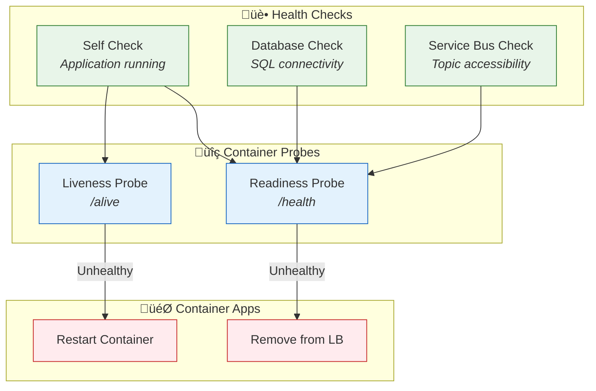

# Observability Architecture

← [Technology Architecture](04-technology-architecture.md) | [Index](README.md) | [Security Architecture →](06-security-architecture.md)

---

## 1. Observability Strategy Overview

The solution implements **comprehensive observability** using the three pillars: **Traces**, **Metrics**, and **Logs**. All telemetry flows to Azure Application Insights with Log Analytics for advanced querying.

### Three Pillars Implementation

| Pillar | Technology | Purpose | Storage |
|--------|------------|---------|---------|
| **Traces** | OpenTelemetry + Azure Monitor Exporter | Distributed request tracing | Application Insights |
| **Metrics** | OpenTelemetry Metrics + Custom Counters | Performance monitoring | Azure Monitor Metrics |
| **Logs** | OpenTelemetry Logging + ILogger | Structured event logging | Log Analytics Workspace |

### Tooling Decisions

| Capability | Choice | Rationale |
|------------|--------|-----------|
| **Instrumentation SDK** | OpenTelemetry | Vendor-neutral, comprehensive auto-instrumentation |
| **APM Backend** | Application Insights | Native Azure integration, powerful analytics |
| **Log Aggregation** | Log Analytics | KQL queries, Azure integration, 30-day retention |
| **Exporter** | Azure Monitor Exporter | Direct integration without OTLP collector |

---

## 2. Distributed Tracing

### Trace Propagation Flow


### Correlation ID Strategy

| Context | Header/Property | Example |
|---------|-----------------|---------|
| HTTP Requests | `traceparent` header | `00-abc123...-def456...-01` |
| Service Bus Messages | `ApplicationProperties["traceparent"]` | W3C Trace Context |
| Logs | `TraceId`, `SpanId` properties | Structured log correlation |
| Application Insights | `Operation ID` | Auto-correlated |

### Span Hierarchy Example

```
🔗 Operation: POST /api/orders (2.5s)
├── 📡 HTTP POST /api/orders (1.8s)
│   ├── ✅ Validate Order (10ms)
│   ├── 🗄️ SQL INSERT Orders (200ms)
│   ├── 🗄️ SQL INSERT OrderProducts (150ms)
│   └── 📨 Service Bus Publish (50ms)
└── 🔄 Logic App: ProcessingOrdersPlaced (700ms)
    └── ⚙️ Workflow Actions (700ms)
```

---

## 3. Logging Architecture

### Log Levels and Standards

| Level | Usage | Example |
|-------|-------|---------|
| **Trace** | Detailed diagnostic info | Method entry/exit |
| **Debug** | Development debugging | Variable values, query text |
| **Information** | Normal operations | Order created, message published |
| **Warning** | Recoverable issues | Validation failed, retry occurred |
| **Error** | Failures requiring attention | Unhandled exception, connection failed |
| **Critical** | System failures | Database unavailable after retries |

### Structured Logging Format

All logs follow a consistent JSON structure:

```json
{
  "Timestamp": "2025-12-30T10:30:00.000Z",
  "Level": "Information",
  "MessageTemplate": "Order {OrderId} created for customer {CustomerId}",
  "Properties": {
    "OrderId": "ORD-2025-001",
    "CustomerId": "CUST-100",
    "Total": 149.99,
    "TraceId": "abc123def456...",
    "SpanId": "789xyz...",
    "RequestPath": "/api/orders",
    "SourceContext": "eShop.Orders.API.Services.OrderService"
  }
}
```

### Log Analytics Configuration

| Setting | Value | Purpose |
|---------|-------|---------|
| Workspace SKU | PerGB2018 | Pay-per-GB pricing |
| Retention | 30 days | Log storage duration |
| Destination Type | Dedicated | Separate table per resource |
| Linked Storage | Alerts, Query | Persisted queries and alerts |

---

## 4. Metrics & Monitoring

### Key Metrics

| Metric | Source | Type | Threshold | Alert |
|--------|--------|------|-----------|-------|
| `http.server.request.duration` | Orders API | Histogram | P95 < 2s | Yes |
| `http.server.active_requests` | All Services | UpDownCounter | < 100 | No |
| `eShop.orders.placed` | Orders API | Counter | N/A | No |
| `eShop.orders.processing.duration` | Orders API | Histogram | P95 < 5s | Yes |
| `eShop.orders.processing.errors` | Orders API | Counter | > 0/5min | Yes |
| `db.client.operation.duration` | Orders API | Histogram | P95 < 500ms | Yes |

### Custom Metrics Implementation

From [OrderService.cs](../../src/eShop.Orders.API/Services/OrderService.cs):

```csharp
private static readonly Meter Meter = new("eShop.Orders.API");

private static readonly Counter<long> OrdersPlacedCounter = Meter.CreateCounter<long>(
    "eShop.orders.placed",
    unit: "order",
    description: "Total number of orders successfully placed");

private static readonly Histogram<double> OrderProcessingDuration = Meter.CreateHistogram<double>(
    "eShop.orders.processing.duration",
    unit: "ms",
    description: "Time taken to process order operations");

private static readonly Counter<long> OrderProcessingErrors = Meter.CreateCounter<long>(
    "eShop.orders.processing.errors",
    unit: "error",
    description: "Total number of order processing errors");
```

### Platform Metrics (Azure Monitor)

| Resource | Metric | Alert Threshold |
|----------|--------|-----------------|
| Service Bus | `ActiveMessages` | > 1000 |
| Service Bus | `DeadLetteredMessages` | > 0 |
| SQL Database | `cpu_percent` | > 80% |
| Logic Apps | `RunsFailed` | > 0 |
| Container Apps | `Requests` | N/A (baseline) |

---

## 5. Application Insights Integration

### Instrumentation Approach

Configured in [Extensions.cs](../../app.ServiceDefaults/Extensions.cs):

```csharp
public static TBuilder ConfigureOpenTelemetry<TBuilder>(this TBuilder builder)
{
    builder.Logging.AddOpenTelemetry(logging =>
    {
        logging.IncludeFormattedMessage = true;
        logging.IncludeScopes = true;
        logging.ParseStateValues = true;
    });

    var openTelemetry = builder.Services.AddOpenTelemetry();

    openTelemetry.WithMetrics(metrics =>
    {
        metrics.AddAspNetCoreInstrumentation()
            .AddHttpClientInstrumentation()
            .AddRuntimeInstrumentation()
            .AddMeter("eShop.Orders.API")
            .AddMeter("eShop.Web.App");
    });

    openTelemetry.WithTracing(tracing =>
    {
        tracing.AddSource("eShop.Orders.API")
            .AddSource("eShop.Web.App")
            .AddSource("Azure.Messaging.ServiceBus")
            .AddAspNetCoreInstrumentation()
            .AddHttpClientInstrumentation()
            .AddSqlClientInstrumentation();
    });
}
```

### SDK Configuration

| Configuration | Value | Purpose |
|--------------|-------|---------|
| Connection String | App Insights Connection String | Telemetry destination |
| Sampling | None (capture all) | Full visibility |
| Filter | Exclude `/health`, `/alive` | Reduce noise |
| Enrichment | Request/response size | Additional context |

---

## 6. Health Monitoring

### Health Check Endpoints

| Endpoint | Type | Checks | Tags |
|----------|------|--------|------|
| `/health` | Readiness | All registered checks | `ready` |
| `/alive` | Liveness | Self-check only | `live` |

### Health Model



### Dependency Health Tracking

| Dependency | Health Check | Failure Impact |
|------------|--------------|----------------|
| SQL Database | `DbContextHealthCheck` | Orders API unhealthy |
| Service Bus | `ServiceBusHealthCheck` | Orders API unhealthy |
| Orders API | HTTP health check | Web App unhealthy |

---

## 7. Alerting Strategy

### Alert Rules

| Alert | Condition | Severity | Action |
|-------|-----------|----------|--------|
| High API Latency | P95 > 2s for 5 min | Warning | Notify team |
| API Errors Spike | Error rate > 5% | Error | Page on-call |
| Service Bus Dead Letters | DLQ count > 0 | Warning | Notify team |
| Logic App Failures | RunsFailed > 0 | Error | Notify team |
| SQL High CPU | cpu_percent > 80% | Warning | Auto-scale review |
| Health Check Failed | Unhealthy > 1 min | Critical | Page on-call |

### Escalation Paths

| Severity | Initial Response | Escalation |
|----------|------------------|------------|
| **Warning** | Slack notification | Review within 4 hours |
| **Error** | Email + Slack | Investigate within 1 hour |
| **Critical** | PagerDuty | Immediate response |

---

## 8. Dashboards & Visualization

### Dashboard Inventory

| Dashboard | Purpose | Primary Users |
|-----------|---------|---------------|
| **Application Map** | Service dependency visualization | Developers, SRE |
| **Transaction Search** | End-to-end trace analysis | Developers |
| **Performance Dashboard** | Latency and throughput | SRE, Management |
| **Live Metrics** | Real-time request flow | SRE during incidents |
| **Failures Dashboard** | Error analysis | Developers |

### Key Visualizations

| Visualization | Source | KQL Query Example |
|---------------|--------|-------------------|
| Request rate over time | `requests` table | `requests \| summarize count() by bin(timestamp, 5m)` |
| Error distribution | `exceptions` table | `exceptions \| summarize count() by type` |
| Dependency latency | `dependencies` table | `dependencies \| summarize avg(duration) by name` |
| Order throughput | Custom metric | `customMetrics \| where name == "eShop.orders.placed"` |

---

## Related Documents

- [Data Architecture](02-data-architecture.md) - Telemetry data mapping
- [Application Architecture](03-application-architecture.md) - Service instrumentation
- [Technology Architecture](04-technology-architecture.md) - Azure Monitor resources
- [ADR-003](adr/ADR-003-observability-strategy.md) - Observability strategy decision

---

> 💡 **Tip:** Use the Application Map in Azure Portal to quickly understand service dependencies and identify performance bottlenecks.
