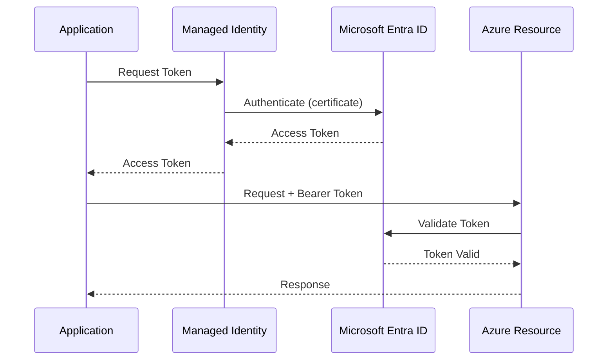
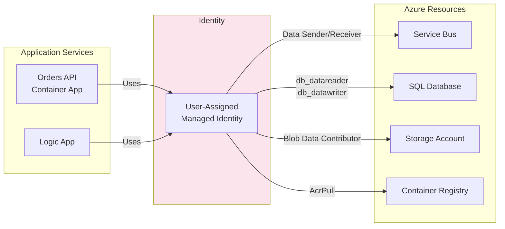
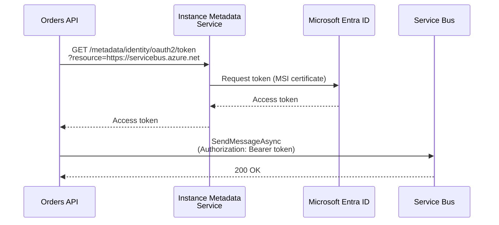
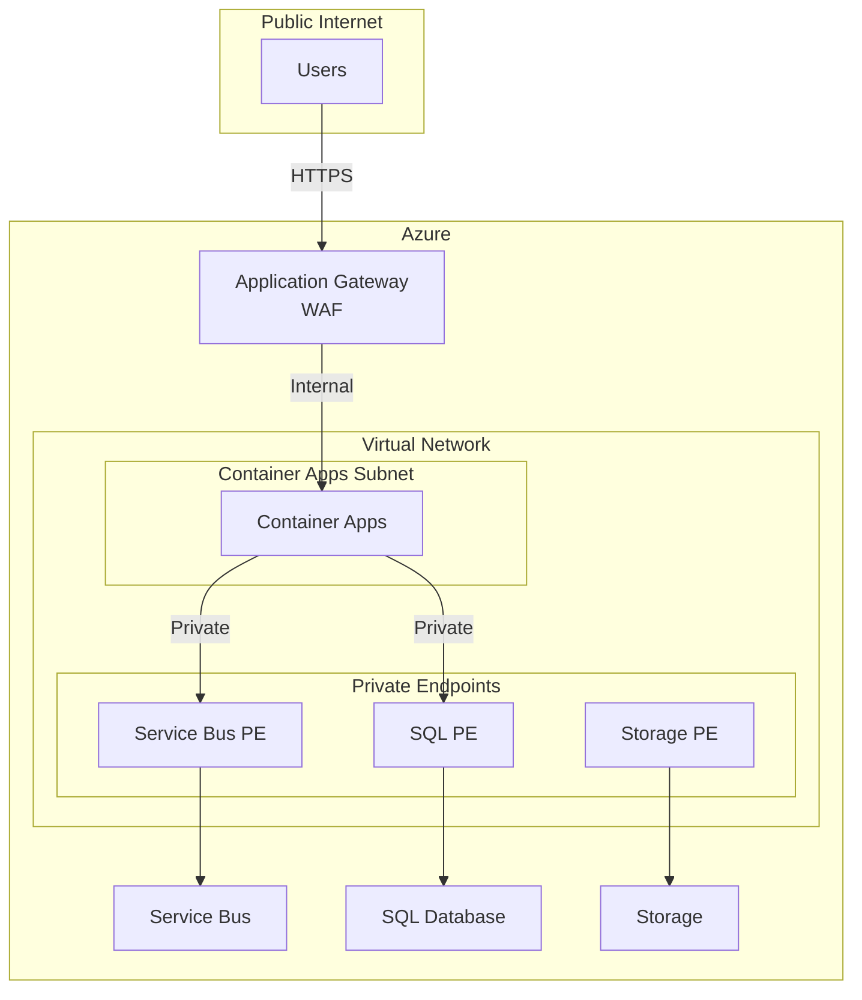

# Security Architecture

← [Observability Architecture](05-observability-architecture.md) | [Index](README.md) | [Deployment Architecture →](07-deployment-architecture.md)

## Security Overview

The solution implements defense-in-depth security with emphasis on:

- **Zero Trust**: No implicit trust; verify explicitly at every layer
- **Least Privilege**: Minimal permissions for each service
- **Managed Identities**: Eliminate credential management
- **Encryption**: Data protected at rest and in transit

### Security Principles Applied

| Principle | Implementation |
|-----------|----------------|
| **No Secrets in Code** | Managed identities, user secrets for local dev |
| **Principle of Least Privilege** | Specific RBAC roles per resource |
| **Defense in Depth** | Network controls, identity, encryption |
| **Secure by Default** | TLS 1.2+, HTTPS enforced |

---

## Authentication & Authorization

### Authentication Flow



### Identity Providers

| Context | Identity Provider | Authentication Method |
|---------|-------------------|----------------------|
| Azure Resources | Microsoft Entra ID | Managed Identity |
| Local Development | Azure CLI / Visual Studio | Developer credentials |
| SQL Database | Microsoft Entra ID | Managed Identity (token) |
| Service Bus | Microsoft Entra ID | Managed Identity (token) |

### API Security

| Endpoint | Authentication | Authorization |
|----------|----------------|---------------|
| `/api/orders` | None (internal only) | Container Apps ingress |
| `/health` | None | Public (health probes) |
| `/alive` | None | Public (liveness probes) |

> **Note:** The current implementation assumes internal-only access. For external exposure, implement API key, OAuth 2.0, or Microsoft Entra ID authentication.

---

## Managed Identity Architecture

### Identity Assignments



### Role Assignments Table

| Resource | Role | Principal | Scope |
|----------|------|-----------|-------|
| Service Bus Namespace | Azure Service Bus Data Sender | Managed Identity | Namespace |
| Service Bus Namespace | Azure Service Bus Data Receiver | Managed Identity | Namespace |
| SQL Database | db_datareader, db_datawriter | Managed Identity | Database |
| Storage Account (Workflow) | Storage Blob Data Contributor | Managed Identity | Account |
| Storage Account (Workflow) | Storage Table Data Contributor | Managed Identity | Account |
| Storage Account (Workflow) | Storage Queue Data Contributor | Managed Identity | Account |
| Container Registry | AcrPull | Managed Identity | Registry |

### Service-to-Service Auth Flow



---

## Secret Management

### Secret Storage Approach

| Environment | Secret Store | Access Method |
|-------------|--------------|---------------|
| Local Development | .NET User Secrets | `builder.Configuration` |
| Azure Container Apps | Environment Variables (from azd) | `builder.Configuration` |
| Azure Logic Apps | App Settings | `configuration()` function |
| CI/CD Pipelines | Azure Key Vault / GitHub Secrets | azd integration |

### Secrets Required

| Secret | Purpose | Storage |
|--------|---------|---------|
| `APPLICATIONINSIGHTS_CONNECTION_STRING` | Telemetry | User Secrets / Env Var |
| `Azure:ServiceBus:HostName` | Service Bus endpoint | User Secrets / Env Var |
| `Azure:SqlServer:Name` | SQL Server FQDN | User Secrets / Env Var |
| SQL Connection String | Database access | Aspire-generated / Env Var |

### Local Development Secrets

The `postprovision` hook configures user secrets:

```powershell
# From postprovision.ps1
Set-DotNetUserSecret -Key "Azure:ServiceBus:HostName" -Value $env:MESSAGING_SERVICEBUSHOSTNAME
Set-DotNetUserSecret -Key "Azure:SqlServer:Name" -Value $env:AZURE_SQL_SERVER_NAME
Set-DotNetUserSecret -Key "APPLICATIONINSIGHTS_CONNECTION_STRING" -Value $env:APPLICATIONINSIGHTS_CONNECTION_STRING
```

### Secret Rotation Strategy

| Secret Type | Rotation | Method |
|-------------|----------|--------|
| Managed Identity Tokens | Automatic | Azure platform manages |
| Connection Strings | On reprovisioning | `azd provision` regenerates |
| Application Insights Key | Static | Regenerate via Azure Portal |

---

## Network Security

### Current Network Controls

| Component | Access Level | Security Control |
|-----------|--------------|------------------|
| Container Apps | Public HTTPS | TLS 1.2+, Azure-managed cert |
| Service Bus | Public | Microsoft Entra auth required |
| SQL Database | Public with firewall | IP allowlist, Entra auth |
| Application Insights | Public | Connection string required |
| Storage Accounts | Public | Entra auth or SAS tokens |

### Transport Security

| Protocol | Requirement | Configuration |
|----------|-------------|---------------|
| HTTPS | Required | `UseHttpsRedirection()`, HSTS |
| TLS Version | 1.2 minimum | Storage: `minimumTlsVersion: 'TLS1_2'` |
| AMQP WebSockets | Used for Service Bus | `ServiceBusTransportType.AmqpWebSockets` |

### Future Enhancements: Private Networking

For production, consider:



---

## Data Protection

### Encryption at Rest

| Resource | Encryption | Key Management |
|----------|------------|----------------|
| SQL Database | TDE (Transparent Data Encryption) | Service-managed |
| Storage Accounts | SSE (Storage Service Encryption) | Service-managed |
| Service Bus | Platform encryption | Service-managed |
| Application Insights | Platform encryption | Service-managed |

### Encryption in Transit

| Connection | Protocol | Certificate |
|------------|----------|-------------|
| User → Web App | HTTPS/TLS 1.2+ | Azure-managed |
| Web App → API | HTTPS/TLS 1.2+ | Azure-managed |
| API → SQL | TDS/TLS 1.2+ | Azure-managed |
| API → Service Bus | AMQP-WS/TLS 1.2+ | Azure-managed |

### Data Masking

Sensitive data handling in logs:

| Data Type | Handling | Implementation |
|-----------|----------|----------------|
| Order ID | Logged | `{OrderId}` parameter |
| Customer ID | Logged (ID only) | `{CustomerId}` parameter |
| Delivery Address | Not logged in full | Omitted from structured logs |
| Order Total | Logged | `{Total}` parameter, metrics |

---

## Compliance & Governance

### Compliance Considerations

| Requirement | Implementation |
|-------------|----------------|
| **Data Residency** | Single Azure region deployment |
| **Audit Logging** | Application Insights, Activity Log |
| **Access Logging** | Azure Monitor diagnostics |
| **Encryption** | At rest and in transit |

### Audit Logging

| Event | Log Destination | Retention |
|-------|-----------------|-----------|
| API Requests | Application Insights | 90 days |
| Database Queries | SQL Audit (if enabled) | Configurable |
| Azure Resource Changes | Activity Log | 90 days |
| Security Events | Microsoft Defender | Configurable |

### Resource Tagging for Governance

```bicep
// From main.bicep
var coreTags = {
  Solution: solutionName
  Environment: envName
  CostCenter: 'Engineering'
  Owner: 'Platform-Team'
  BusinessUnit: 'IT'
  DeploymentDate: deploymentDate
  Repository: 'Azure-LogicApps-Monitoring'
}
```

---

## Security Checklist

- [x] Managed identities for all service-to-service auth
- [x] No secrets in source code
- [x] HTTPS enforced for all endpoints
- [x] TLS 1.2+ required for storage
- [x] Health endpoints exposed for monitoring
- [ ] Private endpoints for PaaS services (future)
- [ ] Web Application Firewall (future)
- [ ] API authentication (future enhancement)

---

## Related Documents

- [Technology Architecture](04-technology-architecture.md) - Identity infrastructure
- [Deployment Architecture](07-deployment-architecture.md) - Secret management in CI/CD
- [ADR-001: Aspire Orchestration](adr/ADR-001-aspire-orchestration.md) - Local dev security
