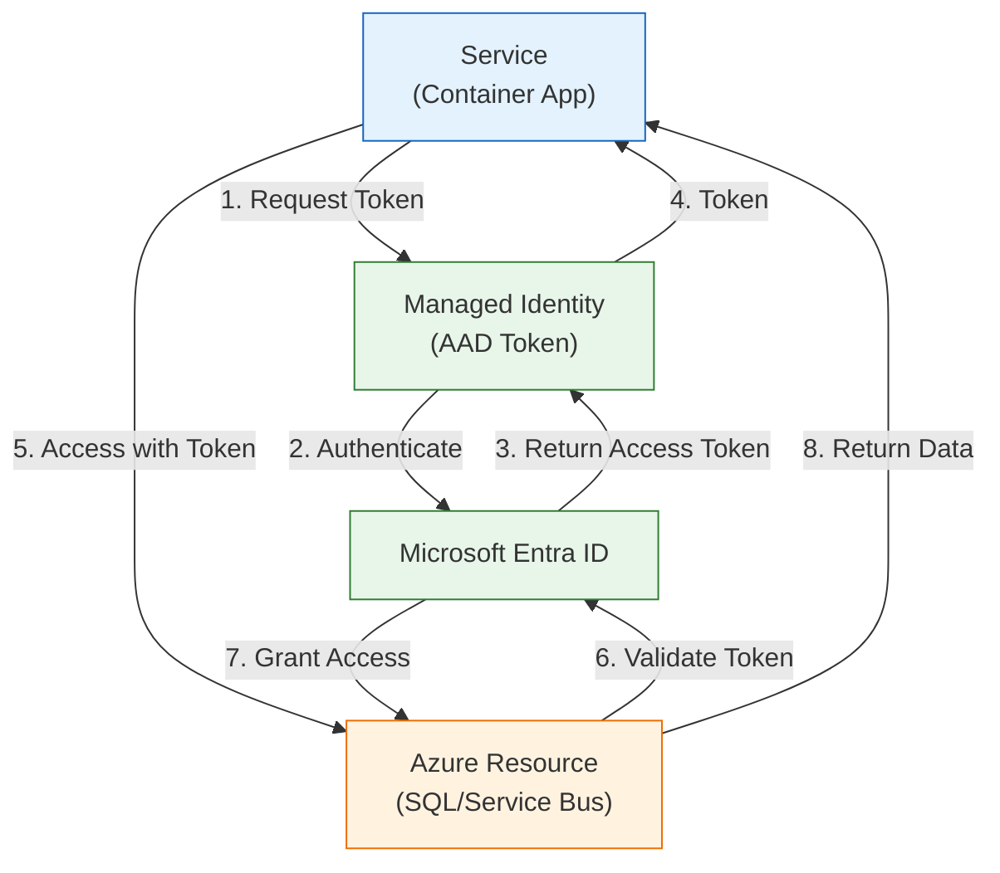
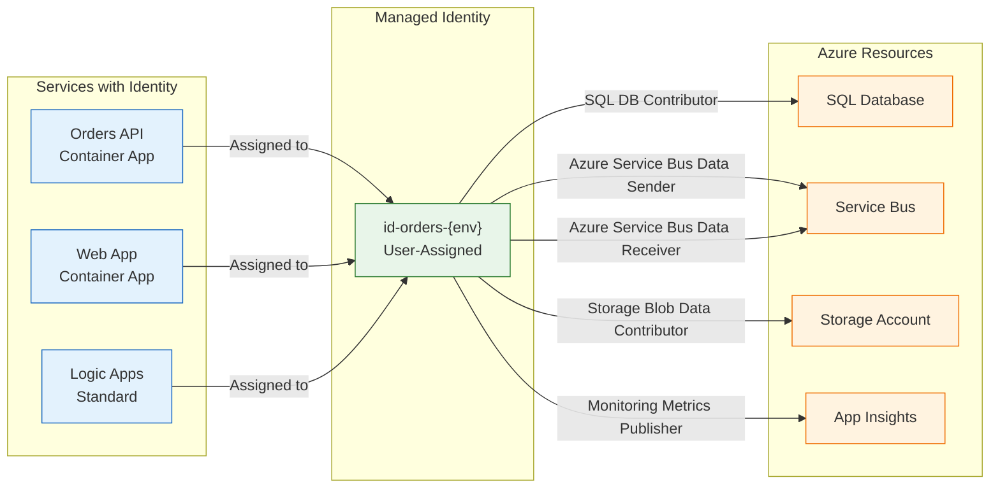
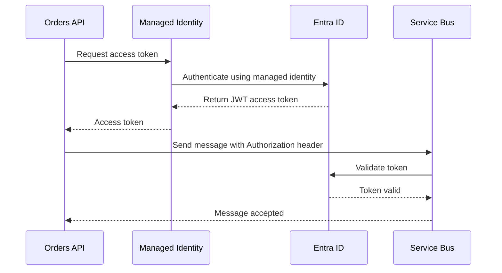
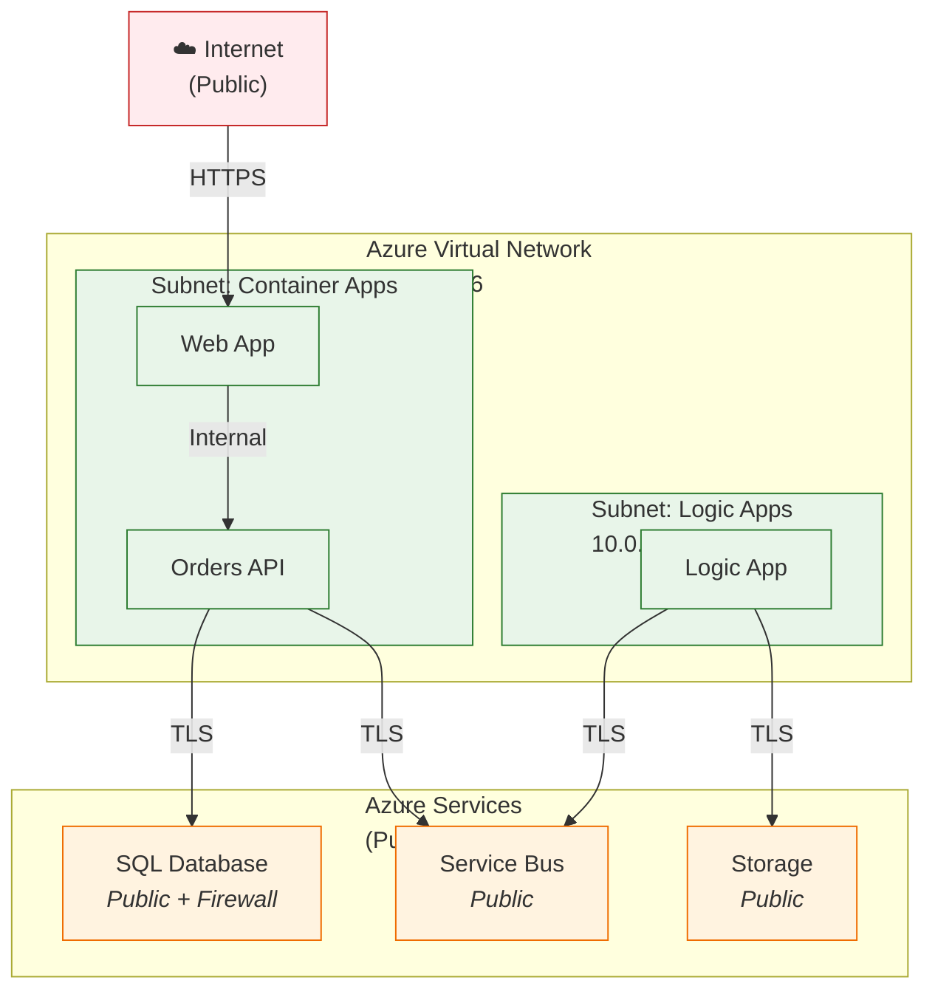

# Security Architecture

← [Observability Architecture](05-observability-architecture.md) | [Index](README.md) | [Deployment Architecture](07-deployment-architecture.md) →

## 1. Security Overview

The solution implements defense-in-depth security following Azure Well-Architected Framework security pillar principles:

- **Zero stored secrets**: All authentication via Managed Identity
- **Least privilege access**: RBAC with minimal required permissions
- **Encryption everywhere**: TLS in transit, TDE/SSE at rest
- **Network segmentation**: Virtual Network with subnet isolation
- **Audit logging**: Comprehensive diagnostic logs

---

## 2. Authentication & Authorization

### 2.1 Authentication Flow



### 2.2 Identity Providers

| Environment           | Identity                       | Method        |
| --------------------- | ------------------------------ | ------------- |
| **Local Development** | User Azure CLI credentials     | `az login`    |
| **Azure Deployment**  | User-Assigned Managed Identity | Azure-managed |

### 2.3 API Security

| Endpoint                 | Authentication       | Authorization         |
| ------------------------ | -------------------- | --------------------- |
| Orders API `/api/orders` | None (future: OAuth) | Public (future: RBAC) |
| Health checks `/health`  | None                 | Public                |
| Aspire Dashboard         | None (local only)    | N/A                   |

---

## 3. Managed Identity Architecture

### 3.1 Identity Assignments



### 3.2 Service-to-Service Auth Flow



### 3.3 Role Assignments

| Principal            | Resource                   | Role                            | Scope     |
| -------------------- | -------------------------- | ------------------------------- | --------- |
| **Managed Identity** | SQL Database               | SQL DB Contributor              | Database  |
| **Managed Identity** | Service Bus                | Azure Service Bus Data Sender   | Namespace |
| **Managed Identity** | Service Bus                | Azure Service Bus Data Receiver | Namespace |
| **Managed Identity** | Storage Account (Workflow) | Storage Blob Data Contributor   | Account   |
| **Managed Identity** | Application Insights       | Monitoring Metrics Publisher    | Instance  |

---

## 4. Secret Management

### 4.1 Secret Storage Approach

| Environment           | Storage                       | Access Method         | Rotation           |
| --------------------- | ----------------------------- | --------------------- | ------------------ |
| **Local Development** | .NET User Secrets             | `dotnet user-secrets` | Manual             |
| **Azure Deployment**  | Key Vault References (future) | Managed Identity      | Automatic (future) |
| **Configuration**     | Environment Variables         | Aspire provisioning   | Per deployment     |

### 4.2 Secret Rotation Strategy

| Secret Type          | Rotation Frequency          | Automation      |
| -------------------- | --------------------------- | --------------- |
| SQL Admin Password   | Manual (not used in prod)   | N/A             |
| Storage Account Keys | 90 days (future)            | Azure Key Vault |
| Service Bus Keys     | Not used (Managed Identity) | N/A             |
| API Keys             | Not used                    | N/A             |

### 4.3 Local Development Secrets

**Managed via**: [postprovision.ps1](../../hooks/postprovision.ps1)

Configuration stored in `.azure/{env}/.env`:

```bash
AZURE_SUBSCRIPTION_ID=...
AZURE_RESOURCE_GROUP=...
APPLICATIONINSIGHTS_CONNECTION_STRING=...
AZURE_SQL_CONNECTION_STRING=...
AZURE_SERVICEBUS_HOSTNAME=...
```

Propagated to User Secrets via:

```powershell
dotnet user-secrets set "ApplicationInsights:ConnectionString" $connectionString --project $projectPath
```

---

## 5. Network Security

### 5.1 Network Controls

| Control                     | Implementation                                         | Purpose                |
| --------------------------- | ------------------------------------------------------ | ---------------------- |
| **Virtual Network**         | 10.0.0.0/16                                            | Network isolation      |
| **Subnet Isolation**        | Container Apps (10.0.0.0/23), Logic Apps (10.0.2.0/24) | Workload segmentation  |
| **Service Endpoints**       | Service Bus, Storage                                   | Azure backbone traffic |
| **Private Endpoints**       | SQL Database (future)                                  | Private connectivity   |
| **Network Security Groups** | Future                                                 | Traffic filtering      |

### 5.2 Firewall Rules

| Resource            | Rule                  | Source          | Destination      |
| ------------------- | --------------------- | --------------- | ---------------- |
| **SQL Database**    | Allow Azure Services  | Azure IP ranges | SQL endpoint     |
| **Service Bus**     | Public network access | All             | Public endpoint  |
| **Storage Account** | Allow Azure Services  | Azure IP ranges | Storage endpoint |

### 5.3 Network Architecture (Current State)



**Future State**: Private endpoints for SQL, Service Bus, Storage to eliminate public internet exposure.

---

## 6. Data Protection

### 6.1 Encryption at Rest

| Resource                 | Mechanism                         | Key Management |
| ------------------------ | --------------------------------- | -------------- |
| **SQL Database**         | Transparent Data Encryption (TDE) | Azure-managed  |
| **Service Bus**          | Storage Service Encryption (SSE)  | Azure-managed  |
| **Storage Account**      | Storage Service Encryption (SSE)  | Azure-managed  |
| **Application Insights** | Azure Monitor encryption          | Azure-managed  |

### 6.2 Encryption in Transit

| Connection              | Protocol          | Minimum TLS |
| ----------------------- | ----------------- | ----------- |
| User → Web App          | HTTPS             | TLS 1.2     |
| Web App → API           | HTTPS (internal)  | TLS 1.2     |
| API → SQL               | TDS over TLS      | TLS 1.2     |
| API → Service Bus       | AMQP over TLS     | TLS 1.2     |
| Logic App → Service Bus | HTTPS (connector) | TLS 1.2     |
| Services → App Insights | HTTPS             | TLS 1.2     |

### 6.3 Data Masking

**Current State**: No PII collected

**Future Considerations**:

- Dynamic Data Masking in SQL for sensitive fields
- Log sanitization for customer data
- GDPR compliance for data subject requests

---

## 7. Compliance & Governance

### 7.1 Compliance Requirements

| Requirement           | Status         | Implementation                  |
| --------------------- | -------------- | ------------------------------- |
| **HTTPS Enforcement** | ✅ Implemented | All endpoints TLS 1.2+          |
| **Audit Logging**     | ✅ Implemented | Diagnostic logs enabled         |
| **Access Control**    | ✅ Implemented | RBAC with Managed Identity      |
| **Data Encryption**   | ✅ Implemented | TDE + SSE                       |
| **Network Isolation** | ⚠️ Partial     | VNet (Private Endpoints future) |
| **Secret Management** | ⚠️ Partial     | User Secrets (Key Vault future) |

### 7.2 Audit Logging

| Resource           | Log Category              | Destination   | Retention |
| ------------------ | ------------------------- | ------------- | --------- |
| **SQL Database**   | SQLSecurityAuditEvents    | Log Analytics | 30 days   |
| **Service Bus**    | OperationalLogs           | Log Analytics | 30 days   |
| **Container Apps** | ContainerAppConsoleLogs   | Log Analytics | 30 days   |
| **Logic Apps**     | WorkflowRuntime           | Log Analytics | 30 days   |
| **Storage**        | StorageRead, StorageWrite | Log Analytics | 30 days   |

### 7.3 Security Monitoring

| Alert                       | Condition             | Response                |
| --------------------------- | --------------------- | ----------------------- |
| **SQL Injection Attempt**   | SQL threat detection  | Block IP + investigate  |
| **Unusual Access Pattern**  | AAD sign-in logs      | Verify with user        |
| **Key Vault Access Denied** | Audit logs            | Review RBAC assignments |
| **Failed Auth Attempts**    | >10 failures in 5 min | Rate limiting (future)  |

---

## 8. Security Best Practices Implemented

| Practice                         | Implementation                         | Reference                                |
| -------------------------------- | -------------------------------------- | ---------------------------------------- |
| **Principle of Least Privilege** | Scoped RBAC roles                      | [Role Assignments](#33-role-assignments) |
| **Defense in Depth**             | Multiple security layers               | VNet + RBAC + Encryption                 |
| **Secure by Default**            | TLS enforced, public access restricted | All service configurations               |
| **Assume Breach**                | Audit logging, anomaly detection       | Diagnostic settings                      |
| **Security as Code**             | Bicep templates with security configs  | [infra/](../../infra/)                   |

---

## Cross-Architecture Relationships

| Related Architecture           | Connection                          | Reference                                                                 |
| ------------------------------ | ----------------------------------- | ------------------------------------------------------------------------- |
| **Technology Architecture**    | Security controls in infrastructure | [Technology Architecture](04-technology-architecture.md#network-platform) |
| **Data Architecture**          | Data protection policies            | [Data Architecture](02-data-architecture.md#data-architecture-principles) |
| **Observability Architecture** | Security audit logs                 | [Observability Architecture](05-observability-architecture.md#logs)       |

---

← [Observability Architecture](05-observability-architecture.md) | [Index](README.md) | [Deployment Architecture](07-deployment-architecture.md) →
