# Security Architecture

← [Observability Architecture](05-observability-architecture.md) | [Index](README.md) | [Deployment Architecture →](07-deployment-architecture.md)

---

## 1. Security Overview

### Security Principles Applied

| Principle | Implementation | Benefit |
|-----------|----------------|---------|
| **Zero Trust** | Managed Identity for all service-to-service auth | No hardcoded credentials |
| **Least Privilege** | RBAC with minimal required permissions | Reduced blast radius |
| **Defense in Depth** | Multiple security layers (network, identity, encryption) | Layered protection |
| **Secure by Default** | TLS 1.2+, encryption at rest enabled | Baseline security |

### Threat Model Summary

| Threat | Mitigation | Control |
|--------|------------|---------|
| Credential theft | No secrets in code; Managed Identity | Preventive |
| Data interception | TLS for all communications | Preventive |
| Unauthorized access | RBAC role assignments | Preventive |
| SQL injection | Parameterized queries (EF Core) | Preventive |
| Data exposure | Encryption at rest | Preventive |

---

## 2. Authentication & Authorization

### Authentication Flow

```mermaid
flowchart TB
    subgraph Services["🖥️ Application Services"]
        API["Orders API"]
        WebApp["Web App"]
        LogicApp["Logic App"]
    end

    subgraph Identity["🔐 Azure Identity"]
        MI["User Assigned<br/>Managed Identity"]
        EntraID["Microsoft Entra ID"]
    end

    subgraph Resources["📦 Azure Resources"]
        SQL["SQL Database"]
        SB["Service Bus"]
        Storage["Storage Account"]
    end

    API & WebApp & LogicApp --> MI
    MI -->|"Get Token"| EntraID
    EntraID -->|"Access Token"| MI
    MI -->|"Bearer Token"| SQL
    MI -->|"Bearer Token"| SB
    MI -->|"Bearer Token"| Storage

    classDef service fill:#e3f2fd,stroke:#1565c0
    classDef identity fill:#fce4ec,stroke:#c2185b
    classDef resource fill:#e8f5e9,stroke:#2e7d32

    class API,WebApp,LogicApp service
    class MI,EntraID identity
    class SQL,SB,Storage resource
```



### Identity Providers

| Context | Provider | Method |
|---------|----------|--------|
| Service-to-Service | Microsoft Entra ID | Managed Identity |
| Local Development | Azure CLI / VS Code | DefaultAzureCredential |
| API Consumers | N/A (internal only) | Service Discovery |

### API Security

| Aspect | Implementation | Notes |
|--------|----------------|-------|
| Transport | HTTPS only | Enforced by Container Apps |
| Authentication | Internal network | No external API auth required |
| Authorization | N/A | All operations permitted internally |
| Rate Limiting | Container Apps default | Built-in protection |

---

## 3. Managed Identity Architecture

### Identity Assignments


### Service-to-Service Auth Flow

1. **Container App starts** → Managed Identity assigned
2. **App requests token** → `DefaultAzureCredential` obtains token from Entra ID
3. **Token cached** → SDK handles token refresh automatically
4. **Access resource** → Bearer token included in request headers

### Role Assignments Table

| Resource | Role | Scope | Purpose |
|----------|------|-------|---------|
| SQL Server | SQL DB Contributor | Database | Data operations |
| Service Bus | Azure Service Bus Data Owner | Namespace | Send/receive messages |
| Storage Account | Storage Blob Data Contributor | Account | Workflow state access |
| Container Registry | AcrPull | Registry | Pull container images |
| Application Insights | Monitoring Metrics Publisher | Resource | Publish telemetry |

---

## 4. Secret Management

### Secret Storage Approach

| Environment | Method | Location |
|-------------|--------|----------|
| **Local Development** | .NET User Secrets | `~/.microsoft/usersecrets/{id}/secrets.json` |
| **Azure** | Managed Identity | No secrets stored |

### Secret Configuration

The solution uses **zero secrets in Azure** through Managed Identity. Local development uses User Secrets configured via `postprovision.ps1`:

```powershell
# From postprovision.ps1 - configures local dev secrets
Set-DotNetUserSecret -Key 'Azure:TenantId' -Value $tenantId -ProjectPath $projectPath
Set-DotNetUserSecret -Key 'Azure:ClientId' -Value $clientId -ProjectPath $projectPath
Set-DotNetUserSecret -Key 'Azure:ResourceGroup' -Value $resourceGroup -ProjectPath $projectPath
```

### Secret Rotation Strategy

| Secret Type | Rotation | Method |
|-------------|----------|--------|
| Managed Identity | Automatic | Azure manages |
| Connection Strings | N/A | Using MI, no connection string secrets |
| API Keys | N/A | No external APIs with keys |

### Local Development Secrets

Secrets are populated by `azd` hooks after provisioning:

| Secret | Source | Purpose |
|--------|--------|---------|
| `Azure:TenantId` | Azure subscription | Entra ID tenant |
| `Azure:ResourceGroup` | Deployment output | Resource scope |
| `Azure:ServiceBus:HostName` | Deployment output | Service Bus connection |
| `Azure:SqlServer:Name` | Deployment output | SQL Server connection |
| `ApplicationInsights:ConnectionString` | Deployment output | Telemetry |

---

## 5. Network Security

### Network Controls

| Control | Implementation | Purpose |
|---------|----------------|---------|
| HTTPS Only | Container Apps ingress | Transport encryption |
| Internal Services | Internal ingress (API) | Limit exposure |
| Service Mesh | Container Apps built-in | Service-to-service TLS |

### Exposure Model

| Service | Ingress Type | Accessible From |
|---------|--------------|-----------------|
| Web App | External | Internet (HTTPS) |
| Orders API | Internal | Container Apps environment only |
| Logic App | Internal | Service Bus trigger only |
| SQL Database | Private | Azure network only |
| Service Bus | Private | Azure network only |

### Firewall Rules

| Resource | Default Action | Allowed |
|----------|----------------|---------|
| Storage Account | Allow | Azure Services |
| SQL Database | Deny | Azure Services, specific IPs |
| Service Bus | Allow | All (Standard tier limitation) |

---

## 6. Data Protection

### Encryption at Rest

| Resource | Encryption | Key Management |
|----------|------------|----------------|
| SQL Database | TDE (Transparent Data Encryption) | Microsoft-managed keys |
| Storage Account | SSE (Storage Service Encryption) | Microsoft-managed keys |
| Service Bus | Platform encryption | Microsoft-managed keys |
| Application Insights | Platform encryption | Microsoft-managed keys |

### Encryption in Transit

| Communication | Protocol | Certificate |
|---------------|----------|-------------|
| Client → Web App | HTTPS (TLS 1.2+) | Azure-managed |
| Web App → API | HTTPS (TLS 1.2+) | Container Apps internal |
| API → SQL | TDS (TLS 1.2+) | Azure-managed |
| API → Service Bus | AMQP (TLS 1.2+) | Azure-managed |

### Data Masking

| Data Type | Handling | Implementation |
|-----------|----------|----------------|
| Customer IDs | Logged as-is | Non-PII in this demo |
| Order Totals | Logged as-is | Non-PII |
| Addresses | Logged as-is | Demo data only |
| Telemetry | Captured | Exclude sensitive parameters |

> ⚠️ **Warning:** In production with real PII, implement proper data masking in logs and telemetry.

---

## 7. Compliance & Governance

### Compliance Requirements

| Requirement | Implementation | Status |
|-------------|----------------|--------|
| Encryption at rest | TDE, SSE enabled | ✅ Met |
| Encryption in transit | TLS 1.2+ enforced | ✅ Met |
| No hardcoded secrets | Managed Identity | ✅ Met |
| Audit logging | Azure Activity Log | ✅ Met |
| Access control | RBAC | ✅ Met |

### Audit Logging

| Log Type | Source | Retention |
|----------|--------|-----------|
| Activity Log | Azure subscription | 90 days |
| Diagnostic Logs | All resources | 30 days (Log Analytics) |
| Application Logs | Services | 90 days (App Insights) |

### Governance Tags

Applied to all resources via Bicep:

```bicep
var coreTags = {
  Solution: solutionName
  Environment: envName
  CostCenter: 'Engineering'
  Owner: 'Platform-Team'
  BusinessUnit: 'IT'
  DeploymentDate: deploymentDate
}
```

---

## Related Documents

- [Technology Architecture](04-technology-architecture.md) - Identity infrastructure
- [Deployment Architecture](07-deployment-architecture.md) - Secret injection in CI/CD
- [ADR-001](adr/ADR-001-aspire-orchestration.md) - Local development security

---

> 💡 **Tip:** Always use `DefaultAzureCredential` in code to automatically use the appropriate authentication method for each environment (Managed Identity in Azure, Azure CLI/VS credentials locally).
