# Security Architecture

← [Observability Architecture](05-observability-architecture.md) | [Index](README.md) | [Deployment Architecture →](07-deployment-architecture.md)

---

## Security Architecture Overview

The solution implements a **defense-in-depth** security model with **passwordless authentication** as a core principle. Azure Managed Identity provides secure service-to-service authentication, eliminating the need for secrets management.

---

## Security Principles

| Principle | Statement | Implementation |
|-----------|-----------|----------------|
| **Passwordless by Default** | No secrets in code or configuration | User-assigned Managed Identity for all Azure services |
| **Least Privilege** | Minimum permissions necessary | Role-based access control (RBAC) with specific roles |
| **Defense in Depth** | Multiple security layers | Network, identity, data encryption |
| **Zero Trust** | Verify explicitly, assume breach | Token-based authentication, audit logging |
| **Secure by Design** | Security built into architecture | Security controls in IaC templates |

---

## Identity Architecture

### Managed Identity Model

```mermaid
flowchart TB
    subgraph EntraID["🔐 Microsoft Entra ID"]
        MI["User-Assigned<br/>Managed Identity"]
        Tokens["Access Tokens"]
    end

    subgraph Services["🖥️ Services"]
        WebApp["eShop.Web.App"]
        API["eShop.Orders.API"]
        LogicApp["Logic Apps"]
    end

    subgraph Resources["📦 Azure Resources"]
        SQL["Azure SQL<br/>Database"]
        SB["Service Bus<br/>Namespace"]
        Storage["Azure Storage<br/>Account"]
        AI["Application<br/>Insights"]
    end

    MI --> Services
    Services -->|"Request Token"| EntraID
    EntraID -->|"Issue Token"| Tokens
    Tokens -->|"Authenticate"| Resources

    classDef identity fill:#ffecb3,stroke:#ff8f00
    classDef service fill:#e3f2fd,stroke:#1565c0
    classDef resource fill:#e8f5e9,stroke:#2e7d32

    class MI,Tokens identity
    class WebApp,API,LogicApp service
    class SQL,SB,Storage,AI resource
```



### Identity Configuration

From [identity/main.bicep](../../infra/shared/identity/main.bicep):

```bicep
resource managedIdentity 'Microsoft.ManagedIdentity/userAssignedIdentities@2023-01-31' = {
  name: name
  location: location
  tags: tags
}
```

### Service Identity Assignment

| Service | Identity Type | Usage |
|---------|--------------|-------|
| **eShop.Orders.API** | User-Assigned MI | SQL, Service Bus, App Insights |
| **eShop.Web.App** | User-Assigned MI | App Insights |
| **Logic Apps** | System-Assigned MI | Service Bus, Storage |

---

## Role-Based Access Control

### RBAC Assignments

| Service | Resource | Role | Purpose |
|---------|----------|------|---------|
| **Managed Identity** | SQL Database | `SQL DB Contributor` | Database operations |
| **Managed Identity** | Service Bus | `Azure Service Bus Data Sender` | Publish messages |
| **Managed Identity** | Service Bus | `Azure Service Bus Data Receiver` | Consume messages |
| **Managed Identity** | Storage Account | `Storage Blob Data Contributor` | Logic App state |
| **Managed Identity** | App Insights | `Monitoring Metrics Publisher` | Telemetry write |

### SQL Database Authentication

The solution uses **Entra ID authentication** for Azure SQL:

From [sql-managed-identity-config.ps1](../../hooks/sql-managed-identity-config.ps1):

```powershell
# Configure managed identity as SQL admin
$sqlServer = Get-AzSqlServer -ResourceGroupName $resourceGroup -ServerName $serverName
Set-AzSqlServerActiveDirectoryAdministrator `
    -ResourceGroupName $resourceGroup `
    -ServerName $serverName `
    -DisplayName $managedIdentityName `
    -ObjectId $managedIdentityObjectId
```

---

## Network Security

### Network Architecture

```mermaid
flowchart TB
    subgraph Internet["🌐 Internet"]
        User["👤 Users"]
    end

    subgraph EdgeSecurity["🛡️ Edge Security"]
        TLS["TLS 1.2+<br/>Termination"]
    end

    subgraph ACA["Container Apps Environment"]
        Ingress["Envoy Ingress<br/>(HTTPS only)"]
        WebApp["eShop.Web.App"]
        API["eShop.Orders.API"]
    end

    subgraph DataTier["🔒 Data Tier"]
        SQL["Azure SQL<br/>(Entra Auth)"]
        SB["Service Bus<br/>(Managed Identity)"]
    end

    User -->|"HTTPS"| TLS
    TLS --> Ingress
    Ingress --> WebApp
    WebApp --> API
    API -->|"Encrypted"| SQL
    API -->|"Encrypted"| SB

    classDef internet fill:#ffcdd2,stroke:#c62828
    classDef edge fill:#fff3e0,stroke:#ef6c00
    classDef app fill:#e3f2fd,stroke:#1565c0
    classDef data fill:#e8f5e9,stroke:#2e7d32

    class User internet
    class TLS edge
    class Ingress,WebApp,API app
    class SQL,SB data
```



### Network Security Controls

| Layer | Control | Implementation |
|-------|---------|----------------|
| **Transport** | TLS 1.2+ | Container Apps managed |
| **Ingress** | HTTPS only | Container Apps configuration |
| **Service-to-Service** | Internal network | Container Apps environment |
| **Data Access** | Service endpoints | Azure backbone network |

---

## Data Protection

### Encryption at Rest

| Data Store | Encryption | Key Management |
|------------|------------|----------------|
| **Azure SQL** | Transparent Data Encryption (TDE) | Platform-managed |
| **Service Bus** | Azure Storage Service Encryption | Platform-managed |
| **Azure Storage** | Azure Storage Service Encryption | Platform-managed |
| **Application Insights** | Log Analytics encryption | Platform-managed |

### Encryption in Transit

| Communication | Protocol | Encryption |
|---------------|----------|------------|
| **Client to Web App** | HTTPS | TLS 1.2+ |
| **Web App to API** | HTTPS | TLS 1.2+ |
| **API to SQL** | TDS | TLS 1.2 |
| **API to Service Bus** | AMQP | TLS 1.2 |

---

## Secrets Management

### Principle: No Secrets in Code

The solution eliminates secrets through Managed Identity:

| Connection | Traditional Approach | Solution Approach |
|------------|---------------------|-------------------|
| **SQL Database** | Connection string with password | `Authentication=Active Directory Managed Identity` |
| **Service Bus** | SAS token or connection string | `ServiceBusClient(fullyQualifiedNamespace, credential)` |
| **App Insights** | Instrumentation key | Connection string (not a secret) |

### Service Bus Client Configuration

From [Extensions.cs](../../app.ServiceDefaults/Extensions.cs):

```csharp
public static IHostApplicationBuilder AddAzureServiceBusClient(
    this IHostApplicationBuilder builder)
{
    builder.Services.AddSingleton<ServiceBusClient>(sp =>
    {
        var fullyQualifiedNamespace = builder.Configuration["Messaging:ServiceBusHostName"]
            ?? throw new InvalidOperationException("Service Bus hostname not configured");

        var options = new ServiceBusClientOptions
        {
            TransportType = ServiceBusTransportType.AmqpWebSockets,
            RetryOptions = new ServiceBusRetryOptions
            {
                MaxRetries = 3,
                Delay = TimeSpan.FromSeconds(1),
                Mode = ServiceBusRetryMode.Exponential
            }
        };

        // Use DefaultAzureCredential for Managed Identity authentication
        return new ServiceBusClient(
            fullyQualifiedNamespace, 
            new DefaultAzureCredential(), 
            options);
    });

    return builder;
}
```

---

## Security Monitoring

### Audit Logging

| Event Type | Source | Destination |
|------------|--------|-------------|
| **Authentication** | Entra ID | Entra ID logs |
| **Authorization** | Azure RBAC | Activity logs |
| **Data Access** | SQL Database | SQL Audit logs |
| **API Operations** | Application logs | Application Insights |

### Security-Relevant Log Events

| Event | Severity | Source | Action |
|-------|----------|--------|--------|
| Authentication failure | Warning | Entra ID | Investigate |
| Unauthorized access attempt | Warning | API | Alert |
| SQL permission denied | Error | SQL Database | Review RBAC |
| Service Bus auth failure | Error | Service Bus | Check identity |

---

## Security Boundaries

```mermaid
flowchart TB
    subgraph Boundary1["🔒 Trust Boundary: Internet Edge"]
        User["👤 External Users"]
    end

    subgraph Boundary2["🔐 Trust Boundary: Application"]
        WebApp["eShop.Web.App"]
        API["eShop.Orders.API"]
    end

    subgraph Boundary3["🛡️ Trust Boundary: Data"]
        SQL["Azure SQL"]
        SB["Service Bus"]
        Storage["Azure Storage"]
    end

    User -->|"HTTPS + TLS"| WebApp
    WebApp -->|"Internal HTTPS"| API
    API -->|"Managed Identity"| SQL
    API -->|"Managed Identity"| SB
    SB -->|"Managed Identity"| Storage

    classDef boundary1 fill:#ffcdd2,stroke:#c62828
    classDef boundary2 fill:#e3f2fd,stroke:#1565c0
    classDef boundary3 fill:#e8f5e9,stroke:#2e7d32

    class User boundary1
    class WebApp,API boundary2
    class SQL,SB,Storage boundary3
```



---

## Compliance Considerations

### Data Residency

| Data Type | Storage Location | Control |
|-----------|------------------|---------|
| **Order Data** | Azure SQL (region-specific) | Bicep location parameter |
| **Messages** | Service Bus (region-specific) | Bicep location parameter |
| **Telemetry** | Log Analytics (region-specific) | Workspace location |

### Security Best Practices Implemented

| Practice | Implementation | Status |
|----------|---------------|--------|
| **No hardcoded secrets** | Managed Identity | ✅ Implemented |
| **Encryption at rest** | TDE, SSE | ✅ Platform-managed |
| **Encryption in transit** | TLS 1.2+ | ✅ Enforced |
| **Least privilege access** | RBAC with specific roles | ✅ Configured |
| **Audit logging** | Activity logs, App Insights | ✅ Enabled |
| **Network segmentation** | Container Apps environment | ✅ Configured |

---

## Security Incident Response

### Response Workflow

```mermaid
flowchart TD
    Detect["🔍 Detect<br/>Alert triggered"] --> Triage["📋 Triage<br/>Assess severity"]
    Triage --> Contain["🛑 Contain<br/>Isolate affected resources"]
    Contain --> Investigate["🔬 Investigate<br/>Review logs and traces"]
    Investigate --> Remediate["🔧 Remediate<br/>Fix vulnerability"]
    Remediate --> Recover["✅ Recover<br/>Restore service"]
    Recover --> Review["📝 Post-mortem<br/>Document lessons"]
```



### Key Investigation Resources

| Resource | Location | Purpose |
|----------|----------|---------|
| **Activity Logs** | Azure Portal | Control plane operations |
| **Application Insights** | Azure Portal | Application telemetry |
| **SQL Audit Logs** | Azure Portal / Log Analytics | Database operations |
| **Entra ID Sign-in Logs** | Entra ID Portal | Authentication events |

---

## Cross-Architecture Relationships

| Related Architecture | Connection | Reference |
|---------------------|------------|-----------|
| **Technology Architecture** | Security implemented in Azure PaaS | [04-technology-architecture.md](04-technology-architecture.md) |
| **Observability Architecture** | Security events logged and monitored | [05-observability-architecture.md](05-observability-architecture.md) |
| **Deployment Architecture** | Security configured via IaC | [07-deployment-architecture.md](07-deployment-architecture.md) |
| **ADR-004** | Managed Identity authentication decision | [ADR-004-managed-identity-authentication.md](adr/ADR-004-managed-identity-authentication.md) |

---

← [Observability Architecture](05-observability-architecture.md) | [Index](README.md) | [Deployment Architecture →](07-deployment-architecture.md)
