# Security Architecture

← [Observability Architecture](05-observability-architecture.md) | [Index](README.md) | [Deployment Architecture →](07-deployment-architecture.md)

---

## 1. Security Overview

The solution implements a **Zero Trust** security model with Azure Managed Identity as the primary authentication mechanism, eliminating stored credentials for service-to-service communication.

### Security Principles

| Principle | Implementation | Status |
|-----------|----------------|--------|
| **No Secrets** | Managed Identity authentication | ✅ Implemented |
| **Least Privilege** | RBAC role assignments | ✅ Implemented |
| **Defense in Depth** | Multiple security layers | 🔄 Partial |
| **Zero Trust** | Verify every access | 🔄 Partial |

---

## 2. Identity Architecture


---

## 3. Managed Identity Configuration

### User-Assigned Managed Identity

From [infra/shared/identity/main.bicep](../../infra/shared/identity/main.bicep):

```bicep
resource managedIdentity 'Microsoft.ManagedIdentity/userAssignedIdentities@2023-01-31' = {
  name: '${abbrs.managedIdentityUserAssignedIdentities}${resourceToken}'
  location: location
}
```

### Identity Assignment

**Container Apps (API, Web):**
```bicep
identity: {
  type: 'UserAssigned'
  userAssignedIdentities: {
    '${managedIdentityId}': {}
  }
}
```

**Logic Apps:**
```bicep
identity: {
  type: 'UserAssigned'
  userAssignedIdentities: {
    '${managedIdentityId}': {}
  }
}
```

---

## 4. RBAC Role Assignments

### Role Assignment Matrix

| Service | Resource | Role | Purpose |
|---------|----------|------|---------|
| **Orders API** | Azure SQL | db_datareader, db_datawriter | Database CRUD |
| **Orders API** | Service Bus | Azure Service Bus Data Sender | Publish messages |
| **Logic Apps** | Service Bus | Azure Service Bus Data Receiver | Receive messages |
| **Logic Apps** | Storage | Storage Blob Data Contributor | Write blobs |
| **All Services** | App Insights | Monitoring Metrics Publisher | Send telemetry |

### Azure SQL Database Access

From [hooks/sql-managed-identity-config.ps1](../../hooks/sql-managed-identity-config.ps1):

```sql
-- Create user from Managed Identity
CREATE USER [{managedIdentityName}] FROM EXTERNAL PROVIDER;

-- Grant database roles
ALTER ROLE db_datareader ADD MEMBER [{managedIdentityName}];
ALTER ROLE db_datawriter ADD MEMBER [{managedIdentityName}];
```

### Service Bus RBAC

```bicep
// Sender role for API
resource senderRoleAssignment 'Microsoft.Authorization/roleAssignments@2022-04-01' = {
  name: guid(serviceBusNamespace.id, managedIdentityId, 'sender')
  scope: serviceBusNamespace
  properties: {
    roleDefinitionId: subscriptionResourceId(
      'Microsoft.Authorization/roleDefinitions',
      '69a216fc-b8fb-44d8-bc22-1f3c2cd27a39' // Azure Service Bus Data Sender
    )
    principalId: managedIdentityPrincipalId
    principalType: 'ServicePrincipal'
  }
}

// Receiver role for Logic Apps
resource receiverRoleAssignment 'Microsoft.Authorization/roleAssignments@2022-04-01' = {
  name: guid(serviceBusNamespace.id, managedIdentityId, 'receiver')
  scope: serviceBusNamespace
  properties: {
    roleDefinitionId: subscriptionResourceId(
      'Microsoft.Authorization/roleDefinitions',
      '4f6d3b9b-027b-4f4c-9142-0e5a2a2247e0' // Azure Service Bus Data Receiver
    )
    principalId: managedIdentityPrincipalId
    principalType: 'ServicePrincipal'
  }
}
```

---

## 5. Authentication Flows

### Service Bus Authentication


### SQL Database Authentication

From [src/eShop.Orders.API/Program.cs](../../src/eShop.Orders.API/Program.cs):

```csharp
// Azure SQL with Managed Identity
builder.AddAzureSqlClient("orderDb", configureSettings: settings =>
{
    settings.Credential = new DefaultAzureCredential(
        new DefaultAzureCredentialOptions
        {
            ManagedIdentityClientId = builder.Configuration["AZURE_CLIENT_ID"]
        });
});
```

---

## 6. Network Security

### Current Configuration (Development)

| Resource | Endpoint | Access | Notes |
|----------|----------|--------|-------|
| **Container Apps** | Public | External ingress | HTTPS enforced |
| **Azure SQL** | Public | Firewall rules | Azure services allowed |
| **Service Bus** | Public | RBAC | Managed Identity only |
| **Storage** | Public | RBAC | Managed Identity only |
| **Logic Apps** | Public | Azure Entra ID | System auth |

### Network Flow

```mermaid
%%{init: {'theme': 'base', 'themeVariables': { 'fontSize': '14px'}}}%%
flowchart LR
    subgraph Internet["🌐 Public Internet"]
        direction TB
        subgraph EndUsers["End Users"]
            Users["👤 Users"]
        end
    end

    subgraph Azure["☁️ Azure"]
        direction TB
        subgraph CAE["Container Apps (Managed VNet)"]
            direction LR
            subgraph ExternalIngress["External Ingress"]
                API["📡 Orders API<br/>External Ingress"]
                Web["🌐 Web App<br/>External Ingress"]
            end
        end
        
        subgraph PaaSServices["PaaS Services"]
            direction LR
            subgraph DatabaseServices["Database"]
                SQL[("🗄️ Azure SQL<br/>Public + Firewall")]
            end
            subgraph MessagingServices["Messaging"]
                SB["📨 Service Bus<br/>Public + RBAC"]
            end
        end
    end

    Users -->|"HTTPS (443)"| API
    Users -->|"HTTPS (443)"| Web
    API -->|"TDS (1433)"| SQL
    API -->|"AMQP (5671)"| SB

    %% Accessible color palette for network zones
    classDef public fill:#ffebee,stroke:#c62828,stroke-width:2px,color:#b71c1c
    classDef protected fill:#e8f5e9,stroke:#2e7d32,stroke-width:2px,color:#1b5e20

    class Users public
    class API,Web,SQL,SB protected

    %% Subgraph container styling for visual layer grouping
    style Internet fill:#ffebee22,stroke:#c62828,stroke-width:2px
    style Azure fill:#e8f5e922,stroke:#2e7d32,stroke-width:2px
    style CAE fill:#e3f2fd22,stroke:#1565c0,stroke-width:2px
    style EndUsers fill:#ffebee11,stroke:#c62828,stroke-width:1px,stroke-dasharray:3
    style ExternalIngress fill:#e3f2fd11,stroke:#1565c0,stroke-width:1px,stroke-dasharray:3
    style PaaSServices fill:#e8f5e911,stroke:#2e7d32,stroke-width:1px,stroke-dasharray:3
    style DatabaseServices fill:#e8f5e911,stroke:#2e7d32,stroke-width:1px,stroke-dasharray:3
    style MessagingServices fill:#e8f5e911,stroke:#2e7d32,stroke-width:1px,stroke-dasharray:3
```



### Recommended Production Enhancements

| Control | Current | Recommended |
|---------|---------|-------------|
| **Network Isolation** | Public endpoints | Private Endpoints |
| **WAF** | None | Azure Front Door + WAF |
| **DDoS Protection** | Basic | Standard |
| **SQL Firewall** | Allow Azure services | Private Endpoint only |

---

## 7. Secrets Management

### Current State (Development)

| Secret Type | Storage | Usage |
|-------------|---------|-------|
| **Azure credentials** | Managed Identity | No secrets stored |
| **SQL Connection** | User Secrets (local) | Development only |
| **Service Bus Connection** | User Secrets (local) | Development only |
| **App Insights Key** | Environment variable | Auto-configured |

### Local Development Secrets

Configured via [hooks/postprovision.ps1](../../hooks/postprovision.ps1):

```powershell
# Configure .NET user secrets after Azure provisioning
dotnet user-secrets set "ConnectionStrings:orderDb" $sqlConnectionString
dotnet user-secrets set "ConnectionStrings:serviceBus" $serviceBusConnectionString
dotnet user-secrets set "APPLICATIONINSIGHTS_CONNECTION_STRING" $appInsightsConnectionString
```

### Recommended: Azure Key Vault

Future enhancement for production:

```bicep
// Key Vault (not currently deployed)
resource keyVault 'Microsoft.KeyVault/vaults@2023-07-01' = {
  name: 'kv-${resourceToken}'
  properties: {
    sku: { name: 'standard', family: 'A' }
    tenantId: tenant().tenantId
    enableRbacAuthorization: true
    enableSoftDelete: true
    softDeleteRetentionInDays: 90
  }
}
```

---

## 8. Data Protection

### Data at Rest

| Data | Encryption | Key Management |
|------|------------|----------------|
| **SQL Database** | TDE (AES-256) | Microsoft-managed |
| **Service Bus** | SSE (AES-256) | Microsoft-managed |
| **Storage Account** | SSE (AES-256) | Microsoft-managed |
| **App Insights** | SSE (AES-256) | Microsoft-managed |

### Data in Transit

| Path | Protocol | Encryption |
|------|----------|------------|
| **Client → Container Apps** | HTTPS | TLS 1.2+ |
| **Container Apps → SQL** | TDS | TLS 1.2 |
| **Container Apps → Service Bus** | AMQP | TLS 1.2 |
| **Logic Apps → Storage** | HTTPS | TLS 1.2 |

---

## 9. Security Controls Summary

### Implemented Controls

| Control | Implementation | Evidence |
|---------|----------------|----------|
| ✅ **Authentication** | Managed Identity | All Azure service connections |
| ✅ **Authorization** | Azure RBAC | Role assignments per service |
| ✅ **Encryption at Rest** | Platform SSE | Default for all Azure PaaS |
| ✅ **Encryption in Transit** | TLS 1.2+ | HTTPS/AMQP/TDS |
| ✅ **No Hardcoded Secrets** | User secrets + MI | Connection strings not in code |

### Controls to Consider

| Control | Recommendation | Priority |
|---------|----------------|----------|
| 🔲 **Private Endpoints** | Network isolation | High (Production) |
| 🔲 **Key Vault** | Centralized secrets | Medium |
| 🔲 **WAF** | Application firewall | High (Production) |
| 🔲 **Diagnostic Settings** | Security logging | Medium |
| 🔲 **Microsoft Defender** | Threat protection | High (Production) |

---

## 10. Compliance Considerations

### Relevant Standards

| Standard | Relevance | Notes |
|----------|-----------|-------|
| **Azure Security Benchmark** | All services | Platform baseline |
| **GDPR** | If handling EU PII | Data residency |
| **SOC 2** | Enterprise deployments | Audit controls |
| **PCI DSS** | If processing payments | Not current scope |

### Azure Policy Recommendations

| Policy | Purpose | Scope |
|--------|---------|-------|
| **Require HTTPS** | Force TLS | Container Apps |
| **Require MI** | No credentials | All compute |
| **Audit public access** | Network visibility | All PaaS |
| **Require encryption** | Data protection | Storage/SQL |

---

## Cross-Architecture Relationships

| Related Architecture | Connection | Reference |
|---------------------|------------|-----------|
| **Technology Architecture** | Security infrastructure | [Technology Architecture](04-technology-architecture.md) |
| **Application Architecture** | Secure service design | [Application Architecture](03-application-architecture.md) |
| **Deployment Architecture** | Secure CI/CD | [Deployment Architecture](07-deployment-architecture.md) |

---

## Related Documents

- [Technology Architecture](04-technology-architecture.md) - Identity infrastructure
- [Deployment Architecture](07-deployment-architecture.md) - Secure deployment practices

---

<div align="center">

**Made with ❤️ by Evilazaro | Principal Cloud Solution Architect | Microsoft**

[⬆ Back to Top](#-azure-logic-apps-monitoring-solution)

</div>
