# Security Architecture

[← Observability Architecture](05-observability-architecture.md) | [Index](README.md) | [Deployment Architecture →](07-deployment-architecture.md)

---

## 📑 Table of Contents

- [📋 Security Overview](#-1-security-overview)
- [🔐 Authentication & Authorization](#-2-authentication--authorization)
- [🎭 Managed Identity Architecture](#-3-managed-identity-architecture)
- [🔑 Secret Management](#-4-secret-management)
- [🌐 Network Security](#-5-network-security)
- [🛡️ Data Protection](#%EF%B8%8F-6-data-protection)
- [✅ Compliance & Governance](#-7-compliance--governance)
- [📝 Security Checklist](#-8-security-checklist)
- [🔗 Cross-Architecture Relationships](#-cross-architecture-relationships)

---

## 📋 1. Security Overview

### Security Principles

| #       | Principle              | Statement                             | Implementation                          |
| ------- | ---------------------- | ------------------------------------- | --------------------------------------- |
| **S-1** | **Zero Trust**         | Never trust, always verify            | Managed Identity for all service auth   |
| **S-2** | **Least Privilege**    | Minimal permissions required          | Scoped RBAC role assignments            |
| **S-3** | **Defense in Depth**   | Multiple security layers              | Network + Identity + Encryption         |
| **S-4** | **Secrets-Free**       | No secrets in code or config          | Managed Identity, no connection strings |
| **S-5** | **Encrypt Everything** | Data protected at rest and in transit | TLS 1.2+, TDE, Azure encryption         |

### Threat Model Summary

| Threat Category         | Risk   | Mitigation                                        |
| ----------------------- | ------ | ------------------------------------------------- |
| **Credential Theft**    | High   | Managed Identity - no credentials to steal        |
| **Data Exfiltration**   | Medium | Network isolation, encryption at rest             |
| **Man-in-the-Middle**   | Medium | TLS 1.2+ for all communications                   |
| **Unauthorized Access** | High   | Azure RBAC, API authentication                    |
| **Injection Attacks**   | Medium | Parameterized queries (EF Core), input validation |

---

## 🔐 2. Authentication & Authorization

### Authentication Flow


### Identity Providers

| Component             | Identity Type                  | Authentication Method                 |
| --------------------- | ------------------------------ | ------------------------------------- |
| **Orders API**        | User-Assigned Managed Identity | Azure.Identity DefaultAzureCredential |
| **Web App**           | User-Assigned Managed Identity | Azure.Identity DefaultAzureCredential |
| **Logic Apps**        | User-Assigned Managed Identity | Azure connector authentication        |
| **Local Development** | Azure CLI / Visual Studio      | Interactive login                     |

### API Security

| Endpoint      | Authentication  | Authorization     |
| ------------- | --------------- | ----------------- |
| `/api/orders` | None (internal) | Network isolation |
| `/health`     | None            | Public            |
| `/alive`      | None            | Public            |

> **Note**: In production, consider adding API authentication (e.g., Entra ID, API keys) for external access.

---

## 🎭 3. Managed Identity Architecture

### Identity Assignments

```mermaid
flowchart TB
    subgraph Identity["🔐 User-Assigned Managed Identity"]
        MI["id-orders-{env}"]
    end

    subgraph Services["📱 Services"]
        API["Container App:<br/>orders-api"]
        Web["Container App:<br/>web-app"]
        LA["Logic App:<br/>OrdersManagement"]
    end

    subgraph Roles["🎫 Role Assignments"]
        SQLRole["Azure SQL:<br/>SQL DB Contributor"]
        SBRole["Service Bus:<br/>Data Sender/Receiver"]
        StorageRole["Storage:<br/>Blob Data Contributor"]
        AIRole["App Insights:<br/>Monitoring Contributor"]
    end

    MI --> API
    MI --> Web
    MI --> LA
    MI --> SQLRole
    MI --> SBRole
    MI --> StorageRole
    MI --> AIRole

    classDef identity fill:#fff3e0,stroke:#ef6c00,stroke-width:2px
    classDef service fill:#e3f2fd,stroke:#1565c0
    classDef role fill:#e8f5e9,stroke:#2e7d32

    class MI identity
    class API,Web,LA service
    class SQLRole,SBRole,StorageRole,AIRole role
```



### Role Assignments

| Resource                 | Role                            | Purpose                             |
| ------------------------ | ------------------------------- | ----------------------------------- |
| **Azure SQL Database**   | SQL DB Contributor              | Database read/write access          |
| **Azure Service Bus**    | Azure Service Bus Data Sender   | Publish messages to topics          |
| **Azure Service Bus**    | Azure Service Bus Data Receiver | Receive messages from subscriptions |
| **Azure Storage**        | Storage Blob Data Contributor   | Logic App workflow state            |
| **Application Insights** | Monitoring Contributor          | Telemetry write access              |

### Service-to-Service Auth Flow


---

## 🔑 4. Secret Management

### Secret Storage Approach

| Environment           | Approach         | Storage             |
| --------------------- | ---------------- | ------------------- |
| **Production**        | Managed Identity | No secrets stored   |
| **Local Development** | User Secrets     | .NET Secret Manager |
| **CI/CD**             | GitHub Variables | Repository settings |

### Secrets Inventory

| Secret                     | Usage           | Storage                 | Rotation |
| -------------------------- | --------------- | ----------------------- | -------- |
| **SQL Connection**         | Database access | None (Managed Identity) | N/A      |
| **Service Bus Connection** | Messaging       | None (Managed Identity) | N/A      |
| **App Insights Key**       | Telemetry       | Connection string       | N/A      |
| **Azure Client ID**        | Local dev only  | User Secrets            | Manual   |
| **Azure Tenant ID**        | Local dev only  | User Secrets            | Manual   |

### Local Development Secrets

```json
// User Secrets (secrets.json) - Local development only
{
  "Azure:TenantId": "<tenant-id>",
  "Azure:ClientId": "<client-id>",
  "ConnectionStrings:OrderDb": "Server=localhost;...",
  "MESSAGING_HOST": "localhost"
}
```

> **Important**: User secrets are never committed to source control.

---

## 🌐 5. Network Security

### Network Topology


### Network Controls

| Control               | Implementation             | Purpose                 |
| --------------------- | -------------------------- | ----------------------- |
| **VNet Integration**  | Container Apps, Logic Apps | Network isolation       |
| **SQL Firewall**      | Azure SQL firewall rules   | Database access control |
| **Private Endpoints** | Optional for SQL, Storage  | Enhanced isolation      |
| **TLS Enforcement**   | TLS 1.2+ required          | Encryption in transit   |

---

## 🛡️ 6. Data Protection

### Encryption at Rest

| Resource                 | Encryption                        | Key Management    |
| ------------------------ | --------------------------------- | ----------------- |
| **Azure SQL Database**   | TDE (Transparent Data Encryption) | Microsoft-managed |
| **Azure Service Bus**    | Service-managed encryption        | Microsoft-managed |
| **Azure Storage**        | SSE (Storage Service Encryption)  | Microsoft-managed |
| **Application Insights** | Azure encryption                  | Microsoft-managed |

### Encryption in Transit

| Connection         | Protocol      | Minimum Version |
| ------------------ | ------------- | --------------- |
| **HTTPS (APIs)**   | TLS           | 1.2             |
| **SQL Connection** | TDS over TLS  | 1.2             |
| **Service Bus**    | AMQP over TLS | 1.2             |
| **Storage**        | HTTPS         | TLS 1.2         |

### Data Classification

| Data Type              | Classification | Handling            |
| ---------------------- | -------------- | ------------------- |
| **Order IDs**          | Internal       | No special handling |
| **Customer IDs**       | Internal       | No special handling |
| **Delivery Addresses** | PII            | Encrypted at rest   |
| **Telemetry Data**     | Operational    | 90-day retention    |

---

## ✅ 7. Compliance & Governance

### Compliance Requirements

| Requirement         | Implementation                   | Evidence                 |
| ------------------- | -------------------------------- | ------------------------ |
| **Data Encryption** | TDE, TLS 1.2+                    | Azure compliance reports |
| **Access Control**  | RBAC, Managed Identity           | Role assignment audit    |
| **Audit Logging**   | Azure Activity Log, App Insights | Log retention policies   |
| **Data Residency**  | Single region deployment         | Resource location        |

### Audit Logging

| Event Type                    | Log Destination               | Retention |
| ----------------------------- | ----------------------------- | --------- |
| **Azure Resource Operations** | Activity Log                  | 90 days   |
| **Application Events**        | Application Insights          | 90 days   |
| **Security Events**           | Log Analytics                 | 30 days   |
| **API Access**                | Application Insights requests | 90 days   |

---

## 📝 8. Security Checklist

- [x] **Managed Identity** configured for all services
- [x] **No secrets** stored in code or configuration files
- [x] **TLS 1.2+** enforced for all connections
- [x] **RBAC** role assignments with least privilege
- [x] **Encryption at rest** enabled for all data stores
- [x] **Network isolation** via VNet integration
- [x] **Health endpoints** excluded from authentication
- [x] **Input validation** via Data Annotations
- [x] **Parameterized queries** via Entity Framework Core
- [ ] **API authentication** (consider for external access)
- [ ] **Private endpoints** (consider for enhanced isolation)
- [ ] **Key Vault** (consider for external secrets)

---

## 🔗 Cross-Architecture Relationships

| Related Architecture        | Connection                         | Reference                                                |
| --------------------------- | ---------------------------------- | -------------------------------------------------------- |
| **Technology Architecture** | Identity and network platform      | [Technology Architecture](04-technology-architecture.md) |
| **Deployment Architecture** | Secret management in CI/CD         | [Deployment Architecture](07-deployment-architecture.md) |
| **Data Architecture**       | Data classification and protection | [Data Architecture](02-data-architecture.md)             |

---

[← Observability Architecture](05-observability-architecture.md) | [Index](README.md) | [Deployment Architecture →](07-deployment-architecture.md)
