# 🔐 Security Architecture

> [!NOTE]
> **Target Audience:** Security Engineers, Platform Engineers, Compliance Officers  
> **Reading Time:** ~20 minutes

<details>
<summary>📖 <strong>Navigation</strong></summary>

| Previous                                                         |       Index        |                                                       Next |
| :--------------------------------------------------------------- | :----------------: | ---------------------------------------------------------: |
| [← Observability Architecture](05-observability-architecture.md) | [Index](README.md) | [Deployment Architecture →](07-deployment-architecture.md) |

</details>

---

## 📑 Table of Contents

- [🛡️ Overview](#️-1-security-overview)
- [🔑 Authentication & Authorization](#-2-authentication--authorization)
- [🔐 Managed Identity](#-3-managed-identity-architecture)
- [🗝️ Secret Management](#️-4-secret-management)
- [🌐 Network Security](#-5-network-security)
- [📊 Data Protection](#-6-data-protection)
- [✅ Compliance & Governance](#-7-compliance--governance)
- [🚨 Security Monitoring](#-8-security-monitoring)
- [🔗 Related Documents](#-related-documents)

---

## 🛡️ 1. Security Overview

### 📋 Security Principles

| #   | Principle                 | Statement                             | Implementation                          |
| --- | ------------------------- | ------------------------------------- | --------------------------------------- |
| S-1 | **Zero Trust**            | Never trust, always verify            | Managed Identity for all service auth   |
| S-2 | **Least Privilege**       | Minimum permissions required          | Fine-grained RBAC roles                 |
| S-3 | **Defense in Depth**      | Multiple security layers              | Network + Identity + Encryption         |
| S-4 | **Secrets Elimination**   | No stored credentials                 | Managed Identity, no connection strings |
| S-5 | **Encryption Everywhere** | Data protected at rest and in transit | TLS 1.2+, Azure encryption              |

### ⚠️ Threat Model Summary

> [!CAUTION]
> The following threats have been identified and mitigated. Regular threat modeling reviews should be conducted as the architecture evolves.

| Threat Category         | Risk Level | Mitigation                                 |
| ----------------------- | ---------- | ------------------------------------------ |
| **Credential Theft**    | High       | Managed Identity (no credentials to steal) |
| **SQL Injection**       | Medium     | Parameterized queries via EF Core          |
| **Man-in-the-Middle**   | Medium     | TLS 1.2+ enforced                          |
| **Unauthorized Access** | High       | Azure RBAC, network isolation              |
| **Data Exfiltration**   | Medium     | Network controls, audit logging            |

---

<div align="right"><a href="#-table-of-contents">⬆️ Back to top</a></div>

## 🔑 2. Authentication & Authorization

### 🔄 Authentication Flow

```mermaid
sequenceDiagram
    participant Service as 📡 Service
    participant MI as 🔐 Managed Identity
    participant AAD as Microsoft Entra ID
    participant Resource as ☁️ Azure Resource

    Service->>MI: Request token for resource
    MI->>AAD: Authenticate (no credentials)
    AAD-->>MI: Access token (JWT)
    MI-->>Service: Token returned
    Service->>Resource: API call with Bearer token
    Resource->>AAD: Validate token
    AAD-->>Resource: Token valid
    Resource-->>Service: Authorized response
```



### 🏛️ Identity Providers

| Provider               | Usage                   | Configuration    |
| ---------------------- | ----------------------- | ---------------- |
| **Microsoft Entra ID** | Service-to-service auth | Managed Identity |
| **Azure SQL AD Auth**  | Database authentication | Entra ID users   |

### 🔒 API Security

> [!WARNING]
> The Orders API is internal-only, accessed via Container Apps internal networking. External access would require additional authentication (e.g., Entra ID, API keys).

| Endpoint        | Authentication  | Authorization          |
| --------------- | --------------- | ---------------------- |
| `/api/orders`   | None (internal) | Network isolation      |
| `/health`       | None            | Public (health probes) |
| Logic App → API | Internal        | VNet integration       |

> **Note:** The Orders API is internal-only, accessed via Container Apps internal networking. External access would require additional authentication (e.g., Entra ID, API keys).

---

<div align="right"><a href="#-table-of-contents">⬆️ Back to top</a></div>

## 🔐 3. Managed Identity Architecture

### 👤 Identity Assignments


### 📝 Role Assignments

From [infra/shared/identity/main.bicep](../../infra/shared/identity/main.bicep):

| Role                               | Role Definition ID                     | Purpose                 |
| ---------------------------------- | -------------------------------------- | ----------------------- |
| Storage Account Contributor        | `17d1049b-9a84-46fb-8f53-869881c3d3ab` | Storage management      |
| Storage Blob Data Contributor      | `ba92f5b4-2d11-453d-a403-e96b0029c9fe` | Blob read/write         |
| Storage Blob Data Owner            | `b7e6dc6d-f1e8-4753-8033-0f276bb0955b` | Blob full control       |
| Monitoring Metrics Publisher       | `3913510d-42f4-4e42-8a64-420c390055eb` | Emit metrics            |
| Monitoring Contributor             | `749f88d5-cbae-40b8-bcfc-e573ddc772fa` | Monitor management      |
| App Insights Component Contributor | `ae349356-3a1b-4a5e-921d-050484c6347e` | App Insights config     |
| Service Bus Data Owner             | `090c5cfd-751d-490a-894a-3ce6f1109419` | Full Service Bus access |
| Service Bus Data Receiver          | `4f6d3b9b-027b-4f4c-9142-0e5a2a2247e0` | Receive messages        |
| Service Bus Data Sender            | `69a216fc-b8fb-44d8-bc22-1f3c2cd27a39` | Send messages           |

### 🔄 Service-to-Service Authentication Flow

```mermaid
flowchart LR
    subgraph LocalDev["🛠️ Local Development"]
        DevCred["Azure CLI / VS Credential"]
    end

    subgraph AzureDeploy["☁️ Azure Deployment"]
        ManagedId["User Assigned<br/>Managed Identity"]
    end

    subgraph DefaultAzureCredential["DefaultAzureCredential Chain"]
        direction TB
        Env["Environment Credential"]
        MI["Managed Identity"]
        VS["Visual Studio Credential"]
        CLI["Azure CLI Credential"]
    end

    DevCred --> VS & CLI
    ManagedId --> MI

    DefaultAzureCredential --> SQL & SB & Storage

    SQL[("Azure SQL")]
    SB["Service Bus"]
    Storage["Storage"]
```



---

<div align="right"><a href="#-table-of-contents">⬆️ Back to top</a></div>

## 🗝️ 4. Secret Management

### 📦 Secret Storage Approach

| Environment           | Mechanism         | Configuration         |
| --------------------- | ----------------- | --------------------- |
| **Local Development** | .NET User Secrets | `dotnet user-secrets` |
| **CI/CD**             | GitHub Secrets    | Environment variables |
| **Azure Runtime**     | Managed Identity  | No secrets needed     |

### 📋 Secret Categories

| Category               | Local Dev        | Azure                 | Example          |
| ---------------------- | ---------------- | --------------------- | ---------------- |
| **Connection Strings** | User Secrets     | Managed Identity      | SQL, Service Bus |
| **API Keys**           | User Secrets     | Key Vault (if needed) | External APIs    |
| **Certificates**       | Local cert store | Azure Key Vault       | TLS              |

### 🛠️ Local Development Secrets

> [!TIP]
> Use .NET User Secrets to avoid storing credentials in source control during local development.

Configured via [hooks/postprovision.ps1](../../hooks/postprovision.ps1):

```powershell
# User secrets configured after azd provision
dotnet user-secrets set "Azure:TenantId" $env:AZURE_TENANT_ID
dotnet user-secrets set "Azure:ClientId" $env:AZURE_CLIENT_ID
dotnet user-secrets set "Azure:ServiceBus:HostName" $serviceBusHostName
```

### 🔄 Secret Rotation Strategy

| Secret Type             | Rotation     | Method               |
| ----------------------- | ------------ | -------------------- |
| Managed Identity tokens | Automatic    | Azure-managed        |
| User secrets (dev)      | Manual       | On credential change |
| GitHub OIDC tokens      | Per-workflow | Automatic            |

---

<div align="right"><a href="#-table-of-contents">⬆️ Back to top</a></div>

## 🌐 5. Network Security

### 🗺️ Network Topology


### 🛡️ Network Controls

| Control               | Implementation             | Purpose                 |
| --------------------- | -------------------------- | ----------------------- |
| **VNet Integration**  | Container Apps, Logic Apps | Network isolation       |
| **Service Endpoints** | SQL, Service Bus, Storage  | PaaS access from VNet   |
| **TLS Enforcement**   | All services               | Encryption in transit   |
| **Ingress Control**   | Container Apps ingress     | External access control |

### 🔥 Firewall Rules

| Service        | Allowed Sources    | Ports                      |
| -------------- | ------------------ | -------------------------- |
| Azure SQL      | VNet subnets       | 1433                       |
| Service Bus    | VNet subnets       | 443 (AMQP over WebSockets) |
| Storage        | VNet subnets       | 443                        |
| Container Apps | Internet (ingress) | 443                        |

---

<div align="right"><a href="#-table-of-contents">⬆️ Back to top</a></div>

## 📊 6. Data Protection

### 🔒 Encryption at Rest

| Service              | Encryption                        | Key Management    |
| -------------------- | --------------------------------- | ----------------- |
| Azure SQL            | TDE (Transparent Data Encryption) | Microsoft-managed |
| Service Bus          | SSE (Storage Service Encryption)  | Microsoft-managed |
| Azure Storage        | SSE                               | Microsoft-managed |
| Application Insights | SSE                               | Microsoft-managed |

### 🔐 Encryption in Transit

| Communication   | Protocol      | Minimum Version |
| --------------- | ------------- | --------------- |
| HTTP APIs       | TLS           | 1.2             |
| SQL connections | TDS over TLS  | 1.2             |
| Service Bus     | AMQP over TLS | 1.2             |
| Storage         | HTTPS         | TLS 1.2         |

### 🏷️ Data Classification

| Data Type    | Classification | Handling           |
| ------------ | -------------- | ------------------ |
| Order IDs    | Internal       | Log freely         |
| Customer IDs | Confidential   | Mask in logs       |
| Order totals | Internal       | Log freely         |
| Telemetry    | Internal       | Standard retention |

### 🕶️ Data Masking

```csharp
// Example: Logging with masked customer data
_logger.LogInformation("Order {OrderId} created for customer {CustomerId}",
    order.Id,
    MaskCustomerId(order.CustomerId)); // CUST-***-001
```

---

<div align="right"><a href="#-table-of-contents">⬆️ Back to top</a></div>

## ✅ 7. Compliance & Governance

### 📋 Compliance Requirements

| Requirement               | Implementation           | Validation              |
| ------------------------- | ------------------------ | ----------------------- |
| **No stored credentials** | Managed Identity         | Audit role assignments  |
| **Encryption at rest**    | Azure-managed encryption | Azure Policy            |
| **Encryption in transit** | TLS 1.2+                 | Connection string audit |
| **Access logging**        | Azure Activity Log       | Log Analytics queries   |
| **Least privilege**       | Scoped RBAC roles        | Role assignment review  |

### 📝 Audit Logging

| Event Type          | Source                | Destination   |
| ------------------- | --------------------- | ------------- |
| Resource operations | Azure Activity Log    | Log Analytics |
| Authentication      | Entra ID Sign-in logs | Log Analytics |
| Data access         | SQL Audit             | Log Analytics |
| API requests        | Application Insights  | App Insights  |

### 🏛️ Governance Controls

| Control                | Implementation           | Enforcement           |
| ---------------------- | ------------------------ | --------------------- |
| **Tagging**            | Required tags in Bicep   | Deployment validation |
| **Naming conventions** | Consistent naming in IaC | Code review           |
| **Resource locks**     | Production resources     | Manual/Bicep          |

---

<div align="right"><a href="#-table-of-contents">⬆️ Back to top</a></div>

## 🚨 8. Security Monitoring

### ⚠️ Security Alerts

| Alert                 | Condition             | Response           |
| --------------------- | --------------------- | ------------------ |
| Failed SQL logins     | > 5 failures in 5 min | Investigate source |
| Unusual API errors    | 401/403 spike         | Check for attacks  |
| Resource modification | Outside change window | Audit review       |

### 📊 Security Dashboard KQL Queries

```kusto
// Failed authentication attempts
AzureActivity
| where OperationNameValue contains "MICROSOFT.SQL"
| where ActivityStatusValue == "Failed"
| summarize FailedCount = count() by CallerIpAddress, bin(TimeGenerated, 1h)
```

---

<div align="right"><a href="#-table-of-contents">⬆️ Back to top</a></div>

## 🔗 Related Documents

- [Technology Architecture](04-technology-architecture.md) - Identity platform details
- [Deployment Architecture](07-deployment-architecture.md) - OIDC federation
- [ADR-001](adr/ADR-001-aspire-orchestration.md) - Managed identity configuration

---

<div align="center">

| Previous                                                         |       Index        |                                                       Next |
| :--------------------------------------------------------------- | :----------------: | ---------------------------------------------------------: |
| [← Observability Architecture](05-observability-architecture.md) | [Index](README.md) | [Deployment Architecture →](07-deployment-architecture.md) |

</div>

---

_Last Updated: January 2026_
