# Security Architecture

[← Observability Architecture](05-observability-architecture.md) | **Security Architecture** | [Deployment Architecture →](07-deployment-architecture.md)

---

## 1. Security Overview

### Security Principles

| #       | Principle                 | Implementation                             | Benefit                              |
| ------- | ------------------------- | ------------------------------------------ | ------------------------------------ |
| **S-1** | **Zero Trust**            | All service-to-service calls authenticated | No implicit trust between components |
| **S-2** | **Least Privilege**       | RBAC with specific role assignments        | Minimal access surface               |
| **S-3** | **No Secrets in Code**    | Managed Identity for all Azure auth        | Eliminated credential exposure risk  |
| **S-4** | **Encryption Everywhere** | TLS 1.2+ in transit, TDE/SSE at rest       | Data protection in all states        |
| **S-5** | **Defense in Depth**      | Network isolation + identity + encryption  | Multiple security layers             |

### Threat Model Summary

| Threat                  | Mitigation                        | Control Type         |
| ----------------------- | --------------------------------- | -------------------- |
| **Credential theft**    | Managed Identity (no credentials) | Preventive           |
| **Data exfiltration**   | Encryption at rest (TDE, SSE)     | Detective/Preventive |
| **Man-in-the-middle**   | TLS 1.2+ enforced                 | Preventive           |
| **Unauthorized access** | Azure RBAC, network isolation     | Preventive           |
| **Injection attacks**   | Parameterized queries (EF Core)   | Preventive           |
| **Denial of service**   | Azure DDoS protection (platform)  | Preventive           |

---

## 2. Authentication & Authorization

### Identity Flow


### Authentication Methods

| Component                    | Authentication Method       | Configuration                                                             |
| ---------------------------- | --------------------------- | ------------------------------------------------------------------------- |
| **Orders API → SQL**         | Managed Identity + Entra ID | Connection string with `Authentication=Active Directory Managed Identity` |
| **Orders API → Service Bus** | Managed Identity            | `ServiceBusClient` with `DefaultAzureCredential`                          |
| **Logic App → Storage**      | Managed Identity            | API connection with identity                                              |
| **Logic App → Orders API**   | Anonymous (internal)        | VNet-scoped, no external access                                           |
| **Web App → Orders API**     | Anonymous (internal)        | Service-to-service via Aspire                                             |

### API Security

| Aspect               | Implementation                  | Notes                                                      |
| -------------------- | ------------------------------- | ---------------------------------------------------------- |
| **Transport**        | HTTPS only (TLS 1.2+)           | Enforced by Container Apps                                 |
| **Authentication**   | None (internal services)        | API not exposed externally                                 |
| **Authorization**    | Not implemented (demo)          | Consider OAuth/JWT for production                          |
| **Input Validation** | Model binding + DataAnnotations | [CommonTypes.cs](../../app.ServiceDefaults/CommonTypes.cs) |

---

## 3. Managed Identity Architecture

### Identity Assignments

```mermaid
flowchart TD
    subgraph ManagedIdentity["🔑 User-Assigned Managed Identity"]
        MI["orders-*-mi"]
    end

    subgraph Applications["📱 Applications"]
        API["Container App:<br/>orders-api"]
        WebApp["Container App:<br/>web-app"]
        LogicApp["Logic App:<br/>orders-logicapp"]
    end

    subgraph RoleAssignments["🛡️ Role Assignments"]
        R1["Storage Blob Data Contributor"]
        R2["Storage File Data SMB Share Contributor"]
        R3["Azure Service Bus Data Owner"]
        R4["Monitoring Metrics Publisher"]
        R5["Application Insights Component Contributor"]
        R6["ACR Pull / ACR Push"]
    end

    MI --> API
    MI --> WebApp
    MI --> LogicApp

    MI --> R1
    MI --> R2
    MI --> R3
    MI --> R4
    MI --> R5
    MI --> R6

    classDef identity fill:#fff3e0,stroke:#ef6c00,stroke-width:2px
    classDef app fill:#e3f2fd,stroke:#1565c0,stroke-width:2px
    classDef role fill:#e8f5e9,stroke:#2e7d32,stroke-width:2px

    class MI identity
    class API,WebApp,LogicApp app
    class R1,R2,R3,R4,R5,R6 role
```



### Role Assignments Table

| Role                                       | Resource Scope     | Purpose                    | Reference                              |
| ------------------------------------------ | ------------------ | -------------------------- | -------------------------------------- |
| Storage Account Contributor                | Resource Group     | Storage account management | `17d1049b-9a84-46fb-8f53-869881c3d3ab` |
| Storage Blob Data Contributor              | Resource Group     | Read/write blob data       | `ba92f5b4-2d11-453d-a403-e96b0029c9fe` |
| Storage File Data SMB Share Contributor    | Resource Group     | Logic App workflow state   | `0c867c2a-1d8c-454a-a3db-ab2ea1bdc8bb` |
| Azure Service Bus Data Owner               | Resource Group     | Send/receive messages      | `090c5cfd-751d-490a-894a-3ce6f1109419` |
| Monitoring Metrics Publisher               | Resource Group     | Emit custom metrics        | `3913510d-42f4-4e42-8a64-420c390055eb` |
| Application Insights Component Contributor | Resource Group     | Access App Insights        | `ae349356-3a1b-4a5e-921d-050484c6347e` |
| ACR Pull                                   | Container Registry | Pull container images      | `7f951dda-4ed3-4680-a7ca-43fe172d538d` |

> **Reference:** [infra/shared/identity/main.bicep](../../infra/shared/identity/main.bicep)

---

## 4. Secret Management

### Secret Storage Strategy

| Secret Type            | Storage Location          | Access Method               | Rotation             |
| ---------------------- | ------------------------- | --------------------------- | -------------------- |
| **Connection Strings** | .NET User Secrets (local) | `IConfiguration`            | Manual               |
| **Azure Credentials**  | Managed Identity          | `DefaultAzureCredential`    | Automatic            |
| **App Insights Key**   | Environment variable      | Aspire configuration        | Per deployment       |
| **SQL Connection**     | Aspire resource binding   | Connection string injection | N/A (identity-based) |

### Local Development Secrets

For local development, secrets are stored in .NET User Secrets:

```bash
# Initialize user secrets (one-time)
dotnet user-secrets init --project src/eShop.Orders.API

# Set secrets (managed by postprovision hook)
dotnet user-secrets set "ConnectionStrings:OrderDb" "<connection-string>"
dotnet user-secrets set "Azure:ServiceBus:HostName" "<namespace>.servicebus.windows.net"
```

> **Reference:** [hooks/postprovision.ps1](../../hooks/postprovision.ps1) - Automated secret configuration

### Secret Lifecycle


---

## 5. Network Security

### Network Architecture


### Network Controls

| Control               | Implementation                      | Scope              |
| --------------------- | ----------------------------------- | ------------------ |
| **VNet Integration**  | Container Apps + Logic Apps in VNet | Application tier   |
| **Service Endpoints** | SQL, Service Bus, Storage           | Data tier access   |
| **Ingress Control**   | Container Apps external ingress     | Public-facing only |
| **TLS Enforcement**   | Minimum TLS 1.2                     | All connections    |

---

## 6. Data Protection

### Encryption at Rest

| Data Store               | Encryption Method                 | Key Management         |
| ------------------------ | --------------------------------- | ---------------------- |
| **Azure SQL Database**   | Transparent Data Encryption (TDE) | Microsoft-managed keys |
| **Service Bus**          | Storage Service Encryption        | Microsoft-managed keys |
| **Azure Storage**        | Storage Service Encryption (SSE)  | Microsoft-managed keys |
| **Application Insights** | Platform encryption               | Microsoft-managed keys |

### Encryption in Transit

| Connection              | Protocol      | Minimum Version |
| ----------------------- | ------------- | --------------- |
| **Client → Web App**    | TLS           | 1.2             |
| **Web App → API**       | TLS           | 1.2             |
| **API → SQL**           | TLS           | 1.2             |
| **API → Service Bus**   | AMQP over TLS | 1.2             |
| **Logic App → Storage** | HTTPS         | TLS 1.2         |

### Data Classification

| Data Type        | Classification | Handling Requirements         |
| ---------------- | -------------- | ----------------------------- |
| Order ID         | Internal       | No special handling           |
| Customer ID      | Internal       | No PII exposure in logs       |
| Delivery Address | Confidential   | Encrypt at rest, mask in logs |
| Order Total      | Internal       | No special handling           |
| Trace IDs        | Internal       | Retain for observability      |

---

## 7. Compliance & Governance

### Audit Logging

| Event                     | Source             | Destination          | Retention |
| ------------------------- | ------------------ | -------------------- | --------- |
| **API Requests**          | ASP.NET Core       | Application Insights | 90 days   |
| **Database Operations**   | Azure SQL          | Log Analytics        | 30 days   |
| **Resource Changes**      | Azure Activity Log | Log Analytics        | 90 days   |
| **Workflow Executions**   | Logic Apps         | Log Analytics        | 30 days   |
| **Authentication Events** | Entra ID           | Entra ID logs        | 30 days   |

### Security Checklist

- [x] Managed Identity configured for all services
- [x] No secrets in source code
- [x] TLS 1.2+ enforced for all connections
- [x] Encryption at rest enabled on all data stores
- [x] RBAC with least privilege roles
- [x] Diagnostic logging enabled
- [x] VNet integration for network isolation
- [ ] WAF for external-facing endpoints (not applicable - internal APIs)
- [ ] Private endpoints (optional enhancement)

---

## 8. Cross-Architecture Relationships

| Related Architecture           | Connection                                 | Reference                                                                        |
| ------------------------------ | ------------------------------------------ | -------------------------------------------------------------------------------- |
| **Technology Architecture**    | Identity platform (Managed Identity, RBAC) | [Platform Decomposition](04-technology-architecture.md#3-platform-decomposition) |
| **Deployment Architecture**    | Secret management in CI/CD                 | [Deployment Architecture](07-deployment-architecture.md)                         |
| **Data Architecture**          | Data classification and protection         | [Data Stores](02-data-architecture.md#5-data-store-details)                      |
| **Observability Architecture** | Security event logging                     | [Logs](05-observability-architecture.md#6-logs)                                  |

---

**Next:** [Deployment Architecture →](07-deployment-architecture.md)
