# Security Architecture

[← Observability Architecture](05-observability-architecture.md) | [Index](README.md) | [Next →](07-deployment-architecture.md)

## Security Architecture Overview

The solution implements a **zero-trust security model** with **passwordless authentication** using **Azure Managed Identity** throughout. All service-to-service communication uses managed identity, eliminating the need for stored credentials.

### Security Principles

| Principle | Implementation | Benefit |
|-----------|---------------|---------|
| **Zero Trust** | Verify explicitly, least privilege, assume breach | Defense in depth |
| **Passwordless** | Managed Identity for all Azure service access | No secrets to rotate |
| **Encryption** | TLS in transit, encryption at rest | Data protection |
| **Least Privilege** | Role-based access with minimal permissions | Reduced attack surface |
| **Defense in Depth** | Multiple security layers | Resilience to breaches |

---

## Identity Architecture

### Managed Identity Flow

```mermaid
flowchart TB
    subgraph Applications["📱 Applications"]
        WebApp["🌐 Web App"]
        API["📡 Orders API"]
        LogicApp["🔄 Logic Apps"]
    end

    subgraph Identity["🔐 Identity Layer"]
        UAMI["User-Assigned<br/>Managed Identity"]
        EntraID["Microsoft Entra ID<br/><i>Token Service</i>"]
    end

    subgraph Resources["☁️ Azure Resources"]
        SQL["Azure SQL<br/><i>Entra ID Auth</i>"]
        SB["Service Bus<br/><i>RBAC</i>"]
        Storage["Storage<br/><i>RBAC</i>"]
        AI["App Insights<br/><i>RBAC</i>"]
    end

    Applications -->|"1. Request Token"| UAMI
    UAMI -->|"2. Authenticate"| EntraID
    EntraID -->|"3. Issue Token"| UAMI
    UAMI -->|"4. Return Token"| Applications
    Applications -->|"5. Access with Token"| Resources

    classDef app fill:#e3f2fd,stroke:#1565c0
    classDef identity fill:#fce4ec,stroke:#c2185b
    classDef resource fill:#e8f5e9,stroke:#2e7d32

    class WebApp,API,LogicApp app
    class UAMI,EntraID identity
    class SQL,SB,Storage,AI resource
```



### Identity Configuration

From [managed-identity.bicep](../infra/shared/identity/managed-identity.bicep):

```bicep
resource managedIdentity 'Microsoft.ManagedIdentity/userAssignedIdentities@2023-01-31' = {
  name: name
  location: location
  tags: tags
}

output identityId string = managedIdentity.id
output principalId string = managedIdentity.properties.principalId
output clientId string = managedIdentity.properties.clientId
```

### DefaultAzureCredential Usage

From [Extensions.cs](../app.ServiceDefaults/Extensions.cs):

```csharp
public static IHostApplicationBuilder AddAzureServiceBusClient(
    this IHostApplicationBuilder builder,
    string connectionName)
{
    builder.AddAzureServiceBusClient(connectionName, settings =>
    {
        settings.Credential = new DefaultAzureCredential();
    });
    return builder;
}
```

---

## Role-Based Access Control (RBAC)

### RBAC Matrix

| Identity | Resource | Role | Purpose |
|----------|----------|------|---------|
| **User-Assigned MI** | SQL Database | `db_datareader`, `db_datawriter` | Data access |
| **User-Assigned MI** | Service Bus | `Azure Service Bus Data Sender` | Message publishing |
| **User-Assigned MI** | Service Bus | `Azure Service Bus Data Receiver` | Message consumption |
| **User-Assigned MI** | Storage Account | `Storage Blob Data Contributor` | Blob read/write |
| **User-Assigned MI** | App Insights | `Monitoring Metrics Publisher` | Telemetry export |
| **Logic Apps MI** | Service Bus | `Azure Service Bus Data Receiver` | Trigger access |
| **Logic Apps MI** | Storage Account | `Storage Blob Data Contributor` | Workflow state |
| **Deployer Principal** | Resource Group | `Contributor` | Infrastructure deployment |
| **Deployer Principal** | SQL Database | `SQL DB Contributor` | Database configuration |

### RBAC Configuration

From [sql-database.bicep](../infra/shared/data/sql-database.bicep):

```bicep
resource sqlRoleAssignment 'Microsoft.Authorization/roleAssignments@2022-04-01' = {
  name: guid(sqlServer.id, principalId, sqlContributorRole)
  scope: sqlServer
  properties: {
    roleDefinitionId: sqlContributorRole
    principalId: principalId
    principalType: 'ServicePrincipal'
  }
}
```

---

## Authentication Patterns

### SQL Database Authentication


**EF Core Configuration:**
```csharp
// Connection string with Entra ID authentication
"Server=tcp:sql-server.database.windows.net;Database=OrderDb;Authentication=Active Directory Default;"
```

### Service Bus Authentication


**SDK Configuration:**
```csharp
var client = new ServiceBusClient(
    "sb-namespace.servicebus.windows.net",
    new DefaultAzureCredential()
);
```

---

## Secret Management

### Secret-Free Architecture

| Traditional Approach | Zero-Trust Approach | Benefit |
|---------------------|---------------------|---------|
| Connection strings in config | Managed Identity | No secrets to manage |
| API keys in Key Vault | RBAC with Entra ID | No rotation required |
| Service principal secrets | User-Assigned MI | No expiration concerns |
| Database passwords | Entra ID authentication | Centralized identity |

### Configuration Sources

```mermaid
flowchart TB
    subgraph Sources["📋 Configuration Sources"]
        EnvVars["Environment Variables<br/><i>Connection names</i>"]
        AppSettings["appsettings.json<br/><i>Non-sensitive config</i>"]
        Aspire["Aspire Manifest<br/><i>Service discovery</i>"]
    end

    subgraph Runtime["🔧 Runtime Resolution"]
        Config["IConfiguration"]
        Discovery["Service Discovery"]
        Credential["DefaultAzureCredential"]
    end

    subgraph Access["☁️ Resource Access"]
        SQL["SQL Database"]
        SB["Service Bus"]
        Storage["Storage"]
    end

    EnvVars & AppSettings & Aspire --> Config
    Config --> Discovery
    Discovery --> Credential
    Credential --> Access

    classDef source fill:#e3f2fd,stroke:#1565c0
    classDef runtime fill:#fff3e0,stroke:#ef6c00
    classDef access fill:#e8f5e9,stroke:#2e7d32

    class EnvVars,AppSettings,Aspire source
    class Config,Discovery,Credential runtime
    class SQL,SB,Storage access
```



### Environment Variables (Non-Sensitive)

| Variable | Purpose | Example Value |
|----------|---------|---------------|
| `ConnectionStrings__sql` | SQL Server hostname | `sql-server.database.windows.net` |
| `ConnectionStrings__servicebus` | Service Bus namespace | `sb-namespace.servicebus.windows.net` |
| `ConnectionStrings__storage` | Storage account endpoint | `https://storage.blob.core.windows.net` |
| `APPLICATIONINSIGHTS_CONNECTION_STRING` | App Insights endpoint | `InstrumentationKey=...` |

---

## Data Protection

### Encryption at Rest

| Resource | Encryption Method | Key Management |
|----------|------------------|----------------|
| **Azure SQL** | Transparent Data Encryption (TDE) | Service-managed |
| **Service Bus** | Storage Service Encryption | Service-managed |
| **Azure Storage** | Storage Service Encryption | Service-managed |
| **App Insights** | Platform encryption | Service-managed |

### Encryption in Transit

| Communication Path | Protocol | TLS Version |
|-------------------|----------|-------------|
| Client → Web App | HTTPS | TLS 1.2+ |
| Web App → API | HTTPS | TLS 1.2+ |
| API → SQL Database | TDS over TLS | TLS 1.2+ |
| API → Service Bus | AMQP over TLS | TLS 1.2+ |
| Logic Apps → Storage | HTTPS | TLS 1.2+ |
| All → App Insights | HTTPS | TLS 1.2+ |

---

## Network Security

### Network Architecture

```mermaid
flowchart TB
    subgraph Internet["🌐 Internet"]
        Users["End Users"]
    end

    subgraph Azure["☁️ Azure"]
        subgraph PublicEndpoints["Public Endpoints (HTTPS)"]
            WAF["Azure Front Door / WAF<br/><i>(Optional)</i>"]
            Ingress["Container Apps Ingress"]
        end

        subgraph ACAEnvironment["Container Apps Environment"]
            WebApp["Web App"]
            API["Orders API"]
        end

        subgraph PlatformServices["Platform Services (Private)"]
            SQL["Azure SQL<br/><i>Public endpoint</i>"]
            SB["Service Bus<br/><i>Public endpoint</i>"]
            Storage["Storage<br/><i>Public endpoint</i>"]
            LogicApp["Logic Apps"]
        end
    end

    Users -->|"HTTPS"| WAF
    WAF -->|"HTTPS"| Ingress
    Ingress --> ACAEnvironment
    ACAEnvironment -->|"TDS/TLS"| SQL
    ACAEnvironment -->|"AMQP/TLS"| SB
    SB -->|"Managed Connector"| LogicApp
    LogicApp -->|"HTTPS"| Storage

    classDef internet fill:#f5f5f5,stroke:#757575
    classDef public fill:#fff3e0,stroke:#ef6c00
    classDef internal fill:#e3f2fd,stroke:#1565c0
    classDef platform fill:#e8f5e9,stroke:#2e7d32

    class Users internet
    class WAF,Ingress public
    class WebApp,API internal
    class SQL,SB,Storage,LogicApp platform
```



### Firewall Configuration

| Resource | Network Access | Allowed Sources |
|----------|---------------|-----------------|
| **Container Apps** | Public ingress | Internet (HTTPS) |
| **Azure SQL** | Public endpoint | Azure services, deployer IP |
| **Service Bus** | Public endpoint | Azure services |
| **Storage Account** | Public endpoint | Azure services, Logic Apps |
| **Application Insights** | Public endpoint | All Azure services |

> **Note:** For production deployments, consider implementing Private Endpoints for SQL, Service Bus, and Storage to eliminate public internet exposure.

---

## Security Monitoring

### Security Logs

| Log Type | Source | Destination | Retention |
|----------|--------|-------------|-----------|
| **Authentication logs** | Entra ID | Log Analytics | 30 days |
| **Authorization logs** | Azure RBAC | Activity Log | 90 days |
| **Database audit logs** | SQL Database | Storage / Log Analytics | 90 days |
| **Service Bus logs** | Diagnostic Settings | Log Analytics | 30 days |
| **Container logs** | Container Apps | Log Analytics | 30 days |

### Security Alerts

| Alert | Condition | Severity | Response |
|-------|-----------|----------|----------|
| **Failed authentication** | Auth failures > 10/5min | High | Investigate source |
| **Privilege escalation** | Role assignment changes | Medium | Review change |
| **Data exfiltration** | Unusual data access | High | Block and investigate |
| **DDoS detected** | Traffic spike | High | Enable DDoS protection |

---

## Compliance Considerations

### Data Classification

| Data Type | Classification | Handling Requirements |
|-----------|---------------|----------------------|
| **Order data** | Business Confidential | Encrypt at rest, access logging |
| **Customer names** | PII | Minimize collection, access controls |
| **Addresses** | PII | Encrypt, restrict access |
| **Telemetry** | Operational | Retain per policy, anonymize |
| **Logs** | Internal | Protect integrity, retain per policy |

### Compliance Controls

| Control | Implementation | Evidence |
|---------|---------------|----------|
| **Access Control** | RBAC with Entra ID | Role assignments, audit logs |
| **Encryption** | TDE, SSE, TLS | Service configuration |
| **Audit Logging** | Diagnostic settings | Log Analytics queries |
| **Data Residency** | Regional deployment | Resource location |
| **Identity Management** | Managed Identity | No stored credentials |

---

## Security Checklist

### Pre-Deployment

- [ ] User-Assigned Managed Identity created
- [ ] RBAC roles assigned with least privilege
- [ ] Entra ID authentication enabled for SQL
- [ ] Service Bus using Managed Identity
- [ ] Storage using Managed Identity
- [ ] TLS 1.2+ enforced on all endpoints

### Post-Deployment

- [ ] Diagnostic settings configured
- [ ] Security alerts enabled
- [ ] Access reviews scheduled
- [ ] Penetration testing planned
- [ ] Incident response plan documented

---

## Cross-Architecture Relationships

| Related Architecture | Connection | Reference |
|---------------------|------------|-----------|
| **Data Architecture** | Data classification drives access controls | [Data Architecture](02-data-architecture.md#data-stores-inventory) |
| **Application Architecture** | Applications authenticate via Managed Identity SDK | [Application Architecture](03-application-architecture.md#cross-cutting-concerns) |
| **Technology Architecture** | Azure services provide identity infrastructure | [Technology Architecture](04-technology-architecture.md#identity-layer) |
| **Observability Architecture** | Security events logged to monitoring systems | [Observability Architecture](05-observability-architecture.md#logging-architecture) |
| **Deployment Architecture** | IaC provisions identity and RBAC configuration | [Deployment Architecture](07-deployment-architecture.md#infrastructure-as-code) |

---

[← Observability Architecture](05-observability-architecture.md) | [Index](README.md) | [Next →](07-deployment-architecture.md)
