# 🔐 Security Architecture

> [!NOTE]
> **Target Audience:** Security Teams, Compliance Officers, Platform Engineers
> **Reading Time:** ~12 minutes

📠Navigation

| Previous                                                         |    Index     |                                                       Next |
| :--------------------------------------------------------------- | :----------: | ---------------------------------------------------------: |
| [← Observability Architecture](05-observability-architecture.md) | **Security** | [Deployment Architecture →](07-deployment-architecture.md) |

---

## 📑 Table of Contents

- [📋 Security Principles](#-security-principles)
- [🔑 Identity and Access Management](#-identity-and-access-management)
- [🌐 Network Security](#-network-security)
- [🔄 Authentication Flows](#-authentication-flows)
- [🛡️ Data Protection](#-data-protection)
- [🔒 Secret Management Strategy](#-secret-management-strategy)
- [✅ Compliance Considerations](#-compliance-considerations)
- [⚠️ Threat Model Summary](#-threat-model-summary)
- [📹 Security Monitoring](#-security-monitoring)
- [🌐 Cross-Architecture Relationships](#-cross-architecture-relationships)

---

## 📋 Security Principles

| #       | Principle                    | Rationale                 | Implications                         |
| ------- | ---------------------------- | ------------------------- | ------------------------------------ |
| **S-1** | **Zero Credentials in Code** | Eliminate secret exposure | Managed Identity everywhere          |
| **S-2** | **Least Privilege**          | Limit blast radius        | Role-specific RBAC assignments       |
| **S-3** | **Defense in Depth**         | Multiple security layers  | Network + Identity + Encryption      |
| **S-4** | **Assume Breach**            | Proactive protection      | Monitoring, segmentation, encryption |
| **S-5** | **Secure by Default**        | No manual hardening       | Infrastructure as Code policies      |

---

## 🔑 Identity and Access Management

### Managed Identity Architecture

```mermaid
---
title: Managed Identity Architecture
---
flowchart TB
    %% ===== APPLICATIONS =====
    subgraph Apps["🖥️ Applications"]
        API["Orders API<br/><i>User-Assigned MI</i>"]
        Web["Web App<br/><i>User-Assigned MI</i>"]
        LA["Logic Apps<br/><i>System-Assigned MI</i>"]
    end

    %% ===== IDENTITY =====
    subgraph Identity["🔐 Microsoft Entra ID"]
        MI["Managed<br/>Identities"]
        Roles["Role<br/>Definitions"]
        RBAC["Role<br/>Assignments"]
    end

    %% ===== RESOURCES =====
    subgraph Resources["☁️ Azure Resources"]
        SQL["🗄️ SQL Database"]
        SB["📨 Service Bus"]
        KV["🔑 Key Vault"]
        Storage["📦 Blob Storage"]
        AI["📊 App Insights"]
    end

    %% ===== CONNECTIONS =====
    API -->|"authenticates"| MI
    Web -->|"authenticates"| MI
    LA -->|"authenticates"| MI
    MI -->|"assigned"| RBAC
    Roles -->|"defines"| RBAC
    RBAC -->|"authorizes"| SQL
    RBAC -->|"authorizes"| SB
    RBAC -->|"authorizes"| KV
    RBAC -->|"authorizes"| Storage
    RBAC -->|"authorizes"| AI

    %% ===== STYLES - NODE CLASSES =====
    classDef primary fill:#4F46E5,stroke:#3730A3,color:#FFFFFF
    classDef secondary fill:#10B981,stroke:#059669,color:#FFFFFF
    classDef datastore fill:#F59E0B,stroke:#D97706,color:#000000

    %% ===== CLASS ASSIGNMENTS =====
    class API,Web,LA primary
    class MI,Roles,RBAC secondary
    class SQL,SB,KV,Storage,AI datastore

    %% ===== SUBGRAPH STYLES =====
    style Apps fill:#EEF2FF,stroke:#4F46E5,stroke-width:2px
    style Identity fill:#ECFDF5,stroke:#10B981,stroke-width:2px
    style Resources fill:#FEF3C7,stroke:#F59E0B,stroke-width:2px
```

### Identity Assignments

| Application    | Identity Type   | Identity Name Pattern        |
| -------------- | --------------- | ---------------------------- |
| Orders API     | User-Assigned   | `id-{env}-{location}-orders` |
| Web App        | User-Assigned   | `id-{env}-{location}-web`    |
| Logic Apps     | System-Assigned | (auto-generated)             |
| Container Apps | User-Assigned   | `id-{env}-{location}-{app}`  |

### RBAC Role Assignments

| Principal      | Resource             | Role                              | Purpose               |
| -------------- | -------------------- | --------------------------------- | --------------------- |
| Orders API MI  | SQL Database         | `db_datareader`, `db_datawriter`  | CRUD operations       |
| Orders API MI  | Service Bus          | `Azure Service Bus Data Sender`   | Publish messages      |
| Logic Apps MI  | Service Bus          | `Azure Service Bus Data Receiver` | Consume messages      |
| Logic Apps MI  | Storage Account      | `Storage Blob Data Contributor`   | Write processed blobs |
| Web App MI     | Orders API           | Network access                    | HTTP calls            |
| GitHub Actions | Azure Resource Group | `Contributor`                     | Deployment            |

---

## 🌐 Network Security

### Network Architecture

### Network Controls

| Control               | Resource                   | Configuration                    |
| --------------------- | -------------------------- | -------------------------------- |
| **IP Restrictions**   | Logic Apps                 | Allowed IPs for admin access     |
| **Service Endpoints** | SQL, Service Bus           | VNet integration                 |
| **NSG Rules**         | Subnets                    | Deny all inbound, allow specific |
| **WAF**               | (Optional) APIM/Front Door | OWASP rule set                   |

### Firewall Rules Summary

| Source         | Destination                  | Port | Protocol | Action |
| -------------- | ---------------------------- | ---- | -------- | ------ |
| Internet       | Container Apps               | 443  | HTTPS    | Allow  |
| Container Apps | SQL Private Endpoint         | 1433 | TDS      | Allow  |
| Container Apps | Service Bus Private Endpoint | 5671 | AMQPS    | Allow  |
| Logic Apps     | Service Bus                  | 5671 | AMQPS    | Allow  |
| GitHub Actions | Azure Resource Manager       | 443  | HTTPS    | Allow  |

---

## 🔄 Authentication Flows

### Service-to-Service Authentication

### GitHub Actions to Azure Authentication

---

## 🛡️ Data Protection

### Encryption at Rest

| Resource             | Encryption                        | Key Management    |
| -------------------- | --------------------------------- | ----------------- |
| Azure SQL Database   | TDE (Transparent Data Encryption) | Microsoft-managed |
| Service Bus          | Platform encryption               | Microsoft-managed |
| Storage Account      | AES-256                           | Microsoft-managed |
| Application Insights | Platform encryption               | Microsoft-managed |

### Encryption in Transit

| Channel            | Protocol | Minimum Version |
| ------------------ | -------- | --------------- |
| HTTP Traffic       | TLS      | 1.2             |
| SQL Connections    | TLS      | 1.2             |
| Service Bus (AMQP) | TLS      | 1.2             |
| Azure Management   | TLS      | 1.2             |

### Sensitive Data Classification

| Data Type          | Classification | Protection                  |
| ------------------ | -------------- | --------------------------- |
| Order IDs          | Internal       | UUID format, no PII         |
| Customer IDs       | Internal       | Reference only              |
| Order Totals       | Internal       | Financial data              |
| Connection Strings | Confidential   | Managed Identity eliminates |
| API Keys           | Confidential   | Not used (Managed Identity) |

---

## 🔒 Secret Management Strategy

### No Secrets Architecture

```mermaid
---
title: No Secrets Architecture
---
flowchart LR
    %% ===== TRADITIONAL (AVOIDED) =====
    subgraph Traditional["❌ Traditional (Avoided)"]
        App1["Application"]
        Secrets["🔑 Secrets"]
        KV1["Key Vault"]
        Res1["Resources"]

        App1 -->|"retrieves"| KV1
        KV1 -->|"returns"| Secrets
        Secrets -->|"authenticates"| Res1
    end

    %% ===== MODERN (IMPLEMENTED) =====
    subgraph Modern["✅ Modern (Implemented)"]
        App2["Application"]
        MI2["🔐 Managed<br/>Identity"]
        Entra2["Entra ID"]
        Res2["Resources"]

        App2 -->|"requests token"| MI2
        MI2 -->|"authenticates"| Entra2
        Entra2 -->|"issues JWT"| App2
        App2 -->|"Bearer token"| Res2
    end

    %% ===== STYLES - NODE CLASSES =====
    classDef failed fill:#F44336,stroke:#C62828,color:#FFFFFF
    classDef secondary fill:#10B981,stroke:#059669,color:#FFFFFF

    %% ===== CLASS ASSIGNMENTS =====
    class App1,Secrets,KV1,Res1 failed
    class App2,MI2,Entra2,Res2 secondary

    %% ===== SUBGRAPH STYLES =====
    style Traditional fill:#FEE2E2,stroke:#F44336,stroke-width:2px
    style Modern fill:#ECFDF5,stroke:#10B981,stroke-width:2px
```

### Remaining Secrets

| Secret                  | Storage            | Rotation                   |
| ----------------------- | ------------------ | -------------------------- |
| `AZURE_CLIENT_ID`       | GitHub Environment | Manual (service principal) |
| `AZURE_TENANT_ID`       | GitHub Environment | N/A (static)               |
| `AZURE_SUBSCRIPTION_ID` | GitHub Environment | N/A (static)               |

> [!TIP]
> **Note**: GitHub Actions uses OIDC federation with Workload Identity, eliminating client secrets.

---

## ✅ Compliance Considerations

### Security Controls Matrix

| Control                 | Implementation                       | Evidence           |
| ----------------------- | ------------------------------------ | ------------------ |
| **Identity Management** | Managed Identity, no shared accounts | Bicep deployment   |
| **Access Control**      | RBAC with least privilege            | Role assignments   |
| **Audit Logging**       | Azure Activity Log, App Insights     | Log Analytics      |
| **Network Security**    | Service endpoints, NSGs              | VNet configuration |
| **Data Encryption**     | TDE, TLS 1.2                         | Platform default   |

### Audit Trail

| Event                  | Log Source            | Retention |
| ---------------------- | --------------------- | --------- |
| Resource modifications | Azure Activity Log    | 90 days   |
| Authentication events  | Entra ID Sign-in Logs | 30 days   |
| Application operations | Application Insights  | 90 days   |
| API requests           | Container Apps logs   | 90 days   |

---

## ⚠️ Threat Model Summary

| Threat                  | Vector                  | Mitigation                     |
| ----------------------- | ----------------------- | ------------------------------ |
| **Credential Theft**    | Hardcoded secrets       | Managed Identity               |
| **Man-in-the-Middle**   | Network interception    | TLS 1.2+, private endpoints    |
| **Unauthorized Access** | Weak authentication     | Entra ID, RBAC                 |
| **Data Exfiltration**   | Direct resource access  | Private endpoints, NSGs        |
| **Supply Chain**        | Malicious dependencies  | NuGet audit, GitHub Dependabot |
| **Insider Threat**      | Privileged access abuse | Least privilege, audit logs    |

---

## 📹 Security Monitoring

### Security Alerts

| Alert                        | Trigger                       | Response               |
| ---------------------------- | ----------------------------- | ---------------------- |
| Failed authentication spike  | > 10 failures in 5 min        | Investigate source IPs |
| Unauthorized role assignment | Any role change               | Review and approve     |
| Public endpoint enabled      | Resource configuration change | Remediate immediately  |
| TLS 1.0/1.1 detected         | Connection attempt            | Block and investigate  |

### Security KPIs

| KPI                             | Target   | Measurement       |
| ------------------------------- | -------- | ----------------- |
| Secrets in code                 | 0        | Static analysis   |
| Resources with public endpoints | 0        | Azure Policy      |
| Failed authentication %         | < 0.1%   | Entra ID logs     |
| Time to patch critical CVE      | < 7 days | Dependabot alerts |

---

## 🌐 Cross-Architecture Relationships

| Related Architecture           | Connection                       | Reference                                                                      |
| ------------------------------ | -------------------------------- | ------------------------------------------------------------------------------ |
| **Technology Architecture**    | Infrastructure security controls | [Platform Decomposition](04-technology-architecture.md#platform-decomposition) |
| **Deployment Architecture**    | CI/CD security (OIDC)            | [CI/CD Strategy](07-deployment-architecture.md)                                |
| **Observability Architecture** | Security monitoring and alerts   | [Alert Rules](05-observability-architecture.md#alert-rules-catalog)            |

---

[← Observability Architecture](05-observability-architecture.md) | **Security** | [Deployment Architecture →](07-deployment-architecture.md)

