# Security Architecture

[← Observability Architecture](05-observability-architecture.md) | [Index](README.md) | [Deployment Architecture →](07-deployment-architecture.md)

## Security Overview

### Security Principles

| #       | Principle                    | Statement                           | Implementation                            |
| ------- | ---------------------------- | ----------------------------------- | ----------------------------------------- |
| **S-1** | **Zero Trust**               | Never trust, always verify          | Managed Identity for all service auth     |
| **S-2** | **Least Privilege**          | Minimum necessary permissions       | Scoped RBAC role assignments              |
| **S-3** | **Defense in Depth**         | Multiple security layers            | Network + Identity + Encryption           |
| **S-4** | **Secret-Free Architecture** | No secrets in code or config        | Managed Identity, no connection strings   |
| **S-5** | **Encryption Everywhere**    | Protect data at rest and in transit | TLS 1.2+, TDE, Storage Service Encryption |

### Threat Model Summary

| Threat                   | Risk Level | Mitigation                                 |
| ------------------------ | ---------- | ------------------------------------------ |
| **Credential Theft**     | High       | Managed Identity (no credentials to steal) |
| **Data Breach**          | High       | Encryption at rest (TDE, SSE)              |
| **Man-in-the-Middle**    | Medium     | TLS 1.2+ for all connections               |
| **Privilege Escalation** | Medium     | Least privilege RBAC                       |
| **Unauthorized Access**  | Medium     | Network security, private endpoints        |

---

## Authentication & Authorization

### Authentication Flow

```mermaid
flowchart LR
    subgraph Services["📡 Services"]
        API["Orders API"]
        LA["Logic Apps"]
    end

    subgraph Identity["🔐 Identity"]
        MI["User-Assigned<br/>Managed Identity"]
        AAD["Azure AD<br/>(Entra ID)"]
    end

    subgraph Azure["☁️ Azure Resources"]
        SQL["Azure SQL"]
        SB["Service Bus"]
        AI["App Insights"]
    end

    API -->|"1. Request token"| MI
    MI -->|"2. Authenticate"| AAD
    AAD -->|"3. Access token"| MI
    MI -->|"4. Return token"| API
    API -->|"5. Access with token"| SQL & SB & AI
    LA -->|"Uses identity"| MI

    classDef service fill:#e3f2fd,stroke:#1565c0
    classDef identity fill:#e8f5e9,stroke:#2e7d32
    classDef azure fill:#fff3e0,stroke:#ef6c00

    class API,LA service
    class MI,AAD identity
    class SQL,SB,AI azure
```



### Identity Providers

| Provider                   | Purpose                  | Scope                       |
| -------------------------- | ------------------------ | --------------------------- |
| **Azure AD (Entra ID)**    | Service authentication   | Azure resource access       |
| **Managed Identity**       | Credential management    | Automatic token rotation    |
| **DefaultAzureCredential** | Local dev authentication | Developer tooling (VS, CLI) |

---

## Managed Identity Architecture

### Identity Assignments

```mermaid
flowchart TB
    subgraph Identity["🔐 User-Assigned Managed Identity"]
        MI["orders-identity"]
    end

    subgraph Compute["🖥️ Compute Resources"]
        ACA["Container Apps"]
        LA["Logic Apps"]
    end

    subgraph Data["💾 Data Resources"]
        SQL["Azure SQL"]
        SB["Service Bus"]
        Storage["Azure Storage"]
    end

    subgraph Monitoring["📊 Monitoring"]
        AI["App Insights"]
        LAW["Log Analytics"]
    end

    MI --> ACA & LA
    ACA -->|"SQL Contributor"| SQL
    ACA -->|"Data Sender"| SB
    LA -->|"Data Receiver"| SB
    LA -->|"Blob Contributor"| Storage
    ACA -->|"Telemetry Writer"| AI

    classDef identity fill:#e8f5e9,stroke:#2e7d32,stroke-width:2px
    classDef compute fill:#e3f2fd,stroke:#1565c0
    classDef data fill:#fff3e0,stroke:#ef6c00
    classDef monitoring fill:#f3e5f5,stroke:#7b1fa2

    class MI identity
    class ACA,LA compute
    class SQL,SB,Storage data
    class AI,LAW monitoring
```



### Role Assignments

| Resource         | Role                            | Principal        | Purpose             |
| ---------------- | ------------------------------- | ---------------- | ------------------- |
| **Azure SQL**    | SQL DB Contributor              | Managed Identity | Database operations |
| **Service Bus**  | Azure Service Bus Data Sender   | Managed Identity | Message publishing  |
| **Service Bus**  | Azure Service Bus Data Receiver | Logic Apps       | Message consumption |
| **Storage**      | Storage Blob Data Contributor   | Logic Apps       | Workflow archives   |
| **App Insights** | Monitoring Metrics Publisher    | Managed Identity | Telemetry export    |

### Service-to-Service Auth Implementation

```csharp
// From Extensions.cs - Managed Identity configuration for Service Bus
var credential = new DefaultAzureCredential(new DefaultAzureCredentialOptions
{
    Retry = {
        MaxRetries = 3,
        NetworkTimeout = TimeSpan.FromSeconds(30)
    },
    ExcludeEnvironmentCredential = false,
    ExcludeManagedIdentityCredential = false,
    ExcludeVisualStudioCredential = false,
    ExcludeAzureCliCredential = false
});

return new ServiceBusClient(messagingHostName, credential, clientOptions);
```

---

## Secret Management

### Secret Storage Approach

| Environment           | Secret Storage              | Access Method              |
| --------------------- | --------------------------- | -------------------------- |
| **Local Development** | .NET User Secrets           | `secrets.json` file        |
| **CI/CD Pipeline**    | GitHub Repository Variables | OIDC federated credentials |
| **Azure Runtime**     | Managed Identity            | No secrets needed          |

### Secret-Free Architecture

The solution implements a **zero-secret architecture** in production:

| Resource         | Traditional Approach            | This Solution                    |
| ---------------- | ------------------------------- | -------------------------------- |
| **Azure SQL**    | Connection string with password | Managed Identity + Entra ID auth |
| **Service Bus**  | Shared access key               | Managed Identity                 |
| **App Insights** | Instrumentation key             | Connection string (non-secret)   |
| **Storage**      | Account key                     | Managed Identity                 |

### Local Development Secrets

```json
// User secrets structure (secrets.json)
{
  "Azure:TenantId": "xxx-xxx-xxx",
  "Azure:ClientId": "yyy-yyy-yyy",
  "ApplicationInsights:ConnectionString": "InstrumentationKey=zzz",
  "Azure:ServiceBus:HostName": "localhost",
  "Azure:SqlServer:Name": "OrdersDatabase"
}
```

> ⚠️ **Warning:** Never commit secrets to source control. User secrets are stored outside the project directory.

---

## Network Security

### Network Controls

| Control             | Implementation                     | Purpose                    |
| ------------------- | ---------------------------------- | -------------------------- |
| **Virtual Network** | Azure VNet with subnets            | Network isolation          |
| **Subnets**         | Separate API and Logic App subnets | Workload segmentation      |
| **TLS**             | TLS 1.2+ enforced                  | Data in transit encryption |
| **HTTPS Only**      | Redirect HTTP to HTTPS             | Secure communications      |

### Network Architecture


---

## Data Protection

### Encryption at Rest

| Resource          | Encryption Method                 | Key Management  |
| ----------------- | --------------------------------- | --------------- |
| **Azure SQL**     | Transparent Data Encryption (TDE) | Service-managed |
| **Service Bus**   | Storage Service Encryption        | Service-managed |
| **Azure Storage** | Storage Service Encryption        | Service-managed |
| **App Insights**  | Azure Monitor encryption          | Service-managed |

### Encryption in Transit

| Connection      | Protocol      | Minimum Version |
| --------------- | ------------- | --------------- |
| **HTTPS**       | TLS           | 1.2             |
| **SQL**         | TDS over TLS  | 1.2             |
| **Service Bus** | AMQP over TLS | 1.2             |
| **Storage**     | HTTPS         | 1.2             |

### Data Classification

| Data Type        | Classification        | Handling                           |
| ---------------- | --------------------- | ---------------------------------- |
| **Order Data**   | Business Confidential | Encrypted at rest, TLS in transit  |
| **Customer IDs** | Personal Data         | No PII logged, masked in telemetry |
| **Telemetry**    | Operational           | No sensitive data in logs          |
| **Credentials**  | Secret                | Not stored (Managed Identity)      |

---

## Compliance & Governance

### Compliance Requirements

| Requirement            | Implementation                 | Validation    |
| ---------------------- | ------------------------------ | ------------- |
| **No secrets in code** | Managed Identity               | Code scanning |
| **Encryption at rest** | TDE, SSE enabled               | Azure Policy  |
| **Audit logging**      | All resources send diagnostics | Log Analytics |
| **Access control**     | RBAC with least privilege      | IAM review    |

### Audit Logging

| Resource           | Audit Logs                  | Destination   |
| ------------------ | --------------------------- | ------------- |
| **Azure SQL**      | Query logs, login attempts  | Log Analytics |
| **Service Bus**    | Operations, message metrics | Log Analytics |
| **Container Apps** | Console logs, system logs   | Log Analytics |
| **Logic Apps**     | Run history, action logs    | Log Analytics |

### Governance Tags

All Azure resources include governance tags:

| Tag           | Purpose                    | Example                      |
| ------------- | -------------------------- | ---------------------------- |
| `Solution`    | Solution identification    | `orders`                     |
| `Environment` | Environment classification | `dev`, `prod`                |
| `CostCenter`  | Cost allocation            | `Engineering`                |
| `Owner`       | Ownership                  | `Platform-Team`              |
| `Repository`  | Source code location       | `Azure-LogicApps-Monitoring` |

---

## Security Checklist

- [x] Managed Identity for all Azure service authentication
- [x] No secrets or connection strings in source code
- [x] TLS 1.2+ for all network communications
- [x] Encryption at rest enabled on all data stores
- [x] RBAC with least privilege role assignments
- [x] Audit logging to Log Analytics
- [x] Governance tags on all resources
- [x] OIDC federated credentials for CI/CD (no stored secrets)

---

## Cross-Architecture Relationships

| Related Architecture           | Connection                         | Reference                                                                     |
| ------------------------------ | ---------------------------------- | ----------------------------------------------------------------------------- |
| **Technology Architecture**    | Identity platform components       | [Technology Architecture](04-technology-architecture.md#identity-platform)    |
| **Data Architecture**          | Data classification and encryption | [Data Architecture](02-data-architecture.md#data-architecture-principles)     |
| **Deployment Architecture**    | OIDC authentication for CI/CD      | [Deployment Architecture](07-deployment-architecture.md#security--compliance) |
| **Observability Architecture** | Audit logging destinations         | [Observability Architecture](05-observability-architecture.md#logs)           |

---

_Last Updated: January 2026_
