# Security Architecture

← [Observability Architecture](05-observability-architecture.md) | [Index](README.md) | [Deployment Architecture →](07-deployment-architecture.md)

---

The Security Architecture establishes a **Zero Trust** security posture for the Azure Logic Apps Monitoring Solution, demonstrating how to eliminate stored credentials through Azure Managed Identity and enforce least-privilege access via Role-Based Access Control (RBAC). This document provides a comprehensive blueprint for securing cloud-native applications on Azure, covering identity architecture, authentication flows, network boundaries, and data protection—all implemented without hardcoded secrets or connection strings in application code.

Beyond foundational identity controls, this architecture addresses the complete security lifecycle: from RBAC role assignment matrices that map services to specific Azure resource permissions, through network security configurations for development and production environments, to secrets management strategies using .NET User Secrets locally and Azure Key Vault recommendations for production. The document also covers data protection (encryption at rest and in transit), compliance considerations aligned with Azure Security Benchmark, and a prioritized roadmap for production hardening including Private Endpoints, Web Application Firewall (WAF), and Microsoft Defender for Cloud integration.

## Table of Contents

- [🔐 1. Security Overview](#1-security-overview)
  - [📐 Security Principles](#security-principles)
- [🪪 2. Identity Architecture](#2-identity-architecture)
- [🆔 3. Managed Identity Configuration](#3-managed-identity-configuration)
  - [👤 User-Assigned Managed Identity](#user-assigned-managed-identity)
  - [🔗 Identity Assignment](#identity-assignment)
- [🛡️ 4. RBAC Role Assignments](#4-rbac-role-assignments)
  - [📋 Role Assignment Matrix](#role-assignment-matrix)
  - [🗄️ Azure SQL Database Access](#azure-sql-database-access)
  - [📨 Service Bus RBAC](#service-bus-rbac)
- [🔄 5. Authentication Flows](#5-authentication-flows)
  - [📬 Service Bus Authentication](#service-bus-authentication)
  - [💾 SQL Database Authentication](#sql-database-authentication)
- [🌐 6. Network Security](#6-network-security)
  - [⚙️ Current Configuration (Development)](#current-configuration-development)
  - [🔀 Network Flow](#network-flow)
  - [🚀 Recommended Production Enhancements](#recommended-production-enhancements)
- [🔑 7. Secrets Management](#7-secrets-management)
  - [📊 Current State (Development)](#current-state-development)
  - [💻 Local Development Secrets](#local-development-secrets)
  - [🏦 Recommended: Azure Key Vault](#recommended-azure-key-vault)
- [🛡️ 8. Data Protection](#8-data-protection)
  - [💾 Data at Rest](#data-at-rest)
  - [🔒 Data in Transit](#data-in-transit)
- [✅ 9. Security Controls Summary](#9-security-controls-summary)
  - [🟢 Implemented Controls](#implemented-controls)
  - [🔲 Controls to Consider](#controls-to-consider)
- [📜 10. Compliance Considerations](#10-compliance-considerations)
  - [📋 Relevant Standards](#relevant-standards)
  - [📝 Azure Policy Recommendations](#azure-policy-recommendations)
- [🔗 Cross-Architecture Relationships](#cross-architecture-relationships)
- [📚 Related Documents](#related-documents)

---

## 1. Security Overview

The solution implements a **Zero Trust** security model with Azure Managed Identity as the primary authentication mechanism, eliminating stored credentials for service-to-service communication.

### Security Principles

| Principle            | Implementation                  | Status         |
| -------------------- | ------------------------------- | -------------- |
| **No Secrets**       | Managed Identity authentication | ✅ Implemented |
| **Least Privilege**  | RBAC role assignments           | ✅ Implemented |
| **Defense in Depth** | Multiple security layers        | 🔄 Partial     |
| **Zero Trust**       | Verify every access             | 🔄 Partial     |

---

## 2. Identity Architecture


---

## 3. Managed Identity Configuration

### User-Assigned Managed Identity

From [infra/shared/identity/main.bicep](../../infra/shared/identity/main.bicep):

```bicep
resource managedIdentity 'Microsoft.ManagedIdentity/userAssignedIdentities@2023-01-31' = {
  name: '${abbrs.managedIdentityUserAssignedIdentities}${resourceToken}'
  location: location
}
```

### Identity Assignment

**Container Apps (API, Web):**

```bicep
identity: {
  type: 'UserAssigned'
  userAssignedIdentities: {
    '${managedIdentityId}': {}
  }
}
```

**Logic Apps:**

```bicep
identity: {
  type: 'UserAssigned'
  userAssignedIdentities: {
    '${managedIdentityId}': {}
  }
}
```

---

## 4. RBAC Role Assignments

### Role Assignment Matrix

| Service          | Resource     | Role                            | Purpose          |
| ---------------- | ------------ | ------------------------------- | ---------------- |
| **Orders API**   | Azure SQL    | db_datareader, db_datawriter    | Database CRUD    |
| **Orders API**   | Service Bus  | Azure Service Bus Data Sender   | Publish messages |
| **Logic Apps**   | Service Bus  | Azure Service Bus Data Receiver | Receive messages |
| **Logic Apps**   | Storage      | Storage Blob Data Contributor   | Write blobs      |
| **All Services** | App Insights | Monitoring Metrics Publisher    | Send telemetry   |

### Azure SQL Database Access

From [hooks/sql-managed-identity-config.ps1](../../hooks/sql-managed-identity-config.ps1):

```sql
-- Create user from Managed Identity
CREATE USER [{managedIdentityName}] FROM EXTERNAL PROVIDER;

-- Grant database roles
ALTER ROLE db_datareader ADD MEMBER [{managedIdentityName}];
ALTER ROLE db_datawriter ADD MEMBER [{managedIdentityName}];
```

### Service Bus RBAC

```bicep
// Sender role for API
resource senderRoleAssignment 'Microsoft.Authorization/roleAssignments@2022-04-01' = {
  name: guid(serviceBusNamespace.id, managedIdentityId, 'sender')
  scope: serviceBusNamespace
  properties: {
    roleDefinitionId: subscriptionResourceId(
      'Microsoft.Authorization/roleDefinitions',
      '69a216fc-b8fb-44d8-bc22-1f3c2cd27a39' // Azure Service Bus Data Sender
    )
    principalId: managedIdentityPrincipalId
    principalType: 'ServicePrincipal'
  }
}

// Receiver role for Logic Apps
resource receiverRoleAssignment 'Microsoft.Authorization/roleAssignments@2022-04-01' = {
  name: guid(serviceBusNamespace.id, managedIdentityId, 'receiver')
  scope: serviceBusNamespace
  properties: {
    roleDefinitionId: subscriptionResourceId(
      'Microsoft.Authorization/roleDefinitions',
      '4f6d3b9b-027b-4f4c-9142-0e5a2a2247e0' // Azure Service Bus Data Receiver
    )
    principalId: managedIdentityPrincipalId
    principalType: 'ServicePrincipal'
  }
}
```

---

## 5. Authentication Flows

### Service Bus Authentication


### SQL Database Authentication

From [src/eShop.Orders.API/Program.cs](../../src/eShop.Orders.API/Program.cs):

```csharp
// Azure SQL with Managed Identity
builder.AddAzureSqlClient("orderDb", configureSettings: settings =>
{
    settings.Credential = new DefaultAzureCredential(
        new DefaultAzureCredentialOptions
        {
            ManagedIdentityClientId = builder.Configuration["AZURE_CLIENT_ID"]
        });
});
```

---

## 6. Network Security

### Current Configuration (Development)

| Resource           | Endpoint | Access           | Notes                  |
| ------------------ | -------- | ---------------- | ---------------------- |
| **Container Apps** | Public   | External ingress | HTTPS enforced         |
| **Azure SQL**      | Public   | Firewall rules   | Azure services allowed |
| **Service Bus**    | Public   | RBAC             | Managed Identity only  |
| **Storage**        | Public   | RBAC             | Managed Identity only  |
| **Logic Apps**     | Public   | Azure Entra ID   | System auth            |

### Network Flow

```mermaid
%%{init: {'theme': 'base', 'themeVariables': { 'fontSize': '14px'}}}%%
flowchart LR
    subgraph Internet["🌐 Public Internet"]
        direction TB
        subgraph EndUsers["End Users"]
            Users["👤 Users"]
        end
    end

    subgraph Azure["☁️ Azure"]
        direction TB
        subgraph CAE["Container Apps (Managed VNet)"]
            direction LR
            subgraph ExternalIngress["External Ingress"]
                API["📡 Orders API<br/>External Ingress"]
                Web["🌐 Web App<br/>External Ingress"]
            end
        end

        subgraph PaaSServices["PaaS Services"]
            direction LR
            subgraph DatabaseServices["Database"]
                SQL[("🗄️ Azure SQL<br/>Public + Firewall")]
            end
            subgraph MessagingServices["Messaging"]
                SB["📨 Service Bus<br/>Public + RBAC"]
            end
        end
    end

    Users -->|"HTTPS (443)"| API
    Users -->|"HTTPS (443)"| Web
    API -->|"TDS (1433)"| SQL
    API -->|"AMQP (5671)"| SB

    %% Accessible color palette for network zones
    classDef public fill:#ffebee,stroke:#c62828,stroke-width:2px,color:#b71c1c
    classDef protected fill:#e8f5e9,stroke:#2e7d32,stroke-width:2px,color:#1b5e20

    class Users public
    class API,Web,SQL,SB protected

    %% Subgraph container styling for visual layer grouping
    style Internet fill:#ffebee22,stroke:#c62828,stroke-width:2px
    style Azure fill:#e8f5e922,stroke:#2e7d32,stroke-width:2px
    style CAE fill:#e3f2fd22,stroke:#1565c0,stroke-width:2px
    style EndUsers fill:#ffebee11,stroke:#c62828,stroke-width:1px,stroke-dasharray:3
    style ExternalIngress fill:#e3f2fd11,stroke:#1565c0,stroke-width:1px,stroke-dasharray:3
    style PaaSServices fill:#e8f5e911,stroke:#2e7d32,stroke-width:1px,stroke-dasharray:3
    style DatabaseServices fill:#e8f5e911,stroke:#2e7d32,stroke-width:1px,stroke-dasharray:3
    style MessagingServices fill:#e8f5e911,stroke:#2e7d32,stroke-width:1px,stroke-dasharray:3
```



### Recommended Production Enhancements

| Control               | Current              | Recommended            |
| --------------------- | -------------------- | ---------------------- |
| **Network Isolation** | Public endpoints     | Private Endpoints      |
| **WAF**               | None                 | Azure Front Door + WAF |
| **DDoS Protection**   | Basic                | Standard               |
| **SQL Firewall**      | Allow Azure services | Private Endpoint only  |

---

## 7. Secrets Management

### Current State (Development)

| Secret Type                | Storage              | Usage             |
| -------------------------- | -------------------- | ----------------- |
| **Azure credentials**      | Managed Identity     | No secrets stored |
| **SQL Connection**         | User Secrets (local) | Development only  |
| **Service Bus Connection** | User Secrets (local) | Development only  |
| **App Insights Key**       | Environment variable | Auto-configured   |

### Local Development Secrets

Configured via [hooks/postprovision.ps1](../../hooks/postprovision.ps1):

```powershell
# Configure .NET user secrets after Azure provisioning
dotnet user-secrets set "ConnectionStrings:orderDb" $sqlConnectionString
dotnet user-secrets set "ConnectionStrings:serviceBus" $serviceBusConnectionString
dotnet user-secrets set "APPLICATIONINSIGHTS_CONNECTION_STRING" $appInsightsConnectionString
```

### Recommended: Azure Key Vault

Future enhancement for production:

```bicep
// Key Vault (not currently deployed)
resource keyVault 'Microsoft.KeyVault/vaults@2023-07-01' = {
  name: 'kv-${resourceToken}'
  properties: {
    sku: { name: 'standard', family: 'A' }
    tenantId: tenant().tenantId
    enableRbacAuthorization: true
    enableSoftDelete: true
    softDeleteRetentionInDays: 90
  }
}
```

---

## 8. Data Protection

### Data at Rest

| Data                | Encryption    | Key Management    |
| ------------------- | ------------- | ----------------- |
| **SQL Database**    | TDE (AES-256) | Microsoft-managed |
| **Service Bus**     | SSE (AES-256) | Microsoft-managed |
| **Storage Account** | SSE (AES-256) | Microsoft-managed |
| **App Insights**    | SSE (AES-256) | Microsoft-managed |

### Data in Transit

| Path                             | Protocol | Encryption |
| -------------------------------- | -------- | ---------- |
| **Client → Container Apps**      | HTTPS    | TLS 1.2+   |
| **Container Apps → SQL**         | TDS      | TLS 1.2    |
| **Container Apps → Service Bus** | AMQP     | TLS 1.2    |
| **Logic Apps → Storage**         | HTTPS    | TLS 1.2    |

---

## 9. Security Controls Summary

### Implemented Controls

| Control                      | Implementation    | Evidence                       |
| ---------------------------- | ----------------- | ------------------------------ |
| ✅ **Authentication**        | Managed Identity  | All Azure service connections  |
| ✅ **Authorization**         | Azure RBAC        | Role assignments per service   |
| ✅ **Encryption at Rest**    | Platform SSE      | Default for all Azure PaaS     |
| ✅ **Encryption in Transit** | TLS 1.2+          | HTTPS/AMQP/TDS                 |
| ✅ **No Hardcoded Secrets**  | User secrets + MI | Connection strings not in code |

### Controls to Consider

| Control                    | Recommendation       | Priority          |
| -------------------------- | -------------------- | ----------------- |
| 🔲 **Private Endpoints**   | Network isolation    | High (Production) |
| 🔲 **Key Vault**           | Centralized secrets  | Medium            |
| 🔲 **WAF**                 | Application firewall | High (Production) |
| 🔲 **Diagnostic Settings** | Security logging     | Medium            |
| 🔲 **Microsoft Defender**  | Threat protection    | High (Production) |

---

## 10. Compliance Considerations

### Relevant Standards

| Standard                     | Relevance              | Notes             |
| ---------------------------- | ---------------------- | ----------------- |
| **Azure Security Benchmark** | All services           | Platform baseline |
| **GDPR**                     | If handling EU PII     | Data residency    |
| **SOC 2**                    | Enterprise deployments | Audit controls    |
| **PCI DSS**                  | If processing payments | Not current scope |

### Azure Policy Recommendations

| Policy                  | Purpose            | Scope          |
| ----------------------- | ------------------ | -------------- |
| **Require HTTPS**       | Force TLS          | Container Apps |
| **Require MI**          | No credentials     | All compute    |
| **Audit public access** | Network visibility | All PaaS       |
| **Require encryption**  | Data protection    | Storage/SQL    |

---

## Cross-Architecture Relationships

| Related Architecture         | Connection              | Reference                                                  |
| ---------------------------- | ----------------------- | ---------------------------------------------------------- |
| **Technology Architecture**  | Security infrastructure | [Technology Architecture](04-technology-architecture.md)   |
| **Application Architecture** | Secure service design   | [Application Architecture](03-application-architecture.md) |
| **Deployment Architecture**  | Secure CI/CD            | [Deployment Architecture](07-deployment-architecture.md)   |

---

## Related Documents

- [Technology Architecture](04-technology-architecture.md) - Identity infrastructure
- [Deployment Architecture](07-deployment-architecture.md) - Secure deployment practices

---

<div align="center">

**Made with ❤️ by Evilazaro | Principal Cloud Solution Architect | Microsoft**

[⬆ Back to Top](#-azure-logic-apps-monitoring-solution)

</div>
