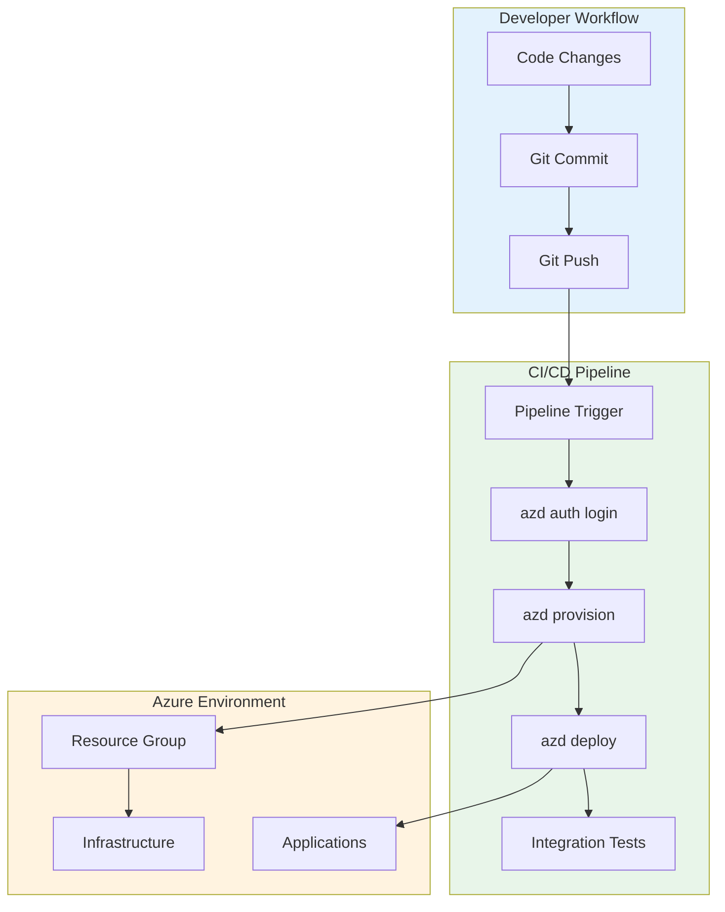
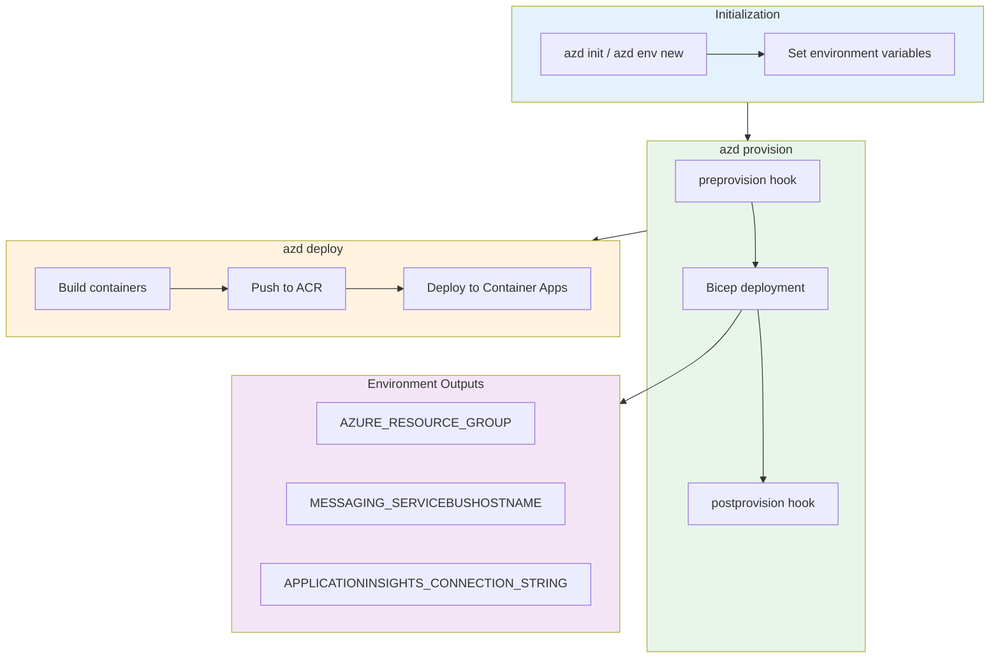
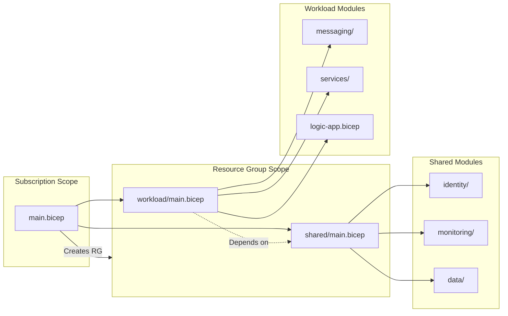

# Deployment Architecture

← [Security Architecture](06-security-architecture.md) | [Index](README.md) | [ADR Index →](adr/README.md)

## Deployment Overview

The solution uses **Azure Developer CLI (azd)** for end-to-end deployment orchestration, combining infrastructure provisioning with application deployment in a single workflow.

### Deployment Philosophy

| Principle | Implementation |
|-----------|----------------|
| **Infrastructure as Code** | All resources defined in Bicep |
| **GitOps Ready** | azd integrates with CI/CD pipelines |
| **Environment Parity** | Same IaC for all environments |
| **Automated Configuration** | Hook scripts handle post-deployment setup |

---

## Environment Topology

| Environment | Purpose | Subscription | Provisioning |
|-------------|---------|--------------|--------------|
| **local** | Developer inner loop | N/A (emulators) | `dotnet run` |
| **dev** | Integration testing | Development | `azd up --environment dev` |
| **staging** | Pre-production validation | Staging | `azd up --environment staging` |
| **prod** | Production workloads | Production | `azd up --environment prod` |

### Environment Naming Convention

Resources follow the pattern: `{resource-prefix}-{solution}-{env}-{unique-suffix}`

Example: `rg-orders-dev-eastus2`

---

## CI/CD Pipeline

### azd Workflow



### Pipeline Stages

| Stage | Purpose | azd Command | Duration |
|-------|---------|-------------|----------|
| **Auth** | Authenticate to Azure | `azd auth login --client-id ...` | ~30s |
| **Provision** | Deploy infrastructure | `azd provision` | ~10-15 min |
| **Build** | Build containers | Included in deploy | ~2-3 min |
| **Deploy** | Deploy applications | `azd deploy` | ~3-5 min |
| **Validate** | Post-deployment tests | Custom scripts | ~2-3 min |

### Quality Gates

| Gate | Check | Failure Action |
|------|-------|----------------|
| **Pre-provision** | Validate prerequisites | Block deployment |
| **Infrastructure** | Bicep deployment success | Rollback |
| **Health Check** | `/health` endpoint returns 200 | Alert + investigate |
| **Smoke Test** | Basic API operations | Alert + investigate |

---

## Azure Developer CLI Integration

### azure.yaml Configuration

```yaml
# From azure.yaml
name: azure-logicapps-monitoring
metadata:
  template: azure-logicapps-monitoring@0.0.1
infra:
  provider: bicep
  path: infra
  module: main
services:
  app:
    language: dotnet
    project: ./app.AppHost/app.AppHost.csproj
    host: containerapp
hooks:
  preprovision:
    windows:
      shell: pwsh
      run: ./hooks/preprovision.ps1 -Force -Verbose
  postprovision:
    windows:
      shell: pwsh
      run: |
        ./hooks/postprovision.ps1 -Force -Verbose
        ./hooks/Generate-Orders.ps1 -Force -Verbose
```

### Hook Scripts Inventory

| Hook | Script | Purpose | Execution |
|------|--------|---------|-----------|
| **preprovision** | `preprovision.ps1` / `.sh` | Validate workstation, clear secrets | Before `azd provision` |
| **postprovision** | `postprovision.ps1` / `.sh` | Configure user secrets, ACR login | After `azd provision` |
| **postprovision** | `Generate-Orders.ps1` / `.sh` | Create test data | After `azd provision` |

### azd Workflow Diagram



---

## Infrastructure Provisioning

### Provisioning Flow



### Resource Dependencies

| Resource | Depends On | Reason |
|----------|------------|--------|
| Application Insights | Log Analytics Workspace | Workspace-based AI |
| Service Bus | Managed Identity | RBAC assignment |
| Logic App | Storage Account, App Service Plan | Runtime requirements |
| Container Apps | Container Registry, Managed Identity | Image pull, auth |
| SQL Database | SQL Server, Managed Identity | Database hosting, auth |

### Bicep Deployment Sequence

1. **Resource Group** (subscription scope)
2. **Managed Identity** (no dependencies)
3. **Log Analytics + Storage** (parallel)
4. **Application Insights** (depends on Log Analytics)
5. **SQL Server + Database** (depends on Identity)
6. **Service Bus** (depends on Identity)
7. **Container Registry** (depends on Identity)
8. **Container Apps Environment** (depends on Log Analytics)
9. **Logic App** (depends on Storage, Identity, App Insights)

---

## Application Deployment

### Container Build Process

1. **dotnet publish**: Build .NET projects
2. **Docker build**: Create container images
3. **Docker push**: Push to Azure Container Registry
4. **Container Apps update**: Deploy new revision

### Deployment Strategies

| Strategy | Usage | Configuration |
|----------|-------|---------------|
| **Rolling Update** | Default for Container Apps | Automatic |
| **Blue-Green** | Not currently implemented | Future enhancement |
| **Canary** | Not currently implemented | Future enhancement |

### Rollback Procedures

| Scenario | Action | Command |
|----------|--------|---------|
| **Application Failure** | Revert to previous revision | `az containerapp revision activate` |
| **Infrastructure Failure** | Redeploy previous state | `azd provision` with previous commit |
| **Configuration Error** | Update environment variables | `az containerapp update` |

---

## Local Development

### Prerequisites

| Component | Version | Purpose |
|-----------|---------|---------|
| .NET SDK | 10.0+ | Application runtime |
| .NET Aspire Workload | 9.5+ | Orchestration |
| Docker Desktop | Latest | Containers and emulators |
| Azure CLI | 2.60+ | Azure management |
| azd | Latest | Deployment automation |

### Local Setup

```powershell
# 1. Clone repository
git clone https://github.com/Evilazaro/Azure-LogicApps-Monitoring.git

# 2. Install Aspire workload
dotnet workload install aspire

# 3. Start Docker Desktop

# 4. Run locally (uses emulators)
cd app.AppHost
dotnet run

# 5. Access services
# - Aspire Dashboard: https://localhost:18888
# - Web App: https://localhost:5001
# - Orders API: https://localhost:5002
```

### Emulator Configuration

| Service | Emulator | Configuration |
|---------|----------|---------------|
| SQL Database | SQL Server Container | Auto-provisioned by Aspire |
| Service Bus | Service Bus Emulator | Auto-provisioned by Aspire |
| Application Insights | Aspire Dashboard | OTLP exporter |

### Dev/Prod Parity

| Aspect | Local | Azure |
|--------|-------|-------|
| Database | SQL Server container | Azure SQL Database |
| Messaging | Service Bus emulator | Azure Service Bus |
| Telemetry | Aspire Dashboard | Application Insights |
| Identity | Azure CLI credential | Managed Identity |
| Networking | localhost | Azure VNet / Public |

---

## Deployment Checklist

### Pre-Deployment

- [ ] Azure subscription with required permissions
- [ ] Azure CLI authenticated (`az login`)
- [ ] azd authenticated (`azd auth login`)
- [ ] Docker Desktop running
- [ ] Required resource providers registered

### Post-Deployment Verification

- [ ] Resource group created with expected resources
- [ ] Container Apps healthy (replicas running)
- [ ] Health endpoints returning 200
- [ ] Application Insights receiving telemetry
- [ ] Service Bus topic and subscription created
- [ ] SQL Database accessible
- [ ] Logic App deployed and configured

---

## Related Documents

- [Technology Architecture](04-technology-architecture.md) - Azure resource details
- [Security Architecture](06-security-architecture.md) - Secret management
- [hooks/README.md](../../hooks/README.md) - Developer workflow guide
