# Deployment Architecture

← [Security Architecture](06-security-architecture.md) | [Index](README.md) | [ADR Index](adr/README.md) →

## 1. Deployment Overview

The solution uses **Azure Developer CLI (azd)** for infrastructure provisioning and application deployment, implementing Infrastructure as Code principles with Bicep templates.

**Deployment Principles**:

- **Declarative Infrastructure**: All resources defined in Bicep
- **Immutable Deployments**: Container images versioned, no in-place updates
- **Automated Provisioning**: Lifecycle hooks for configuration
- **Environment Parity**: Consistent structure across dev/staging/prod
- **GitOps Ready**: Pipeline integration for CI/CD

---

## 2. Azure Developer CLI (azd) Lifecycle

### 2.1 Deployment Phases

```mermaid
flowchart LR
    subgraph Init["🔧 Initialization"]
        AzdInit["azd init"]
        EnvConfig["Environment<br/>Configuration"]
    end

    subgraph Provision["🏗️ Provision"]
        PreProv["preprovision hook"]
        DeployInfra["azd provision<br/>(Bicep deployment)"]
        PostProv["postprovision hook"]
    end

    subgraph Deploy["🚀 Deploy"]
        BuildImages["Build Containers"]
        PushImages["Push to ACR"]
        UpdateApps["Update Container Apps"]
    end

    subgraph Runtime["▶️ Runtime"]
        Monitor["Monitoring"]
        Validate["Validation"]
    end

    AzdInit --> EnvConfig
    EnvConfig --> PreProv
    PreProv --> DeployInfra
    DeployInfra --> PostProv
    PostProv --> BuildImages
    BuildImages --> PushImages
    PushImages --> UpdateApps
    UpdateApps --> Monitor
    Monitor --> Validate

    classDef init fill:#e3f2fd,stroke:#1565c0
    classDef provision fill:#e8f5e9,stroke:#2e7d32
    classDef deploy fill:#fff3e0,stroke:#ef6c00
    classDef runtime fill:#f3e5f5,stroke:#6a1b9a

    class Init init
    class Provision provision
    class Deploy deploy
    class Runtime runtime
```



### 2.2 azd Commands

| Command           | Phase          | Purpose                    |
| ----------------- | -------------- | -------------------------- |
| `azd init`        | Initialization | Template initialization    |
| `azd up`          | Full workflow  | Provision + Deploy         |
| `azd provision`   | Infrastructure | Deploy Bicep templates     |
| `azd deploy`      | Application    | Build + push containers    |
| `azd down`        | Teardown       | Delete resource groups     |
| `azd env refresh` | Configuration  | Sync environment variables |

---

## 3. Environment Topology

### 3.1 Environment Strategy

| Environment | Purpose                   | Lifespan   | Deployment Trigger      |
| ----------- | ------------------------- | ---------- | ----------------------- |
| **dev**     | Development + Testing     | Persistent | Manual / Feature branch |
| **staging** | Pre-production validation | Persistent | PR merge to main        |
| **prod**    | Production workloads      | Persistent | Release tag             |

### 3.2 Environment Progression


### 3.3 Environment Configuration

**Configuration Source**: `.azure/{env}/.env`

| Parameter     | dev           | staging                | prod                              |
| ------------- | ------------- | ---------------------- | --------------------------------- |
| **Location**  | eastus        | eastus2                | eastus + westus (future DR)       |
| **SKU Tier**  | Basic         | Standard               | Standard                          |
| **Autoscale** | 1-2 instances | 2-5 instances          | 3-10 instances                    |
| **Alerts**    | Disabled      | Enabled (non-critical) | Enabled (all)                     |
| **Backup**    | None          | Daily (7 days)         | Daily (30 days) + geo-replication |

---

## 4. Infrastructure as Code

### 4.1 Bicep Module Hierarchy


### 4.2 Bicep Template Responsibilities

| Module                            | Scope          | Resources                                          |
| --------------------------------- | -------------- | -------------------------------------------------- |
| **main.bicep**                    | Subscription   | Resource groups, shared/workload orchestration     |
| **shared/main.bicep**             | Resource group | Managed identity, App Insights, VNet, SQL Database |
| **workload/main.bicep**           | Resource group | Container Apps, Service Bus, Logic Apps            |
| **identity/identity.bicep**       | Resource group | User-assigned managed identity, role assignments   |
| **monitoring/app-insights.bicep** | Resource group | Application Insights, Log Analytics workspace      |
| **network/vnet.bicep**            | Resource group | Virtual network, subnets, service endpoints        |
| **data/sql.bicep**                | Resource group | SQL server, database, firewall rules               |
| **services/container-apps.bicep** | Resource group | Container Apps environment, apps, ingress          |
| **messaging/service-bus.bicep**   | Resource group | Service Bus namespace, topics, subscriptions       |

### 4.3 Deployment Sequence

```mermaid
sequenceDiagram
    participant User
    participant azd
    participant ARM as Azure ARM
    participant RG as Resource Groups
    participant Shared
    participant Workload

    User->>azd: azd up
    azd->>ARM: Deploy main.bicep (subscription scope)
    ARM->>RG: Create rg-orders-{env}-shared
    ARM->>RG: Create rg-orders-{env}

    ARM->>Shared: Deploy shared/main.bicep
    Shared->>Shared: Identity → Monitoring → Network → Data
    Shared-->>ARM: Shared resources ready

    ARM->>Workload: Deploy workload/main.bicep
    Workload->>Workload: Services → Messaging → Logic Apps
    Workload-->>ARM: Workload resources ready

    ARM-->>azd: Provisioning complete
    azd->>azd: Run postprovision hook
    azd->>User: Infrastructure ready
```



---

## 5. Lifecycle Hooks

### 5.1 Hook Inventory

| Hook                            | Phase        | Purpose                          | Script                                                                         |
| ------------------------------- | ------------ | -------------------------------- | ------------------------------------------------------------------------------ |
| **preprovision**                | Before infra | Validate prerequisites           | [preprovision.ps1](../../hooks/preprovision.ps1)                               |
| **postprovision**               | After infra  | Configure secrets, initialize DB | [postprovision.ps1](../../hooks/postprovision.ps1)                             |
| **check-dev-workstation**       | Pre-flight   | Verify tools installed           | [check-dev-workstation.ps1](../../hooks/check-dev-workstation.ps1)             |
| **sql-managed-identity-config** | Post-DB      | Configure SQL AAD authentication | [sql-managed-identity-config.ps1](../../hooks/sql-managed-identity-config.ps1) |
| **clean-secrets**               | Pre-teardown | Remove local secrets             | [clean-secrets.ps1](../../hooks/clean-secrets.ps1)                             |
| **deploy-workflow**             | Post-deploy  | Deploy Logic App workflows       | [deploy-workflow.ps1](../../hooks/deploy-workflow.ps1)                         |
| **Generate-Orders**             | Testing      | Generate test orders             | [Generate-Orders.ps1](../../hooks/Generate-Orders.ps1)                         |

### 5.2 preprovision Hook

**Purpose**: Validate environment before deployment

**Key Validations**:

```powershell
# Check Azure CLI authentication
az account show

# Verify subscription access
az account set --subscription $AZURE_SUBSCRIPTION_ID

# Validate resource provider registrations
az provider register --namespace Microsoft.App
az provider register --namespace Microsoft.ServiceBus
az provider register --namespace Microsoft.Sql
```

### 5.3 postprovision Hook

**Purpose**: Initialize application configuration

**Key Operations**:

1. **Retrieve connection strings** from Azure resources
2. **Configure .NET User Secrets** for local development
3. **Run EF Core migrations** to initialize SQL database
4. **Create Service Bus topic/subscription** if not exists
5. **Upload sample data** (optional)

**Example**:

```powershell
# Get Application Insights connection string
$appInsightsConnectionString = az monitor app-insights component show `
    --app $appInsightsName `
    --resource-group $resourceGroupName `
    --query connectionString -o tsv

# Set user secret
dotnet user-secrets set "ApplicationInsights:ConnectionString" $appInsightsConnectionString `
    --project "src/eShop.Orders.API/eShop.Orders.API.csproj"

# Run EF migrations
dotnet ef database update --project "src/eShop.Orders.API"
```

---

## 6. CI/CD Pipeline Architecture

### 6.1 Pipeline Stages (Future)

```mermaid
flowchart LR
    subgraph Build["🔨 Build Stage"]
        Compile["Compile .NET"]
        Test["Unit Tests"]
        Scan["Security Scan"]
    end

    subgraph Provision["🏗️ Provision Stage"]
        ValidateBicep["Validate Bicep"]
        WhatIf["What-If Analysis"]
        DeployInfra["Deploy Infrastructure"]
    end

    subgraph Deploy["🚀 Deploy Stage"]
        BuildImages["Build Container Images"]
        PushACR["Push to ACR"]
        UpdateCAE["Update Container Apps"]
    end

    subgraph Validate["✅ Validate Stage"]
        HealthCheck["Health Check"]
        SmokeTest["Smoke Tests"]
        Notify["Notify Team"]
    end

    Compile --> Test
    Test --> Scan
    Scan --> ValidateBicep
    ValidateBicep --> WhatIf
    WhatIf --> DeployInfra
    DeployInfra --> BuildImages
    BuildImages --> PushACR
    PushACR --> UpdateCAE
    UpdateCAE --> HealthCheck
    HealthCheck --> SmokeTest
    SmokeTest --> Notify

    classDef build fill:#e3f2fd,stroke:#1565c0
    classDef provision fill:#e8f5e9,stroke:#2e7d32
    classDef deploy fill:#fff3e0,stroke:#ef6c00
    classDef validate fill:#f3e5f5,stroke:#6a1b9a

    class Build build
    class Provision provision
    class Deploy deploy
    class Validate validate
```



### 6.2 Deployment Automation

| Tool                         | Purpose             | Configuration                                           |
| ---------------------------- | ------------------- | ------------------------------------------------------- |
| **GitHub Actions**           | CI/CD orchestration | [.github/workflows/](../../.github/workflows/) (future) |
| **Azure Developer CLI**      | azd tasks           | [azure.yaml](../../azure.yaml)                          |
| **Docker**                   | Container builds    | Dockerfiles in service projects                         |
| **Azure Container Registry** | Image repository    | Created by azd provision                                |

---

## 7. Rollback Strategy

### 7.1 Rollback Mechanisms

| Component          | Mechanism                               | Recovery Time |
| ------------------ | --------------------------------------- | ------------- |
| **Container Apps** | Revision management (previous revision) | < 5 min       |
| **Infrastructure** | Bicep redeployment (previous commit)    | 15-20 min     |
| **Database**       | Backup restore (point-in-time)          | 30-60 min     |
| **Logic Apps**     | Workflow version revert                 | < 5 min       |

### 7.2 Rollback Procedure

```mermaid
flowchart TD
    Incident["🚨 Incident Detected"]
    Assess["Assess Impact"]
    Decision{"Rollback<br/>Required?"}

    RollbackApp["Rollback Container App<br/>(Previous Revision)"]
    RollbackInfra["Rollback Infrastructure<br/>(Git revert + azd up)"]
    RollbackDB["Restore Database<br/>(Point-in-time restore)"]

    Validate["Validate Health Checks"]
    Notify["Notify Stakeholders"]
    PostMortem["Post-Mortem Analysis"]

    Incident --> Assess
    Assess --> Decision
    Decision -->|Yes| RollbackApp
    Decision -->|No| Notify

    RollbackApp --> Validate
    RollbackInfra --> Validate
    RollbackDB --> Validate

    Validate --> Notify
    Notify --> PostMortem

    classDef incident fill:#ffebee,stroke:#c62828
    classDef action fill:#e3f2fd,stroke:#1565c0
    classDef validate fill:#e8f5e9,stroke:#2e7d32

    class Incident incident
    class RollbackApp,RollbackInfra,RollbackDB action
    class Validate,Notify validate
```



---

## 8. Deployment Validation

### 8.1 Validation Checklist

| Check                       | Method                  | Success Criteria                   |
| --------------------------- | ----------------------- | ---------------------------------- |
| **Infrastructure Deployed** | azd provision output    | Exit code 0, all resources created |
| **Services Running**        | Health checks           | 200 OK from `/health`              |
| **Database Accessible**     | EF Core connection test | Migrations applied successfully    |
| **Service Bus Connected**   | Message send test       | Message delivered to topic         |
| **Observability Enabled**   | App Insights query      | Telemetry flowing within 5 min     |
| **Logic App Triggered**     | Manual test message     | Workflow completes successfully    |

### 8.2 Post-Deployment Tests

**Execute via**: [Generate-Orders.ps1](../../hooks/Generate-Orders.ps1)

```powershell
# Create test order
$order = @{
    customerName = "Test Customer"
    orderItems = @(
        @{ productName = "Widget"; quantity = 2; price = 19.99 }
    )
    totalAmount = 39.98
} | ConvertTo-Json

$response = Invoke-RestMethod -Uri "https://<api-url>/api/orders" `
    -Method POST `
    -Body $order `
    -ContentType "application/json"

# Verify order created
Write-Output "Order ID: $($response.orderId)"

# Wait for Service Bus message processing
Start-Sleep -Seconds 30

# Check Logic App execution
az logicapp show --name "logicapp-orders-dev" --resource-group "rg-orders-dev"
```

---

## 9. Disaster Recovery

### 9.1 Backup Strategy

| Resource                 | Backup Method              | Frequency  | Retention                     |
| ------------------------ | -------------------------- | ---------- | ----------------------------- |
| **SQL Database**         | Automated backups          | Continuous | 7 days (dev) / 30 days (prod) |
| **Service Bus**          | Geo-replication (future)   | Real-time  | N/A                           |
| **Application Insights** | Continuous export (future) | Real-time  | 90 days                       |
| **Infrastructure**       | Git repository             | On commit  | Indefinite                    |

### 9.2 Recovery Time Objectives

| Component        | RTO      | RPO                     | Strategy              |
| ---------------- | -------- | ----------------------- | --------------------- |
| **Web App**      | < 15 min | 0 (stateless)           | Redeploy from ACR     |
| **Orders API**   | < 15 min | 0 (stateless)           | Redeploy from ACR     |
| **SQL Database** | < 1 hour | < 1 hour                | Point-in-time restore |
| **Logic Apps**   | < 30 min | 0 (workflow definition) | Redeploy from Git     |

---

## 10. Configuration Management

### 10.1 Configuration Sources

| Source                     | Environment | Scope                        | Precedence  |
| -------------------------- | ----------- | ---------------------------- | ----------- |
| **appsettings.json**       | All         | Base configuration           | 1 (lowest)  |
| **appsettings.{env}.json** | Specific    | Environment overrides        | 2           |
| **.NET User Secrets**      | Local only  | Secrets + connection strings | 3           |
| **Environment Variables**  | Azure       | Runtime configuration        | 4 (highest) |

### 10.2 Configuration by Layer

| Configuration            | Local (User Secrets)                   | Azure (Environment Variables)           |
| ------------------------ | -------------------------------------- | --------------------------------------- |
| **Application Insights** | `ApplicationInsights:ConnectionString` | `APPLICATIONINSIGHTS_CONNECTION_STRING` |
| **SQL Connection**       | `ConnectionStrings:OrdersDb`           | `AZURE_SQL_CONNECTION_STRING`           |
| **Service Bus**          | `ServiceBus:HostName`                  | `AZURE_SERVICEBUS_HOSTNAME`             |
| **Aspire Dashboard**     | `DOTNET_DASHBOARD_OTLP_ENDPOINT_URL`   | N/A (not used in Azure)                 |

---

## Cross-Architecture Relationships

| Related Architecture           | Connection                     | Reference                                                                          |
| ------------------------------ | ------------------------------ | ---------------------------------------------------------------------------------- |
| **Technology Architecture**    | Infrastructure components      | [Technology Architecture](04-technology-architecture.md)                           |
| **Security Architecture**      | Managed identity configuration | [Security Architecture](06-security-architecture.md#managed-identity-architecture) |
| **Observability Architecture** | Monitoring configuration       | [Observability Architecture](05-observability-architecture.md)                     |

---

← [Security Architecture](06-security-architecture.md) | [Index](README.md) | [ADR Index](adr/README.md) →
