# 🚀 Deployment Architecture

> [!NOTE]
> **Target Audience:** DevOps Engineers, Platform Engineers, Release Managers  
> **Reading Time:** ~20 minutes

<details>
<summary>📖 <strong>Navigation</strong></summary>

| Previous                                               |       Index        |                    Next |
| :----------------------------------------------------- | :----------------: | ----------------------: |
| [← Security Architecture](06-security-architecture.md) | [Index](README.md) | [ADRs →](adr/README.md) |

</details>

---

## 📑 Table of Contents

- [📊 Overview](#-overview)
- [🗺️ Architecture Diagram](#️-architecture-diagram)
- [🔄 Deployment Pipeline](#-deployment-pipeline)
- [📜 Infrastructure as Code](#-infrastructure-as-code)
- [🔑 Authentication Architecture](#-authentication-architecture)
- [🛡️ Security Considerations](#️-security-considerations)
- [🌍 Deployment Environments](#-deployment-environments)
- [📊 Monitoring and Observability](#-monitoring-and-observability)
- [↩️ Rollback Procedures](#️-rollback-procedures)
- [🔗 Related Documentation](#-related-documentation)

---

## 📊 Overview

This document describes the deployment architecture for the Azure Logic Apps Monitoring solution, including the CI/CD pipelines, infrastructure provisioning, and deployment processes.

<div align="right"><a href="#-table-of-contents">⬆️ Back to top</a></div>

## 🗺️ Architecture Diagram


<div align="right"><a href="#-table-of-contents">⬆️ Back to top</a></div>

## 🔄 Deployment Pipeline

### 📦 Pipeline Stages

The deployment pipeline consists of two main workflows:

| Stage  | Workflow        | Description                             |
| ------ | --------------- | --------------------------------------- |
| **CI** | `ci-dotnet.yml` | Build, test, analyze, and security scan |
| **CD** | `azure-dev.yml` | Provision infrastructure and deploy     |

### 🛠️ CI Stage Details

```mermaid
---
title: CI Stage Details
---
flowchart LR
    %% ===== CI PIPELINE =====
    subgraph CI["CI Pipeline"]
        direction TB

        %% ===== CROSS-PLATFORM MATRIX =====
        subgraph Matrix["Cross-Platform Matrix"]
            U[Ubuntu]
            W[Windows]
            M[macOS]
        end

        BUILD["🔨 Build"] -->|"produces"| TEST["🧪 Test"]
        BUILD -->|"feeds"| ANALYZE["🔍 Analyze"]
        BUILD -->|"feeds"| CODEQL["🛡️ CodeQL"]

        Matrix -->|"runs on"| BUILD
    end

    %% ===== OUTPUTS =====
    subgraph Outputs["Outputs"]
        ARTIFACTS[Build Artifacts]
        COVERAGE[Code Coverage]
        SARIF[Security Report]
    end

    TEST -->|"generates"| ARTIFACTS
    TEST -->|"generates"| COVERAGE
    CODEQL -->|"generates"| SARIF

    %% ===== CLASS DEFINITIONS (EXACT HEX COLORS) =====
    classDef primary fill:#4F46E5,stroke:#3730A3,color:#FFFFFF
    classDef secondary fill:#10B981,stroke:#059669,color:#FFFFFF
    classDef datastore fill:#F59E0B,stroke:#D97706,color:#000000
    classDef trigger fill:#818CF8,stroke:#4F46E5,color:#FFFFFF
    classDef failed fill:#F44336,stroke:#C62828,color:#FFFFFF

    class BUILD,TEST,ANALYZE secondary
    class CODEQL failed
    class U,W,M trigger
    class ARTIFACTS,COVERAGE,SARIF datastore

    %% ===== SUBGRAPH STYLES =====
    style CI fill:#ECFDF5,stroke:#10B981,stroke-width:2px
    style Matrix fill:#EEF2FF,stroke:#4F46E5,stroke-width:2px
    style Outputs fill:#FEF3C7,stroke:#F59E0B,stroke-width:2px
```



| Job     | Purpose                                | Platforms              |
| ------- | -------------------------------------- | ---------------------- |
| Build   | Compile solution with versioning       | Ubuntu, Windows, macOS |
| Test    | Execute tests with coverage collection | Ubuntu, Windows, macOS |
| Analyze | Verify code formatting compliance      | Ubuntu                 |
| CodeQL  | Security vulnerability scanning        | Ubuntu                 |

### 🚀 CD Stage Details


| Phase          | Purpose                                  |
| -------------- | ---------------------------------------- |
| Authentication | OIDC-based authentication with Azure     |
| Provision      | Create/update Azure resources via Bicep  |
| SQL Config     | Configure managed identity access to SQL |
| Deploy         | Deploy application containers            |

<div align="right"><a href="#-table-of-contents">⬆️ Back to top</a></div>

## 📜 Infrastructure as Code

### 📁 Bicep Structure

```text
infra/
├── main.bicep                 # Entry point
├── main.parameters.json       # Parameters
├── types.bicep                # Type definitions
├── shared/
│   ├── main.bicep             # Shared resources orchestrator
│   ├── data/                  # Data resources
│   ├── identity/              # Identity resources
│   ├── monitoring/            # Monitoring resources
│   └── network/               # Network resources
└── workload/
    ├── main.bicep             # Workload orchestrator
    ├── logic-app.bicep        # Logic App resources
    ├── messaging/             # Service Bus
    └── services/              # Container Apps
```

### ☁️ Azure Resources Provisioned

| Resource Type              | Purpose                                 |
| -------------------------- | --------------------------------------- |
| Container Apps Environment | Hosting platform for containerized apps |
| Container Apps             | Orders API and Web App services         |
| Azure SQL Database         | Order data persistence                  |
| Service Bus                | Message queue for order processing      |
| Managed Identity           | Secure authentication without secrets   |
| Log Analytics Workspace    | Centralized logging                     |
| Application Insights       | Application performance monitoring      |
| Virtual Network            | Network isolation                       |

<div align="right"><a href="#-table-of-contents">⬆️ Back to top</a></div>

## 🔑 Authentication Architecture

### 🔄 OIDC Federation

> [!TIP]
> OIDC federation eliminates the need for storing Azure credentials in GitHub secrets, providing a more secure deployment model.

The deployment uses OpenID Connect (OIDC) for secure, secretless authentication:


### ⚙️ Required Configuration

| Component            | Configuration                                                 |
| -------------------- | ------------------------------------------------------------- |
| Azure AD App         | App registration with federated credential                    |
| Federated Credential | Bound to repository, branch, environment                      |
| GitHub Variables     | `AZURE_CLIENT_ID`, `AZURE_TENANT_ID`, `AZURE_SUBSCRIPTION_ID` |
| GitHub Environment   | `dev` environment with protection rules                       |

<div align="right"><a href="#-table-of-contents">⬆️ Back to top</a></div>

## 🛡️ Security Considerations

### 🔐 Pipeline Security

| Measure                   | Implementation                              |
| ------------------------- | ------------------------------------------- |
| Secretless Authentication | OIDC federation with Azure                  |
| Pinned Action Versions    | SHA-based pinning for supply chain security |
| Code Scanning             | CodeQL on every CI run                      |
| Dependency Updates        | Dependabot automated PRs                    |
| Least Privilege           | Minimal permissions in workflow             |

### 🛡️ Runtime Security

| Measure             | Implementation                         |
| ------------------- | -------------------------------------- |
| Managed Identity    | No credentials stored in app           |
| Network Isolation   | Virtual network with private endpoints |
| SQL Authentication  | Entra ID (Azure AD) only               |
| Container Isolation | Azure Container Apps environment       |

<div align="right"><a href="#-table-of-contents">⬆️ Back to top</a></div>

## 🌍 Deployment Environments

### ⚙️ Environment Configuration

| Environment | Trigger                   | Protection Rules   |
| ----------- | ------------------------- | ------------------ |
| `dev`       | Push to configured branch | None (auto-deploy) |

### 📋 Environment Variables

| Variable                  | Description                   |
| ------------------------- | ----------------------------- |
| `AZURE_ENV_NAME`          | Environment identifier        |
| `AZURE_LOCATION`          | Azure region                  |
| `DEPLOYER_PRINCIPAL_TYPE` | Principal type for deployment |
| `DEPLOY_HEALTH_MODEL`     | Health model configuration    |

<div align="right"><a href="#-table-of-contents">⬆️ Back to top</a></div>

## 📊 Monitoring and Observability

### 👁️ Pipeline Monitoring

- **GitHub Actions UI**: Real-time workflow execution status
- **Workflow Summaries**: Detailed Markdown reports per job
- **Artifacts**: Build outputs, test results, coverage reports
- **Security Tab**: CodeQL findings and SARIF results

### 📱 Application Monitoring

- **Application Insights**: Distributed tracing and metrics
- **Log Analytics**: Centralized log aggregation
- **Azure Monitor**: Resource health and alerts
- **Container Apps Metrics**: Container-level telemetry

<div align="right"><a href="#-table-of-contents">⬆️ Back to top</a></div>

## ↩️ Rollback Procedures

> [!CAUTION]
> Always verify the health of the application after rollback. Ensure database migrations are backward-compatible before proceeding.

### 📦 Application Rollback

```bash
# Option 1: Re-deploy previous commit
gh workflow run azure-dev.yml --ref <previous-commit>

# Option 2: Use azd locally
git checkout <previous-commit>
azd deploy
```

### 🏗️ Infrastructure Rollback

```bash
# Azure resources maintain deployment history
# Use Azure portal or CLI to review and rollback

# View deployment history
az deployment group list --resource-group <rg-name>

# Redeploy specific deployment
az deployment group create --template-file infra/main.bicep \
  --parameters @infra/main.parameters.json
```

<div align="right"><a href="#-table-of-contents">⬆️ Back to top</a></div>

## 🔗 Related Documentation

- [Architecture Overview](README.md) - Documentation navigation
- [Security Architecture](06-security-architecture.md) - OIDC and identity details
- [Observability Architecture](05-observability-architecture.md) - Monitoring integration
- [Technology Architecture](04-technology-architecture.md) - Platform components
- [DevOps Documentation](../devops/README.md) - Detailed workflow documentation
- [CI Workflow](../devops/ci-dotnet.md) - Build and test pipeline
- [CD Workflow](../devops/azure-dev.md) - Deployment pipeline
- [Azure Developer CLI](https://learn.microsoft.com/azure/developer/azure-developer-cli/)

---

<div align="center">

| Previous                                               |       Index        |                    Next |
| :----------------------------------------------------- | :----------------: | ----------------------: |
| [← Security Architecture](06-security-architecture.md) | [Index](README.md) | [ADRs →](adr/README.md) |

</div>

---

_Last Updated: January 2026_
