# Deployment Architecture

[← Security Architecture](06-security-architecture.md) | **Deployment Architecture** | [ADR Index →](adr/README.md)

---

## 1. Deployment Principles

### Core Principles

| #       | Principle                     | Implementation                                | Benefit                                       |
| ------- | ----------------------------- | --------------------------------------------- | --------------------------------------------- |
| **D-1** | **Infrastructure as Code**    | Bicep templates for all Azure resources       | Repeatable, version-controlled infrastructure |
| **D-2** | **Declarative Configuration** | `azure.yaml` defines all deployment artifacts | Single source of truth                        |
| **D-3** | **Environment Parity**        | Parameterized Bicep with environment toggles  | Consistent dev/staging/prod                   |
| **D-4** | **Immutable Deployments**     | Container images with version tags            | Predictable rollbacks                         |
| **D-5** | **Automated Validation**      | Pre-provision hooks validate prerequisites    | Fail fast before resource creation            |

### Deployment Model

| Aspect                | Choice                    | Rationale                               |
| --------------------- | ------------------------- | --------------------------------------- |
| **IaC Tool**          | Azure Bicep               | Native Azure integration, strong typing |
| **Orchestration**     | Azure Developer CLI (azd) | End-to-end workflow automation          |
| **Container Runtime** | Azure Container Apps      | Serverless scale, Aspire-native         |
| **Workflow Engine**   | Logic Apps Standard       | Event-driven, scalable workflows        |
| **CI/CD**             | GitHub Actions (optional) | azd-compatible, Azure-integrated        |

---

## 2. Environment Topology

### Environment Matrix

| Environment     | Purpose               | Infrastructure           | Data                               | Lifecycle        |
| --------------- | --------------------- | ------------------------ | ---------------------------------- | ---------------- |
| **Local**       | Developer workstation | Emulators + User Secrets | SQLite/SQL LocalDB                 | Per-developer    |
| **Development** | Integration testing   | Azure (minimal SKUs)     | SQL Basic, Service Bus Basic       | Feature branch   |
| **Production**  | Live workloads        | Azure (standard SKUs)    | SQL Standard, Service Bus Standard | Protected branch |

### Environment Configuration

```mermaid
flowchart TB
    subgraph Local["🏠 Local Development"]
        Aspire["Aspire Dashboard"]
        Emulators["Azure Emulators"]
        LocalDB["Local Database"]
    end

    subgraph Dev["🔧 Development"]
        DevRG["Resource Group: orders-dev-rg"]
        DevACA["Container Apps (B1)"]
        DevSQL["SQL Basic (5 DTU)"]
        DevSB["Service Bus Basic"]
    end

    subgraph Prod["🚀 Production"]
        ProdRG["Resource Group: orders-prod-rg"]
        ProdACA["Container Apps (Standard)"]
        ProdSQL["SQL Standard (10 DTU)"]
        ProdSB["Service Bus Standard"]
    end

    Local -->|"azd provision"| Dev
    Dev -->|"azd provision"| Prod

    classDef local fill:#fff3e0,stroke:#ef6c00,stroke-width:2px
    classDef dev fill:#e3f2fd,stroke:#1565c0,stroke-width:2px
    classDef prod fill:#e8f5e9,stroke:#2e7d32,stroke-width:2px

    class Aspire,Emulators,LocalDB local
    class DevRG,DevACA,DevSQL,DevSB dev
    class ProdRG,ProdACA,ProdSQL,ProdSB prod
```



### Resource Naming Convention

| Resource Type   | Pattern                      | Example                 |
| --------------- | ---------------------------- | ----------------------- |
| Resource Group  | `{name}-{env}-{location}-rg` | `orders-dev-eastus2-rg` |
| Container App   | `{name}-{service}`           | `orders-api`            |
| Logic App       | `{name}-logicapp`            | `orders-logicapp`       |
| Service Bus     | `{name}-sb`                  | `orders-sb`             |
| Storage Account | `{name}st{random}`           | `ordersst7x2k`          |
| SQL Server      | `{name}-sql`                 | `orders-sql`            |

---

## 3. CI/CD Pipeline

### Azure Developer CLI Workflow

```mermaid
flowchart LR
    subgraph Developer["👨‍💻 Developer"]
        Code["Code Changes"]
        PR["Pull Request"]
    end

    subgraph AZD["🔄 azd Workflow"]
        Auth["azd auth login"]
        Init["azd init"]
        Provision["azd provision"]
        Deploy["azd deploy"]
    end

    subgraph Hooks["⚡ Lifecycle Hooks"]
        PreProv["preprovision.ps1"]
        PostProv["postprovision.ps1"]
        PreDeploy["deploy-workflow.ps1"]
    end

    subgraph Azure["☁️ Azure"]
        Infra["Infrastructure"]
        Apps["Container Apps"]
        LogicApps["Logic Apps"]
    end

    Code --> PR --> Auth
    Auth --> Init --> Provision
    Provision --> Deploy

    PreProv -->|"Before"| Provision
    PostProv -->|"After"| Provision
    PreDeploy -->|"Before"| Deploy

    Provision --> Infra
    Deploy --> Apps
    Deploy --> LogicApps

    classDef dev fill:#fff3e0,stroke:#ef6c00,stroke-width:2px
    classDef azd fill:#e3f2fd,stroke:#1565c0,stroke-width:2px
    classDef hook fill:#fce4ec,stroke:#c2185b,stroke-width:2px
    classDef azure fill:#e8f5e9,stroke:#2e7d32,stroke-width:2px

    class Code,PR dev
    class Auth,Init,Provision,Deploy azd
    class PreProv,PostProv,PreDeploy hook
    class Infra,Apps,LogicApps azure
```



### azd Commands Reference

| Command         | Purpose                    | Hooks Triggered                            |
| --------------- | -------------------------- | ------------------------------------------ |
| `azd init`      | Initialize azd environment | None                                       |
| `azd provision` | Deploy infrastructure      | preprovision → [provision] → postprovision |
| `azd deploy`    | Deploy application code    | predeploy → [deploy] → postdeploy          |
| `azd up`        | Provision + Deploy         | All hooks                                  |
| `azd down`      | Delete all resources       | None                                       |
| `azd env list`  | List environments          | None                                       |

---

## 4. Infrastructure as Code Structure

### Bicep Module Hierarchy


### Module Responsibilities

| Module                       | Scope          | Resources                                         | Dependencies        |
| ---------------------------- | -------------- | ------------------------------------------------- | ------------------- |
| **infra/main.bicep**         | Subscription   | Resource Group                                    | None                |
| **shared/main.bicep**        | Resource Group | Shared services orchestration                     | Resource Group      |
| **shared/identity**          | Resource Group | Managed Identity, RBAC role assignments           | None                |
| **shared/monitoring**        | Resource Group | Log Analytics, App Insights, Health Model         | Identity            |
| **shared/network**           | Resource Group | VNet, Subnets (API, Data, Logic App)              | None                |
| **shared/data**              | Resource Group | Storage Accounts, SQL Server, Private Endpoints   | Identity, Network   |
| **workload/main.bicep**      | Resource Group | Workload services orchestration                   | Shared              |
| **workload/messaging**       | Resource Group | Service Bus Namespace, Topics, Subscriptions      | Identity            |
| **workload/services**        | Resource Group | Container Registry, Container Apps Environment    | Identity, Messaging |
| **workload/logic-app.bicep** | Resource Group | App Service Plan, Logic App, API Connections      | Identity, Messaging |

### Key Bicep Parameters

| Parameter                    | Type   | Default  | Description                        |
| ---------------------------- | ------ | -------- | ---------------------------------- |
| `environmentName`            | string | Required | Environment identifier (dev, prod) |
| `location`                   | string | Required | Azure region                       |
| `principalId`                | string | Required | Deployer's principal ID            |
| `useLocalEmulator`           | bool   | `false`  | Use local emulators                |
| `containerAppsEnvironmentId` | string | ''       | Pre-existing CAE (optional)        |

> **Reference:** [infra/main.bicep](../../infra/main.bicep)

---

## 5. Deployment Hooks

### Hook Inventory

| Hook              | File                                                   | Trigger                | Purpose                          |
| ----------------- | ------------------------------------------------------ | ---------------------- | -------------------------------- |
| **preprovision**  | [preprovision.ps1](../../hooks/preprovision.ps1)       | Before `azd provision` | Validate prerequisites           |
| **postprovision** | [postprovision.ps1](../../hooks/postprovision.ps1)     | After `azd provision`  | Configure secrets, generate data |
| **predeploy**     | [deploy-workflow.ps1](../../hooks/deploy-workflow.ps1) | Before `azd deploy`    | Deploy Logic Apps workflows      |

### preprovision Hook

**Purpose:** Validate development workstation has required tools and configuration.

**Validations:**

- Azure CLI installed and logged in
- Azure Developer CLI version ≥ 1.11.0
- .NET SDK 10.0+
- Azure Functions Core Tools (optional)
- Required VS Code extensions

```powershell
# Key operations
./hooks/preprovision.ps1 -Force -Verbose

# Checks performed:
# 1. Azure CLI (az) availability
# 2. Azure Developer CLI (azd) version
# 3. .NET SDK version
# 4. Active Azure subscription
```

### postprovision Hook

**Purpose:** Configure local development environment after infrastructure deployment.

**Operations:**

1. Extract deployment outputs (connection strings, endpoints)
2. Configure .NET User Secrets for local development
3. Generate sample order data
4. Configure SQL managed identity access

```powershell
# Key operations
./hooks/postprovision.ps1 -Force -Verbose

# Sets user secrets:
# - ConnectionStrings:OrderDb
# - Azure:ServiceBus:HostName
# - Azure:ApplicationInsights:ConnectionString
```

### predeploy Hook (deploy-workflow)

**Purpose:** Deploy Logic Apps workflow definitions.

**Operations:**

1. Compress workflow definitions
2. Deploy via Azure CLI / REST API
3. Configure API connections with managed identity

```powershell
# Key operations
./hooks/deploy-workflow.ps1

# Deploys workflows from:
# - workflows/OrdersManagement/
```

---

## 6. Local Development Setup

### Prerequisites

| Tool                | Version  | Purpose                      |
| ------------------- | -------- | ---------------------------- |
| .NET SDK            | 10.0+    | Build and run applications   |
| Azure CLI           | Latest   | Azure authentication         |
| Azure Developer CLI | ≥ 1.11.0 | Environment orchestration    |
| VS Code             | Latest   | IDE with extensions          |
| Docker Desktop      | Latest   | Container runtime (optional) |

### Quick Start

```bash
# 1. Clone and navigate
git clone <repository-url>
cd azure-logicapps-monitoring

# 2. Authenticate with Azure
azd auth login

# 3. Initialize environment
azd init

# 4. Provision infrastructure (includes preprovision + postprovision hooks)
azd provision

# 5. Run locally with Aspire
dotnet run --project app.AppHost
```

### Local vs Azure Mode

| Aspect            | Local Mode               | Azure Mode            |
| ----------------- | ------------------------ | --------------------- |
| **Database**      | SQL LocalDB or Azure SQL | Azure SQL             |
| **Service Bus**   | Emulator (optional)      | Azure Service Bus     |
| **Storage**       | Azurite or Azure         | Azure Storage         |
| **App Insights**  | Connection string        | Managed Identity      |
| **Configuration** | User Secrets             | Environment variables |

```csharp
// AppHost.cs configuration pattern
var builder = DistributedApplication.CreateBuilder(args);

// Conditional Azure vs local configuration
if (builder.ExecutionContext.IsRunMode)
{
    // Local development with emulators
}
else
{
    // Azure deployment with managed identity
}
```

---

## 7. Deployment Troubleshooting

### Common Issues

| Issue                         | Cause                           | Resolution                                            |
| ----------------------------- | ------------------------------- | ----------------------------------------------------- |
| `azd provision` fails on RBAC | Insufficient permissions        | Ensure Contributor + User Access Administrator        |
| Container App fails to start  | Missing environment variables   | Check `azd env get-values`                            |
| Logic App workflow not found  | Workflow not deployed           | Run `deploy-workflow.ps1` manually                    |
| Database connection fails     | Managed identity not configured | Run SQL MI configuration hook                         |
| Hooks not executing           | PowerShell execution policy     | `Set-ExecutionPolicy -Scope CurrentUser RemoteSigned` |

### Diagnostic Commands

```bash
# View environment configuration
azd env get-values

# Check deployment status
az deployment sub show --name <deployment-name>

# View Container App logs
az containerapp logs show --name orders-api --resource-group <rg>

# Test Logic App workflow
az logic workflow show --name orders-logicapp --resource-group <rg>
```

---

## 8. Rollback Strategy

### Rollback Procedures

| Scenario                  | Rollback Method                   | RTO       |
| ------------------------- | --------------------------------- | --------- |
| **Infrastructure change** | Redeploy previous Bicep version   | 15-30 min |
| **Application code**      | Redeploy previous container image | 5-10 min  |
| **Logic App workflow**    | Redeploy previous workflow.json   | 2-5 min   |
| **Database schema**       | EF Core migration rollback        | 10-20 min |

### Rollback Commands

```bash
# Rollback to previous container image
az containerapp update --name orders-api \
  --resource-group <rg> \
  --image <previous-image-tag>

# Rollback infrastructure (requires git)
git checkout <previous-commit> -- infra/
azd provision
```

---

## 9. Cross-Architecture Relationships

| Related Architecture           | Connection                    | Reference                                                                        |
| ------------------------------ | ----------------------------- | -------------------------------------------------------------------------------- |
| **Technology Architecture**    | IaC structure, Azure services | [Platform Decomposition](04-technology-architecture.md#3-platform-decomposition) |
| **Security Architecture**      | Secret management in hooks    | [Secret Management](06-security-architecture.md#4-secret-management)             |
| **Application Architecture**   | Service deployment targets    | [Service Catalog](03-application-architecture.md#2-service-catalog)              |
| **Observability Architecture** | Deployment monitoring         | [Alerting Rules](05-observability-architecture.md#7-alerting-rules)              |

---

**Next:** [ADR Index →](adr/README.md)
