# Deployment Architecture

← [Security Architecture](06-security-architecture.md) | [Index](README.md) | [ADRs →](adr/README.md)

---

## Deployment Architecture Overview

The solution uses **Azure Developer CLI (azd)** for deployment orchestration with **Bicep** as the Infrastructure as Code language. This enables repeatable, auditable deployments from local development to production.

---

## Deployment Principles

| Principle | Statement | Implementation |
|-----------|-----------|----------------|
| **Infrastructure as Code** | All infrastructure defined declaratively | Bicep templates in `infra/` |
| **Repeatable Deployments** | Same code produces same environment | azd with parameterized Bicep |
| **Environment Parity** | Dev/Test/Prod structurally identical | Shared templates, environment-specific params |
| **Automated Pipeline** | CI/CD for all changes | azd lifecycle hooks |
| **Rollback Capability** | Quick recovery from failed deployments | Container versioning, IaC state |

---

## Environment Model

```mermaid
flowchart LR
    subgraph Local["💻 Local Development"]
        Aspire["🎯 .NET Aspire"]
        Containers["📦 Local Containers"]
    end

    subgraph Azure["☁️ Azure Environments"]
        Dev["🔧 Development"]
        Staging["🧪 Staging"]
        Prod["🚀 Production"]
    end

    Local -->|"azd deploy"| Dev
    Dev -->|"Promote"| Staging
    Staging -->|"Promote"| Prod

    classDef local fill:#e3f2fd,stroke:#1565c0
    classDef azure fill:#e8f5e9,stroke:#2e7d32

    class Aspire,Containers local
    class Dev,Staging,Prod azure
```



### Environment Configuration

| Environment | Purpose | Infrastructure | Data |
|-------------|---------|----------------|------|
| **Local** | Development | .NET Aspire, containers | Local SQL, Service Bus emulator |
| **Development** | Integration testing | Azure PaaS (minimal SKUs) | Test data |
| **Staging** | Pre-production validation | Azure PaaS (prod-like) | Anonymized data |
| **Production** | Live workloads | Azure PaaS (scaled) | Production data |

---

## Azure Developer CLI (azd) Workflow

### azd Commands

| Command | Purpose | Triggers |
|---------|---------|----------|
| `azd init` | Initialize azd project | Initial setup |
| `azd provision` | Create Azure infrastructure | Infrastructure changes |
| `azd deploy` | Deploy application code | Code changes |
| `azd up` | Provision + Deploy | Full deployment |
| `azd down` | Destroy environment | Cleanup |

### azd Lifecycle

```mermaid
flowchart TB
    subgraph Init["🚀 Initialization"]
        AzdInit["azd init"]
    end

    subgraph Provision["📦 Provisioning"]
        PreProvision["preprovision hook"]
        BicepDeploy["Bicep Deployment"]
        PostProvision["postprovision hook"]
    end

    subgraph Deploy["🚢 Deployment"]
        Build["Build Applications"]
        Push["Push to ACR"]
        Update["Update Container Apps"]
    end

    AzdInit --> PreProvision
    PreProvision --> BicepDeploy
    BicepDeploy --> PostProvision
    PostProvision --> Build
    Build --> Push
    Push --> Update

    classDef init fill:#e3f2fd,stroke:#1565c0
    classDef provision fill:#fff3e0,stroke:#ef6c00
    classDef deploy fill:#e8f5e9,stroke:#2e7d32

    class AzdInit init
    class PreProvision,BicepDeploy,PostProvision provision
    class Build,Push,Update deploy
```



---

## azure.yaml Configuration

```yaml
name: app
metadata:
  template: azd-init@1.11.0

services:
  orders-api:
    project: ./src/eShop.Orders.API
    host: containerapp
    language: dotnet
  
  web-app:
    project: ./src/eShop.Web.App
    host: containerapp
    language: dotnet

hooks:
  preprovision:
    posix:
      shell: sh
      run: ./hooks/preprovision.sh
    windows:
      shell: pwsh
      run: ./hooks/preprovision.ps1
  
  postprovision:
    posix:
      shell: sh
      run: ./hooks/postprovision.sh
    windows:
      shell: pwsh
      run: ./hooks/postprovision.ps1
```

---

## Lifecycle Hooks

### preprovision Hook

**Purpose:** Validate prerequisites before infrastructure deployment

**Script:** [preprovision.ps1](../../hooks/preprovision.ps1)

| Check | Description | Action on Failure |
|-------|-------------|-------------------|
| Azure CLI | Verify installation | Error message |
| Azure subscription | Verify login | Prompt login |
| Required permissions | Verify RBAC | Error message |
| Environment variables | Verify configuration | Error message |

### postprovision Hook

**Purpose:** Configure resources after infrastructure deployment

**Script:** [postprovision.ps1](../../hooks/postprovision.ps1)

| Task | Description |
|------|-------------|
| SQL Managed Identity | Configure Entra ID authentication |
| Role assignments | Assign RBAC roles to managed identity |
| App configuration | Set application settings |

### sql-managed-identity-config Hook

**Purpose:** Configure SQL Server for Entra ID authentication

**Script:** [sql-managed-identity-config.ps1](../../hooks/sql-managed-identity-config.ps1)

```powershell
# Key operations:
# 1. Get managed identity details
# 2. Set as SQL Server admin
# 3. Create contained database user
# 4. Grant necessary permissions
```

---

## Bicep Deployment Structure


### Deployment Order

| Phase | Resources | Dependencies |
|-------|-----------|--------------|
| **1. Identity** | User-assigned managed identity | None |
| **2. Monitoring** | App Insights, Log Analytics | Identity |
| **3. Data** | SQL Server, Database | Identity |
| **4. Messaging** | Service Bus, Topics, Subscriptions | Identity |
| **5. Compute** | Container Apps Environment, Apps | Identity, Monitoring, Data, Messaging |
| **6. Workflows** | Logic Apps | Identity, Messaging |

---

## Container Deployment Flow

```mermaid
sequenceDiagram
    autonumber
    participant Dev as 👩‍💻 Developer
    participant AZD as 🔧 azd
    participant ACR as 📦 Container Registry
    participant ACA as 🖥️ Container Apps

    Dev->>AZD: azd deploy
    AZD->>AZD: Build .NET projects
    AZD->>AZD: Create Docker images
    AZD->>ACR: Push images
    ACR-->>AZD: Image tags
    AZD->>ACA: Update revision
    ACA->>ACR: Pull images
    ACA-->>AZD: Deployment complete
    AZD-->>Dev: Success
```



### Container Image Strategy

| Aspect | Strategy | Rationale |
|--------|----------|-----------|
| **Tagging** | Git SHA / Build ID | Immutable, traceable |
| **Registry** | Azure Container Registry | Integrated with ACA |
| **Base Image** | Microsoft .NET SDK/Runtime | Official, supported |
| **Multi-stage** | Yes | Smaller runtime images |

---

## Infrastructure Outputs

Key outputs from Bicep deployment used by applications:

| Output | Description | Consumer |
|--------|-------------|----------|
| `MANAGED_IDENTITY_CLIENT_ID` | Managed identity client ID | All services |
| `APPLICATIONINSIGHTS_CONNECTION_STRING` | App Insights connection | All services |
| `MESSAGING_SERVICEBUSHOSTNAME` | Service Bus FQDN | Orders API |
| `SQL_CONNECTIONSTRING` | SQL connection string (no password) | Orders API |
| `AZURE_CONTAINER_REGISTRY_ENDPOINT` | ACR login server | azd deploy |

---

## Deployment Validation

### Health Check Verification

After deployment, verify service health:

```powershell
# Check Orders API health
$apiUrl = (azd env get-values | ConvertFrom-StringData).ORDERS_API_URL
Invoke-RestMethod "$apiUrl/health"

# Check Web App health
$webUrl = (azd env get-values | ConvertFrom-StringData).WEB_APP_URL
Invoke-RestMethod "$webUrl/health"
```

### Smoke Tests

| Test | Endpoint | Expected |
|------|----------|----------|
| API Liveness | `GET /alive` | 200 OK |
| API Readiness | `GET /health` | 200 OK (all checks pass) |
| Web Liveness | `GET /alive` | 200 OK |
| Create Order | `POST /api/orders` | 201 Created |
| List Orders | `GET /api/orders` | 200 OK |

---

## Test Data Generation

### Generate-Orders Hook

**Purpose:** Generate test data for development/testing

**Script:** [Generate-Orders.ps1](../../hooks/Generate-Orders.ps1)

```powershell
# Usage examples:
./hooks/Generate-Orders.ps1 -OrderCount 10 -ApiUrl "https://your-api.azurecontainerapps.io"
./hooks/Generate-Orders.ps1 -OrderCount 100 -BatchSize 10
```

| Parameter | Description | Default |
|-----------|-------------|---------|
| `OrderCount` | Number of orders to generate | 10 |
| `BatchSize` | Orders per batch request | 10 |
| `ApiUrl` | Orders API base URL | From azd env |

---

## Rollback Strategy

### Container App Rollback

```powershell
# List revisions
az containerapp revision list -n orders-api -g $resourceGroup

# Activate previous revision
az containerapp revision activate -n orders-api -g $resourceGroup --revision $previousRevision

# Route traffic to previous revision
az containerapp ingress traffic set -n orders-api -g $resourceGroup --revision-weight $previousRevision=100
```

### Infrastructure Rollback

| Scenario | Strategy |
|----------|----------|
| **Failed provision** | azd down, fix issues, azd up |
| **Configuration drift** | Re-run azd provision |
| **Data migration failure** | Restore from backup |

---

## CI/CD Pipeline (Recommended)

### GitHub Actions Workflow

```yaml
# .github/workflows/deploy.yml (recommended structure)
name: Deploy to Azure

on:
  push:
    branches: [main]
  pull_request:
    branches: [main]

jobs:
  build-and-test:
    runs-on: ubuntu-latest
    steps:
      - uses: actions/checkout@v4
      - name: Setup .NET
        uses: actions/setup-dotnet@v4
        with:
          dotnet-version: '10.0.x'
      - name: Build
        run: dotnet build
      - name: Test
        run: dotnet test

  deploy:
    needs: build-and-test
    runs-on: ubuntu-latest
    if: github.ref == 'refs/heads/main'
    steps:
      - uses: actions/checkout@v4
      - name: Install azd
        uses: Azure/setup-azd@v1
      - name: Login to Azure
        uses: azure/login@v2
        with:
          creds: ${{ secrets.AZURE_CREDENTIALS }}
      - name: Deploy
        run: azd up --no-prompt
        env:
          AZURE_ENV_NAME: production
```

### Pipeline Stages

```mermaid
flowchart LR
    subgraph Build["🔨 Build"]
        Checkout["Checkout"]
        Restore["Restore"]
        Compile["Compile"]
        UnitTest["Unit Tests"]
    end

    subgraph Deploy["🚀 Deploy"]
        Login["Azure Login"]
        Provision["Provision"]
        DeployApp["Deploy Apps"]
        Smoke["Smoke Tests"]
    end

    Checkout --> Restore --> Compile --> UnitTest
    UnitTest -->|"main branch"| Login
    Login --> Provision --> DeployApp --> Smoke

    classDef build fill:#e3f2fd,stroke:#1565c0
    classDef deploy fill:#e8f5e9,stroke:#2e7d32

    class Checkout,Restore,Compile,UnitTest build
    class Login,Provision,DeployApp,Smoke deploy
```



---

## Local Development Setup

### Prerequisites

| Tool | Version | Purpose |
|------|---------|---------|
| **.NET SDK** | 10.0+ | Build and run |
| **Docker Desktop** | Latest | Local containers |
| **Azure CLI** | Latest | Azure management |
| **azd** | Latest | Deployment |
| **VS Code** | Latest | Development |

### Local Run Commands

```powershell
# Start with .NET Aspire
cd app.AppHost
dotnet run

# Or use VS Code task
# Run "func: host start" task for Logic Apps
```

### Aspire Dashboard

| Feature | URL | Purpose |
|---------|-----|---------|
| **Dashboard** | http://localhost:15000 | Service overview |
| **Traces** | Dashboard → Traces | Distributed tracing |
| **Logs** | Dashboard → Logs | Centralized logging |
| **Metrics** | Dashboard → Metrics | Performance metrics |

---

## Troubleshooting Deployments

### Common Issues

| Issue | Cause | Resolution |
|-------|-------|------------|
| **Provision fails** | Missing permissions | Check Azure RBAC |
| **Container pull fails** | ACR auth | Verify managed identity |
| **App crashes** | Missing config | Check environment variables |
| **Health check fails** | Dependency down | Check SQL, Service Bus status |

### Diagnostic Commands

```powershell
# View azd deployment logs
azd show

# Check Container App logs
az containerapp logs show -n orders-api -g $resourceGroup

# Check provisioning status
az deployment group show -g $resourceGroup -n main

# View Bicep what-if
az deployment group what-if -g $resourceGroup -f infra/main.bicep
```

---

## Cross-Architecture Relationships

| Related Architecture | Connection | Reference |
|---------------------|------------|-----------|
| **Technology Architecture** | IaC defines technology stack | [04-technology-architecture.md](04-technology-architecture.md) |
| **Security Architecture** | Security controls deployed via IaC | [06-security-architecture.md](06-security-architecture.md) |
| **Observability Architecture** | Monitoring infrastructure deployed | [05-observability-architecture.md](05-observability-architecture.md) |

---

← [Security Architecture](06-security-architecture.md) | [Index](README.md) | [ADRs →](adr/README.md)
