# Deployment Architecture

[← Security Architecture](06-security-architecture.md) | [Index](README.md) | [ADRs →](adr/README.md)

## Deployment Architecture Overview

The solution uses **Azure Developer CLI (azd)** for end-to-end deployment orchestration with **Bicep Infrastructure as Code**. Deployments follow an immutable infrastructure pattern with automated provisioning and configuration.

### Deployment Pipeline

```mermaid
flowchart LR
    subgraph Developer["👨‍💻 Developer"]
        Code["Source Code"]
        AZD["azd CLI"]
    end

    subgraph Pipeline["🔄 Deployment Pipeline"]
        Preprovision["preprovision.ps1<br/><i>Validation</i>"]
        Provision["azd provision<br/><i>Bicep deployment</i>"]
        Postprovision["postprovision.ps1<br/><i>Configuration</i>"]
        Build["azd package<br/><i>Container build</i>"]
        Deploy["azd deploy<br/><i>App deployment</i>"]
    end

    subgraph Azure["☁️ Azure"]
        RG["Resource Group"]
        Infra["Infrastructure"]
        Apps["Applications"]
    end

    Code --> AZD
    AZD --> Preprovision --> Provision --> Postprovision --> Build --> Deploy
    Provision --> RG --> Infra
    Deploy --> Apps

    classDef dev fill:#e3f2fd,stroke:#1565c0
    classDef pipeline fill:#fff3e0,stroke:#ef6c00
    classDef azure fill:#e8f5e9,stroke:#2e7d32

    class Code,AZD dev
    class Preprovision,Provision,Postprovision,Build,Deploy pipeline
    class RG,Infra,Apps azure
```



---

## Azure Developer CLI Configuration

### azure.yaml

```yaml
name: eshop-azure-platform
metadata:
  template: eshop-azure-platform@1.0.0

infra:
  provider: bicep
  path: infra
  module: main

services:
  web:
    project: ./src/eShop.Web.App
    host: containerapp
    language: dotnet
    
  api:
    project: ./src/eShop.Orders.API
    host: containerapp
    language: dotnet

hooks:
  preprovision:
    windows:
      shell: pwsh
      run: ./hooks/preprovision.ps1
    posix:
      shell: bash
      run: ./hooks/preprovision.sh
      
  postprovision:
    windows:
      shell: pwsh
      run: ./hooks/postprovision.ps1
    posix:
      shell: bash
      run: ./hooks/postprovision.sh
```

### azd Commands

| Command | Purpose | Hooks Invoked |
|---------|---------|---------------|
| `azd init` | Initialize project | None |
| `azd provision` | Deploy infrastructure | preprovision, postprovision |
| `azd deploy` | Deploy applications | None |
| `azd up` | Provision + Deploy | preprovision, postprovision |
| `azd down` | Tear down environment | None |
| `azd env` | Manage environments | None |

---

## Infrastructure as Code

### Bicep Module Hierarchy

```mermaid
flowchart TB
    subgraph Root["📋 Root"]
        Main["infra/main.bicep<br/><i>Subscription scope</i>"]
        Params["main.parameters.json"]
        Types["types.bicep"]
    end

    subgraph Shared["🔧 Shared Infrastructure"]
        SharedMain["shared/main.bicep"]
        Identity["identity/<br/>managed-identity.bicep"]
        Monitoring["monitoring/<br/>app-insights.bicep<br/>log-analytics-workspace.bicep"]
        Data["data/<br/>sql-database.bicep<br/>storage-account.bicep"]
    end

    subgraph Workload["⚙️ Workload Infrastructure"]
        WorkloadMain["workload/main.bicep"]
        Services["services/<br/>acr.bicep<br/>container-apps.bicep<br/>container-apps-environment.bicep"]
        Messaging["messaging/<br/>main.bicep (Service Bus)"]
        LogicApp["logic-app.bicep"]
    end

    Main --> Params & Types
    Main --> SharedMain
    Main --> WorkloadMain
    SharedMain --> Identity & Monitoring & Data
    WorkloadMain --> Services & Messaging & LogicApp

    classDef root fill:#e3f2fd,stroke:#1565c0
    classDef shared fill:#fff3e0,stroke:#ef6c00
    classDef workload fill:#e8f5e9,stroke:#2e7d32

    class Main,Params,Types root
    class SharedMain,Identity,Monitoring,Data shared
    class WorkloadMain,Services,Messaging,LogicApp workload
```



### Module Descriptions

| Module | Scope | Purpose | Outputs |
|--------|-------|---------|---------|
| **main.bicep** | Subscription | Orchestrates all deployments | Resource group, service endpoints |
| **shared/main.bicep** | Resource Group | Coordinates shared resources | Identity, monitoring, data endpoints |
| **workload/main.bicep** | Resource Group | Coordinates workload resources | App endpoints, messaging |
| **managed-identity** | Resource Group | User-assigned managed identity | Principal ID, Client ID |
| **app-insights** | Resource Group | Application Insights | Connection string |
| **log-analytics-workspace** | Resource Group | Log Analytics | Workspace ID |
| **sql-database** | Resource Group | Azure SQL server and database | Connection string |
| **storage-account** | Resource Group | Storage account with containers | Endpoints |
| **acr** | Resource Group | Container registry | Login server |
| **container-apps-environment** | Resource Group | ACA environment | Environment ID |
| **container-apps** | Resource Group | Container apps (Web, API) | App URLs |
| **service-bus** | Resource Group | Service Bus namespace, topics | Namespace endpoint |
| **logic-app** | Resource Group | Logic Apps Standard | App URL |

---

## Deployment Hooks

### preprovision.ps1

**Purpose:** Validate environment and prerequisites before provisioning.

**Functions:**
- Validate Azure subscription access
- Check required tools (Azure CLI, azd)
- Verify resource provider registrations
- Initialize environment variables

```powershell
# Key validation functions
function Test-AzureSubscription {
    $context = Get-AzContext
    if (-not $context) {
        throw "Not logged in to Azure. Run 'az login' first."
    }
    Write-Host "Using subscription: $($context.Subscription.Name)"
}

function Test-RequiredProviders {
    $providers = @(
        "Microsoft.App",
        "Microsoft.ContainerRegistry",
        "Microsoft.Sql",
        "Microsoft.ServiceBus",
        "Microsoft.Web",
        "Microsoft.Storage",
        "Microsoft.Insights"
    )
    foreach ($provider in $providers) {
        $status = Get-AzResourceProvider -ProviderNamespace $provider
        if ($status.RegistrationState -ne "Registered") {
            Register-AzResourceProvider -ProviderNamespace $provider
        }
    }
}
```

### postprovision.ps1

**Purpose:** Configure resources after infrastructure provisioning.

**Functions:**
- Configure SQL Server managed identity authentication
- Deploy Logic App workflows
- Set up API connections with managed identity
- Configure diagnostic settings

```powershell
# Key configuration functions
function Set-SqlManagedIdentity {
    param([string]$ServerName, [string]$DatabaseName, [string]$ManagedIdentityName)
    
    # Create contained database user for managed identity
    $query = @"
    IF NOT EXISTS (SELECT * FROM sys.database_principals WHERE name = '$ManagedIdentityName')
    BEGIN
        CREATE USER [$ManagedIdentityName] FROM EXTERNAL PROVIDER;
        ALTER ROLE db_datareader ADD MEMBER [$ManagedIdentityName];
        ALTER ROLE db_datawriter ADD MEMBER [$ManagedIdentityName];
    END
"@
    Invoke-Sqlcmd -ServerInstance $ServerName -Database $DatabaseName -Query $query
}

function Deploy-LogicAppWorkflows {
    param([string]$LogicAppName, [string]$ResourceGroup, [string]$WorkflowsPath)
    
    # Package and deploy workflows
    $zipPath = Join-Path $env:TEMP "workflows.zip"
    Compress-Archive -Path "$WorkflowsPath/*" -DestinationPath $zipPath -Force
    
    az logicapp deployment source config-zip `
        --name $LogicAppName `
        --resource-group $ResourceGroup `
        --src $zipPath
}
```

---

## Environment Configuration

### Environment Matrix

| Setting | Development | Staging | Production |
|---------|-------------|---------|------------|
| **Resource Group** | rg-{app}-dev | rg-{app}-staging | rg-{app}-prod |
| **SQL SKU** | Basic | Standard S1 | Premium P1 |
| **Service Bus** | Standard | Standard | Premium |
| **Container Apps** | Consumption | Consumption | Dedicated |
| **Logic Apps** | WS1 | WS1 | WS2 |
| **Replicas (min)** | 0 | 1 | 2 |
| **Replicas (max)** | 3 | 5 | 10 |

### Environment Variables

| Variable | Source | Description |
|----------|--------|-------------|
| `AZURE_ENV_NAME` | `azd env` | Environment name (dev, staging, prod) |
| `AZURE_LOCATION` | `azd env` | Azure region |
| `AZURE_SUBSCRIPTION_ID` | `azd auth` | Target subscription |
| `AZURE_RESOURCE_GROUP` | Bicep output | Deployed resource group |
| `SERVICE_API_ENDPOINT_URL` | Bicep output | Orders API URL |
| `SERVICE_WEB_ENDPOINT_URL` | Bicep output | Web App URL |

---

## Deployment Sequence

### Full Deployment (azd up)


---

## Container Deployment

### Build and Push Process

```mermaid
flowchart LR
    subgraph Source["📁 Source"]
        WebProject["eShop.Web.App"]
        APIProject["eShop.Orders.API"]
    end

    subgraph Build["🔨 Build"]
        DockerBuild["Docker Build<br/><i>Multi-stage</i>"]
    end

    subgraph Registry["📦 Registry"]
        ACR["Azure Container Registry"]
    end

    subgraph Deploy["🚀 Deploy"]
        WebApp["Web Container App"]
        API["API Container App"]
    end

    WebProject & APIProject --> DockerBuild
    DockerBuild -->|"Push"| ACR
    ACR -->|"Pull"| WebApp & API

    classDef source fill:#e3f2fd,stroke:#1565c0
    classDef build fill:#fff3e0,stroke:#ef6c00
    classDef registry fill:#e8f5e9,stroke:#2e7d32
    classDef deploy fill:#f3e5f5,stroke:#7b1fa2

    class WebProject,APIProject source
    class DockerBuild build
    class ACR registry
    class WebApp,API deploy
```



### Container App Configuration

From [container-apps.bicep](../infra/workload/services/container-apps.bicep):

```bicep
resource containerApp 'Microsoft.App/containerApps@2024-03-01' = {
  name: name
  location: location
  identity: {
    type: 'UserAssigned'
    userAssignedIdentities: {
      '${managedIdentityId}': {}
    }
  }
  properties: {
    environmentId: containerAppEnvironmentId
    configuration: {
      ingress: {
        external: true
        targetPort: 8080
        transport: 'http'
      }
      registries: [
        {
          server: containerRegistryLoginServer
          identity: managedIdentityId
        }
      ]
    }
    template: {
      containers: [
        {
          name: containerName
          image: containerImage
          resources: {
            cpu: json('0.5')
            memory: '1Gi'
          }
          env: environmentVariables
        }
      ]
      scale: {
        minReplicas: 0
        maxReplicas: 10
        rules: [
          {
            name: 'http-scaling'
            http: {
              metadata: {
                concurrentRequests: '100'
              }
            }
          }
        ]
      }
    }
  }
}
```

---

## Logic App Workflow Deployment

### Workflow Deployment Process


### API Connection Configuration

From [logic-app.bicep](../infra/workload/logic-app.bicep):

```bicep
resource serviceBusConnection 'Microsoft.Web/connections@2018-07-01-preview' = {
  name: 'servicebus-connection'
  location: location
  properties: {
    api: {
      id: subscriptionResourceId('Microsoft.Web/locations/managedApis', location, 'servicebus')
    }
    displayName: 'Service Bus Connection'
    parameterValueSet: {
      name: 'managedIdentityAuth'
      values: {
        namespaceEndpoint: {
          value: 'sb://${serviceBusNamespace}.servicebus.windows.net/'
        }
      }
    }
  }
}
```

---

## Rollback Strategy

### Rollback Procedures

| Scenario | Procedure | RTO |
|----------|-----------|-----|
| **Failed deployment** | `azd down` + `azd up` | 15 min |
| **Application issue** | Revert container image | 5 min |
| **Infrastructure issue** | Redeploy from Git | 15 min |
| **Data corruption** | Restore from backup | 30 min |

### Container App Revision Management

```bash
# List revisions
az containerapp revision list --name $APP_NAME --resource-group $RG

# Activate previous revision
az containerapp revision activate --name $APP_NAME --resource-group $RG --revision $REVISION_NAME

# Route traffic to previous revision
az containerapp ingress traffic set --name $APP_NAME --resource-group $RG --revision-weight $REVISION_NAME=100
```

---

## Monitoring Deployment

### Deployment Monitoring

| Metric | Source | Alert Threshold |
|--------|--------|-----------------|
| **Deployment duration** | azd logs | > 30 minutes |
| **Failed deployments** | Activity Log | Any failure |
| **Container start time** | Container Apps logs | > 60 seconds |
| **Health check failures** | App Insights | > 3 consecutive |

### Post-Deployment Validation

```powershell
# Validate deployment
function Test-Deployment {
    param([string]$WebUrl, [string]$ApiUrl)
    
    # Test Web App health
    $webHealth = Invoke-RestMethod -Uri "$WebUrl/health"
    if ($webHealth.status -ne "Healthy") {
        throw "Web App health check failed"
    }
    
    # Test API health
    $apiHealth = Invoke-RestMethod -Uri "$ApiUrl/health"
    if ($apiHealth.status -ne "Healthy") {
        throw "API health check failed"
    }
    
    Write-Host "✅ Deployment validation successful"
}
```

---

## Cross-Architecture Relationships

| Related Architecture | Connection | Reference |
|---------------------|------------|-----------|
| **Technology Architecture** | IaC deploys Azure platform services | [Technology Architecture](04-technology-architecture.md#infrastructure-as-code-architecture) |
| **Security Architecture** | Deployment configures identity and RBAC | [Security Architecture](06-security-architecture.md#rbac-configuration) |
| **Observability Architecture** | Deployment includes diagnostic settings | [Observability Architecture](05-observability-architecture.md#health-checks) |

---

[← Security Architecture](06-security-architecture.md) | [Index](README.md) | [ADRs →](adr/README.md)
