# Deployment Architecture

[← Security Architecture](06-security-architecture.md) | [Index](README.md) | [ADRs →](adr/README.md)

---

## 📑 Table of Contents

- [📋 Deployment Overview](#-1-deployment-overview)
- [📁 Infrastructure as Code](#-2-infrastructure-as-code)
- [⚙️ Azure Developer CLI (azd)](#%EF%B8%8F-3-azure-developer-cli-azd)
- [🚀 CI/CD Pipeline](#-4-cicd-pipeline)
- [🔐 Workload Identity Federation](#-5-workload-identity-federation)
- [💻 Local Development](#-6-local-development)

---

## 📋 1. Deployment Overview

### Deployment Strategy

| Aspect             | Approach                     | Rationale                                  |
| ------------------ | ---------------------------- | ------------------------------------------ |
| **Methodology**    | Infrastructure as Code (IaC) | Repeatable, version-controlled deployments |
| **IaC Language**   | Azure Bicep                  | Native Azure support, type safety          |
| **Orchestration**  | Azure Developer CLI (azd)    | Unified developer experience               |
| **CI/CD**          | GitHub Actions               | Native GitHub integration                  |
| **Authentication** | Workload Identity Federation | Zero secrets in pipelines                  |

### Environment Model


---

## 📁 2. Infrastructure as Code

### Bicep Module Structure

```
infra/
├── main.bicep                    # Subscription-scoped orchestrator
├── main.parameters.json          # Parameter file
├── types.bicep                   # Shared type definitions
├── shared/
│   ├── main.bicep               # Shared resources module
│   ├── identity/                 # Managed Identity
│   ├── monitoring/               # App Insights, Log Analytics
│   ├── network/                  # VNet, subnets, NSGs
│   └── data/                     # SQL Server, databases
└── workload/
    ├── main.bicep               # Workload resources module
    ├── messaging/                # Service Bus
    ├── services/                 # Container Apps
    └── logic-app.bicep          # Logic Apps
```

### Module Relationships


### Key Bicep Patterns

| Pattern                   | Implementation       | Purpose                   |
| ------------------------- | -------------------- | ------------------------- |
| **Modular Design**        | Nested modules       | Reusability, separation   |
| **Parameter Files**       | main.parameters.json | Environment configuration |
| **Type Safety**           | types.bicep          | Shared type definitions   |
| **Output Chaining**       | Module outputs       | Cross-module references   |
| **Conditional Resources** | `if` expressions     | Feature toggles           |

---

## ⚙️ 3. Azure Developer CLI (azd)

### azd Workflow

```mermaid
flowchart TB
    %% Azure Developer CLI (azd) Workflow - Lifecycle hooks and stages
    subgraph Init["🔧 Initialize"]
        Init1["azd init"]
        Init2["Select template"]
    end

    subgraph Provision["☁️ Provision"]
        Prov1["azd provision"]
        Prov2["Deploy Bicep"]
        Prov3["Create resources"]
    end

    subgraph Deploy["🚀 Deploy"]
        Deploy1["azd deploy"]
        Deploy2["Build apps"]
        Deploy3["Push to Azure"]
    end

    subgraph Hooks["🪝 Lifecycle Hooks"]
        PreProv["preprovision"]
        PostProv["postprovision"]
        PreDeploy["predeploy"]
        PostDeploy["postdeploy"]
    end

    %% Workflow flow
    Init1 --> Init2
    Init2 --> PreProv
    PreProv --> Prov1
    Prov1 --> Prov2
    Prov2 --> Prov3
    Prov3 --> PostProv
    PostProv --> PreDeploy
    PreDeploy --> Deploy1
    Deploy1 --> Deploy2
    Deploy2 --> Deploy3
    Deploy3 --> PostDeploy

    %% Modern color palette - WCAG AA compliant
    classDef init fill:#EEF2FF,stroke:#4F46E5,stroke-width:2px,color:#312E81
    classDef prov fill:#D1FAE5,stroke:#10B981,stroke-width:2px,color:#065F46
    classDef deploy fill:#FEF3C7,stroke:#F59E0B,stroke-width:2px,color:#92400E
    classDef hook fill:#F3E8FF,stroke:#A855F7,stroke-width:2px,color:#581C87

    class Init1,Init2 init
    class Prov1,Prov2,Prov3 prov
    class Deploy1,Deploy2,Deploy3 deploy
    class PreProv,PostProv,PreDeploy,PostDeploy hook
```



### azure.yaml Configuration

```yaml
# azure.yaml - Azure Developer CLI configuration
name: eShop-Orders
metadata:
  template: azd-init
services:
  orders-api:
    project: ./src/eShop.Orders.API
    language: csharp
    host: containerapp
  web-app:
    project: ./src/eShop.Web.App
    language: csharp
    host: containerapp
hooks:
  preprovision:
    posix:
      shell: sh
      run: ./hooks/preprovision.sh
    windows:
      shell: pwsh
      run: ./hooks/preprovision.ps1
  postprovision:
    posix:
      shell: sh
      run: ./hooks/postprovision.sh
    windows:
      shell: pwsh
      run: ./hooks/postprovision.ps1
```

### Lifecycle Hooks

| Hook                | Script                                                 | Purpose                                        |
| ------------------- | ------------------------------------------------------ | ---------------------------------------------- |
| **preprovision**    | [preprovision.ps1](../../hooks/preprovision.ps1)       | Validate prerequisites, check workstation      |
| **postprovision**   | [postprovision.ps1](../../hooks/postprovision.ps1)     | Configure SQL Managed Identity, run migrations |
| **postinfradelete** | [postinfradelete.ps1](../../hooks/postinfradelete.ps1) | Clean up after infrastructure deletion         |

---

## 🚀 4. CI/CD Pipeline

### Pipeline Architecture


### GitHub Actions Workflows

| Workflow      | File                                                   | Trigger         | Purpose              |
| ------------- | ------------------------------------------------------ | --------------- | -------------------- |
| **CI**        | [ci.yml](../../.github/workflows/ci.yml)               | Push, PR        | Build, test, analyze |
| **Azure Dev** | [azure-dev.yml](../../.github/workflows/azure-dev.yml) | Manual dispatch | Full deployment      |

### CI Workflow Steps

```yaml
# .github/workflows/ci.yml (simplified)
name: CI

on:
  push:
    branches: [main]
  pull_request:
    branches: [main]

jobs:
  build:
    runs-on: ubuntu-latest
    steps:
      - uses: actions/checkout@v4
      - uses: actions/setup-dotnet@v4
        with:
          dotnet-version: "10.0.x"
      - run: dotnet restore
      - run: dotnet build --no-restore
      - run: dotnet test --no-build
```

### Azure Dev Workflow Steps

```yaml
# .github/workflows/azure-dev.yml (simplified)
name: Azure Dev

on:
  workflow_dispatch:
    inputs:
      environment:
        description: "Environment to deploy"
        required: true
        default: "dev"

permissions:
  id-token: write
  contents: read

jobs:
  deploy:
    runs-on: ubuntu-latest
    environment: ${{ inputs.environment }}
    steps:
      - uses: actions/checkout@v4
      - uses: azure/login@v2
        with:
          client-id: ${{ vars.AZURE_CLIENT_ID }}
          tenant-id: ${{ vars.AZURE_TENANT_ID }}
          subscription-id: ${{ vars.AZURE_SUBSCRIPTION_ID }}
      - run: azd provision --no-prompt
      - run: azd deploy --no-prompt
```

---

## 🔐 5. Workload Identity Federation

### OIDC Authentication Flow


### Federated Credential Configuration

| Setting      | Value                                         | Purpose              |
| ------------ | --------------------------------------------- | -------------------- |
| **Issuer**   | `https://token.actions.githubusercontent.com` | GitHub OIDC provider |
| **Subject**  | `repo:{org}/{repo}:ref:refs/heads/main`       | Branch binding       |
| **Audience** | `api://AzureADTokenExchange`                  | Azure token exchange |

### Setup Script

```powershell
# hooks/configure-federated-credential.ps1
$appId = az ad app list --display-name "github-actions-$env:AZURE_ENV_NAME" --query "[0].appId" -o tsv

az ad app federated-credential create `
  --id $appId `
  --parameters @{
    name = "github-main"
    issuer = "https://token.actions.githubusercontent.com"
    subject = "repo:$($env:GITHUB_REPOSITORY):ref:refs/heads/main"
    audiences = @("api://AzureADTokenExchange")
  }
```

---

## 💻 6. Local Development

### Prerequisites

| Tool                    | Version | Purpose                    |
| ----------------------- | ------- | -------------------------- |
| **.NET SDK**            | 10.0+   | Build and run applications |
| **Azure CLI**           | 2.60+   | Azure authentication       |
| **Azure Developer CLI** | 1.11.0+ | Deployment orchestration   |
| **Docker Desktop**      | Latest  | Container runtime          |
| **Visual Studio Code**  | Latest  | Development IDE            |

### Development Workflow

```mermaid
flowchart LR
    %% Local Development Workflow - Setup to running
    subgraph Setup["🔧 Setup"]
        Clone["git clone"]
        Deps["dotnet restore"]
    end

    subgraph Auth["🔐 Authentication"]
        Login["az login"]
        Select["az account set"]
    end

    subgraph Run["▶️ Run"]
        Aspire["dotnet run<br/>(AppHost)"]
        Dashboard["Aspire Dashboard<br/>localhost:15217"]
    end

    %% Workflow flow
    Clone --> Deps
    Deps --> Login
    Login --> Select
    Select --> Aspire
    Aspire --> Dashboard

    %% Modern color palette - WCAG AA compliant
    classDef setup fill:#EEF2FF,stroke:#4F46E5,stroke-width:2px,color:#312E81
    classDef auth fill:#FEF3C7,stroke:#F59E0B,stroke-width:2px,color:#92400E
    classDef run fill:#D1FAE5,stroke:#10B981,stroke-width:2px,color:#065F46

    class Clone,Deps setup
    class Login,Select auth
    class Aspire,Dashboard run
```



### Check Workstation Script

```powershell
# hooks/check-dev-workstation.ps1
$requiredTools = @(
    @{ Name = "dotnet"; MinVersion = "10.0.0" },
    @{ Name = "az"; MinVersion = "2.60.0" },
    @{ Name = "azd"; MinVersion = "1.11.0" },
    @{ Name = "docker"; MinVersion = "24.0.0" }
)

foreach ($tool in $requiredTools) {
    $version = & $tool.Name --version 2>$null
    if (-not $version) {
        Write-Error "$($tool.Name) not found"
    }
}
```

---

## 7. Release Strategy

### Release Flow

| Stage          | Trigger         | Approval  | Actions                   |
| -------------- | --------------- | --------- | ------------------------- |
| **Dev**        | Push to main    | Automatic | Build, test, deploy       |
| **Staging**    | Dev success     | Manual    | Integration tests, deploy |
| **Production** | Staging success | Required  | Deploy, smoke tests       |

### Rollback Procedures

| Scenario                 | Procedure                                   |
| ------------------------ | ------------------------------------------- |
| **Application Issue**    | `azd deploy` previous version               |
| **Infrastructure Issue** | `azd provision` with previous parameters    |
| **Data Issue**           | Restore from Azure SQL backup               |
| **Complete Rollback**    | `azd down` + `azd up` from known-good state |

---

## 8. Deployment Checklist

### Pre-Deployment

- [ ] All tests passing in CI
- [ ] Code review approved
- [ ] Infrastructure changes reviewed
- [ ] Secrets and variables configured
- [ ] Feature flags set appropriately

### Post-Deployment

- [ ] Health checks passing
- [ ] Smoke tests completed
- [ ] Application Insights showing telemetry
- [ ] No new errors in logs
- [ ] Performance baselines verified

---

## Cross-Architecture Relationships

| Related Architecture           | Connection              | Reference                                                      |
| ------------------------------ | ----------------------- | -------------------------------------------------------------- |
| **Technology Architecture**    | Infrastructure platform | [Technology Architecture](04-technology-architecture.md)       |
| **Security Architecture**      | OIDC, secret management | [Security Architecture](06-security-architecture.md)           |
| **Observability Architecture** | Deployment monitoring   | [Observability Architecture](05-observability-architecture.md) |

---

[← Security Architecture](06-security-architecture.md) | [Index](README.md) | [ADRs →](adr/README.md)
