# Deployment Architecture

← [Security Architecture](06-security-architecture.md) | [Index](README.md) | [ADRs →](adr/README.md)

---

## 1. Deployment Overview

### Deployment Philosophy

- **Infrastructure as Code:** All Azure resources defined in Bicep
- **Single Command Deployment:** `azd up` provisions and deploys everything
- **Environment Parity:** Local development mirrors Azure configuration
- **Automation First:** Lifecycle hooks automate configuration tasks

### Environment Strategy

| Environment | Purpose | Deployment Method |
|-------------|---------|-------------------|
| **Local** | Development and debugging | `dotnet run` via .NET Aspire |
| **Dev** | Integration testing | `azd up --environment dev` |
| **Staging** | Pre-production validation | `azd up --environment staging` |
| **Prod** | Production workloads | `azd up --environment prod` |

---

## 2. Environment Topology

| Environment | Purpose | Azure Subscription | Resource Group Pattern |
|-------------|---------|-------------------|------------------------|
| **local** | Local development | N/A (emulators) | N/A |
| **dev** | Development/testing | Development subscription | `rg-orders-dev-{location}` |
| **staging** | Pre-production | Staging subscription | `rg-orders-staging-{location}` |
| **prod** | Production | Production subscription | `rg-orders-prod-{location}` |

---

## 3. CI/CD Pipeline

### Azure Developer CLI Workflow

```mermaid
flowchart LR
    subgraph Developer["👩‍💻 Developer"]
        Code["Code Changes"]
        AzdUp["azd up"]
    end

    subgraph Hooks["🪝 Lifecycle Hooks"]
        PreProv["preprovision<br/><i>Validate workstation</i>"]
        PostProv["postprovision<br/><i>Configure secrets</i>"]
        GenData["Generate-Orders<br/><i>Create test data</i>"]
    end

    subgraph Provision["📦 Provision"]
        Bicep["Deploy Bicep<br/><i>infra/main.bicep</i>"]
        RG["Create Resource Group"]
        Shared["Deploy Shared<br/><i>Identity, Monitoring, Data</i>"]
        Workload["Deploy Workload<br/><i>Messaging, Compute, Logic Apps</i>"]
    end

    subgraph Deploy["🚀 Deploy"]
        Build["Build Containers"]
        Push["Push to ACR"]
        Update["Update Container Apps"]
    end

    subgraph Azure["☁️ Azure"]
        Resources["Azure Resources"]
        Apps["Running Applications"]
    end

    Code --> AzdUp
    AzdUp --> PreProv
    PreProv --> Bicep
    Bicep --> RG --> Shared --> Workload
    Workload --> PostProv
    PostProv --> GenData
    GenData --> Build
    Build --> Push --> Update
    Update --> Apps
    Workload --> Resources

    classDef developer fill:#e3f2fd,stroke:#1565c0
    classDef hooks fill:#fff3e0,stroke:#ef6c00
    classDef provision fill:#e8f5e9,stroke:#2e7d32
    classDef deploy fill:#f3e5f5,stroke:#7b1fa2

    class Code,AzdUp developer
    class PreProv,PostProv,GenData hooks
    class Bicep,RG,Shared,Workload provision
    class Build,Push,Update deploy
```



### Pipeline Stages

| Stage | Activities | Quality Gate |
|-------|------------|--------------|
| **Pre-provision** | Validate prerequisites, check Azure CLI | Script success |
| **Provision** | Deploy Bicep templates | Deployment success |
| **Post-provision** | Configure secrets, SQL identity | Script success |
| **Build** | Build .NET projects, create containers | Build success |
| **Push** | Push images to ACR | Push success |
| **Deploy** | Update Container Apps | Health check pass |

---

## 4. Azure Developer CLI Integration

### azd Workflow


### Hook Scripts Inventory

| Hook | Script | Purpose | Trigger |
|------|--------|---------|---------|
| **preprovision** | `hooks/preprovision.ps1` | Validate dev workstation prerequisites | Before `azd provision` |
| **postprovision** | `hooks/postprovision.ps1` | Configure .NET User Secrets, SQL MI | After `azd provision` |
| **postprovision** | `hooks/Generate-Orders.ps1` | Generate test order data | After `azd provision` |

### Hook Details

**preprovision.ps1:**
- Validates Azure CLI installation
- Validates .NET SDK version
- Checks Azure subscription access
- Validates required permissions

**postprovision.ps1:**
- Retrieves deployment outputs
- Configures .NET User Secrets for local development
- Authenticates to Container Registry
- Configures SQL Server managed identity access

**Generate-Orders.ps1:**
- Generates sample order data
- Saves to `infra/data/ordersBatch.json`
- Used for testing and demonstrations

---

## 5. Infrastructure Provisioning

### Provisioning Flow


### Resource Dependencies

| Resource | Depends On | Reason |
|----------|------------|--------|
| Monitoring | Identity | Managed Identity for diagnostics |
| Data | Monitoring | Diagnostic settings |
| Messaging | Identity, Monitoring | Identity assignment, diagnostics |
| Services | All shared | Identity, monitoring, data access |
| Logic App | Messaging, Monitoring | Service Bus trigger, diagnostics |

---

## 6. Application Deployment

### Container Build Process

```mermaid
flowchart LR
    subgraph Source["📁 Source"]
        Code["Source Code"]
        Dockerfile["Dockerfile"]
    end

    subgraph Build["🔨 Build"]
        DotnetBuild["dotnet publish"]
        DockerBuild["docker build"]
    end

    subgraph Registry["📦 Registry"]
        ACR["Azure Container<br/>Registry"]
    end

    subgraph Deploy["🚀 Deploy"]
        ContainerApp["Container App<br/>Revision"]
    end

    Code --> DotnetBuild --> DockerBuild --> ACR --> ContainerApp

    classDef source fill:#f5f5f5,stroke:#616161
    classDef build fill:#e3f2fd,stroke:#1565c0
    classDef registry fill:#e8f5e9,stroke:#2e7d32
    classDef deploy fill:#f3e5f5,stroke:#7b1fa2

    class Code,Dockerfile source
    class DotnetBuild,DockerBuild build
    class ACR registry
    class ContainerApp deploy
```



### Deployment Strategies

| Strategy | Implementation | Rollback |
|----------|----------------|----------|
| **Blue-Green** | Container Apps revisions | Activate previous revision |
| **Rolling** | Default Container Apps behavior | Automatic on health failure |

### Rollback Procedures

1. **Via Azure Portal:**
   - Navigate to Container App → Revisions
   - Activate previous healthy revision

2. **Via Azure CLI:**
   ```bash
   az containerapp revision activate --name {app} --revision {revision}
   ```

3. **Via azd:**
   ```bash
   azd deploy --from-package {previous-package}
   ```

---

## 7. Local Development

### Local Setup Requirements

| Requirement | Version | Purpose |
|-------------|---------|---------|
| .NET SDK | 10.0+ | Build and run applications |
| Docker Desktop | Latest | Run emulators and containers |
| Azure CLI | Latest | Azure authentication |
| Azure Developer CLI | Latest | Deployment automation |
| Visual Studio Code | Latest | Development IDE |

### Emulator Configuration

| Service | Local Emulator | Configuration |
|---------|----------------|---------------|
| SQL Server | Docker container | `RunAsContainer()` in AppHost |
| Service Bus | Azure Service Bus Emulator | `RunAsEmulator()` in AppHost |
| Application Insights | User Secrets connection string | Manual configuration |

### Dev/Prod Parity

| Aspect | Local | Azure |
|--------|-------|-------|
| Database | SQL Server container | Azure SQL Database |
| Messaging | Service Bus Emulator | Azure Service Bus |
| Identity | Azure CLI credentials | Managed Identity |
| Telemetry | App Insights (shared) | App Insights (dedicated) |
| Service Discovery | .NET Aspire | Container Apps DNS |

### Running Locally

```bash
# Start all services with Aspire orchestration
cd app.AppHost
dotnet run

# Or use Visual Studio Code launch configuration
# F5 with "Launch AppHost" selected
```

---

## Related Documents

- [Technology Architecture](04-technology-architecture.md) - Infrastructure details
- [Security Architecture](06-security-architecture.md) - Secret management in deployment
- [ADR-001](adr/ADR-001-aspire-orchestration.md) - .NET Aspire decision

---

> 💡 **Tip:** Use `azd env list` to see all configured environments and `azd env select {name}` to switch between them.
