# Deployment Architecture

[← Security Architecture](06-security-architecture.md) | [Index](README.md) | [ADRs →](adr/README.md)

## Deployment Overview

### Deployment Principles

| # | Principle | Statement | Implementation |
|---|-----------|-----------|----------------|
| **D-1** | **Infrastructure as Code** | All infrastructure is versioned | Bicep templates in `infra/` |
| **D-2** | **GitOps** | Git is the source of truth | GitHub Actions, azd |
| **D-3** | **Immutable Deployments** | Replace, don't modify | Container image deployment |
| **D-4** | **Environment Parity** | Dev mirrors production | Same Bicep across envs |
| **D-5** | **Zero Downtime** | No service interruption | Rolling updates |

### Deployment Tooling

| Tool | Purpose | Usage |
|------|---------|-------|
| **Azure Developer CLI (azd)** | Developer workflow orchestration | `azd up`, `azd deploy` |
| **GitHub Actions** | CI/CD automation | PR validation, deployment |
| **Bicep** | Infrastructure as Code | Resource provisioning |
| **Azure CLI** | Resource management | Hook scripts |

---

## Environment Topology

### Environment Strategy

```mermaid
flowchart LR
    subgraph Dev["🔧 Development"]
        DevLocal["Local<br/>(Aspire + Emulators)"]
        DevAzure["Dev Environment<br/>(Azure)"]
    end

    subgraph Staging["🧪 Staging"]
        StagingEnv["Staging Environment<br/>(Azure)"]
    end

    subgraph Prod["🚀 Production"]
        ProdEnv["Production Environment<br/>(Azure)"]
    end

    DevLocal -->|"Code Push"| DevAzure
    DevAzure -->|"PR Merge"| StagingEnv
    StagingEnv -->|"Release"| ProdEnv

    classDef dev fill:#e3f2fd,stroke:#1565c0
    classDef staging fill:#fff3e0,stroke:#ef6c00
    classDef prod fill:#e8f5e9,stroke:#2e7d32

    class DevLocal,DevAzure dev
    class StagingEnv staging
    class ProdEnv prod
```



### Environment Configuration

| Environment | Subscription | Resource Naming | SKU Tier |
|-------------|--------------|-----------------|----------|
| **Local** | N/A | Local emulators | Emulators |
| **Dev** | Non-prod | `{name}-dev-{region}` | Consumption/Basic |
| **Staging** | Non-prod | `{name}-stg-{region}` | Standard |
| **Production** | Prod | `{name}-prod-{region}` | Premium |

---

## CI/CD Pipeline Architecture

### Pipeline Overview


### CI Pipeline (ci.yml)

| Stage | Actions | Artifacts |
|-------|---------|-----------|
| **Build** | `dotnet restore`, `dotnet build` | Build outputs |
| **Test** | `dotnet test`, `coverlet` | Test results, coverage |
| **Analyze** | Code scanning, security analysis | SARIF reports |

### CD Pipeline (azure-dev.yml)

| Stage | Actions | Description |
|-------|---------|-------------|
| **Package** | Build container images | Multi-architecture images |
| **Provision** | `azd provision` | Deploy Bicep infrastructure |
| **Deploy** | `azd deploy` | Deploy application containers |
| **Verify** | Health check validation | Endpoint availability |

---

## Infrastructure as Code

### Bicep Structure

```
infra/
├── main.bicep              # Entry point (subscription-scoped)
├── main.parameters.json    # Environment parameters
├── types.bicep             # Shared type definitions
├── shared/                 # Cross-cutting resources
│   ├── identity.bicep      # Managed Identity
│   ├── monitoring.bicep    # Log Analytics, App Insights
│   ├── network.bicep       # Virtual Network, subnets
│   └── data.bicep          # Azure SQL
└── workload/               # Application resources
    ├── messaging.bicep     # Service Bus
    ├── services.bicep      # Container Apps
    └── logic-app.bicep     # Logic Apps Standard
```

### Deployment Flow

```mermaid
flowchart TB
    subgraph Entry["📄 Entry Point"]
        Main["main.bicep<br/>(subscription-scoped)"]
        Params["main.parameters.json"]
    end

    subgraph Shared["🔧 Shared Resources"]
        RG["Resource Group"]
        Identity["identity.bicep"]
        Monitoring["monitoring.bicep"]
        Network["network.bicep"]
        Data["data.bicep"]
    end

    subgraph Workload["⚙️ Workload Resources"]
        Messaging["messaging.bicep"]
        Services["services.bicep"]
        LogicApp["logic-app.bicep"]
    end

    Params --> Main
    Main --> RG
    RG --> Identity --> Monitoring --> Network --> Data
    Data --> Messaging --> Services --> LogicApp

    classDef entry fill:#e3f2fd,stroke:#1565c0
    classDef shared fill:#e8f5e9,stroke:#2e7d32
    classDef workload fill:#fff3e0,stroke:#ef6c00

    class Main,Params entry
    class RG,Identity,Monitoring,Network,Data shared
    class Messaging,Services,LogicApp workload
```



### Bicep Parameters

| Parameter | Type | Description |
|-----------|------|-------------|
| `location` | string | Azure region for deployment |
| `environmentName` | string | Environment identifier (dev, stg, prod) |
| `principalId` | string | Deploying user/service principal |
| `principalType` | string | ServicePrincipal or User |

---

## Azure Developer CLI Integration

### azd Configuration (azure.yaml)

```yaml
name: orders
metadata:
  template: azure-logicapps-monitoring
services:
  api:
    project: ./src/eShop.Orders.API
    host: containerapp
  web:
    project: ./src/eShop.Web.App
    host: containerapp
hooks:
  preprovision:
    posix: ./hooks/preprovision.sh
    windows: ./hooks/preprovision.ps1
  postprovision:
    posix: ./hooks/postprovision.sh
    windows: ./hooks/postprovision.ps1
```

### azd Commands

| Command | Purpose | When Used |
|---------|---------|-----------|
| `azd init` | Initialize project | New project setup |
| `azd provision` | Deploy infrastructure | Infrastructure changes |
| `azd deploy` | Deploy applications | Code changes |
| `azd up` | Provision + Deploy | Full deployment |
| `azd down` | Delete all resources | Environment cleanup |

---

## Hook Scripts

### Hook Execution Order

```mermaid
flowchart LR
    subgraph Pre["🔧 Pre-Provision"]
        PreCheck["check-dev-workstation"]
        PrepHook["preprovision"]
    end

    subgraph Provision["☁️ Provision"]
        Bicep["Bicep Deployment"]
    end

    subgraph Post["✅ Post-Provision"]
        PostHook["postprovision"]
        SqlConfig["sql-managed-identity-config"]
        FedCred["configure-federated-credential"]
    end

    subgraph Deploy["🚀 Deploy"]
        AzdDeploy["azd deploy"]
        DeployWF["deploy-workflow"]
    end

    PreCheck --> PrepHook --> Bicep --> PostHook
    PostHook --> SqlConfig --> FedCred --> AzdDeploy --> DeployWF

    classDef pre fill:#e3f2fd,stroke:#1565c0
    classDef provision fill:#e8f5e9,stroke:#2e7d32
    classDef post fill:#fff3e0,stroke:#ef6c00
    classDef deploy fill:#f3e5f5,stroke:#7b1fa2

    class PreCheck,PrepHook pre
    class Bicep provision
    class PostHook,SqlConfig,FedCred post
    class AzdDeploy,DeployWF deploy
```



### Hook Scripts Inventory

| Script | Purpose | Platform |
|--------|---------|----------|
| `check-dev-workstation.ps1/.sh` | Validate dev environment prerequisites | Windows/Linux |
| `preprovision.ps1/.sh` | Pre-deployment validation | Windows/Linux |
| `postprovision.ps1/.sh` | Post-deployment configuration | Windows/Linux |
| `sql-managed-identity-config.ps1/.sh` | Configure SQL Managed Identity | Windows/Linux |
| `configure-federated-credential.ps1/.sh` | Setup OIDC for GitHub Actions | Windows/Linux |
| `deploy-workflow.ps1/.sh` | Deploy Logic Apps workflows | Windows/Linux |
| `clean-secrets.ps1/.sh` | Remove local secrets | Windows/Linux |
| `postinfradelete.ps1/.sh` | Cleanup after infrastructure deletion | Windows/Linux |

---

## Release Management

### Release Strategy

| Strategy | Description | Rollback |
|----------|-------------|----------|
| **Rolling Updates** | Gradual container replacement | Automatic with health probes |
| **Blue-Green** | Full environment swap | Switch traffic back |
| **Canary** | Percentage-based rollout | Reduce traffic percentage |

### Container Deployment


### Deployment Verification

| Check | Method | Criteria |
|-------|--------|----------|
| **Health Endpoint** | HTTP GET /health | HTTP 200 |
| **Readiness** | HTTP GET /ready | HTTP 200 |
| **Liveness** | HTTP GET /alive | HTTP 200 |
| **Smoke Tests** | API endpoint calls | Expected responses |

---

## Security & Compliance

### OIDC Authentication

```mermaid
flowchart LR
    subgraph GitHub["🐙 GitHub"]
        Actions["GitHub Actions"]
        OIDC["OIDC Token"]
    end

    subgraph Azure["☁️ Azure"]
        AAD["Azure AD"]
        FedCred["Federated Credential"]
        Sub["Subscription"]
    end

    Actions -->|"1. Request token"| OIDC
    OIDC -->|"2. JWT token"| AAD
    AAD -->|"3. Validate"| FedCred
    FedCred -->|"4. Authorize"| Sub
    Sub -->|"5. Access granted"| Actions

    classDef github fill:#e3f2fd,stroke:#1565c0
    classDef azure fill:#e8f5e9,stroke:#2e7d32

    class Actions,OIDC github
    class AAD,FedCred,Sub azure
```



### Deployment Secrets

| Secret | Storage | Usage |
|--------|---------|-------|
| **AZURE_CLIENT_ID** | GitHub Variables | Service principal ID |
| **AZURE_TENANT_ID** | GitHub Variables | Azure AD tenant |
| **AZURE_SUBSCRIPTION_ID** | GitHub Variables | Target subscription |

> **Note:** No actual secrets are stored. OIDC federated credentials provide secure, secret-free authentication.

---

## Local Development Setup

### Prerequisites

```powershell
# Required tools
- .NET 10 SDK
- Azure CLI (az)
- Azure Developer CLI (azd)
- Docker Desktop (for Aspire)
- Visual Studio 2022 or VS Code
```

### Quick Start

```bash
# Clone repository
git clone <repository-url>
cd eydocs

# Initialize azd
azd init

# Start local development (with emulators)
dotnet run --project app.AppHost

# Or deploy to Azure
azd up
```

### Development Workflow

```mermaid
flowchart TB
    subgraph Local["💻 Local Development"]
        Code["Write Code"]
        Aspire["Run Aspire<br/>(Local Emulators)"]
        Test["Run Tests"]
    end

    subgraph CI["✅ CI"]
        PR["Create PR"]
        Build["Build & Test"]
        Review["Code Review"]
    end

    subgraph CD["🚀 CD"]
        Merge["Merge to main"]
        Deploy["Deploy to Azure"]
    end

    Code --> Aspire --> Test --> PR
    PR --> Build --> Review --> Merge --> Deploy

    classDef local fill:#e3f2fd,stroke:#1565c0
    classDef ci fill:#fff3e0,stroke:#ef6c00
    classDef cd fill:#e8f5e9,stroke:#2e7d32

    class Code,Aspire,Test local
    class PR,Build,Review ci
    class Merge,Deploy cd
```



---

## Cross-Architecture Relationships

| Related Architecture | Connection | Reference |
|---------------------|------------|-----------|
| **Technology Architecture** | Technology stack deployed | [Technology Architecture](04-technology-architecture.md#azure-platform-components) |
| **Security Architecture** | OIDC and secret management | [Security Architecture](06-security-architecture.md#secret-management) |
| **Observability Architecture** | Deployment monitoring | [Observability Architecture](05-observability-architecture.md#deployment-observability) |
| **Application Architecture** | Service deployment targets | [Application Architecture](03-application-architecture.md#deployment-view) |

---

*Last Updated: January 2026*
