# 🚀 Deployment Architecture

> [!NOTE]
> **Target Audience:** DevOps Engineers, Platform Engineers, Developers
> **Reading Time:** ~15 minutes

<details>
<summary>📍 Navigation</summary>

| Previous                                               |     Index      |                         Next |
| :----------------------------------------------------- | :------------: | ---------------------------: |
| [← Security Architecture](06-security-architecture.md) | **Deployment** | [ADR Index →](adr/README.md) |

</details>

---

## 📑 Table of Contents

- [Deployment Principles](#-deployment-principles)
- [Environment Strategy](#-environment-strategy)
- [CI/CD Pipeline Architecture](#-cicd-pipeline-architecture)
- [Azure Developer CLI Integration](#-azure-developer-cli-azd-integration)
- [Infrastructure Modules](#-infrastructure-modules)
- [Deployment Hooks](#-deployment-hooks)
- [Rollback Strategy](#-rollback-strategy)
- [Local Development Setup](#-local-development-setup)
- [Deployment Checklist](#-deployment-checklist)
- [Cross-Architecture Relationships](#-cross-architecture-relationships)

---

## 📋 Deployment Principles

| #       | Principle                  | Rationale                   | Implications                   |
| ------- | -------------------------- | --------------------------- | ------------------------------ |
| **D-1** | **Infrastructure as Code** | Repeatability, auditability | All resources in Bicep         |
| **D-2** | **Single Command Deploy**  | Developer productivity      | `azd up` deploys everything    |
| **D-3** | **Environment Parity**     | Reduce production surprises | Same IaC for all environments  |
| **D-4** | **Zero-Downtime Deploy**   | Business continuity         | Rolling updates, health probes |
| **D-5** | **Automated Validation**   | Shift-left quality          | PR gates, automated tests      |

---

## 🌍 Environment Strategy

### Environment Matrix

| Environment     | Purpose             | Azure Subscription | Trigger         |
| --------------- | ------------------- | ------------------ | --------------- |
| **Local**       | Development         | N/A (Emulators)    | Manual          |
| **Development** | Integration testing | Dev subscription   | Push to `main`  |
| **Production**  | Live workloads      | Prod subscription  | Manual approval |

### Environment Configuration

```mermaid
---
title: Environment Configuration
---
flowchart TB
    %% ===== ENVIRONMENTS =====
    subgraph Environments["🌍 Environments"]
        Local["🖥️ Local<br/><i>Aspire Dashboard</i><br/><i>Emulators</i>"]
        Dev["🔧 Development<br/><i>Azure (Dev Sub)</i><br/><i>Reduced SKUs</i>"]
        Prod["🚀 Production<br/><i>Azure (Prod Sub)</i><br/><i>Full SKUs</i>"]
    end

    %% ===== CONFIGURATION SOURCES =====
    subgraph Config["⚙️ Configuration Sources"]
        LocalCfg["appsettings.Development.json<br/>local emulator endpoints"]
        DevCfg["azd environment variables<br/>Azure-managed endpoints"]
        ProdCfg["azd environment variables<br/>Azure-managed endpoints"]
    end

    %% ===== CONNECTIONS =====
    Local -->|"uses"| LocalCfg
    Dev -->|"uses"| DevCfg
    Prod -->|"uses"| ProdCfg

    %% ===== STYLES - NODE CLASSES =====
    classDef primary fill:#4F46E5,stroke:#3730A3,color:#FFFFFF
    classDef secondary fill:#10B981,stroke:#059669,color:#FFFFFF

    %% ===== CLASS ASSIGNMENTS =====
    class Local,Dev,Prod primary
    class LocalCfg,DevCfg,ProdCfg secondary

    %% ===== SUBGRAPH STYLES =====
    style Environments fill:#EEF2FF,stroke:#4F46E5,stroke-width:2px
    style Config fill:#ECFDF5,stroke:#10B981,stroke-width:2px
```



---

## ⚙️ CI/CD Pipeline Architecture

### Pipeline Flow

```mermaid
---
title: CI/CD Pipeline Flow
---
flowchart LR
    %% ===== TRIGGERS =====
    subgraph Trigger["🎯 Triggers"]
        Push["Push to main"]
        PR["Pull Request"]
        Manual["Manual Dispatch"]
    end

    %% ===== BUILD STAGE =====
    subgraph Build["🔨 Build Stage"]
        Restore["📦 Restore"]
        Compile["⚙️ Build"]
        Test["🧪 Test"]
        Publish["📤 Publish"]
    end

    %% ===== VALIDATE STAGE =====
    subgraph Validate["✅ Validate Stage"]
        Format["📝 Format Check"]
        Lint["🔍 Lint"]
        Security["🔒 Security Scan"]
    end

    %% ===== DEPLOY STAGE =====
    subgraph Deploy["🚀 Deploy Stage"]
        Infra["📐 Bicep Deploy"]
        App["📦 App Deploy"]
        Verify["✔️ Health Check"]
    end

    %% ===== CONNECTIONS =====
    Push -->|"triggers"| Build
    Manual -->|"triggers"| Build
    Build -->|"continues to"| Deploy
    PR -->|"triggers"| Build
    Build -->|"continues to"| Validate

    %% ===== STYLES - NODE CLASSES =====
    classDef trigger fill:#F59E0B,stroke:#D97706,color:#000000
    classDef primary fill:#4F46E5,stroke:#3730A3,color:#FFFFFF
    classDef secondary fill:#10B981,stroke:#059669,color:#FFFFFF
    classDef external fill:#6B7280,stroke:#4B5563,color:#FFFFFF

    %% ===== CLASS ASSIGNMENTS =====
    class Push,PR,Manual trigger
    class Restore,Compile,Test,Publish primary
    class Format,Lint,Security external
    class Infra,App,Verify secondary

    %% ===== SUBGRAPH STYLES =====
    style Trigger fill:#FEF3C7,stroke:#F59E0B,stroke-width:2px
    style Build fill:#EEF2FF,stroke:#4F46E5,stroke-width:2px
    style Validate fill:#F3F4F6,stroke:#6B7280,stroke-width:2px
    style Deploy fill:#ECFDF5,stroke:#10B981,stroke-width:2px
```



### GitHub Actions Workflows

| Workflow        | File                     | Trigger                | Purpose                   |
| --------------- | ------------------------ | ---------------------- | ------------------------- |
| **Azure Dev**   | `azure-dev.yml`          | Push to `main`, manual | Full deployment via azd   |
| **CI .NET**     | `ci-dotnet.yml`          | All pushes, PRs        | Build, test, format check |
| **CI Reusable** | `ci-dotnet-reusable.yml` | Called by ci-dotnet    | Reusable build job        |

### Azure Dev Workflow Detail

```yaml
# .github/workflows/azure-dev.yml
name: Azure Dev
on:
  push:
    branches: [main]
  workflow_dispatch:

permissions:
  id-token: write # OIDC token
  contents: read

jobs:
  build:
    runs-on: ubuntu-latest
    steps:
      - uses: actions/checkout@v4
      - uses: actions/setup-dotnet@v4
        with:
          global-json-file: global.json

      # Build and test
      - run: dotnet restore
      - run: dotnet build --no-restore
      - run: dotnet test --no-build

      # Publish artifacts
      - run: dotnet publish -c Release -o ./publish
      - uses: actions/upload-artifact@v4

  deploy:
    runs-on: ubuntu-latest
    needs: build
    environment: Development
    steps:
      # OIDC authentication
      - uses: azure/login@v2
        with:
          client-id: ${{ vars.AZURE_CLIENT_ID }}
          tenant-id: ${{ vars.AZURE_TENANT_ID }}
          subscription-id: ${{ vars.AZURE_SUBSCRIPTION_ID }}

      # Deploy with azd
      - uses: azure/setup-azd@v2
      - run: azd provision --no-prompt
      - run: azd deploy --no-prompt
```

---

## 🔧 Azure Developer CLI (azd) Integration

### azd Configuration

```yaml
# azure.yaml
name: logic-apps-monitoring
metadata:
  template: azd-aspire
services:
  app:
    language: dotnet
    project: ./app.AppHost/app.AppHost.csproj
    host: containerapp
hooks:
  preprovision:
    posix:
      shell: sh
      run: ./hooks/preprovision.sh
    windows:
      shell: pwsh
      run: ./hooks/preprovision.ps1
  postprovision:
    posix:
      shell: sh
      run: ./hooks/postprovision.sh
    windows:
      shell: pwsh
      run: ./hooks/postprovision.ps1
```

### azd Commands

| Command         | Action                | When to Use            |
| --------------- | --------------------- | ---------------------- |
| `azd init`      | Initialize project    | First-time setup       |
| `azd provision` | Deploy infrastructure | Infrastructure changes |
| `azd deploy`    | Deploy applications   | Code changes           |
| `azd up`        | Provision + Deploy    | Full deployment        |
| `azd down`      | Delete all resources  | Cleanup                |
| `azd env list`  | List environments     | Multi-env management   |

### azd Lifecycle Hooks

```mermaid
---
title: azd Lifecycle Hooks
---
flowchart LR
    %% ===== PROVISION =====
    subgraph Provision["📐 azd provision"]
        PreProv["preprovision<br/><i>Validate prereqs</i>"]
        BicepDeploy["Bicep Deploy"]
        PostProv["postprovision<br/><i>Configure DB, workflows</i>"]
    end

    %% ===== DEPLOY =====
    subgraph Deploy["📦 azd deploy"]
        PreDeploy["predeploy<br/><i>(not used)</i>"]
        AppDeploy["App Deploy"]
        PostDeploy["postdeploy<br/><i>(not used)</i>"]
    end

    %% ===== CONNECTIONS =====
    PreProv -->|"validates"| BicepDeploy
    BicepDeploy -->|"triggers"| PostProv
    PostProv -->|"continues"| PreDeploy
    PreDeploy -->|"starts"| AppDeploy
    AppDeploy -->|"triggers"| PostDeploy

    %% ===== STYLES - NODE CLASSES =====
    classDef trigger fill:#F59E0B,stroke:#D97706,color:#000000
    classDef primary fill:#4F46E5,stroke:#3730A3,color:#FFFFFF

    %% ===== CLASS ASSIGNMENTS =====
    class PreProv,PostProv,PreDeploy,PostDeploy trigger
    class BicepDeploy,AppDeploy primary

    %% ===== SUBGRAPH STYLES =====
    style Provision fill:#EEF2FF,stroke:#4F46E5,stroke-width:2px
    style Deploy fill:#ECFDF5,stroke:#10B981,stroke-width:2px
```



---

## 🏭 Infrastructure Modules

### Bicep Module Hierarchy


### Module Descriptions

| Module                     | Purpose            | Key Resources                 |
| -------------------------- | ------------------ | ----------------------------- |
| `main.bicep`               | Orchestrator       | Resource group, module calls  |
| `shared/identity/`         | Managed identities | User-assigned identities      |
| `shared/monitoring/`       | Observability      | App Insights, Log Analytics   |
| `shared/network/`          | Network foundation | VNet, subnets, NSGs           |
| `shared/data/`             | Data tier          | SQL Server, Database          |
| `workload/logic-app.bicep` | Logic Apps         | Standard plan, workflows      |
| `workload/messaging/`      | Messaging          | Service Bus namespace, topics |
| `workload/services/`       | Compute            | Container Apps environment    |

---

## 🪝 Deployment Hooks

### preprovision Hook

```powershell
# hooks/preprovision.ps1
# Purpose: Validate prerequisites before deployment

# Check for required tools
if (-not (Get-Command az -ErrorAction SilentlyContinue)) {
    Write-Error "Azure CLI not found"
    exit 1
}

# Validate environment variables
$requiredVars = @(
    "AZURE_ENV_NAME",
    "AZURE_LOCATION",
    "AZURE_SUBSCRIPTION_ID"
)

foreach ($var in $requiredVars) {
    if (-not [Environment]::GetEnvironmentVariable($var)) {
        Write-Error "Missing required variable: $var"
        exit 1
    }
}

Write-Host "✅ Prerequisites validated"
```

### postprovision Hook

```powershell
# hooks/postprovision.ps1
# Purpose: Post-deployment configuration

# Configure SQL managed identity
$sqlServer = $env:SQL_SERVER_NAME
$database = $env:SQL_DATABASE_NAME
$managedIdentity = $env:MANAGED_IDENTITY_NAME

# Create database user for managed identity
$sql = @"
IF NOT EXISTS (SELECT * FROM sys.database_principals WHERE name = '$managedIdentity')
BEGIN
    CREATE USER [$managedIdentity] FROM EXTERNAL PROVIDER;
    ALTER ROLE db_datareader ADD MEMBER [$managedIdentity];
    ALTER ROLE db_datawriter ADD MEMBER [$managedIdentity];
END
"@

Invoke-Sqlcmd -ServerInstance $sqlServer -Database $database -Query $sql

# Deploy Logic App workflows
$workflowPath = "./workflows/OrdersManagement"
az logicapp deployment source config-zip `
    --name $env:LOGIC_APP_NAME `
    --resource-group $env:RESOURCE_GROUP `
    --src $workflowPath

Write-Host "✅ Post-provisioning complete"
```

---

## ⏮️ Rollback Strategy

### Rollback Scenarios

| Scenario                    | Detection            | Rollback Method                  |
| --------------------------- | -------------------- | -------------------------------- |
| **Failed Deployment**       | Pipeline failure     | Automatic (no changes applied)   |
| **Health Check Failure**    | Container Apps probe | Automatic rollback               |
| **Performance Degradation** | App Insights alerts  | Manual redeploy previous version |
| **Data Corruption**         | Application errors   | Point-in-time restore (SQL)      |

### Container Apps Revision Management

```mermaid
---
title: Container Apps Revision Management
---
flowchart LR
    %% ===== REVISIONS =====
    subgraph Revisions["📦 Container Apps Revisions"]
        Rev1["Revision 1<br/><i>0% traffic</i>"]
        Rev2["Revision 2<br/><i>0% traffic</i>"]
        Rev3["Revision 3<br/><i>100% traffic</i><br/>✅ Active"]
    end

    %% ===== ACTIONS =====
    subgraph Actions["⚡ Actions"]
        Deploy["New Deploy<br/>→ Rev 4"]
        Rollback["Rollback<br/>→ Rev 2"]
    end

    %% ===== CONNECTIONS =====
    Rev3 -->|"creates"| Deploy
    Rev3 -->|"reverts to"| Rollback
    Rollback -->|"activates"| Rev2

    %% ===== STYLES - NODE CLASSES =====
    classDef secondary fill:#10B981,stroke:#059669,color:#FFFFFF
    classDef external fill:#6B7280,stroke:#4B5563,color:#FFFFFF,stroke-dasharray:5 5
    classDef trigger fill:#F59E0B,stroke:#D97706,color:#000000

    %% ===== CLASS ASSIGNMENTS =====
    class Rev3 secondary
    class Rev1,Rev2 external
    class Deploy,Rollback trigger

    %% ===== SUBGRAPH STYLES =====
    style Revisions fill:#ECFDF5,stroke:#10B981,stroke-width:2px
    style Actions fill:#FEF3C7,stroke:#F59E0B,stroke-width:2px
```



---

## 💻 Local Development Setup

### Prerequisites

| Tool           | Version | Purpose               |
| -------------- | ------- | --------------------- |
| .NET SDK       | 10.0    | Build and run         |
| Docker Desktop | Latest  | Container emulation   |
| Azure CLI      | Latest  | Azure management      |
| azd CLI        | Latest  | Deployment automation |
| VS Code        | Latest  | Development IDE       |

### Local Run Commands

```bash
# Start all services locally with Aspire
dotnet run --project app.AppHost/app.AppHost.csproj

# Access points:
# - Aspire Dashboard: https://localhost:17088
# - Orders API: https://localhost:7001
# - Web App: https://localhost:7002
```

### Local vs Azure Configuration

| Setting        | Local                      | Azure                |
| -------------- | -------------------------- | -------------------- |
| SQL Database   | SQL Server container       | Azure SQL Database   |
| Service Bus    | Azure Service Bus Emulator | Azure Service Bus    |
| App Insights   | Aspire Dashboard OTLP      | Application Insights |
| Authentication | Connection strings         | Managed Identity     |

---

## ✅ Deployment Checklist

> [!IMPORTANT]
> Complete these checks before, during, and after deployment to ensure success.

### Pre-Deployment

- [ ] All tests passing in CI
- [ ] Code review approved
- [ ] No critical security findings
- [ ] Environment variables set in azd

### Deployment

- [ ] Run `azd up` or trigger workflow
- [ ] Monitor deployment logs
- [ ] Verify preprovision hook success
- [ ] Verify postprovision hook success

### Post-Deployment

- [ ] Health endpoints responding
- [ ] Application Insights receiving telemetry
- [ ] Test critical user journeys
- [ ] Verify Service Bus message flow
- [ ] Check Logic App workflow runs

---

## 🌐 Cross-Architecture Relationships

| Related Architecture           | Connection            | Reference                                                                                     |
| ------------------------------ | --------------------- | --------------------------------------------------------------------------------------------- |
| **Technology Architecture**    | IaC modules defined   | [Infrastructure as Code](04-technology-architecture.md#infrastructure-as-code-strategy)       |
| **Security Architecture**      | CI/CD authentication  | [GitHub Actions Auth](06-security-architecture.md#github-actions-to-azure-authentication)     |
| **Observability Architecture** | Deployment monitoring | [Platform Architecture](05-observability-architecture.md#observability-platform-architecture) |

---

<div align="center">

[← Security Architecture](06-security-architecture.md) | **Deployment** | [ADR Index →](adr/README.md)

</div>
