# Deployment Architecture

← [Security Architecture](06-security-architecture.md) | [Index](README.md) | [ADRs →](adr/README.md)

---

## Overview

This document describes the deployment architecture for the Azure Logic Apps Monitoring solution, including the CI/CD pipelines, infrastructure provisioning, and deployment processes.

## Architecture Diagram

```mermaid
flowchart TB
    subgraph GitHub["📦 GitHub Repository"]
        CODE[Source Code]
        WORKFLOWS[GitHub Actions]
        DEPENDABOT[Dependabot]
    end

    subgraph CICD["🔄 CI/CD Pipeline"]
        direction TB

        subgraph CI["CI Stage"]
            BUILD[🔨 Build<br/>Cross-Platform]
            TEST[🧪 Test<br/>Cross-Platform]
            ANALYZE[🔍 Code Analysis]
            CODEQL[🛡️ Security Scan]
        end

        subgraph CD["CD Stage"]
            AUTH[🔐 OIDC Auth]
            PROVISION[🏗️ Provision]
            SQLCONFIG[🔑 SQL Config]
            DEPLOY[🚀 Deploy]
        end
    end

    subgraph Azure["☁️ Azure Cloud"]
        subgraph SharedInfra["Shared Infrastructure"]
            ENTRA[Microsoft Entra ID]
            VNET[Virtual Network]
            LAW[Log Analytics]
            APPINS[App Insights]
        end

        subgraph Workload["Workload Resources"]
            ACA[Azure Container Apps]
            ACAENV[Container Apps Environment]
            SQL[(Azure SQL)]
            SB[Service Bus]
            MI[Managed Identity]
        end
    end

    %% GitHub to CI/CD
    CODE --> BUILD
    WORKFLOWS --> CI
    DEPENDABOT --> CODE

    %% CI Flow
    BUILD --> TEST
    BUILD --> ANALYZE
    BUILD --> CODEQL

    %% CD Flow
    TEST --> AUTH
    CODEQL --> AUTH
    AUTH --> ENTRA
    AUTH --> PROVISION
    PROVISION --> SharedInfra
    PROVISION --> Workload
    SQLCONFIG --> SQL
    SQLCONFIG --> MI
    DEPLOY --> ACA

    %% Azure connections
    ACA --> ACAENV
    ACA --> SB
    ACA --> SQL
    ACA --> MI
    ACAENV --> VNET
    ACA --> APPINS
    APPINS --> LAW

    %% Styling
    classDef github fill:#24292e,stroke:#1b1f23,color:#fff
    classDef ci fill:#FF9800,stroke:#EF6C00,color:#fff
    classDef cd fill:#4CAF50,stroke:#2E7D32,color:#fff
    classDef azure fill:#0078D4,stroke:#005A9E,color:#fff
    classDef security fill:#607D8B,stroke:#455A64,color:#fff

    class CODE,WORKFLOWS,DEPENDABOT github
    class BUILD,TEST,ANALYZE ci
    class CODEQL security
    class AUTH,PROVISION,SQLCONFIG,DEPLOY cd
    class ENTRA,VNET,LAW,APPINS,ACA,ACAENV,SQL,SB,MI azure
```



## Deployment Pipeline

### Pipeline Stages

The deployment pipeline consists of two main workflows:

| Stage  | Workflow        | Description                             |
| ------ | --------------- | --------------------------------------- |
| **CI** | `ci-dotnet.yml` | Build, test, analyze, and security scan |
| **CD** | `azure-dev.yml` | Provision infrastructure and deploy     |

### CI Stage Details

```mermaid
flowchart LR
    subgraph CI["CI Pipeline"]
        direction TB

        subgraph Matrix["Cross-Platform Matrix"]
            U[Ubuntu]
            W[Windows]
            M[macOS]
        end

        BUILD[🔨 Build] --> TEST[🧪 Test]
        BUILD --> ANALYZE[🔍 Analyze]
        BUILD --> CODEQL[🛡️ CodeQL]

        Matrix --> BUILD
    end

    subgraph Outputs["Outputs"]
        ARTIFACTS[Build Artifacts]
        COVERAGE[Code Coverage]
        SARIF[Security Report]
    end

    TEST --> ARTIFACTS
    TEST --> COVERAGE
    CODEQL --> SARIF

    classDef ci fill:#FF9800,stroke:#EF6C00,color:#fff
    classDef output fill:#4CAF50,stroke:#2E7D32,color:#fff

    class BUILD,TEST,ANALYZE,CODEQL,U,W,M ci
    class ARTIFACTS,COVERAGE,SARIF output
```



| Job     | Purpose                                | Platforms              |
| ------- | -------------------------------------- | ---------------------- |
| Build   | Compile solution with versioning       | Ubuntu, Windows, macOS |
| Test    | Execute tests with coverage collection | Ubuntu, Windows, macOS |
| Analyze | Verify code formatting compliance      | Ubuntu                 |
| CodeQL  | Security vulnerability scanning        | Ubuntu                 |

### CD Stage Details


| Phase          | Purpose                                  |
| -------------- | ---------------------------------------- |
| Authentication | OIDC-based authentication with Azure     |
| Provision      | Create/update Azure resources via Bicep  |
| SQL Config     | Configure managed identity access to SQL |
| Deploy         | Deploy application containers            |

## Infrastructure as Code

### Bicep Structure

```
infra/
├── main.bicep                 # Entry point
├── main.parameters.json       # Parameters
├── types.bicep                # Type definitions
├── shared/
│   ├── main.bicep             # Shared resources orchestrator
│   ├── data/                  # Data resources
│   ├── identity/              # Identity resources
│   ├── monitoring/            # Monitoring resources
│   └── network/               # Network resources
└── workload/
    ├── main.bicep             # Workload orchestrator
    ├── logic-app.bicep        # Logic App resources
    ├── messaging/             # Service Bus
    └── services/              # Container Apps
```

### Azure Resources Provisioned

| Resource Type              | Purpose                                 |
| -------------------------- | --------------------------------------- |
| Container Apps Environment | Hosting platform for containerized apps |
| Container Apps             | Orders API and Web App services         |
| Azure SQL Database         | Order data persistence                  |
| Service Bus                | Message queue for order processing      |
| Managed Identity           | Secure authentication without secrets   |
| Log Analytics Workspace    | Centralized logging                     |
| Application Insights       | Application performance monitoring      |
| Virtual Network            | Network isolation                       |

## Authentication Architecture

### OIDC Federation

The deployment uses OpenID Connect (OIDC) for secure, secretless authentication:


### Required Configuration

| Component            | Configuration                                                 |
| -------------------- | ------------------------------------------------------------- |
| Azure AD App         | App registration with federated credential                    |
| Federated Credential | Bound to repository, branch, environment                      |
| GitHub Variables     | `AZURE_CLIENT_ID`, `AZURE_TENANT_ID`, `AZURE_SUBSCRIPTION_ID` |
| GitHub Environment   | `dev` environment with protection rules                       |

## Security Considerations

### Pipeline Security

| Measure                   | Implementation                              |
| ------------------------- | ------------------------------------------- |
| Secretless Authentication | OIDC federation with Azure                  |
| Pinned Action Versions    | SHA-based pinning for supply chain security |
| Code Scanning             | CodeQL on every CI run                      |
| Dependency Updates        | Dependabot automated PRs                    |
| Least Privilege           | Minimal permissions in workflow             |

### Runtime Security

| Measure             | Implementation                         |
| ------------------- | -------------------------------------- |
| Managed Identity    | No credentials stored in app           |
| Network Isolation   | Virtual network with private endpoints |
| SQL Authentication  | Entra ID (Azure AD) only               |
| Container Isolation | Azure Container Apps environment       |

## Deployment Environments

### Environment Configuration

| Environment | Trigger                   | Protection Rules   |
| ----------- | ------------------------- | ------------------ |
| `dev`       | Push to configured branch | None (auto-deploy) |

### Environment Variables

| Variable                  | Description                   |
| ------------------------- | ----------------------------- |
| `AZURE_ENV_NAME`          | Environment identifier        |
| `AZURE_LOCATION`          | Azure region                  |
| `DEPLOYER_PRINCIPAL_TYPE` | Principal type for deployment |
| `DEPLOY_HEALTH_MODEL`     | Health model configuration    |

## Monitoring and Observability

### Pipeline Monitoring

- **GitHub Actions UI**: Real-time workflow execution status
- **Workflow Summaries**: Detailed Markdown reports per job
- **Artifacts**: Build outputs, test results, coverage reports
- **Security Tab**: CodeQL findings and SARIF results

### Application Monitoring

- **Application Insights**: Distributed tracing and metrics
- **Log Analytics**: Centralized log aggregation
- **Azure Monitor**: Resource health and alerts
- **Container Apps Metrics**: Container-level telemetry

## Rollback Procedures

### Application Rollback

```bash
# Option 1: Re-deploy previous commit
gh workflow run azure-dev.yml --ref <previous-commit>

# Option 2: Use azd locally
git checkout <previous-commit>
azd deploy
```

### Infrastructure Rollback

```bash
# Azure resources maintain deployment history
# Use Azure portal or CLI to review and rollback

# View deployment history
az deployment group list --resource-group <rg-name>

# Redeploy specific deployment
az deployment group create --template-file infra/main.bicep \
  --parameters @infra/main.parameters.json
```

## Related Documentation

- [Architecture Overview](README.md) - Documentation navigation
- [Security Architecture](06-security-architecture.md) - OIDC and identity details
- [Observability Architecture](05-observability-architecture.md) - Monitoring integration
- [Technology Architecture](04-technology-architecture.md) - Platform components
- [DevOps Documentation](../devops/README.md) - Detailed workflow documentation
- [CI Workflow](../devops/ci-dotnet.md) - Build and test pipeline
- [CD Workflow](../devops/azure-dev.md) - Deployment pipeline
- [Azure Developer CLI](https://learn.microsoft.com/azure/developer/azure-developer-cli/)

---

_Last Updated: January 2026_
