# 🚀 Deployment Architecture

> [!NOTE]
> **Target Audience:** DevOps Engineers, Platform Engineers, Developers
> **Reading Time:** ~15 minutes

<details>
<summary>📍 Navigation</summary>

| Previous                                               |     Index      |                         Next |
| :----------------------------------------------------- | :------------: | ---------------------------: |
| [← Security Architecture](06-security-architecture.md) | **Deployment** | [ADR Index →](adr/README.md) |

</details>

---

## 📑 Table of Contents

- [📋 Deployment Principles](#-deployment-principles)
- [🌍 Environment Strategy](#-environment-strategy)
- [⚙️ CI/CD Pipeline Architecture](#-cicd-pipeline-architecture)
- [🔧 Azure Developer CLI Integration](#-azure-developer-cli-azd-integration)
- [🏭 Infrastructure Modules](#-infrastructure-modules)
- [🪝 Deployment Hooks](#-deployment-hooks)
- [⏮️ Rollback Strategy](#-rollback-strategy)
- [💻 Local Development Setup](#-local-development-setup)
- [✅ Deployment Checklist](#-deployment-checklist)
- [🌐 Cross-Architecture Relationships](#-cross-architecture-relationships)

---

## 📋 Deployment Principles

| #       | Principle                  | Rationale                   | Implications                   |
| ------- | -------------------------- | --------------------------- | ------------------------------ |
| **D-1** | **Infrastructure as Code** | Repeatability, auditability | All resources in Bicep         |
| **D-2** | **Single Command Deploy**  | Developer productivity      | `azd up` deploys everything    |
| **D-3** | **Environment Parity**     | Reduce production surprises | Same IaC for all environments  |
| **D-4** | **Zero-Downtime Deploy**   | Business continuity         | Rolling updates, health probes |
| **D-5** | **Automated Validation**   | Shift-left quality          | PR gates, automated tests      |

---

## 🌍 Environment Strategy

### Environment Matrix

| Environment     | Purpose             | Azure Subscription | Trigger              |
| --------------- | ------------------- | ------------------ | -------------------- |
| **Local**       | Development         | N/A (Emulators)    | Manual               |
| **Development** | Integration testing | Dev subscription   | Push to `docs987678` |
| **Production**  | Live workloads      | Prod subscription  | Manual approval      |

### Environment Configuration

```mermaid
---
title: Environment Configuration
---
flowchart TB
    %% ===== ENVIRONMENTS =====
    subgraph Environments["🌍 Environments"]
        Local["🖥️ Local<br/><i>Aspire Dashboard</i><br/><i>Emulators</i>"]
        Dev["🔧 Development<br/><i>Azure (Dev Sub)</i><br/><i>Reduced SKUs</i>"]
        Prod["🚀 Production<br/><i>Azure (Prod Sub)</i><br/><i>Full SKUs</i>"]
    end

    %% ===== CONFIGURATION SOURCES =====
    subgraph Config["⚙️ Configuration Sources"]
        LocalCfg["appsettings.Development.json<br/>local emulator endpoints"]
        DevCfg["azd environment variables<br/>Azure-managed endpoints"]
        ProdCfg["azd environment variables<br/>Azure-managed endpoints"]
    end

    %% ===== CONNECTIONS =====
    Local -->|"uses"| LocalCfg
    Dev -->|"uses"| DevCfg
    Prod -->|"uses"| ProdCfg

    %% ===== STYLES - NODE CLASSES =====
    classDef primary fill:#4F46E5,stroke:#3730A3,color:#FFFFFF
    classDef secondary fill:#10B981,stroke:#059669,color:#FFFFFF

    %% ===== CLASS ASSIGNMENTS =====
    class Local,Dev,Prod primary
    class LocalCfg,DevCfg,ProdCfg secondary

    %% ===== SUBGRAPH STYLES =====
    style Environments fill:#EEF2FF,stroke:#4F46E5,stroke-width:2px
    style Config fill:#ECFDF5,stroke:#10B981,stroke-width:2px
```



---

## ⚙️ CI/CD Pipeline Architecture

### Pipeline Flow

The project has **two distinct pipeline flows**:

1. **CI Pipeline** (`ci-dotnet.yml`) - Triggered by pushes and PRs, runs build/test/analyze/security
2. **CD Pipeline** (`azure-dev.yml`) - Triggered by push to `docs987678` branch only, includes CI + deployment

```mermaid
---
title: CI/CD Pipeline Architecture
---
flowchart TB
    %% ===== TRIGGERS =====
    subgraph Triggers["🎯 Trigger Events"]
        push_main(["Push to main/feature/**"])
        push_cd(["Push to docs987678"])
        pr(["Pull Request to main"])
        manual(["Manual Dispatch"])
    end

    %% ===== CI WORKFLOW =====
    subgraph CIWorkflow["🔄 CI Workflow (ci-dotnet.yml)"]
        ci_reusable[["CI Reusable Workflow"]]
        subgraph CIJobs["Jobs"]
            direction LR
            subgraph Matrix["Matrix: Ubuntu, Windows, macOS"]
                build["🔨 Build"]
                test["🧪 Test"]
            end
            analyze["🔍 Analyze"]
            codeql["🛡️ CodeQL"]
        end
        ci_summary["📊 Summary"]
    end

    %% ===== CD WORKFLOW =====
    subgraph CDWorkflow["🚀 CD Workflow (azure-dev.yml)"]
        cd_ci[["CI Stage (Reusable)"]]
        subgraph DeployJobs["Deploy Jobs"]
            provision["🏗️ Provision"]
            sql_config["🔑 SQL Config"]
            deploy["📦 Deploy"]
        end
        cd_summary["📊 Summary"]
        cd_failure["❌ On-Failure"]
    end

    %% ===== CONNECTIONS =====
    push_main -->|"triggers"| ci_reusable
    pr -->|"triggers"| ci_reusable
    manual -->|"triggers"| ci_reusable
    manual -->|"triggers"| cd_ci

    push_cd -->|"triggers"| cd_ci

    ci_reusable --> CIJobs
    build --> test
    build --> analyze
    build --> codeql
    CIJobs --> ci_summary

    cd_ci -->|"on success"| provision
    provision --> sql_config
    sql_config --> deploy
    deploy --> cd_summary
    cd_ci --x cd_failure
    deploy --x cd_failure

    %% ===== STYLES =====
    classDef trigger fill:#818CF8,stroke:#4F46E5,color:#FFFFFF
    classDef primary fill:#4F46E5,stroke:#3730A3,color:#FFFFFF
    classDef secondary fill:#10B981,stroke:#059669,color:#FFFFFF
    classDef external fill:#6B7280,stroke:#4B5563,color:#FFFFFF,stroke-dasharray: 5 5
    classDef failed fill:#F44336,stroke:#C62828,color:#FFFFFF
    classDef datastore fill:#F59E0B,stroke:#D97706,color:#000000

    class push_main,push_cd,pr,manual trigger
    class build,test,codeql,provision,sql_config,deploy primary
    class analyze,ci_summary,cd_summary secondary
    class ci_reusable,cd_ci external
    class cd_failure failed

    style Triggers fill:#EEF2FF,stroke:#4F46E5,stroke-width:2px
    style CIWorkflow fill:#ECFDF5,stroke:#10B981,stroke-width:2px
    style CIJobs fill:#D1FAE5,stroke:#059669,stroke-width:1px
    style Matrix fill:#E0E7FF,stroke:#4F46E5,stroke-width:1px
    style CDWorkflow fill:#EEF2FF,stroke:#4F46E5,stroke-width:2px
    style DeployJobs fill:#E0E7FF,stroke:#3730A3,stroke-width:1px
```



### GitHub Actions Workflows

| Workflow        | File                     | Trigger                                                       | Purpose                                                    |
| --------------- | ------------------------ | ------------------------------------------------------------- | ---------------------------------------------------------- |
| **Azure Dev**   | `azure-dev.yml`          | Push to `docs987678`, `workflow_dispatch`                     | CI + Infrastructure provisioning + SQL config + Deployment |
| **CI .NET**     | `ci-dotnet.yml`          | Push (`main`, `feature/**`, `bugfix/**`, etc.), PRs to `main` | Orchestrates CI by calling reusable workflow               |
| **CI Reusable** | `ci-dotnet-reusable.yml` | `workflow_call` (from azure-dev.yml and ci-dotnet.yml)        | Cross-platform build, test, analyze, CodeQL security scan  |
| **Dependabot**  | `dependabot.yml`         | Schedule (Weekly, Mondays 06:00 UTC)                          | Automated dependency updates for NuGet and GitHub Actions  |

### Azure Dev Workflow Detail

The CD workflow (`azure-dev.yml`) orchestrates the full deployment pipeline with built-in retry logic for resilience:

```yaml
# .github/workflows/azure-dev.yml
name: CD - Azure Deployment

on:
  push:
    branches: [docs987678]
    paths:
      [
        "src/**",
        "app.*/**",
        "infra/**",
        "azure.yaml",
        ".github/workflows/azure-dev.yml",
      ]
  workflow_dispatch:
    inputs:
      skip-ci:
        description: "Skip CI checks (use with caution)"
        type: boolean
        default: false

permissions:
  id-token: write # OIDC authentication
  contents: read # Repository checkout
  checks: write # Test result reporting
  pull-requests: write # PR comments
  security-events: write # CodeQL SARIF upload

jobs:
  # Job 1: CI Pipeline (Reusable)
  ci:
    name: 🔄 CI
    if: ${{ github.event.inputs.skip-ci != 'true' }}
    uses: ./.github/workflows/ci-dotnet-reusable.yml
    with:
      configuration: "Release"
      dotnet-version: "10.0.x"
      solution-file: "app.sln"
      enable-code-analysis: true
      fail-on-format-issues: false
    secrets: inherit

  # Job 2: Deploy to Dev Environment
  deploy-dev:
    name: 🚀 Deploy Dev
    runs-on: ubuntu-latest
    needs: [ci]
    if: always() && (needs.ci.result == 'success' || needs.ci.result == 'skipped')
    environment: { name: dev }
    steps:
      - uses: actions/checkout@v4
      - name: 📦 Install Prerequisites (go-sqlcmd)
      - uses: Azure/setup-azd@v2
      - uses: actions/setup-dotnet@v4
      - name: 🔐 Log in with Azure (OIDC)
        run: azd auth login --client-id "$AZURE_CLIENT_ID" --federated-credential-provider "github" --tenant-id "$AZURE_TENANT_ID"
      - uses: azure/login@v2 # Azure CLI login
      - name: 🏗️ Provision Infrastructure
        # 3 retries with exponential backoff (30s → 60s → 120s)
        run: azd provision --no-prompt
      - name: 🔑 Create SQL User with Client ID
        # 3 retries with exponential backoff (15s → 30s → 60s)
        run: # Uses go-sqlcmd with SID-based user creation
      - name: 🔐 Re-authenticate (token refresh)
      - name: 🚀 Deploy Application
        # 3 retries with exponential backoff (30s → 60s → 120s)
        run: azd deploy --no-prompt

  # Job 3: Workflow Summary
  summary:
    name: 📊 Summary
    runs-on: ubuntu-latest
    needs: [ci, deploy-dev]
    if: always()

  # Job 4: Failure Handler
  on-failure:
    name: ❌ Handle Failure
    runs-on: ubuntu-latest
    needs: [ci, deploy-dev]
    if: failure()
```

### Retry Configuration

The workflow includes built-in retry logic to handle transient cloud failures:

| Operation         | Max Retries | Initial Delay | Backoff Strategy         |
| ----------------- | :---------: | :-----------: | ------------------------ |
| `azd provision`   |      3      |      30s      | Exponential (30→60→120s) |
| SQL User Creation |      3      |      15s      | Exponential (15→30→60s)  |
| `azd deploy`      |      3      |      30s      | Exponential (30→60→120s) |

### CI Reusable Workflow Jobs

The reusable CI workflow (`ci-dotnet-reusable.yml`) contains the following jobs:

| Job            | Runner                          | Purpose                                              |
| -------------- | ------------------------------- | ---------------------------------------------------- |
| **Build**      | Matrix (Ubuntu, Windows, macOS) | Compile solution, generate version, upload artifacts |
| **Test**       | Matrix (Ubuntu, Windows, macOS) | Execute tests with Cobertura coverage                |
| **Analyze**    | `ubuntu-latest` (configurable)  | Verify code formatting with `dotnet format`          |
| **CodeQL**     | `ubuntu-latest` (configurable)  | Security vulnerability scanning (C#)                 |
| **Summary**    | `ubuntu-latest` (configurable)  | Aggregate results from all jobs                      |
| **On-Failure** | `ubuntu-latest` (configurable)  | Report failures with job statuses                    |

---

## 🔧 Azure Developer CLI (azd) Integration

### azd Configuration

```yaml
# azure.yaml
name: azure-logicapps-monitoring

metadata:
  template: azure-logicapps-monitoring@1.0.0
  description: "Azure Logic Apps Monitoring solution with .NET Aspire orchestration"
  author: "Evilazaro"
  repository: "https://github.com/Evilazaro/Azure-LogicApps-Monitoring"

requiredVersions:
  azd: ">= 1.11.0"

infra:
  provider: bicep
  path: infra
  module: main

hooks:
  preprovision:
    posix:
      shell: sh
      run: |
        # Conditional: Only run dotnet build/test when deployed by User (not ServicePrincipal)
        if [ "${DEPLOYER_PRINCIPAL_TYPE}" = "User" ]; then
          dotnet clean && dotnet restore && dotnet build && dotnet test ...
        fi
        ./hooks/preprovision.sh --force --verbose
      continueOnError: false
      interactive: true
    windows:
      shell: pwsh
      run: |
        dotnet clean; dotnet restore; dotnet build; dotnet test ...
        ./hooks/preprovision.ps1 -Force -Verbose
      continueOnError: false
      interactive: true

  postprovision:
    posix:
      shell: sh
      run: |
        if [ "${DEPLOYER_PRINCIPAL_TYPE}" = "ServicePrincipal" ]; then
          echo "Deployer is a Service Principal - skipping Generate-Orders"
        else
          ./hooks/Generate-Orders.sh --force --verbose
        fi
        ./hooks/postprovision.sh --force --verbose
      continueOnError: false
      interactive: true
    windows:
      shell: pwsh
      run: |
        if ($env:DEPLOYER_PRINCIPAL_TYPE -eq "ServicePrincipal") {
          Write-Host "Deployer is a Service Principal - skipping Generate-Orders"
        } else {
          ./hooks/Generate-Orders.ps1 -Force -Verbose
        }
        ./hooks/postprovision.ps1 -Force -Verbose
      continueOnError: false
      interactive: true

  predeploy:
    posix:
      shell: sh
      run: ./hooks/deploy-workflow.sh --force --verbose
      continueOnError: false
      interactive: true
    windows:
      shell: pwsh
      run: ./hooks/deploy-workflow.ps1 -Force -Verbose
      continueOnError: false
      interactive: true

services:
  # .NET Aspire AppHost - orchestrates all child services
  app:
    language: dotnet
    project: ./app.AppHost/app.AppHost.csproj
    host: containerapp

pipeline:
  provider: github
```

### azd Commands

| Command         | Action                | When to Use            |
| --------------- | --------------------- | ---------------------- |
| `azd init`      | Initialize project    | First-time setup       |
| `azd provision` | Deploy infrastructure | Infrastructure changes |
| `azd deploy`    | Deploy applications   | Code changes           |
| `azd up`        | Provision + Deploy    | Full deployment        |
| `azd down`      | Delete all resources  | Cleanup                |
| `azd env list`  | List environments     | Multi-env management   |

### azd Lifecycle Hooks


---

## 🏭 Infrastructure Modules

### Bicep Module Hierarchy


### Module Descriptions

| Module                     | Purpose            | Key Resources                 |
| -------------------------- | ------------------ | ----------------------------- |
| `main.bicep`               | Orchestrator       | Resource group, module calls  |
| `shared/identity/`         | Managed identities | User-assigned identities      |
| `shared/monitoring/`       | Observability      | App Insights, Log Analytics   |
| `shared/network/`          | Network foundation | VNet, subnets, NSGs           |
| `shared/data/`             | Data tier          | SQL Server, Database          |
| `workload/logic-app.bicep` | Logic Apps         | Standard plan, workflows      |
| `workload/messaging/`      | Messaging          | Service Bus namespace, topics |
| `workload/services/`       | Compute            | Container Apps environment    |

---

## 🪝 Deployment Hooks

### preprovision Hook

```powershell
# hooks/preprovision.ps1
# Purpose: Validate prerequisites before deployment

# Check for required tools
if (-not (Get-Command az -ErrorAction SilentlyContinue)) {
    Write-Error "Azure CLI not found"
    exit 1
}

# Validate environment variables
$requiredVars = @(
    "AZURE_ENV_NAME",
    "AZURE_LOCATION",
    "AZURE_SUBSCRIPTION_ID"
)

foreach ($var in $requiredVars) {
    if (-not [Environment]::GetEnvironmentVariable($var)) {
        Write-Error "Missing required variable: $var"
        exit 1
    }
}

Write-Host "✅ Prerequisites validated"
```

### postprovision Hook

```powershell
# hooks/postprovision.ps1
# Purpose: Post-deployment configuration

# Configure SQL managed identity
$sqlServer = $env:SQL_SERVER_NAME
$database = $env:SQL_DATABASE_NAME
$managedIdentity = $env:MANAGED_IDENTITY_NAME

# Create database user for managed identity
$sql = @"
IF NOT EXISTS (SELECT * FROM sys.database_principals WHERE name = '$managedIdentity')
BEGIN
    CREATE USER [$managedIdentity] FROM EXTERNAL PROVIDER;
    ALTER ROLE db_datareader ADD MEMBER [$managedIdentity];
    ALTER ROLE db_datawriter ADD MEMBER [$managedIdentity];
END
"@

Invoke-Sqlcmd -ServerInstance $sqlServer -Database $database -Query $sql

# Deploy Logic App workflows
$workflowPath = "./workflows/OrdersManagement"
az logicapp deployment source config-zip `
    --name $env:LOGIC_APP_NAME `
    --resource-group $env:RESOURCE_GROUP `
    --src $workflowPath

Write-Host "✅ Post-provisioning complete"
```

---

## ⏮️ Rollback Strategy

### Rollback Scenarios

| Scenario                    | Detection            | Rollback Method                  |
| --------------------------- | -------------------- | -------------------------------- |
| **Failed Deployment**       | Pipeline failure     | Automatic (no changes applied)   |
| **Health Check Failure**    | Container Apps probe | Automatic rollback               |
| **Performance Degradation** | App Insights alerts  | Manual redeploy previous version |
| **Data Corruption**         | Application errors   | Point-in-time restore (SQL)      |

### Container Apps Revision Management

```mermaid
---
title: Container Apps Revision Management
---
flowchart LR
    %% ===== REVISIONS =====
    subgraph Revisions["📦 Container Apps Revisions"]
        Rev1["Revision 1<br/><i>0% traffic</i>"]
        Rev2["Revision 2<br/><i>0% traffic</i>"]
        Rev3["Revision 3<br/><i>100% traffic</i><br/>✅ Active"]
    end

    %% ===== ACTIONS =====
    subgraph Actions["⚡ Actions"]
        Deploy["New Deploy<br/>→ Rev 4"]
        Rollback["Rollback<br/>→ Rev 2"]
    end

    %% ===== CONNECTIONS =====
    Rev3 -->|"creates"| Deploy
    Rev3 -->|"reverts to"| Rollback
    Rollback -->|"activates"| Rev2

    %% ===== STYLES - NODE CLASSES =====
    classDef secondary fill:#10B981,stroke:#059669,color:#FFFFFF
    classDef external fill:#6B7280,stroke:#4B5563,color:#FFFFFF,stroke-dasharray:5 5
    classDef trigger fill:#F59E0B,stroke:#D97706,color:#000000

    %% ===== CLASS ASSIGNMENTS =====
    class Rev3 secondary
    class Rev1,Rev2 external
    class Deploy,Rollback trigger

    %% ===== SUBGRAPH STYLES =====
    style Revisions fill:#ECFDF5,stroke:#10B981,stroke-width:2px
    style Actions fill:#FEF3C7,stroke:#F59E0B,stroke-width:2px
```



---

## 💻 Local Development Setup

### Prerequisites

| Tool           | Version | Purpose               |
| -------------- | ------- | --------------------- |
| .NET SDK       | 10.0    | Build and run         |
| Docker Desktop | Latest  | Container emulation   |
| Azure CLI      | Latest  | Azure management      |
| azd CLI        | Latest  | Deployment automation |
| VS Code        | Latest  | Development IDE       |

### Local Run Commands

```bash
# Start all services locally with Aspire
dotnet run --project app.AppHost/app.AppHost.csproj

# Access points:
# - Aspire Dashboard: https://localhost:17088
# - Orders API: https://localhost:7001
# - Web App: https://localhost:7002
```

### Local vs Azure Configuration

| Setting        | Local                      | Azure                |
| -------------- | -------------------------- | -------------------- |
| SQL Database   | SQL Server container       | Azure SQL Database   |
| Service Bus    | Azure Service Bus Emulator | Azure Service Bus    |
| App Insights   | Aspire Dashboard OTLP      | Application Insights |
| Authentication | Connection strings         | Managed Identity     |

---

## ✅ Deployment Checklist

> [!IMPORTANT]
> Complete these checks before, during, and after deployment to ensure success.

### Pre-Deployment

- [ ] All tests passing in CI
- [ ] Code review approved
- [ ] No critical security findings
- [ ] Environment variables set in azd

### Deployment

- [ ] Run `azd up` or trigger workflow
- [ ] Monitor deployment logs
- [ ] Verify preprovision hook success
- [ ] Verify postprovision hook success

### Post-Deployment

- [ ] Health endpoints responding
- [ ] Application Insights receiving telemetry
- [ ] Test critical user journeys
- [ ] Verify Service Bus message flow
- [ ] Check Logic App workflow runs

---

## 🌐 Cross-Architecture Relationships

| Related Architecture           | Connection             | Reference                                                                                     |
| ------------------------------ | ---------------------- | --------------------------------------------------------------------------------------------- |
| **Technology Architecture**    | IaC modules defined    | [Infrastructure as Code](04-technology-architecture.md#infrastructure-as-code-strategy)       |
| **Security Architecture**      | CI/CD authentication   | [GitHub Actions Auth](06-security-architecture.md#github-actions-to-azure-authentication)     |
| **Observability Architecture** | Deployment monitoring  | [Platform Architecture](05-observability-architecture.md#observability-platform-architecture) |
| **DevOps Documentation**       | Detailed workflow docs | [DevOps Index](../devops/README.md)                                                           |

### Related DevOps Documentation

For detailed workflow documentation, see:

| Document                                              | Description                                        |
| ----------------------------------------------------- | -------------------------------------------------- |
| [DevOps Overview](../devops/README.md)                | Master pipeline diagram and quick reference        |
| [CD - Azure Deployment](../devops/azure-dev.md)       | Detailed azure-dev.yml workflow documentation      |
| [CI - .NET Build and Test](../devops/ci-dotnet.md)    | CI orchestration workflow documentation            |
| [CI - .NET Reusable](../devops/ci-dotnet-reusable.md) | Reusable workflow with all jobs and inputs/outputs |

---

<div align="center">

[← Security Architecture](06-security-architecture.md) | **Deployment** | [ADR Index →](adr/README.md)

</div>
