# Deployment Architecture

← [Security Architecture](06-security-architecture.md) | [Index](README.md)

---

## 1. Deployment Overview

The solution uses **Azure Developer CLI (azd)** for streamlined deployments with Bicep Infrastructure as Code. The deployment follows an immutable infrastructure pattern with container-based compute.

### Deployment Stack

| Layer | Technology | Purpose |
|-------|------------|---------|
| **CLI** | Azure Developer CLI (azd) | Deployment orchestration |
| **IaC** | Bicep | Infrastructure provisioning |
| **Container Registry** | Azure Container Registry | Image storage |
| **Compute** | Azure Container Apps | Application hosting |
| **Workflows** | Logic Apps Standard | Workflow deployment |

---

## 2. Deployment Pipeline

```mermaid
%%{init: {'theme': 'base', 'themeVariables': { 'fontSize': '14px'}}}%%
flowchart TB
    subgraph Developer["👨‍💻 Developer Workstation"]
        direction LR
        subgraph SourceControl["Source Control"]
            Code["📄 Source Code"]
        end
        subgraph CLI["CLI Tools"]
            AZD["⚙️ azd CLI"]
        end
    end

    subgraph Provision["📦 azd provision"]
        direction TB
        subgraph Validation["Validation"]
            PreHook["✅ preprovision.ps1<br/><i>Validate & Clean</i>"]
        end
        subgraph Infrastructure["Infrastructure"]
            Bicep["📜 Bicep Templates<br/><i>infra/main.bicep</i>"]
            ARM["☁️ ARM Deployment<br/><i>Subscription Scope</i>"]
        end
        subgraph Configuration["Configuration"]
            PostHook["🔧 postprovision.ps1<br/><i>Configure Secrets</i>"]
        end
    end

    subgraph Deploy["🚀 azd deploy"]
        direction TB
        subgraph ContainerBuild["Container Build"]
            Build["🐳 Docker Build<br/><i>Container Images</i>"]
        end
        subgraph ContainerRegistry["Container Registry"]
            Push["📤 ACR Push<br/><i>Registry Upload</i>"]
        end
        subgraph AppDeployment["App Deployment"]
            Update["🔄 Container Apps Update<br/><i>New Revision</i>"]
        end
    end

    subgraph Azure["☁️ Azure"]
        direction LR
        subgraph AzureInfra["Infrastructure"]
            RG["🗂️ Resource Group"]
            ACR["📦 Container Registry"]
            CAE["⚙️ Container Apps<br/>Environment"]
        end
        subgraph AzureApps["Applications"]
            API["📡 Orders API"]
            Web["🌐 Web App"]
        end
    end

    Code --> AZD
    AZD --> PreHook
    PreHook --> Bicep
    Bicep --> ARM
    ARM --> RG
    ARM --> PostHook
    
    AZD --> Build
    Build --> Push
    Push --> ACR
    ACR --> Update
    Update --> API
    Update --> Web

    %% Accessible color palette for deployment phases
    classDef dev fill:#e3f2fd,stroke:#1565c0,stroke-width:2px,color:#0d47a1
    classDef provision fill:#e8f5e9,stroke:#2e7d32,stroke-width:2px,color:#1b5e20
    classDef deploy fill:#fff3e0,stroke:#e65100,stroke-width:2px,color:#bf360c
    classDef azure fill:#f3e5f5,stroke:#7b1fa2,stroke-width:2px,color:#4a148c

    class Code,AZD dev
    class PreHook,Bicep,ARM,PostHook provision
    class Build,Push,Update deploy
    class RG,ACR,CAE,API,Web azure

    %% Subgraph container styling for visual layer grouping
    style Developer fill:#e3f2fd22,stroke:#1565c0,stroke-width:2px
    style Provision fill:#e8f5e922,stroke:#2e7d32,stroke-width:2px
    style Deploy fill:#fff3e022,stroke:#e65100,stroke-width:2px
    style Azure fill:#f3e5f522,stroke:#7b1fa2,stroke-width:2px
    style SourceControl fill:#e3f2fd11,stroke:#1565c0,stroke-width:1px,stroke-dasharray:3
    style CLI fill:#e3f2fd11,stroke:#1565c0,stroke-width:1px,stroke-dasharray:3
    style Validation fill:#e8f5e911,stroke:#2e7d32,stroke-width:1px,stroke-dasharray:3
    style Infrastructure fill:#e8f5e911,stroke:#2e7d32,stroke-width:1px,stroke-dasharray:3
    style Configuration fill:#e8f5e911,stroke:#2e7d32,stroke-width:1px,stroke-dasharray:3
    style ContainerBuild fill:#fff3e011,stroke:#e65100,stroke-width:1px,stroke-dasharray:3
    style ContainerRegistry fill:#fff3e011,stroke:#e65100,stroke-width:1px,stroke-dasharray:3
    style AppDeployment fill:#fff3e011,stroke:#e65100,stroke-width:1px,stroke-dasharray:3
    style AzureInfra fill:#f3e5f511,stroke:#7b1fa2,stroke-width:1px,stroke-dasharray:3
    style AzureApps fill:#f3e5f511,stroke:#7b1fa2,stroke-width:1px,stroke-dasharray:3
```



---

## 3. Azure Developer CLI Workflow

### Core Commands

| Command | Purpose | Actions |
|---------|---------|---------|
| `azd init` | Initialize project | Generate azure.yaml |
| `azd provision` | Deploy infrastructure | Run Bicep templates |
| `azd deploy` | Deploy applications | Build and push containers |
| `azd up` | Combined provision + deploy | Full deployment |
| `azd down` | Destroy resources | Delete resource group |

### azd Configuration

From [azure.yaml](../../azure.yaml):

```yaml
name: app
metadata:
  template: azd-init@1.11.0

hooks:
  preprovision:
    windows:
      shell: pwsh
      run: ./hooks/preprovision.ps1
    posix:
      shell: sh
      run: ./hooks/preprovision.sh
  postprovision:
    windows:
      shell: pwsh
      run: ./hooks/postprovision.ps1
    posix:
      shell: sh
      run: ./hooks/postprovision.sh

services:
  orders-api:
    project: ./src/eShop.Orders.API
    language: dotnet
    host: containerapp
  web-app:
    project: ./src/eShop.Web.App
    language: dotnet
    host: containerapp
```

---

## 4. Lifecycle Hooks

### preprovision Hook

**Location:** [hooks/preprovision.ps1](../../hooks/preprovision.ps1)

**Purpose:** Validate prerequisites and clean environment before provisioning.

```powershell
# Key operations from preprovision.ps1
# 1. Check for Azure CLI installation
# 2. Verify Azure subscription context
# 3. Clear existing user secrets
# 4. Validate .NET SDK version
```

### postprovision Hook

**Location:** [hooks/postprovision.ps1](../../hooks/postprovision.ps1)

**Purpose:** Configure local development after Azure resources are created.

```powershell
# Key operations from postprovision.ps1
# 1. Retrieve Azure resource details from azd env
# 2. Configure .NET user secrets with connection strings
# 3. Set up local development environment
# 4. Configure SQL database user from Managed Identity
```

### sql-managed-identity-config Hook

**Location:** [hooks/sql-managed-identity-config.ps1](../../hooks/sql-managed-identity-config.ps1)

**Purpose:** Create SQL database user from Managed Identity.

```powershell
# Creates external user in SQL from Managed Identity
$sql = @"
IF NOT EXISTS (SELECT * FROM sys.database_principals WHERE name = '$managedIdentityName')
BEGIN
    CREATE USER [$managedIdentityName] FROM EXTERNAL PROVIDER;
    ALTER ROLE db_datareader ADD MEMBER [$managedIdentityName];
    ALTER ROLE db_datawriter ADD MEMBER [$managedIdentityName];
END
"@
Invoke-Sqlcmd -Query $sql -ConnectionString $connectionString
```

---

## 5. Container Deployment Flow


### Container Image Strategy

| Service | Base Image | Build Context |
|---------|------------|---------------|
| **Orders API** | `mcr.microsoft.com/dotnet/aspnet:10.0` | `src/eShop.Orders.API/` |
| **Web App** | `mcr.microsoft.com/dotnet/aspnet:10.0` | `src/eShop.Web.App/` |

---

## 6. Infrastructure Deployment

### Deployment Scope

The Bicep templates deploy at **subscription scope** to create the resource group:

```bicep
// From infra/main.bicep
targetScope = 'subscription'

resource rg 'Microsoft.Resources/resourceGroups@2022-09-01' = {
  name: 'rg-${name}'
  location: location
}
```

### Deployment Sequence

```mermaid
%%{init: {'theme': 'base', 'themeVariables': { 'fontSize': '14px'}}}%%
flowchart TB
    subgraph Phase1["Phase 1: Foundation"]
        direction LR
        subgraph ResourceGroup["Resource Group"]
            RG["🗂️ Resource Group"]
        end
        subgraph Identity["Identity"]
            MI["🔐 Managed Identity"]
        end
    end

    subgraph Phase2["Phase 2: Shared Services"]
        direction LR
        subgraph Monitoring["Monitoring"]
            LAW["📊 Log Analytics"]
            AI["📊 App Insights"]
        end
        subgraph DataServices["Data Services"]
            SQL[("🗄️ SQL Database")]
            Storage["📁 Storage Account"]
        end
    end

    subgraph Phase3["Phase 3: Workload"]
        direction LR
        subgraph Messaging["Messaging"]
            SB["📨 Service Bus"]
        end
        subgraph ContainerPlatform["Container Platform"]
            ACR["📦 Container Registry"]
            CAE["⚙️ Container Apps Environment"]
        end
    end

    subgraph Phase4["Phase 4: Applications"]
        direction LR
        subgraph ContainerApps["Container Apps"]
            API["📡 Orders API"]
            Web["🌐 Web App"]
        end
        subgraph Workflows["Workflows"]
            LA["🔄 Logic Apps"]
        end
    end

    RG --> MI
    MI --> LAW
    LAW --> AI
    AI --> SQL
    SQL --> Storage

    Storage --> SB
    SB --> ACR
    ACR --> CAE

    CAE --> API
    CAE --> Web
    SB --> LA

    %% Accessible color palette for deployment phases
    classDef phase1 fill:#e3f2fd,stroke:#1565c0,stroke-width:2px,color:#0d47a1
    classDef phase2 fill:#e8f5e9,stroke:#2e7d32,stroke-width:2px,color:#1b5e20
    classDef phase3 fill:#fff3e0,stroke:#e65100,stroke-width:2px,color:#bf360c
    classDef phase4 fill:#f3e5f5,stroke:#7b1fa2,stroke-width:2px,color:#4a148c

    class RG,MI phase1
    class LAW,AI,SQL,Storage phase2
    class SB,ACR,CAE phase3
    class API,Web,LA phase4

    %% Subgraph container styling for visual layer grouping
    style Phase1 fill:#e3f2fd22,stroke:#1565c0,stroke-width:2px
    style Phase2 fill:#e8f5e922,stroke:#2e7d32,stroke-width:2px
    style Phase3 fill:#fff3e022,stroke:#e65100,stroke-width:2px
    style Phase4 fill:#f3e5f522,stroke:#7b1fa2,stroke-width:2px
    style ResourceGroup fill:#e3f2fd11,stroke:#1565c0,stroke-width:1px,stroke-dasharray:3
    style Identity fill:#e3f2fd11,stroke:#1565c0,stroke-width:1px,stroke-dasharray:3
    style Monitoring fill:#e8f5e911,stroke:#2e7d32,stroke-width:1px,stroke-dasharray:3
    style DataServices fill:#e8f5e911,stroke:#2e7d32,stroke-width:1px,stroke-dasharray:3
    style Messaging fill:#fff3e011,stroke:#e65100,stroke-width:1px,stroke-dasharray:3
    style ContainerPlatform fill:#fff3e011,stroke:#e65100,stroke-width:1px,stroke-dasharray:3
    style ContainerApps fill:#f3e5f511,stroke:#7b1fa2,stroke-width:1px,stroke-dasharray:3
    style Workflows fill:#f3e5f511,stroke:#7b1fa2,stroke-width:1px,stroke-dasharray:3
```



---

## 7. Environment Strategy

### Environment Configuration

| Environment | Purpose | Configuration |
|-------------|---------|---------------|
| **Local** | Development | .NET Aspire orchestrator, Docker containers |
| **Dev** | Integration testing | Azure resources, Basic SKUs |
| **Staging** | Pre-production | Production-like, scaled down |
| **Production** | Live workloads | Full scale, HA configuration |

### azd Environment Management

```bash
# Create environment
azd env new dev

# Set environment variables
azd env set AZURE_LOCATION eastus2

# Switch environments
azd env select staging

# List environments
azd env list
```

### Environment Parameters

From [infra/main.parameters.json](../../infra/main.parameters.json):

```json
{
  "$schema": "https://schema.management.azure.com/schemas/2019-04-01/deploymentParameters.json#",
  "contentVersion": "1.0.0.0",
  "parameters": {
    "name": {
      "value": "${AZURE_ENV_NAME}"
    },
    "location": {
      "value": "${AZURE_LOCATION}"
    }
  }
}
```

---

## 8. Local Development Setup

### .NET Aspire Orchestration

From [app.AppHost/AppHost.cs](../../app.AppHost/AppHost.cs):

```csharp
var builder = DistributedApplication.CreateBuilder(args);

// Local mode: Use containers
// Azure mode: Use existing Azure resources

var sqlDatabase = builder.AddSqlServer("sql")
    .WithLifetime(ContainerLifetime.Persistent)
    .AddDatabase("orderDb");

var serviceBus = builder.AddAzureServiceBus("serviceBus")
    .RunAsEmulator();

var ordersApi = builder.AddProject<Projects.eShop_Orders_API>("orders-api")
    .WithReference(sqlDatabase)
    .WithReference(serviceBus)
    .WithReference(appInsights);
```

### Local to Cloud Transition

| Resource | Local Mode | Azure Mode |
|----------|------------|------------|
| **SQL Database** | Docker container | Azure SQL |
| **Service Bus** | Emulator | Azure Service Bus |
| **Storage** | Azurite | Azure Storage |
| **App Insights** | Local telemetry | Azure App Insights |

---

## 9. Logic Apps Deployment

### Workflow Deployment

Logic Apps workflows are deployed via the Bicep template:

From [infra/workload/logic-app.bicep](../../infra/workload/logic-app.bicep):

```bicep
resource logicApp 'Microsoft.Web/sites@2023-12-01' = {
  name: logicAppName
  kind: 'functionapp,workflowapp'
  properties: {
    serverFarmId: hostingPlan.id
    siteConfig: {
      // Workflow runtime configuration
    }
  }
}
```

### Workflow Structure

```
workflows/
└── OrdersManagement/
    └── OrdersManagementLogicApp/
        └── ProcessingOrdersPlaced/
            └── workflow.json        # Workflow definition
```

### Workflow Deployment Script

From [hooks/deploy-workflows.ps1](../../hooks/deploy-workflows.ps1):

```powershell
# Deploy Logic Apps workflows to Azure
# Zips workflow definitions and deploys via Kudu API
```

---

## 10. CI/CD Pipeline (Recommended)

### GitHub Actions Workflow

```yaml
# .github/workflows/deploy.yml (recommended)
name: Deploy to Azure

on:
  push:
    branches: [main]
  pull_request:
    branches: [main]

jobs:
  build:
    runs-on: ubuntu-latest
    steps:
      - uses: actions/checkout@v4
      
      - name: Setup .NET
        uses: actions/setup-dotnet@v4
        with:
          dotnet-version: '10.0.x'
      
      - name: Build
        run: dotnet build --configuration Release
      
      - name: Test
        run: dotnet test --no-build

  deploy:
    needs: build
    runs-on: ubuntu-latest
    if: github.ref == 'refs/heads/main'
    steps:
      - uses: actions/checkout@v4
      
      - name: Install azd
        uses: Azure/setup-azd@v1
      
      - name: Azure Login
        uses: azure/login@v1
        with:
          creds: ${{ secrets.AZURE_CREDENTIALS }}
      
      - name: Deploy
        run: azd up --no-prompt
        env:
          AZURE_ENV_NAME: production
```

### Pipeline Stages

```mermaid
%%{init: {'theme': 'base', 'themeVariables': { 'fontSize': '14px'}}}%%
flowchart LR
    subgraph Build["🔨 Build"]
        direction TB
        subgraph SourcePrep["Source Preparation"]
            Checkout["📄 Checkout"]
            Restore["📦 Restore"]
        end
        subgraph Compilation["Compilation"]
            Compile["⚙️ Compile"]
            Test["✅ Test"]
        end
    end

    subgraph Deploy["🚀 Deploy"]
        direction TB
        subgraph Authentication["Authentication"]
            Login["🔑 Azure Login"]
        end
        subgraph AzureDeployment["Azure Deployment"]
            Provision["🏗️ azd provision"]
            DeployApp["📤 azd deploy"]
        end
        subgraph Verification["Verification"]
            Verify["💚 Health Check"]
        end
    end

    Checkout --> Restore
    Restore --> Compile
    Compile --> Test
    Test --> Login
    Login --> Provision
    Provision --> DeployApp
    DeployApp --> Verify

    %% Accessible color palette for pipeline stages
    classDef build fill:#e3f2fd,stroke:#1565c0,stroke-width:2px,color:#0d47a1
    classDef deploy fill:#e8f5e9,stroke:#2e7d32,stroke-width:2px,color:#1b5e20

    class Checkout,Restore,Compile,Test build
    class Login,Provision,DeployApp,Verify deploy

    %% Subgraph container styling for visual layer grouping
    style Build fill:#e3f2fd22,stroke:#1565c0,stroke-width:2px
    style Deploy fill:#e8f5e922,stroke:#2e7d32,stroke-width:2px
    style SourcePrep fill:#e3f2fd11,stroke:#1565c0,stroke-width:1px,stroke-dasharray:3
    style Compilation fill:#e3f2fd11,stroke:#1565c0,stroke-width:1px,stroke-dasharray:3
    style Authentication fill:#e8f5e911,stroke:#2e7d32,stroke-width:1px,stroke-dasharray:3
    style AzureDeployment fill:#e8f5e911,stroke:#2e7d32,stroke-width:1px,stroke-dasharray:3
    style Verification fill:#e8f5e911,stroke:#2e7d32,stroke-width:1px,stroke-dasharray:3
```



---

## 11. Rollback Strategy

### Container Apps Revision Management

| Strategy | Implementation | Use Case |
|----------|----------------|----------|
| **Traffic Split** | Weighted routing | Canary deployments |
| **Revision Rollback** | Activate previous revision | Quick rollback |
| **Full Redeploy** | azd deploy with previous tag | Complete rollback |

### Rollback Commands

```bash
# List revisions
az containerapp revision list --name orders-api --resource-group rg-dev

# Activate previous revision
az containerapp revision activate --name orders-api --resource-group rg-dev --revision orders-api--rev1

# Traffic split (canary)
az containerapp ingress traffic set --name orders-api --resource-group rg-dev \
  --revision-weight orders-api--rev1=90 orders-api--rev2=10
```

---

## 12. Deployment Checklist

### Pre-Deployment

- [ ] Azure subscription configured
- [ ] Azure Developer CLI installed
- [ ] Docker running (for local builds)
- [ ] .NET 10 SDK installed
- [ ] Environment variables set (AZURE_ENV_NAME, AZURE_LOCATION)

### Deployment Steps

1. `azd auth login` - Authenticate to Azure
2. `azd env new <env-name>` - Create environment
3. `azd provision` - Deploy infrastructure
4. `azd deploy` - Deploy applications
5. Verify health endpoints
6. Run smoke tests

### Post-Deployment

- [ ] Health checks passing
- [ ] Application Insights receiving telemetry
- [ ] Service Bus connectivity verified
- [ ] SQL Database accessible
- [ ] Logic Apps workflows active

---

## Cross-Architecture Relationships

| Related Architecture | Connection | Reference |
|---------------------|------------|-----------|
| **Technology Architecture** | Infrastructure targets | [Technology Architecture](04-technology-architecture.md) |
| **Security Architecture** | Secure deployment | [Security Architecture](06-security-architecture.md) |
| **Observability Architecture** | Deployment monitoring | [Observability Architecture](05-observability-architecture.md) |

---

## Related Documents

- [Technology Architecture](04-technology-architecture.md) - Infrastructure details
- [Security Architecture](06-security-architecture.md) - Secure deployment practices
- [ADR-001: Aspire Orchestration](adr/ADR-001-aspire-orchestration.md) - Local development

---

**Made with ❤️ by Evilazaro | Principal Cloud Solution Architect | Microsoft**
